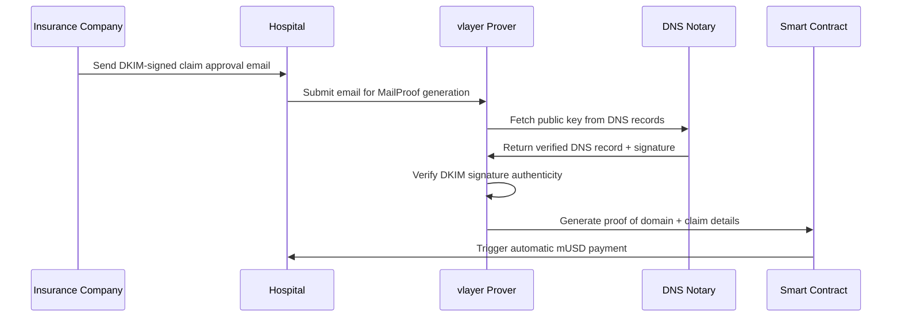
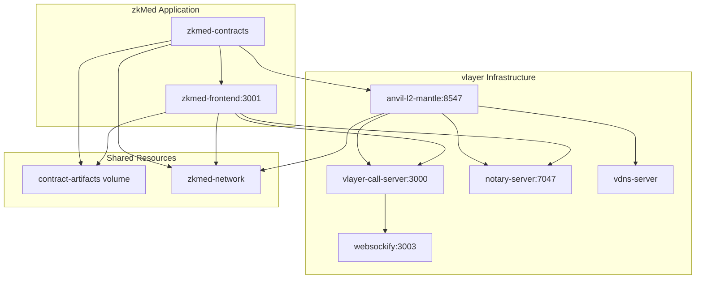
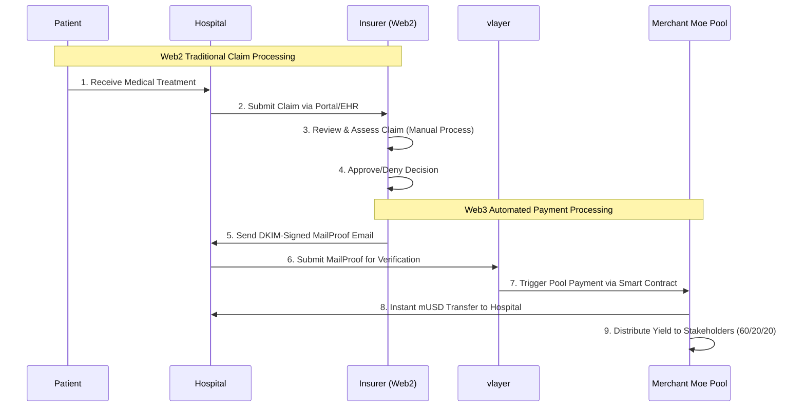

# zkMed - Revolutionary Healthcare Insurance Platform

> **Privacy-preserving healthcare platform using vlayer MailProofs and Merchant Moe Liquidity Book pools on Mantle Network**

[](https://www.mantle.xyz/)
[](https://book.vlayer.xyz/features/email.html)
[](https://docs.merchantmoe.com/)
[](https://playground.thirdweb.com/)

**Originally developed at [ETHGlobal Prague](https://ethglobal.com/events/prague) hackathon, now evolved for [The Cookathon on Mantle](https://www.cookathon.dev/)**

---

## 🎯 Project Vision

### Overview
zkMed is a **privacy-preserving healthcare insurance payment platform** that automates payments from insurers to hospitals using cryptographically verifiable email proofs (vlayer MailProofs) and yield-generating liquidity pools on **Merchant Moe Liquidity Book with custom hooks**. Built on Mantle Network with native mUSD integration.

### Core Innovation
**Web2/Web3 hybrid architecture** maintaining regulatory compliance while delivering blockchain benefits:
- **Web2 Layer**: Traditional claim processing, medical review, regulatory compliance
- **Web3 Layer**: MailProof verification, instant payments, yield generation
- **Bridge**: DKIM-signed emails provide cryptographic proof without exposing medical data

### Current MVP
- ✅ **Docker Environment**: Fully configured container orchestration with vlayer services
- ✅ **Smart Wallet Integration**: Working thirdweb connection with local Mantle fork  
- ✅ **Dynamic Address Resolution**: Automatic contract address discovery
- ✅ **Complete Homepage**: Full landing page with hero section, features, and navigation
- ✅ **Dev Dashboard**: Interface at `/dev` showing system status and wallet interaction

---

## 🏗️ Technical Architecture

### Blockchain Infrastructure
- **Primary Chain**: [Mantle Network](https://www.mantle.xyz/) (Ethereum L2)
- **Chain ID**: 31339 (Local Fork) / 5000 (Mainnet)
- **Native Currency**: Mantle USD (mUSD)
- **Consensus**: Optimistic rollup with fast finality

### Privacy Layer
- **vlayer MailProof**: DKIM verification for payment authorization (planned)
- **Domain Verification**: Cryptographic proof of organizational email control
- **Zero-Knowledge Architecture**: Complete medical privacy preservation
- **Audit Trails**: Email verification history for compliance

### Frontend
- **Framework**: Next.js with Server Actions for SSR compatibility
- **Web3 Integration**: [thirdweb SDK](https://playground.thirdweb.com/) for seamless authentication
- **Smart Accounts**: Abstract account management with gas sponsorship
- **UI Components**: Shadcn/ui with Tailwind CSS for modern design system

### Infrastructure
- **Container Orchestration**: Docker-based microservices architecture
- **Development Environment**: Foundry framework with automated deployment
- **Service Mesh**: vlayer services for MailProof verification
- **Persistent Storage**: Shared volumes for contract artifacts

---

## 🔐 MailProof Technology

### Purpose in zkMed
MailProofs enable **automated payment verification** by proving that claim approval emails come from legitimate insurance companies, eliminating manual verification while maintaining complete privacy of medical data.

### How DKIM Verification Works
**DKIM (DomainKeys Identified Mail)** provides cryptographic proof that emails are authentic:

1. **Email Signing**: Insurance company's SMTP server signs emails with a private key
2. **DNS Publication**: The corresponding public key is published in DNS records
3. **Signature Verification**: vlayer verifies the DKIM signature against the DNS public key
4. **Domain Authentication**: Proves the email truly originated from the claimed domain

### zkMed Implementation Flow


### Security Benefits
- **Domain Verification**: Cryptographically proves emails come from legitimate insurers
- **Privacy Preservation**: Only proves domain authenticity, never exposes medical content
- **Fraud Prevention**: Impossible to forge emails from verified insurance domains
- **Regulatory Compliance**: Maintains audit trails while protecting sensitive data

### Technical Requirements
For zkMed MailProofs to work, insurance company emails must:
- ✅ Be signed with DKIM-Signature header
- ✅ Have matching sender domain in DKIM `d=` tag and `From:` header  
- ✅ Use supported email providers (major providers like Gmail, Outlook)
- ✅ Include claim approval details in structured format

---

## 🚀 Current Implementation

### Development Environment
**Status**: ✅ **Local testing ready Docker container stack** with foundry + vlayer + anvil integration



### Key Features
- ✅ **Smart Wallet Integration**: Direct connection to anvil-l2-mantle with pre-funded accounts
- ✅ **Dynamic Address Resolution**: Frontend reads contract addresses from shared volume
- ✅ **Dev Dashboard**: Container monitoring, wallet connection, and basic contract interaction
- ✅ **Transaction Processing**: Gas-optimized smart contract interaction via thirdweb

---

## 🔄 Hybrid Claim Processing Flow

### Web2/Web3 Integration Architecture



### Why Hybrid Architecture?
- **Regulatory Compliance**: Medical data stays in traditional systems (GDPR/HIPAA)
- **Industry Integration**: Seamless adoption without disrupting existing workflows
- **Privacy Protection**: Medical information never exposed on-chain
- **Instant Settlement**: Blockchain automation for immediate payment execution

---

### Example MailProof Emails

#### Claim Authorization Email (Insurer to Hospital)
```
From: claims@insurancecorp.com
To: billing@cityhospital.org
Subject: Claim #CH-78291 Approved for Payment - Patient ID: 483726
Date: Thu, 13 Jun 2025 14:27:31 +0000

Dear City Hospital Billing Department,

CLAIM PAYMENT AUTHORIZATION

This email serves as official authorization for payment of the following claim:

Claim Reference: CH-78291
Patient ID: 483726
Service Date: June 7, 2025
Approved Amount: 1,875.00 mUSD
CPT Codes Approved: 99215, 73610, 96372

This claim has been reviewed and approved according to policy #INS-54321. 
Payment will be automatically processed through the zkMed platform upon 
verification of this email's authenticity.

Regards,
Jennifer Martinez
Claims Authorization Department
InsuranceCorp, Inc.
```

#### Domain Registration Email (Hospital to zkMed)
```
From: admin@newhospital.org
To: register@zkmed.io
Subject: Domain Verification for zkMed Registration
Date: Thu, 13 Jun 2025 10:15:22 +0000

DOMAIN VERIFICATION REQUEST

Registration ID: NH-20250613-001
Organization Name: New Hospital Medical Center
Organization Type: Hospital
Domain: newhospital.org
Wallet Address: 0x7C2b77Bbe254DaF83965a48C74afF60a94B45335

This email serves as official verification that New Hospital Medical Center 
is requesting domain verification and registration on the zkMed platform.
I am authorized to represent newhospital.org for this registration.

By submitting this email as a MailProof, I authorize zkMed to:
1. Verify our domain ownership through DKIM signature validation
2. Register our organization with the provided wallet address
3. Enable our participation in the zkMed healthcare platform

Best regards,
Dr. Robert Chen
Chief Technology Officer
New Hospital Medical Center
```

---

## 🚀 Getting Started

### Prerequisites
- **Docker**: Version 20.10+ with Docker Compose
- **Node.js**: Version 18+ (for local development)
- **Git**: For repository cloning

### Quick Start

```bash
# Clone the repository
git clone git@github.com:ppezzull/zkMed.git
cd zkMed

# See available commands
make help

# Launch complete environment
make all

# Verify deployment
make health
```

### Environment Variables
All configuration is pre-configured in `docker-compose.yml`:

```bash
# Next.js Configuration
NODE_ENV=development
NEXT_PUBLIC_CHAIN_ID=31339
NEXT_PUBLIC_RPC_URL=http://anvil-l2-mantle:8545
NEXT_PUBLIC_THIRDWEB_CLIENT_ID=b928ddd875d3769c8652f348e29a52c5
NEXT_PUBLIC_GREETING_CONTRACT_ADDRESS=${NEXT_PUBLIC_GREETING_CONTRACT_ADDRESS:-}
NEXT_TELEMETRY_DISABLED=1

# vlayer Environment
VLAYER_ENV=dev
CHAIN_NAME=anvil
PROVER_URL=http://vlayer-call-server:3000
JSON_RPC_URL=http://anvil-l2-mantle:8545
EXAMPLES_TEST_PRIVATE_KEY=0xac0974bec39a17e36ba4a6b4d238ff944bacb478cbed5efcae784d7bf4f2ff80
NOTARY_URL=http://notary-server:7047
WS_PROXY_URL=ws://localhost:3003

# Smart Wallet Configuration
SMART_WALLET_FACTORY_MANTLE=0x06224c9387a352a953d6224bfff134c3dd247313
```

### Local Access
- **Frontend**: http://localhost:3001
- **Dev Dashboard**: http://localhost:3001/dev
- **Mantle Fork**: http://localhost:8547
- **vlayer Services**: http://localhost:3000 (prover), http://localhost:7047 (notary)

---

## 📋 Smart Contract Architecture

### Core Contracts (Planned)

#### Current State
- ✅ **Greeting.sol**: Basic smart contract interaction demonstration
- ✅ **Dynamic Deployment**: Automated contract deployment with artifact generation
- ✅ **Frontend Integration**: Live contract address resolution

#### Future Implementation

```solidity
// Healthcare MailProof verification
contract HealthcareMailProof {
    function registerHospital(bytes calldata domainProof) external;
    function submitClaim(bytes calldata mailProof, uint256 amount) external;
    function verifyClaim(uint256 claimId) external;
}

// Merchant Moe Pool Management
contract HealthcarePoolManager {
    function depositPremium(uint256 amount) external;
    function processClaimPayment(address hospital, uint256 amount) external;
    function distributeYield() external; // 60/20/20 split
}

// Custom Healthcare Hooks
contract HealthcareHook is BaseHook {
    function beforeSwap() external; // Validate MailProof authorization
    function afterSwap() external;  // Trigger yield distribution
}
```

### Smart Contract Evolution Path

**Phase 1**: MailProof verification for hospital domain authentication  
**Phase 2**: [Merchant Moe Liquidity Book](https://docs.merchantmoe.com/) pool integration  
**Phase 3**: Custom healthcare hooks for automated yield distribution

---

## 🗺️ Development Roadmap

### Current MVP (Hackathon Submission)
- ✅ **Docker Environment**: Complete container orchestration
- ✅ **Wallet Integration**: Smart account interaction via thirdweb
- ✅ **Contract Deployment**: Automated Foundry-based deployment
- ✅ **Dev Interface**: Basic dashboard at `/dev` showing system status

### Next Week Goals (All Contracts Working)
- 🚧 **Organization Registration**: Hospital domain verification with [vlayer MailProofs](https://book.vlayer.xyz/features/email.html)
- 🚧 **Pool Integration**: [Merchant Moe Liquidity Book](https://docs.merchantmoe.com/) custom hooks
- 🚧 **Enhanced Frontend**: Multi-role dashboard for patients, hospitals, insurers

### Post-Hackathon (Mainnet Deployment)
- 📋 **Production Infrastructure**: Deploy to Mantle Mainnet with mUSD integration
- 📋 **Regulatory Compliance**: GDPR/HIPAA compliance framework
- 📋 **Real Healthcare Pilots**: Partner with healthcare providers for live testing

---

## 🎯 Economic Model

> **Note**: This is an initial layout for the economic model. Percentages and distribution mechanisms are still being refined and optimized.

### Stakeholder Benefits

#### Patients (60% yield share)
- **Lower Effective Costs**: Premium burden reduced by yield generation
- **Enhanced Privacy**: Medical data never exposed during processing
- **Instant Claims**: Approved procedures result in immediate payments

#### Hospitals (Direct Benefits)
- **Immediate Cash Flow**: Instant payments upon claim authorization
- **Reduced Admin Costs**: Streamlined processing reduces overhead
- **Enhanced Security**: MailProof validation prevents fraud

#### Insurers (20% yield share)
- **Capital Efficiency**: Operational funds earn returns via Merchant Moe pools
- **Competitive Edge**: Pool performance becomes differentiator
- **Reduced Costs**: Automated processing lowers expenses

#### Protocol (20% yield share)
- **Sustainable Development**: Platform treasury for ongoing improvements
- **Innovation Funding**: Research and development of new features
- **Community Incentives**: Rewards for platform adoption and growth

### Revenue Distribution (60/20/20)
```
Total Yield Generated: 100%
├── 60% → Patient Premium Reduction
├── 20% → Insurer Operations  
└── 20% → Protocol Treasury
```

---

**zkMed represents the first practical implementation of yield-generating healthcare insurance through Web3 technology, delivering measurable benefits while maintaining regulatory compliance and user familiarity.** 🚀

---

*Cooked with passion for revolutionizing healthcare finance at The Cookathon! 👨‍🍳🏥*
