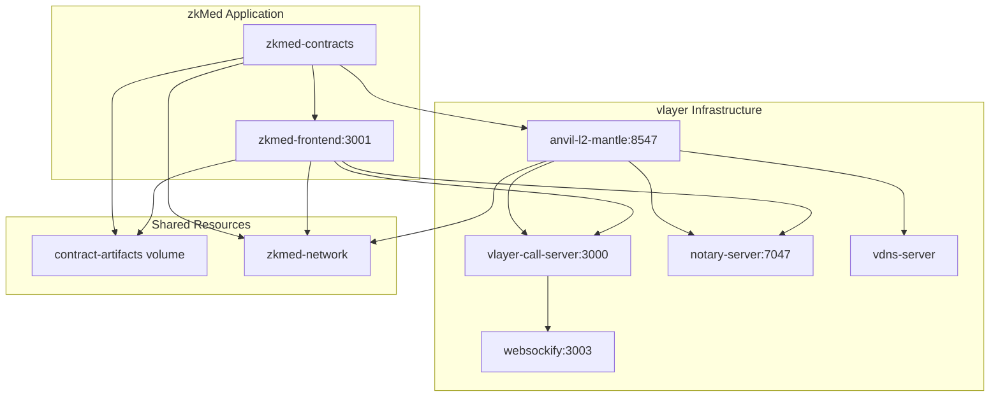
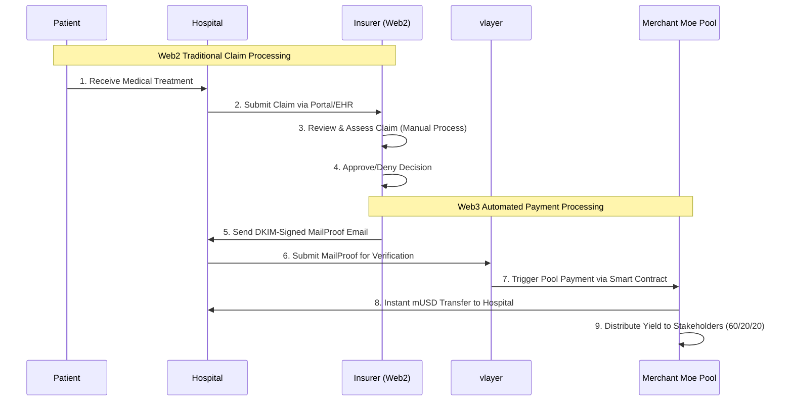

# zkMed - Revolutionary Healthcare Insurance Platform

> **Privacy-preserving healthcare platform using vlayer MailProofs and Merchant Moe Liquidity Book pools on Mantle Network**

[](https://www.mantle.xyz/)
[](https://book.vlayer.xyz/features/email.html)
[](https://docs.merchantmoe.com/)
[](https://playground.thirdweb.com/)

**Originally developed at [ETHGlobal Prague](https://ethglobal.com/events/prague) hackathon, now evolved for [The Cookathon on Mantle](https://www.cookathon.dev/)**

---

## 🎯 1. Project Vision

### Overview
zkMed is the world's first **privacy-preserving healthcare insurance payment platform** that automates payments from insurers to hospitals and patients by leveraging cryptographically verifiable email proofs (vlayer MailProofs) and yield-generating liquidity pools built on **Merchant Moe Liquidity Book with custom hooks**. Built on Mantle Network with native mUSD integration and containerized production deployment.

### Core Innovation
**Web2/Web3 hybrid architecture** that maintains regulatory compliance while delivering revolutionary blockchain benefits:
- **Web2 Layer**: Traditional claim processing, medical review, regulatory compliance
- **Web3 Layer**: MailProof verification, instant payments, yield generation
- **Bridge**: DKIM-signed emails provide cryptographic proof without exposing medical data

### Current MVP Stage
- ✅ **Docker Environment**: Fully configured container orchestration with vlayer services
- ✅ **Smart Wallet Integration**: Working interaction with anvil-l2-mantle container  
- ✅ **Dynamic Address Resolution**: Client automatically connects to appropriate contract addresses
- ✅ **Dev Dashboard**: Basic interface showing container status and wallet connection at `/dev`

---

## 🏗️ 2. Technical Architecture

### Blockchain Infrastructure
- **Primary Chain**: [Mantle Network](https://www.mantle.xyz/) (Ethereum L2)
- **Chain ID**: 31339 (Local Fork) / 5000 (Mainnet)
- **Native Currency**: Mantle USD (mUSD) for all healthcare transactions
- **Consensus**: Optimistic rollup with fast finality

### Privacy Layer
- **[vlayer MailProof](https://book.vlayer.xyz/features/email.html)**: DKIM verification for payment authorization (planned)
- **Domain Verification**: Cryptographic proof of organizational email control
- **Zero-Knowledge Architecture**: Complete medical privacy preservation
- **Audit Trails**: Complete email verification history for compliance

### Frontend
- **Framework**: Next.js with Server Actions for SSR compatibility
- **Web3 Integration**: [thirdweb SDK](https://playground.thirdweb.com/) for seamless authentication
- **Smart Accounts**: Abstract account management with gas sponsorship
- **Responsive Design**: Mobile-first approach with modern UI/UX

### Infrastructure
- **Container Orchestration**: Docker-based microservices architecture
- **Development Environment**: Foundry framework with automated deployment
- **Service Mesh**: vlayer services for MailProof verification
- **Persistent Storage**: Shared volumes for contract artifacts

---

## 🚀 3. Current Implementation

### Development Environment
**Status**: ✅ **Production-ready Docker container stack** with foundry + vlayer + anvil integration



### Smart Wallet Integration
- ✅ **Working Interaction**: Direct connection to anvil-l2-mantle container
- ✅ **Account Management**: Pre-funded development accounts
- ✅ **Transaction Processing**: Smart contract interaction via thirdweb
- ✅ **Gas Optimization**: Sponsored transactions for seamless UX

### Dynamic Address Resolution
- ✅ **Automatic Discovery**: Frontend reads deployed contract addresses from shared volume
- ✅ **Live Updates**: Real-time contract artifact synchronization
- ✅ **Environment Agnostic**: Works across development and production environments

### Dev Dashboard
- ✅ **Container Status**: Real-time monitoring of all services
- ✅ **Wallet Connection**: thirdweb integration with smart account support
- ✅ **Contract Interaction**: Basic greeting contract demonstration
- ✅ **Network Information**: Chain details and account balances

---

## 🐳 4. Docker Infrastructure

### Container Setup
**One-command deployment** with comprehensive service orchestration:

```bash
# Complete environment startup
docker-compose up -d
```

### Key Containers

#### Core Services
- **`anvil-l2-mantle`**: Local Mantle blockchain environment (Chain ID 31339)
- **`zkmed-contracts`**: Smart contract deployment with Foundry framework
- **`zkmed-frontend`**: Next.js application with thirdweb integration

#### vlayer Services
- **`vlayer-call-server`**: MailProof verification service
- **`notary-server`**: DKIM signature validation
- **`vdns-server`**: Domain verification
- **`websockify`**: WebSocket proxy for real-time updates

#### Architecture Benefits
- **Persistent State**: Blockchain data maintained across restarts
- **Shared Volumes**: Contract artifacts automatically synchronized
- **Health Checks**: Automated service monitoring and dependencies
- **Network Isolation**: Secure inter-container communication

---

## 🚀 5. Getting Started

### Prerequisites
- **Docker**: Version 20.10+ with Docker Compose
- **Node.js**: Version 18+ (for local development)
- **Git**: For repository cloning

### Quick Start

```bash
# Clone the repository
git clone git@github.com:ppezzull/zkMed.git
cd zkMed

# Launch complete environment
make all

# Alternative: Direct Docker Compose
docker-compose up -d

# Verify deployment
make health
```

### Environment Variables
Basic configuration is pre-configured for development:

```bash
# Blockchain Configuration
NEXT_PUBLIC_CHAIN_ID=31339
NEXT_PUBLIC_RPC_URL=http://anvil-l2-mantle:8545

# vlayer Services
PROVER_URL=http://vlayer-call-server:3000
NOTARY_URL=http://notary-server:7047

# thirdweb Integration
NEXT_PUBLIC_THIRDWEB_CLIENT_ID=b928ddd875d3769c8652f348e29a52c5
```

### Local Access
- **Frontend**: http://localhost:3001
- **Dev Dashboard**: http://localhost:3001/dev
- **Mantle Fork**: http://localhost:8547
- **vlayer Services**: http://localhost:3000 (prover), http://localhost:7047 (notary)

---

## 📋 6. Smart Contract Architecture

### Core Contracts (Planned)

#### Current State
- ✅ **Greeting.sol**: Basic smart contract interaction demonstration
- ✅ **Dynamic Deployment**: Automated contract deployment with artifact generation
- ✅ **Frontend Integration**: Live contract address resolution

#### Future Implementation

```solidity
// Healthcare MailProof verification
contract HealthcareMailProof {
    function registerHospital(bytes calldata domainProof) external;
    function submitClaim(bytes calldata mailProof, uint256 amount) external;
    function verifyClaim(uint256 claimId) external;
}

// Merchant Moe Pool Management
contract HealthcarePoolManager {
    function depositPremium(uint256 amount) external;
    function processClaimPayment(address hospital, uint256 amount) external;
    function distributeYield() external; // 60/20/20 split
}

// Custom Healthcare Hooks
contract HealthcareHook is BaseHook {
    function beforeSwap() external; // Validate MailProof authorization
    function afterSwap() external;  // Trigger yield distribution
}
```

### Smart Contract Evolution Path

**Phase 1**: MailProof verification for hospital domain authentication  
**Phase 2**: [Merchant Moe Liquidity Book](https://docs.merchantmoe.com/) pool integration  
**Phase 3**: Custom healthcare hooks for automated yield distribution

---

## 🗺️ 7. Development Roadmap

### Current MVP (Hours Remaining)
- ✅ **Docker Environment**: Complete container orchestration
- ✅ **Wallet Integration**: Smart account interaction via thirdweb
- ✅ **Contract Deployment**: Automated Foundry-based deployment
- ✅ **Dev Interface**: Basic dashboard at `/dev` showing system status

### Short-Term Goals (Next 2 weeks)
- 🚧 **Organization Registration**: Hospital domain verification with [vlayer MailProofs](https://book.vlayer.xyz/features/email.html)
- 🚧 **Pool Integration**: [Merchant Moe Liquidity Book](https://docs.merchantmoe.com/) custom hooks
- 🚧 **Enhanced Frontend**: Multi-role dashboard for patients, hospitals, insurers

### Medium-Term Goals (Following 2 weeks)
- 📋 **Patient Registration**: Premium payment setup with yield tracking
- 📋 **Claim Processing**: End-to-end MailProof-based claim automation
- 📋 **Yield Distribution**: Automated 60/20/20 stakeholder rewards

### Long-Term Vision (Post-Hackathon)
- 📋 **Full Implementation**: Complete Web2/Web3 hybrid claim processing
- 📋 **Regulatory Compliance**: GDPR/HIPAA compliance framework
- 📋 **Production Deployment**: Live platform with real healthcare providers

---

## 🧪 8. Testing the Environment

### Verification Steps

```bash
# 1. Check all services are running
docker-compose ps

# 2. Verify Mantle fork is active
curl -X POST -H "Content-Type: application/json" \
  --data '{"jsonrpc":"2.0","method":"eth_blockNumber","params":[],"id":1}' \
  http://localhost:8547

# 3. Test vlayer services
curl http://localhost:3000/health  # vlayer call server
curl http://localhost:7047         # notary server

# 4. Check frontend health
curl http://localhost:3001/api/health
```

### Smart Wallet Demo
1. Navigate to http://localhost:3001/dev
2. Connect wallet using thirdweb interface
3. Interact with deployed Greeting contract
4. Verify transaction on local Mantle fork

### Troubleshooting

**Common Issues:**
- **Port Conflicts**: Ensure ports 3001, 8547, 3000, 7047 are available
- **Container Startup**: Wait for all dependencies before accessing frontend
- **Contract Deployment**: Check `docker logs zkmed-contracts` for deployment status

**Solutions:**
```bash
# Reset environment
make clean && make all

# Check specific service logs
docker logs anvil-l2-mantle
docker logs zkmed-frontend

# Restart specific service
docker-compose restart zkmed-frontend
```

---

## 👨‍💻 9. Solo Development Notes

### Project Status
**Solo Development Project** - Currently developed by a single developer with focus on:
- Container infrastructure and DevOps automation
- Smart contract architecture and deployment
- Frontend integration with Web3 services
- vlayer MailProof integration planning

### Implementation Approach
**Prioritizing container infrastructure** to enable:
- Rapid iteration and testing
- Reliable deployment across environments  
- Seamless integration of multiple services
- Production-ready scalability from day one

### Contribution Guidelines
**Feedback and contributions welcome:**
- 🐛 **Bug Reports**: Open issues for any problems encountered
- 💡 **Feature Suggestions**: Ideas for healthcare platform improvements
- 🔧 **Technical Feedback**: Architecture and implementation suggestions
- 📖 **Documentation**: Help improve setup and usage documentation

---

## 🔄 10. Hybrid Claim Processing Flow

### Web2/Web3 Integration Architecture



### Why Hybrid Architecture?
- **Regulatory Compliance**: Medical data stays in traditional systems (GDPR/HIPAA)
- **Industry Integration**: Seamless adoption without disrupting existing workflows
- **Privacy Protection**: Medical information never exposed on-chain
- **Instant Settlement**: Blockchain automation for immediate payment execution

---

## 📚 11. Documentation & References

### Core Technologies
- **[Mantle Network](https://www.mantle.xyz/)**: Layer 2 blockchain with native mUSD
- **[vlayer MailProofs](https://book.vlayer.xyz/features/email.html)**: DKIM-based email verification
- **[Merchant Moe DEX](https://docs.merchantmoe.com/)**: Liquidity Book with custom hooks
- **[thirdweb SDK](https://playground.thirdweb.com/)**: Web3 authentication and smart accounts

### Hackathon Context
- **Origin**: [ETHGlobal Prague](https://ethglobal.com/events/prague) - vlayer MailProof foundation
- **Current**: [The Cookathon on Mantle](https://www.cookathon.dev/) - Mantle ecosystem integration
- **Evolution**: From basic MailProof verification to comprehensive healthcare platform

### Research Foundation
zkMed's development is grounded in cutting-edge blockchain healthcare research:
- **Blockchain Healthcare Models**: Enhanced transparency and operational efficiency
- **Decentralized Insurance**: Peer-to-peer risk sharing and automated settlement
- **Privacy-Preserving Systems**: Zero-knowledge architectures for medical data
- **DeFi Integration**: Yield-generating liquidity pools for capital efficiency

---

## 🎯 12. Economic Model

### Stakeholder Benefits

#### Patients (60% yield share)
- **Lower Effective Costs**: Premium burden reduced by yield generation
- **Enhanced Privacy**: Medical data never exposed during processing
- **Instant Claims**: Approved procedures result in immediate payments

#### Hospitals (Direct Benefits)
- **Immediate Cash Flow**: Instant payments upon claim authorization
- **Reduced Admin Costs**: Streamlined processing reduces overhead
- **Enhanced Security**: MailProof validation prevents fraud

#### Insurers (20% yield share)
- **Capital Efficiency**: Operational funds earn returns via Merchant Moe pools
- **Competitive Edge**: Pool performance becomes differentiator
- **Reduced Costs**: Automated processing lowers expenses

#### Protocol (20% yield share)
- **Sustainable Development**: Platform treasury for ongoing improvements
- **Innovation Funding**: Research and development of new features
- **Community Incentives**: Rewards for platform adoption and growth

### Revenue Distribution (60/20/20)
```
Total Yield Generated: 100%
├── 60% → Patient Premium Reduction
├── 20% → Insurer Operations  
└── 20% → Protocol Treasury
```

---

## 🚀 13. Getting Involved

### For Developers
```bash
# Fork the repository
git clone <your-fork>
cd zkMed

# Set up development environment
make dev-setup

# Start contributing
make all
```

### For Healthcare Professionals
- **Feedback**: Share insights on healthcare workflow integration
- **Testing**: Help validate real-world use cases and requirements
- **Partnerships**: Explore pilot program opportunities

### For Investors & Partners
- **Technical Due Diligence**: Review architecture and implementation
- **Market Validation**: Assess healthcare industry fit and adoption potential
- **Strategic Partnerships**: Explore integration opportunities

---

**zkMed represents the first practical implementation of yield-generating healthcare insurance through Web3 technology, delivering measurable benefits while maintaining regulatory compliance and user familiarity.** 🚀

---

*Built with ❤️ for the future of healthcare finance*
