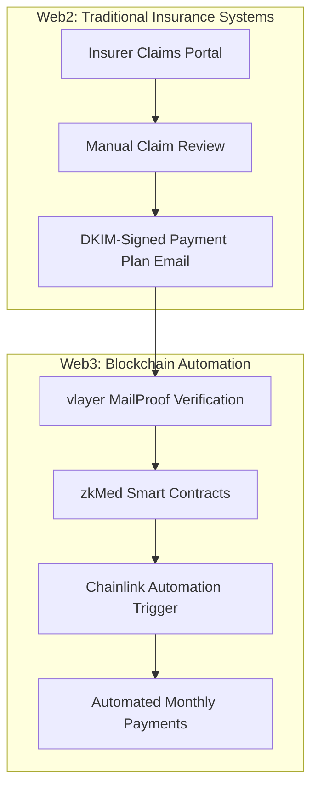
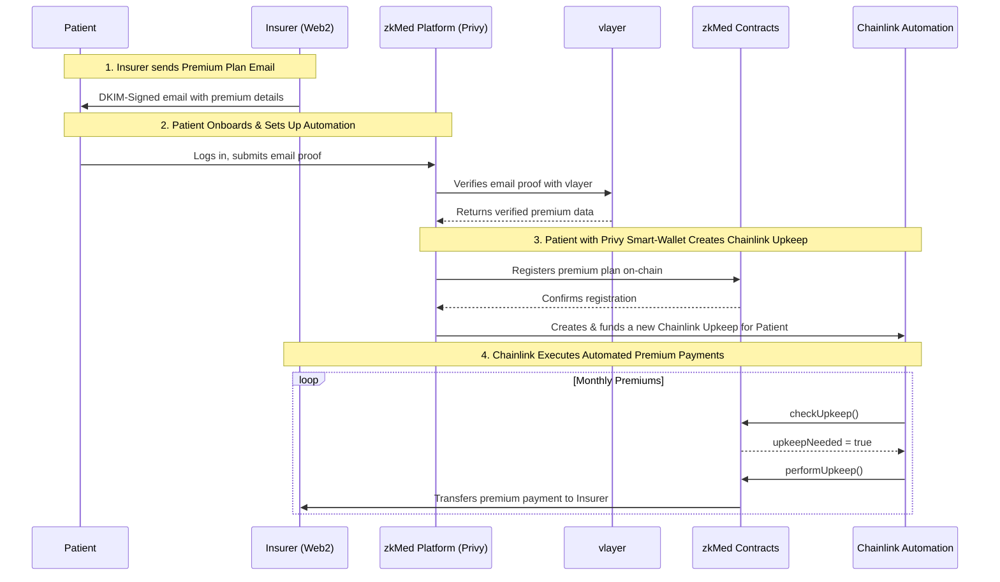
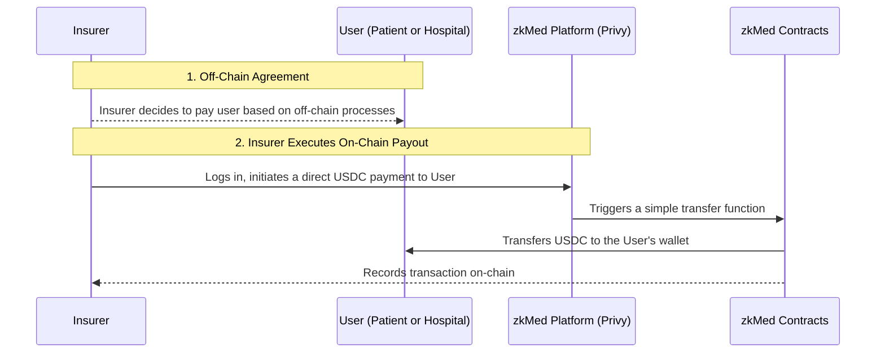
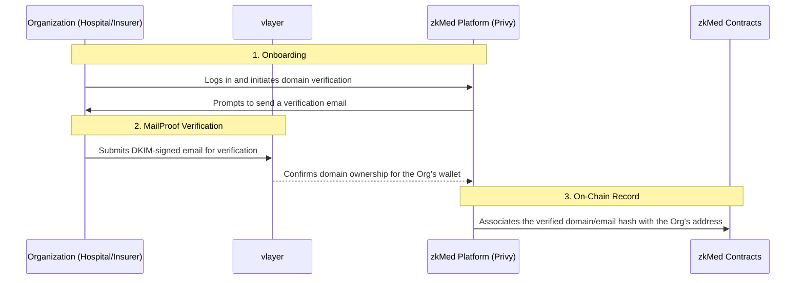
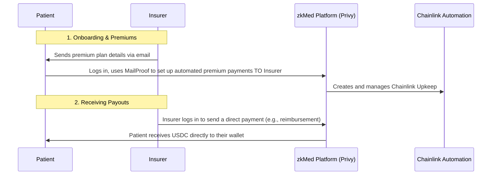
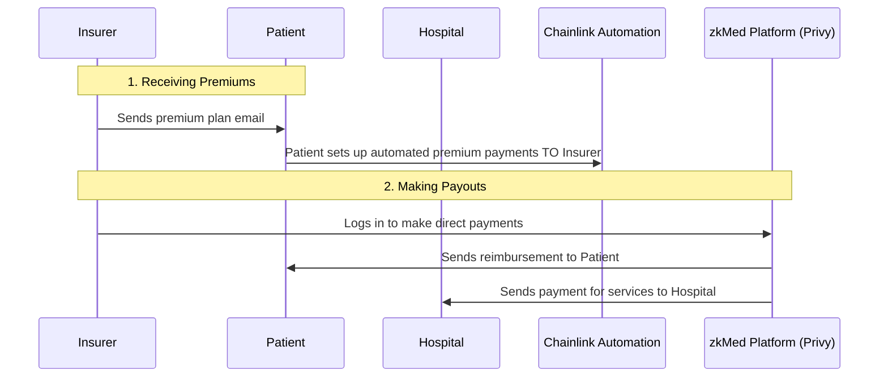

# zkMed - Revolutionary Healthcare Insurance Platform


 > **Privacy-preserving healthcare platform using vlayer MailProofs and automatic payments on Base**

 [](https://base.org/)
 [](https://book.vlayer.xyz/features/email.html)
 [](https://docs.chain.link/chainlink-automation)
 [](https://github.com/ppezzull/Scaffold-Privy-AA)

 **First introduced at [ETHGlobal Prague](https://ethglobal.com/events/prague) and developed at [ETHGlobal Napuleth 2025](https://ethglobal.com/events/napuleth) hackathon on Base**

---

## 🎯 Project Vision

### Overview
zkMed is the world's first **privacy-preserving healthcare insurance payment platform** that automates payments from insurers to hospitals and patients by leveraging cryptographically verifiable email proofs (vlayer MailProofs) and [Chainlink Automation](https://docs.chain.link/chainlink-automation) for recurring payments. Built on Base with a seamless Privy wallet integration.

### Core Innovation
**Web2/Web3 hybrid architecture** that maintains regulatory compliance while delivering revolutionary blockchain benefits:
- **Web2 Layer**: Traditional claim processing, medical review, regulatory compliance
- **Web3 Layer**: MailProof verification, instant payments, automated processing
- **Bridge**: DKIM-signed emails provide cryptographic proof without exposing medical data

---

## 🏗️ Technical Architecture

### Blockchain Infrastructure
- **Primary Chain**: [Base](https://base.org/) (Ethereum L2)
- **Chain ID**: 31337 (Local Fork) / 8453 (Mainnet)  
- **Native Currency**: ETH for all transactions
- **Development**: [Scaffold-ETH 2 with Privy integration](https://github.com/ppezzull/Scaffold-Privy-AA)

### Privacy Layer
- **[vlayer MailProof](https://book.vlayer.xyz/features/email.html)**: DKIM verification for payment authorization
- **Domain Verification**: Cryptographic proof of organizational email control
- **Zero-Knowledge Architecture**: Complete medical privacy preservation
- **Audit Trails**: Complete email verification history for compliance

### Payment System
- **[Chainlink Automation](https://docs.chain.link/chainlink-automation)**: Scheduled monthly payment execution via `checkUpkeep` and `performUpkeep` functions
- **zkMedLinkPay**: Smart contract implementing AutomationCompatibleInterface for recurring payments and fees
- **Payment Plans**: Verified by email proof between insurer and patient

### Privy
- **Framework**: Next.js with Server Components
- **Web3 Integration**: Privy SDK for seamless authentication
- **Smart Accounts**: Abstract account management with gas sponsorship
- **Responsive Design**: Modern UI/UX with desktop-first approach

---

## 📋 Smart Contract Architecture

### Hybrid Insurance System Integration


### Automated Premium Payments (Patient to Insurer)
This diagram shows how a patient uses a MailProof from their insurer to authorize and set up automated monthly premium payments via Chainlink Automation.



### Direct Payouts (Insurer to Patient/Hospital)
This diagram shows how an insurer can directly pay a user (a patient for reimbursement or a hospital for services) using their Privy smart account. This is a simple, direct transfer and does not involve MailProofs or automation.



---

## 🏥 Multi-Role User Management Patterns

### Identity Verification (For Hospitals & Insurers)


### Patient Experience Pattern


### Insurance Company Pattern


---

## 🔄 Hybrid Claim Processing Flow


### Why Hybrid Architecture?
- **Regulatory Compliance**: Medical data stays in traditional systems (GDPR/HIPAA)
- **Industry Integration**: Seamless adoption without disrupting existing workflows
- **Privacy Protection**: Medical information never exposed on-chain
- **Recurring Settlements**: Blockchain automation for scheduled payment execution

---

## 🚀 Bounties Implementation

### Scaffold++ (Scaffold-ETH with Privy)
- **Template Used**: [Scaffold-ETH 2 with Privy integration](https://github.com/ppezzull/Scaffold-Privy-AA)
- **Features Added**:
  - Smart wallet creation and management
  - Social login options (email, phone, social)
  - Gasless transactions for improved UX
  - Automatic user role detection and routing

### Chainlink Automation
- **Contract**: zkMedLinkPay.sol
- **Implementation**: Full [AutomationCompatibleInterface](https://docs.chain.link/chainlink-automation) with:
  - `checkUpkeep`: Identifies payment plans due for processing
  - `performUpkeep`: Executes monthly payments to hospitals
  - Automated triggers based on email-verified payment plans
  - Platform fee distribution and payment statistics

### Base Deployment
- **Contract Addresses** (Base Mainnet):
  - zkMedCore: 0x202Fa7479d6fcBa37148009D256Ac2936729e577
  - zkMedPatient: 0x2a76C471CC4353dAAb3E4938D89f02c7fF1e2F77
  - zkMedHospital: 0xc9913ad9B3730a0C18d7064313A526d24A6F3DFD
  - zkMedInsurer: 0xcE451eC2002643f248d0689650Ef36012bAef6f4
  - zkMedAdmin: 0xb9C155122BcB683EB7d39E980daf811C62203292
  - zkMedPaymentHistory: 0x852FfA30dBdd64a4893D1cAB9DbA14148Ed3690D
  - zkMedRequestManager: 0xA95704b4C8d55594394B7B9602C0454Dc9C0f8a9
  - zkMedRegistrationProver: 0x961A3057DCA3CaAb2bD9Ba54F9BAb42C7c8BEAFa
  - zkMedPaymentPlanProver: 0x2796E5Ff369a1b845dd70948cE19BE01762D42a5

---

## 🧪 Email Formats

### Registration Email
Organizations verify identity through domain ownership:
- **From**: admin@hospitalname.com
- **Subject**: "Hospital registration on zkMed"  
- **Body**: Contains organization name and wallet address

### Payment Plan Email
Insurers authorize payment plans through verified emails:
- **From**: insurance@provider.com
- **To**: patient@email.com
- **Subject**: "{insurance name} payment contract in zkMed"
- **Body**: Patient payment contract, Duration: 01/01/2027, Monthly allowance: 40$

---

## 🚀 Getting Started

### Prerequisites
- **Node.js**: Version 18+
- **Yarn**: For package management
- **Foundry**: For smart contract development

### Quick Start

```bash
# Clone the repository
git clone https://github.com/ppezzull/zkMed.git
cd zkMed

# Install dependencies
yarn install

# Start development environment
yarn chain

# Deploy contracts
yarn deploy

# Start frontend
yarn start
```

### Environment Setup for Base
```bash
# Start a local Base fork
yarn chain:base

# Deploy to Base testnet
yarn deploy --network base-testnet
```

---

## 🗺️ Development Roadmap

### Current MVP (Hackathon Submission)
- ✅ **Privy Integration**: Smart account integration with social logins
- ✅ **Smart Contract Deploy**: Smart contracts deployed and accessible via /debug page
- ✅ **Role-Based Access**: Dynamic routing based on user type

### Next Steps
- 🚧 **Email Verification**: vlayer MailProofs integration (addressing wagmi config conflicts with Privy)
- 🚧 **Enhanced Payment Analytics**: Detailed reporting for hospitals and insurers
- 🚧 **Mobile Interface**: Progressive web app for on-the-go access
- 🚧 **Multi-Currency Support**: Integration with stablecoins for global usage

### Long-Term Vision
- 📋 **Regulatory Compliance Framework**: Comprehensive GDPR/HIPAA compliance
- 📋 **Decentralized Health Records**: Private, patient-controlled medical data
- 📋 **Global Healthcare Network**: Cross-border insurance and care coordination
- 📋 **Universal Insurance Integration**: Payment system compatible with every insurance provider

---

## 🎯 Economic Model

### Stakeholder Benefits

#### Patients
- **Simplified Process**: One-time setup for recurring payments
- **Enhanced Privacy**: Medical data never exposed during processing
- **Trusted Verification**: Cryptographic proof of payment authorization

#### Hospitals
- **Predictable Cash Flow**: Guaranteed monthly payments from insurance
- **Reduced Admin Costs**: Automated processing reduces overhead
- **Enhanced Security**: MailProof validation prevents fraud

#### Insurers
- **Capital Efficiency**: Clear payment schedules improve financial planning
- **Reduced Overhead**: Automation eliminates manual payment processing
- **Enhanced Transparency**: Complete audit trail of all transactions

#### Platform
- **Sustainable Revenue**: Small fee from each processed payment
- **Scalable Model**: Infrastructure supports unlimited users and transactions
- **Regulatory Compliance**: Privacy-preserving architecture meets healthcare standards

---

## 👨‍💻 Contributors

Built by students from [42 Roma Luiss](https://42roma.it/):

- [ppezzull](https://github.com/ppezzull/) – Smart contract backend
- [rdolzi](https://github.com/rdolzi/) – Next.js frontend

---

**zkMed represents the first practical implementation of privacy-preserving healthcare insurance through Web3 technology, delivering measurable benefits while maintaining regulatory compliance and user familiarity.** 🚀

---

*Built with ❤️ for the future of healthcare finance*