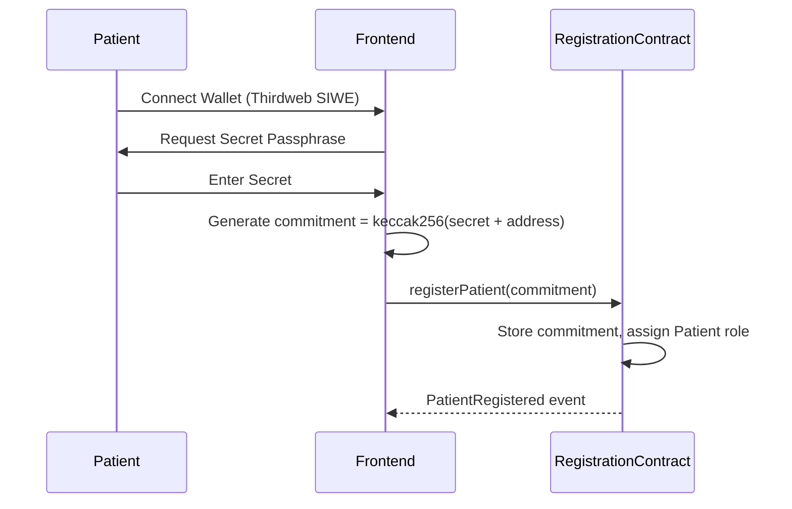
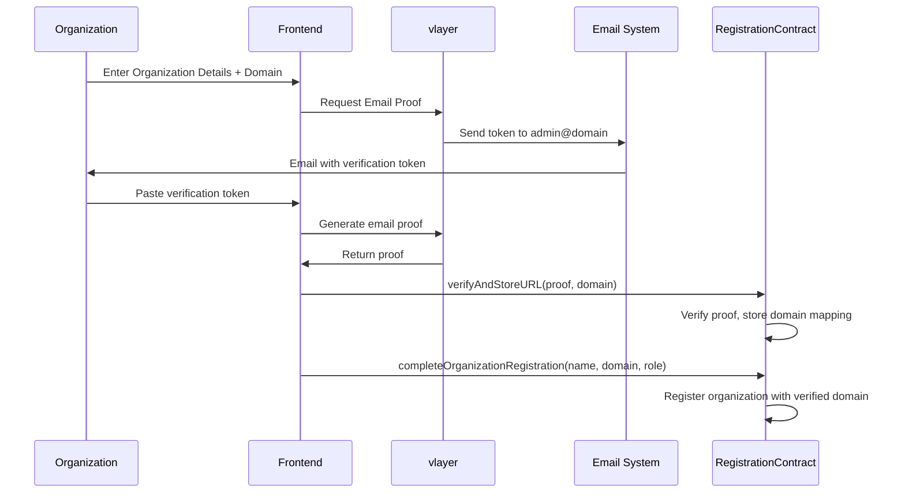
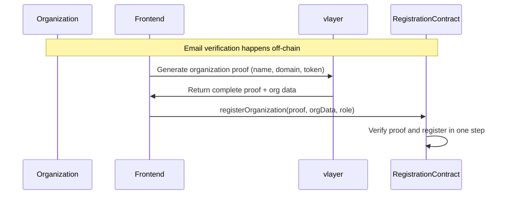

# zkMed Registration System

A privacy-preserving registration system for healthcare stakeholders using vlayer email proofs and cryptographic commitments.

## Overview

The zkMed Registration system implements role-based access control for three types of users:
- **Patients**: Register with privacy-preserving commitments
- **Hospitals**: Verify domain ownership via email proofs
- **Insurance Companies**: Verify domain ownership via email proofs

## Architecture

### Core Contracts

1. **EmailDomainProver.sol** - vlayer Prover contract
   - Inherits from `vlayer-0.1.0/Prover`
   - Generates email domain ownership proofs
   - Validates email tokens sent to admin@domain

2. **RegistrationContract.sol** - Main verifier and registration contract
   - Inherits from `vlayer-0.1.0/Verifier`
   - Manages user roles and verification status
   - Implements privacy-preserving patient registration
   - Validates organization email proofs

## User Registration Flows

### Patient Registration



**Privacy Guarantees:**
- Secret passphrase never leaves patient's device
- Only cryptographic commitment stored on-chain
- Patient can later prove identity with secret

### Organization Registration (Two-Step Flow)



### Organization Registration (Single-Step Flow)



## Smart Contract Interface

### Patient Functions

```solidity
// Register with privacy-preserving commitment
function registerPatient(bytes32 _commitment) external

// Verify commitment with secret (view function)
function verifyPatientCommitment(string memory _secret) external view returns (bool)
```

### Organization Functions

```solidity
// Two-step registration: Step 1 - Verify domain
function verifyAndStoreURL(
    Proof calldata proof,
    string calldata domain,
    uint256 timestamp
) external

// Two-step registration: Step 2 - Complete registration
function completeOrganizationRegistration(
    string calldata organizationName,
    string calldata domain,
    Role _role
) external

// Single-step registration with email proof
function registerOrganization(
    Proof calldata proof,
    OrganizationData calldata orgData,
    Role _role
) external
```

### View Functions

```solidity
// Get complete user registration info
function getUserRegistration(address _user) external view returns (
    Role role,
    bool isVerified,
    uint256 timestamp,
    string memory organizationName,
    string memory domain
)

// Check if user is registered and verified
function isUserVerified(address _user) external view returns (bool)

// Get organization details
function getOrganization(address _organization) external view returns (Organization memory)

// Check domain registration status
function isDomainRegistered(string calldata _domain) external view returns (bool)
```

## Privacy Features

### Patient Privacy
- **No Personal Data**: Only cryptographic commitments stored
- **Local Secrets**: Passphrases never transmitted or stored
- **Verifiable Identity**: Patients can prove identity without revealing secrets

### Organization Privacy
- **Email Protection**: Email addresses never stored on-chain
- **Domain Verification**: Only domain ownership proven, not email access
- **vlayer Integration**: Zero-knowledge email proofs

## Security Features

### Access Control
- **Role-Based Permissions**: Separate roles for Patients, Hospitals, Insurers, Admins
- **Verification Requirements**: All roles must be verified to interact
- **Admin Controls**: Emergency functions for verification management

### Anti-Fraud Measures
- **Domain Uniqueness**: Each domain can only be registered once
- **Commitment Uniqueness**: Each patient can only have one commitment
- **Proof Verification**: All organization registrations require valid vlayer proofs

## Deployment

### Prerequisites
```bash
# Install dependencies
forge soldeer install

# Build contracts
forge build

# Run tests
forge test
```

### Deploy Script
```bash
# Deploy to local network
forge script script/DeployRegistration.s.sol --rpc-url <RPC_URL> --private-key <PRIVATE_KEY> --broadcast

# Deploy to testnet
forge script script/DeployRegistration.s.sol --rpc-url sepolia --private-key <PRIVATE_KEY> --broadcast --verify
```

### Environment Variables
After deployment, add these to your frontend environment:
```env
NEXT_PUBLIC_REGISTRATION_CONTRACT=<RegistrationContract_Address>
NEXT_PUBLIC_EMAIL_DOMAIN_PROVER=<EmailDomainProver_Address>
```

## Integration Examples

### Frontend Integration (Next.js + Thirdweb)

```typescript
import { useContract, useContractWrite } from "@thirdweb-dev/react";

// Patient registration
const registerPatient = async (secret: string, userAddress: string) => {
  const commitment = keccak256(encodePacked(["string", "address"], [secret, userAddress]));
  await contract.call("registerPatient", [commitment]);
};

// Organization registration (two-step)
const registerOrganization = async (orgName: string, domain: string, role: number) => {
  // Step 1: Get email proof from vlayer
  const proof = await vlayerClient.generateEmailProof(domain);
  await contract.call("verifyAndStoreURL", [proof, domain, timestamp]);
  
  // Step 2: Complete registration
  await contract.call("completeOrganizationRegistration", [orgName, domain, role]);
};
```

### vlayer Integration

```typescript
import { vlayer } from "@vlayer/sdk";

// Generate email proof for domain verification
const generateEmailProof = async (domain: string) => {
  const prover = vlayer.createProver(EmailDomainProver);
  
  // vlayer handles email sending and token verification
  const { proof, verifiedDomain, timestamp } = await prover.verifyDomainOwnership(
    domain,
    emailToken // User provides this after receiving email
  );
  
  return { proof, verifiedDomain, timestamp };
};
```

## Testing

The test suite covers:
- ✅ Patient registration and commitment verification
- ✅ Organization registration flows (both single and two-step)
- ✅ Role-based access control
- ✅ Privacy guarantees (no personal data on-chain)
- ✅ Admin functions and emergency controls
- ✅ Error handling and edge cases

Run tests with:
```bash
forge test -vv
```

## Gas Optimization

The contracts implement several gas optimization patterns:
- **Packed Structs**: Registration data packed into single storage slots
- **Event-Driven Architecture**: Minimal on-chain storage, rich event logs
- **Efficient Mappings**: Optimized storage layout for frequent operations

## Future Enhancements

1. **Web Proofs**: vlayer web proofs for ongoing domain verification
2. **Batch Operations**: Multi-user registration in single transaction
3. **Upgradeable Contracts**: Proxy pattern for future improvements
4. **Cross-Chain Support**: Multi-chain registration synchronization

## Security Considerations

- **Reentrancy Protection**: All state-changing functions protected
- **Input Validation**: Comprehensive validation of all user inputs
- **Access Control**: Layered permissions with emergency overrides
- **Audit Trail**: Complete event logging for transparency

This registration system provides the foundation for the zkMed platform's privacy-preserving healthcare claims processing. 