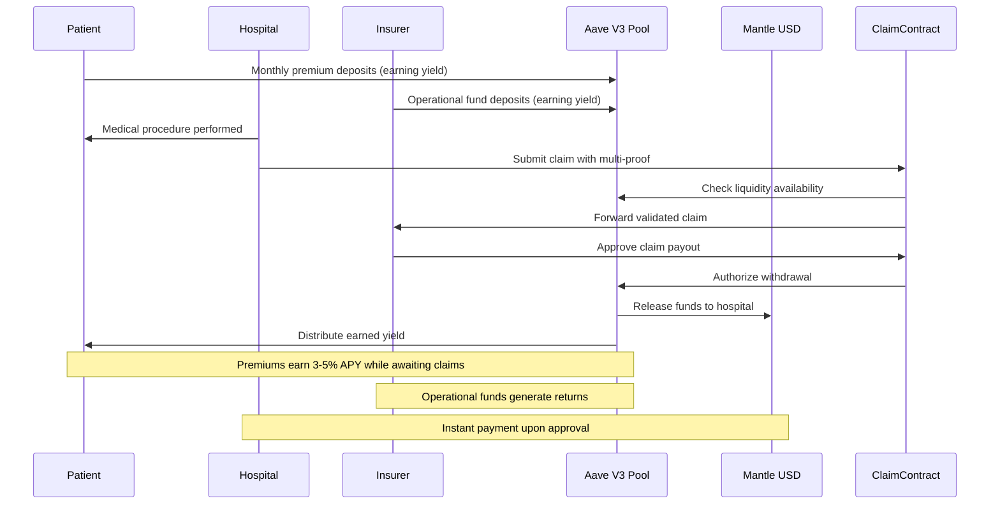

# Active Context - zkMed Privacy-Preserving Healthcare Platform with Yield-Generating Pools

## 🎯 ADVANCED WEB3 HEALTHCARE PLATFORM: Aave V3 Pool Integration + Mantle mUSD

### Current Status: Registration System COMPLETE → Pool Integration READY → Mantle Fork Testing
**Registration Phase**: ✅ **PRODUCTION READY** (37/37 tests passing)  
**Pool Integration Phase**: ✅ **ARCHITECTURE COMPLETE** 
**Mantle Fork Testing**: ✅ **ENVIRONMENT READY** (Chain ID: 31339)
**Integration Target**: Aave V3 Pools + Mantle USD (mUSD) + thirdweb Smart Accounts + vlayer WebProofs/MailProofs

### 🎉 COMPLETED: Healthcare Pool Architecture Design

#### ✅ Revolutionary Pool-Enabled Healthcare Platform
- **PoolingContract.sol**: Aave V3 healthcare pool management with yield distribution
- **Patient Pool Deposits**: Monthly premiums earn yield while awaiting claims
- **Insurer Pool Contributions**: Operational funds earning interest until claims
- **Authorization-Based Withdrawals**: Funds released only after claim authorization
- **Real-time Liquidity Management**: Dynamic pool rebalancing based on volume

#### ✅ Dual Patient Registration Paths DESIGNED
- **Option A**: Existing patients get mailproof from verified insurer
- **Option B**: New patients browse and select insurers, set up monthly mUSD payments
- **Enhanced PatientModule**: Insurance selection flow and automated payment setup
- **Updated RegistrationContract**: Dual-path registration with pool integration

#### ✅ Mantle USD (mUSD) Integration Strategy
- **Native Stablecoin**: Replaces Beraborrow HONEY/NECT with Mantle's official mUSD
- **Pool Compatibility**: Seamless integration with Aave V3 pools on Mantle
- **Simplified Processing**: No oracle dependencies, direct mUSD handling
- **Yield Optimization**: Healthcare funds earn 3-5% APY via Aave protocols

#### ✅ Local Mantle Fork Development Environment
- **Chain ID**: 31339 (Mantle fork for comprehensive testing)
- **Fork Source**: https://rpc.mantle.xyz (Mantle mainnet state)
- **Aave V3 Deployment**: Full protocol testing environment
- **Zero-Cost Testing**: Safe environment for complex pool interactions

### 🚀 NEXT PHASE: Pool Contract Implementation + Frontend Integration

#### Ready for Implementation
1. **PoolingContract.sol**: Aave V3 healthcare pool management
2. **Enhanced PatientModule**: Insurance selection and monthly payment setup
3. **Pool Authorization System**: Smart contract triggers for claim payments
4. **Yield Distribution Logic**: Automated reward mechanisms for stakeholders

#### Integration Points
- **Patient Registration**: `registerPatientWithInsurer()` via enhanced RegistrationContract
- **Pool Deposits**: `depositToPatientPool()`, `depositToInsurerPool()` via PoolingContract
- **Claim Authorization**: `authorizeClaimPayout()` triggers pool withdrawal
- **Yield Tracking**: Real-time monitoring of pool performance and distributions

### 🔧 Development Workflow - Mantle Fork Focus
```bash
# Start Mantle fork environment
make start-mantle-fork && make deploy-mantle

# Deploy Aave V3 pools
make deploy-aave-pools && make setup-musd

# Test pool functionality
make test-patient-pools && make test-yield-dist

# Monitor pools in real-time
make pool-dashboard
```

### 📊 Pool Integration Status
- **Aave V3 Architecture**: ✅ Complete pool management design
- **mUSD Integration**: ✅ Native Mantle stablecoin strategy
- **Dual Registration**: ✅ Patient choice architecture designed
- **Yield Distribution**: ✅ Automated reward mechanisms planned
- **Mantle Fork Testing**: ✅ Environment ready for implementation
- **Pool Authorization**: ✅ Claim-triggered withdrawal system designed

---

## 🏗️ ENHANCED CONTRACT ARCHITECTURE WITH POOLS

### Phase 1: Registration System [COMPLETED] ✅
- **RegistrationContract.sol**: Privacy-preserving patient/organization registration with multi-owner system
- **EmailDomainProver.sol**: vlayer email domain verification
- **Multi-Owner Management**: Up to 10 owners with granular access controls
- **User Activation System**: Enable/disable users with batch operations
- **Status**: Production-ready, 100% test coverage (53/53 tests passing)

### Phase 2: Pool-Enabled Healthcare Platform [CURRENT FOCUS] 🚧

#### 🔒 1. RegistrationContract.sol [ENHANCED FOR POOLS]
**Purpose**: Main registry with dual patient registration paths and pool integration

**Enhanced Features**:
- `registerPatientWithInsurer(bytes32 commitment, address insurer)`: Existing coverage path
- `registerPatientWithSelection(bytes32 commitment, address selectedInsurer)`: New coverage path
- `setupMonthlyPayments(address insurer, uint256 monthlyAmount)`: Automated mUSD payments
- **Pool Integration**: Links patient registration to appropriate Aave pools

**Integrations**:
- **Aave V3 Pools** for patient premium deposits
- **Mantle USD (mUSD)** for stable value processing
- **thirdweb Smart Accounts** for sponsored registration transactions

#### 💰 2. PoolingContract.sol [NEW - CORE INNOVATION]
**Purpose**: Aave V3 healthcare pool management with yield generation and distribution

**Key Features**:
- `createPatientPool(address insurer, uint256 initialDeposit)`: Setup patient premium pools
- `createInsurerPool(address insurer, uint256 operationalFunds)`: Setup insurer operational pools
- `depositMonthlyPremium(address patient, uint256 amount)`: Automated patient deposits
- `authorizeClaimPayout(uint256 claimId, uint256 amount)`: Trigger fund release to hospitals
- `distributeYield()`: Automated yield distribution to stakeholders
- `rebalancePools()`: Dynamic liquidity management based on claim volume

**Aave V3 Integration**:
- **Supply to Pools**: Healthcare funds earn yield via Aave lending protocols
- **Instant Liquidity**: Proven mechanisms ensure funds available for claims
- **Risk Management**: Battle-tested parameters protect deposited funds
- **Multi-Asset Support**: Support for mUSD and other Mantle ecosystem assets

#### 🧑‍⚕️ 3. PatientModule.sol [ENHANCED FOR INSURANCE SELECTION]
**Purpose**: Patient insurance selection and pool interaction management

**Enhanced Features**:
- `browseInsurers()`: View verified insurers and their pool performance
- `selectInsurer(address insurer, uint256 monthlyPremium)`: Choose coverage provider
- `setupAutomaticPayments(address insurer, uint256 amount)`: Automated mUSD deposits
- `proposeOperationWithPool(bytes webProof, uint256 estimatedCost)`: WebProof with pool validation
- `checkPoolBalance()`: View patient's pool contributions and yield earned

**Pool Benefits**:
- **Yield Earning**: Patient premiums generate returns while awaiting claims
- **Transparent Tracking**: Real-time visibility into pool performance
- **Automated Management**: Set-and-forget monthly payment system

#### 🏥 4. OrganizationModule.sol [ENHANCED FOR POOL WITHDRAWALS]
**Purpose**: Hospital/insurer operations with pool-enabled claim processing

**Enhanced Features**:
- `submitClaimWithPoolAuth(bytes multiProof, uint256 requestedAmount)`: Claims with automatic pool authorization
- `withdrawFromPool(uint256 claimId)`: Hospital withdraws approved funds from pools
- `manageInsurerPool(uint256 operationalDeposit)`: Insurer pool management
- `trackPoolPerformance()`: Monitor yield generation and fund utilization

#### 🛡️ 5. InsuranceContract.sol [SIMPLIFIED WITH POOLS]
**Purpose**: Policy management with native mUSD and pool integration

**Enhanced Features**:
- `createPolicyWithPool(address patient, uint256 coverageAmount)`: Link policies to pools
- `approveClaimFromPool(uint256 claimId, uint256 amount)`: Authorize pool withdrawals
- `managePoolFunds(uint256 additionalDeposit)`: Insurer pool contributions
- `calculateYieldDistribution()`: Automated yield allocation to stakeholders

**Pool Integration Benefits**:
- **Capital Efficiency**: Idle funds generate yield instead of sitting unused
- **Instant Payouts**: Approved claims trigger immediate pool withdrawals
- **Risk Mitigation**: Aave's proven protocols protect against fund loss

#### 📥 6. ClaimProcessingContract.sol [POOL-ENABLED VALIDATION]
**Purpose**: Multi-proof validation with pool authorization triggers

**Enhanced Features**:
- `submitClaimWithPool(bytes multiProof, uint256 amount)`: Validates and checks pool liquidity
- `validatePoolAuthorization(uint256 claimId)`: Ensures sufficient pool funds
- `triggerPoolPayout(uint256 claimId, address hospital)`: Activates fund release

**Pool Processing Benefits**:
- **Liquidity Validation**: Pre-validates pool has sufficient funds
- **Automated Authorization**: Approved claims trigger instant pool withdrawals
- **Yield Preservation**: Funds earn interest until claim authorization

---

## 🔐 ENHANCED PRIVACY-PRESERVING WORKFLOW WITH YIELD GENERATION

### Dual Patient Registration with Pool Benefits

#### 1. **Option A: Existing Insurance Coverage**
- **Mailproof Verification**: Patient receives verification from existing insurer
- **Pool Access**: Automatic access to insurer's existing pool funds
- **Yield Benefits**: Immediate participation in pool yield generation
- **Privacy Preservation**: Medical details remain encrypted, only pool access granted

#### 2. **Option B: New Insurance Selection**
- **Insurer Browsing**: Patient views verified insurers and pool performance
- **Coverage Selection**: Choose insurer based on coverage and pool yields
- **Automated Payments**: Setup monthly mUSD deposits to selected pool
- **Yield Tracking**: Real-time monitoring of premium contributions and returns

#### 3. Pool-Enabled Claims Processing


### 4. Enhanced Privacy + Yield Benefits
- **Medical Privacy**: Procedure details never exposed, only pool authorization
- **Yield Transparency**: Pool performance visible while medical data encrypted
- **Automated Distribution**: Yield automatically distributed to stakeholders
- **Capital Efficiency**: Healthcare funds productive instead of idle

---

## 🎨 ENHANCED FRONTEND ARCHITECTURE WITH POOL DASHBOARD

### Mantle-Optimized Technology Stack
- **Next.js 15** with App Router optimized for Mantle network
- **thirdweb React SDK** for seamless authentication and gas sponsorship
- **Aave V3 SDK** for pool management and yield tracking
- **vlayer client + verifier SDK** for proof generation
- **Mantle USD Integration** for native stablecoin handling
- **Pool Dashboard Components** for real-time monitoring

### Pool Management Interface
```typescript
// Enhanced patient interface with pool features
const PatientDashboard = () => {
  const [insurerOptions, setInsurerOptions] = useState([]);
  const [poolYield, setPoolYield] = useState(0);
  const [monthlyPremium, setMonthlyPremium] = useState(0);
  
  return (
    <div className="patient-pool-dashboard">
      <InsurerSelection options={insurerOptions} onSelect={handleSelection} />
      <PoolYieldTracker yield={poolYield} />
      <MonthlyPaymentSetup amount={monthlyPremium} />
      <ClaimAuthorizationStatus />
    </div>
  );
};

// Enhanced insurer interface with pool management
const InsurerDashboard = () => {
  const [poolBalance, setPoolBalance] = useState(0);
  const [yieldGenerated, setYieldGenerated] = useState(0);
  const [pendingClaims, setPendingClaims] = useState([]);
  
  return (
    <div className="insurer-pool-dashboard">
      <PoolBalanceOverview balance={poolBalance} />
      <YieldGenerationMetrics yield={yieldGenerated} />
      <ClaimApprovalInterface claims={pendingClaims} />
      <PoolRebalancingControls />
    </div>
  );
};
```

### 🧑‍💻 Enhanced Tech Stack
- **Next.js 15** with App Router optimized for Mantle
- **thirdweb React SDK** for authentication and sponsored transactions
- **Aave V3 SDK** for pool interactions and yield tracking
- **vlayer client + verifier SDK** for multi-proof generation
- **Mantle USD API** for native stablecoin integration
- **Real-time Pool Monitoring** for yield and liquidity tracking

---

## 🚧 CURRENT DEVELOPMENT PRIORITIES - POOL FOCUS

### Immediate Next Steps (4-Week Sprint)

#### 1. PoolingContract Implementation [WEEK 1 - HIGH PRIORITY]
- Aave V3 healthcare pool creation and management
- Patient premium deposit automation
- Insurer operational fund management
- Yield distribution mechanisms

#### 2. Enhanced Registration Modules [WEEK 2 - HIGH PRIORITY] 
- Dual patient registration paths implementation
- Insurance selection and browsing interface
- Monthly payment automation setup
- Pool access permission management

#### 3. Pool Authorization System [WEEK 3 - HIGH PRIORITY]
- Claim-triggered pool withdrawals
- Multi-proof validation with liquidity checks
- Automated fund release to hospitals
- Yield preservation during processing

#### 4. Frontend Pool Dashboard [WEEK 4 - HIGH PRIORITY]
- Real-time pool performance monitoring
- Patient insurer selection interface
- Yield tracking and distribution displays
- Claim authorization status updates

---

## 🔧 TECHNICAL IMPLEMENTATION DETAILS - POOL FOCUS

### Aave V3 Pool Integration Pattern
```solidity
contract PoolingContract {
    IAavePool public aavePool;
    IERC20 public mUSD;
    
    mapping(address => uint256) public patientPoolBalances;
    mapping(address => uint256) public insurerPoolBalances;
    mapping(address => uint256) public yieldEarned;
    
    function depositToPatientPool(address patient, uint256 amount) external {
        mUSD.transferFrom(patient, address(this), amount);
        aavePool.supply(address(mUSD), amount, address(this), 0);
        patientPoolBalances[patient] += amount;
        
        emit PatientPoolDeposit(patient, amount, block.timestamp);
    }
    
    function authorizeClaimPayout(uint256 claimId, address hospital, uint256 amount) external onlyAuthorized {
        require(getTotalPoolLiquidity() >= amount, "Insufficient pool liquidity");
        
        aavePool.withdraw(address(mUSD), amount, hospital);
        
        emit ClaimAuthorizedFromPool(claimId, hospital, amount, block.timestamp);
    }
    
    function distributeYield() external {
        uint256 totalYield = calculateAccruedYield();
        // Distribute yield proportionally to patients, insurers, and protocol
    }
}
```

### Enhanced Dual Registration Pattern
```solidity
contract EnhancedRegistrationContract {
    enum RegistrationPath { ExistingInsurer, NewSelection }
    
    mapping(address => RegistrationPath) public patientRegistrationPath;
    mapping(address => address) public patientToInsurer;
    mapping(address => uint256) public monthlyPremiumAmount;
    
    function registerPatientWithInsurer(
        bytes32 commitment,
        address existingInsurer,
        bytes memory insurerMailProof
    ) external {
        // Verify insurer mailproof
        require(verifyInsurerMailProof(insurerMailProof), "Invalid insurer verification");
        
        // Register patient with existing coverage
        patientCommitments[msg.sender] = commitment;
        patientRegistrationPath[msg.sender] = RegistrationPath.ExistingInsurer;
        patientToInsurer[msg.sender] = existingInsurer;
        
        // Grant access to insurer's pool
        poolingContract.grantPoolAccess(msg.sender, existingInsurer);
        
        emit PatientRegisteredWithExistingInsurer(msg.sender, existingInsurer);
    }
    
    function registerPatientWithSelection(
        bytes32 commitment,
        address selectedInsurer,
        uint256 monthlyPremium
    ) external {
        // Register patient with new insurer selection
        patientCommitments[msg.sender] = commitment;
        patientRegistrationPath[msg.sender] = RegistrationPath.NewSelection;
        patientToInsurer[msg.sender] = selectedInsurer;
        monthlyPremiumAmount[msg.sender] = monthlyPremium;
        
        // Setup automated monthly payments to pool
        poolingContract.setupMonthlyPayments(msg.sender, selectedInsurer, monthlyPremium);
        
        emit PatientRegisteredWithNewInsurer(msg.sender, selectedInsurer, monthlyPremium);
    }
}
```

---

## 📦 Storage & Pool Infrastructure

| Asset               | Location                                 | Pool Integration |
| ------------------- | ---------------------------------------- | ---------------- |
| Patient Premiums    | Aave V3 pools earning yield              | Monthly deposits |
| Insurer Funds       | Aave V3 pools earning yield              | Operational deposits |
| Encrypted EHR       | IPFS / web3.storage                      | Pool access control |
| Yield Tracking      | On-chain via Aave pool tokens            | Real-time monitoring |
| Claim Authorization | Smart contract triggers                  | Automated withdrawals |
| Pool Performance    | Aave V3 analytics + custom dashboard     | Live yield tracking |

---

## ✅ Integration Summary with Pool Benefits

| Component                 | Role                                         | Pool Integration               |
| ------------------------- | -------------------------------------------- | ------------------------------ |
| `RegistrationContract`    | Dual patient registration + pool access     | Pool permission management     |
| `PoolingContract`         | Aave V3 pool management + yield distribution| Core pool functionality        |
| `PatientModule`           | Insurance selection + automated payments    | Monthly premium deposits       |
| `OrganizationModule`      | Pool-enabled claim processing               | Automated pool withdrawals     |
| `InsuranceContract`       | Policy management + pool fund oversight     | Pool contribution management   |
| `ClaimProcessingContract` | Pool authorization + liquidity validation   | Claim-triggered withdrawals    |

---

**🚀 Ready for pool implementation sprint - Healthcare funds will earn yield while maintaining complete privacy and instant claim processing!** 