# zkMed Active Context - Comprehensive Healthcare Platform with Uniswap v4 Integration

**Current Status**: Advanced privacy-preserving healthcare platform with yield-generating Uniswap v4 pools, comprehensive vlayer MailProof integration, and detailed user workflow implementation for production deployment.

**Last Updated**: December 2024  
**Active Phase**: Uniswap v4 Pool Integration & Comprehensive User Flow Implementation

---

## 🎯 Current Development Focus

The zkMed development environment now features **comprehensive Uniswap v4 integration** with advanced pool management hooks, detailed user registration and action workflows, and enhanced vlayer MailProof verification for complete healthcare insurance automation.

### ✅ Comprehensive Architecture Complete
- **Uniswap v4 Pool Integration**: Advanced liquidity pools with custom hooks for healthcare-specific logic
- **Detailed User Flows**: Complete registration and action workflows for patients, hospitals, and insurers
- **Enhanced vlayer MailProofs**: DKIM-signed email verification for payment authorization
- **Multi-Role Admin System**: Comprehensive governance and management capabilities
- **Context7 Integration**: Real-time documentation access for enhanced development workflows

## 🔗 Enhanced zkMed Architecture Overview

### Revolutionary Healthcare Insurance Platform
zkMed is a privacy-preserving, blockchain-based healthcare insurance payment platform that automates payments from insurers to hospitals and patients by leveraging cryptographically verifiable email proofs (vlayer MailProofs) and yield-generating liquidity pools built on **Uniswap v4 with custom hooks**.

#### Core Innovation Enhancement
```
Traditional Healthcare → Manual Claims → Weeks of Delays
zkMed Platform → MailProof Authorization → Instant Automated Payments
```

### Comprehensive User Registration Flows

#### 1. Patient Registration Flow - Comprehensive Web2/Web3 Integration

##### **Option A: Pure Web2 Registration with MailProof Verification**
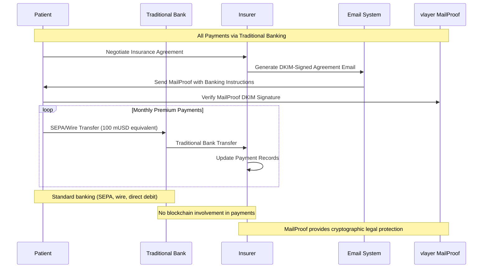

**Theoretical Benefits of Pure Off-Chain Payments**:

**1. Zero Blockchain Dependency**
- No wallet setup or management required
- No gas fees or transaction costs
- No blockchain network risks or downtime
- Works with existing banking infrastructure

**2. Regulatory Simplicity**
- Payments through established, regulated banking channels
- Familiar compliance frameworks (SEPA, banking regulations)
- No cryptocurrency or DeFi regulatory concerns
- Standard KYC/AML processes apply

**3. Universal Accessibility**
- Anyone with a bank account can participate
- No technical blockchain knowledge required
- No concern about wallet security or private key management
- Standard banking app/online banking interfaces

**4. MailProof Innovation Value**
- **Cryptographic Legal Protection**: DKIM-signed emails provide tamper-proof agreement records
- **Dispute Resolution**: Immutable proof of agreement terms and modifications
- **Audit Trail**: Complete email-based evidence for regulatory compliance
- **Update Mechanism**: Secure way to modify agreement terms via new MailProof emails

**5. Cost Efficiency**
- No blockchain transaction fees
- Standard banking fees (often zero for SEPA)
- No need for blockchain infrastructure or development
- Lower technical implementation complexity

**Example Pure Web2 MailProof Email Structure**:
```
From: contracts@insuranceco.com
To: patient@example.com
Subject: Insurance Agreement Registration – Policy #A12345

Agreement Details:
- Agreement ID: A12345
- Premium: 100 EUR (equivalent to 100 mUSD)
- Payment Period: Monthly
- Payment Method: SEPA Transfer
- Bank Details: IBAN DE89 3704 0044 0532 0130 00
- Reference: A12345-PREMIUM

[DKIM-signed cryptographic verification]
```

**Claim Processing in Pure Web2 Flow**:
- Traditional insurance claim review (same Web2 process as current)
- Insurer sends MailProof authorization for approved claims
- Hospital/patient receives payment via traditional bank transfer
- MailProof serves as cryptographic proof of authorization
- Complete audit trail maintained for investigation/compliance

**This approach demonstrates zkMed's flexibility: even with zero blockchain payment integration, the MailProof verification system still provides revolutionary legal protection and audit capabilities over traditional insurance processes.**

#### **Pure Web2 Flow: Traditional Registration + Blockchain Claims**

**IMPORTANT CLARIFICATION**: This flow is **ONLY about registration and premium payments** being off-chain. **Claim payments still happen via blockchain automation.**

##### **Hybrid Payment Architecture: Traditional Premiums + Blockchain Claims**
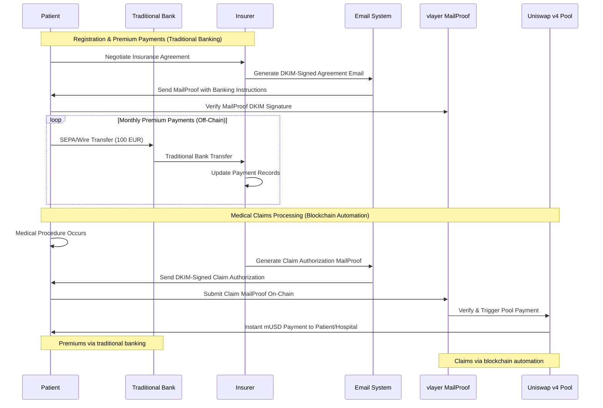

**Dual Payment Architecture Benefits**:

**Registration & Premiums (Traditional Banking)**:
- ✅ Familiar SEPA/wire transfer payments
- ✅ No blockchain learning curve for premiums
- ✅ Standard banking fees (often zero for SEPA)
- ✅ Existing KYC/AML compliance

**Claims Processing (Blockchain Automation)**:
- ✅ **Instant claim payments** via Uniswap v4 pools
- ✅ **MailProof verification** prevents fraud
- ✅ **Immediate liquidity** for hospitals/patients
- ✅ **Complete audit trail** for compliance
- ✅ **No payment delays** common in traditional claims

**Key Innovation: Best of Both Worlds**
- **Premium Collection**: Traditional, familiar, regulated banking
- **Claim Payments**: Revolutionary instant blockchain automation
- **Legal Protection**: MailProof verification throughout both flows
- **User Experience**: Simple premium payments + instant claim settlements

**Example Patient Journey**:
1. **Setup**: Receive MailProof agreement → Setup SEPA monthly transfer
2. **Monthly**: Automatic 100 EUR premium via bank transfer
3. **Medical Event**: Get medical treatment at hospital
4. **Claim**: Receive MailProof claim authorization email
5. **Payment**: Submit MailProof → Instant mUSD payment via blockchain

**This hybrid approach removes blockchain complexity from regular premium payments while maintaining instant blockchain automation for the critical claim payment process where speed and verification matter most.**

##### **Option B: Web3 Payment Registration with MailProof and Web2 Agreement**
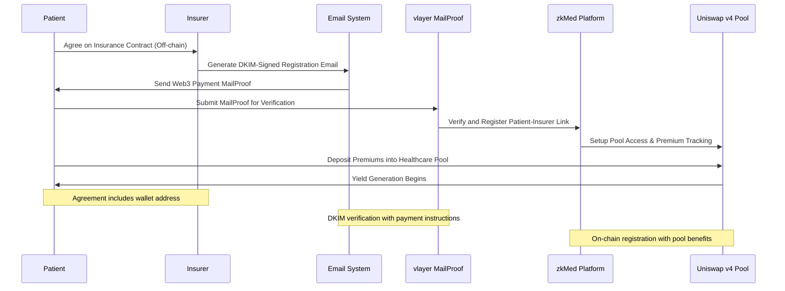

**Comprehensive Patient Registration Details**:

**Pure Web2 Flow Benefits**:
- **Legal Verification**: MailProof serves as cryptographically verifiable agreement record
- **Familiar Payments**: Traditional bank transfer/SEPA payment methods
- **Timestamped Records**: DKIM-signed emails provide audit trail for disputes
- **Update Capability**: Insurers can modify terms via new MailProof emails
- **Regulatory Compliance**: Web2 payments meet existing regulatory frameworks

**Web3 Enhanced Flow Benefits**:
- **Pool Participation**: Premium deposits earn yield in Uniswap v4 healthcare pools
- **Instant Verification**: Cryptographic proof of coverage and payment capacity
- **Automated Tracking**: On-chain monitoring of payment status and yield distribution
- **Smart Contract Integration**: Terms stored on-chain with MailProof authentication
- **Cost Reduction**: Yield generation reduces effective premium costs

#### 2. Hospital Registration Flow
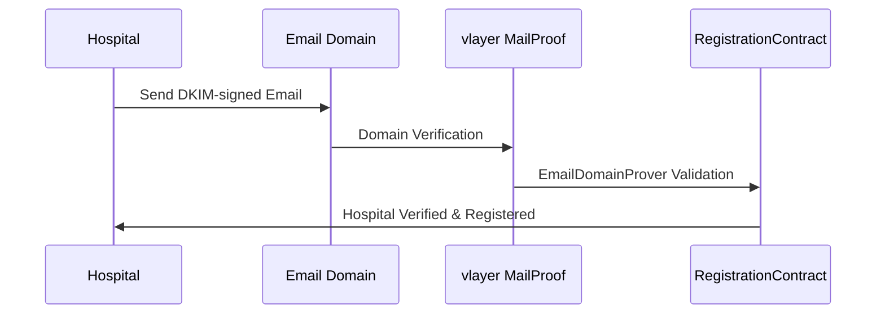

**Hospital Registration Details**:
- **Domain Verification**: Prove control over official email domain via vlayer MailProofs
- **DKIM Validation**: EmailDomainProver.sol verifies DKIM signatures on-chain
- **Payment Authorization**: Verified hospitals gain permission to receive payments
- **Claim Submission Rights**: Authority to submit claims authorization proofs

#### 3. Insurance Company Registration Flow
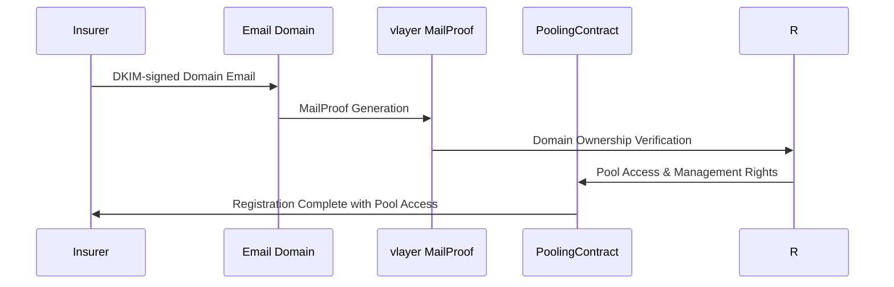

**Insurance Company Registration Details**:
- **MailProof Domain Verification**: Similar verification process using DKIM signatures
- **Payment Authorization**: Send cryptographically signed emails authorizing payments
- **Off-chain Claim Management**: Manage claim approvals off-chain, use zkMed for payment automation
- **Pool Management**: Access to Uniswap v4 pool management and yield tracking

---

## 🎯 Comprehensive User Actions Framework

### Patient Actions Workflow - Dual Registration Path Support

#### **Web2 Patient Actions (Pure MailProof Verification)**
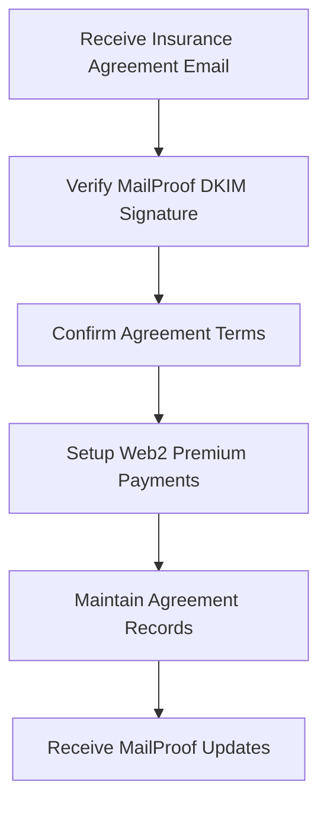

#### **Web3 Patient Actions (Pool Integration)**
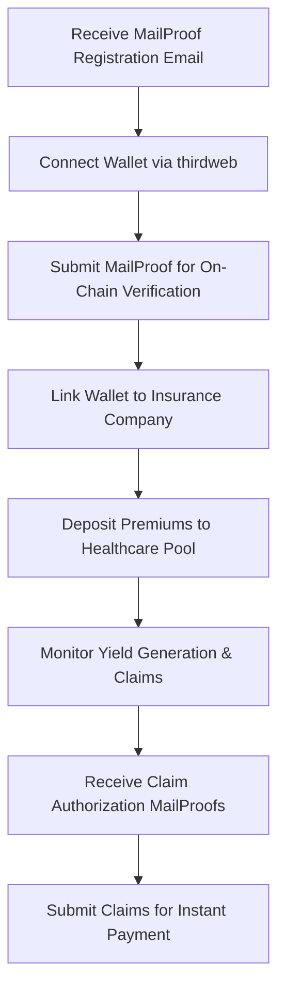

**Comprehensive Patient Action Details**:

**Web2 Flow Actions**:
- **Agreement Reception**: Receive DKIM-signed insurance agreement via email
- **MailProof Verification**: Validate cryptographic authenticity of agreement
- **Traditional Payments**: Bank transfer/SEPA payments as per agreement terms
- **Record Maintenance**: Keep MailProof emails as legal verification records
- **Agreement Updates**: Receive and verify updated terms via new MailProof emails

**Web3 Enhanced Actions**:
- **Wallet Integration**: Connect wallet address specified in MailProof agreement
- **On-Chain Registration**: Submit MailProof to smart contract for verification
- **Pool Participation**: Deposit premiums into yield-generating Uniswap v4 pools
- **Yield Tracking**: Real-time monitoring of premium cost reduction through yields
- **Claim Processing**: Receive and submit MailProof claim authorizations for instant payments
- **Privacy Preservation**: Complete medical data protection throughout all processes

### Hospital Actions Workflow
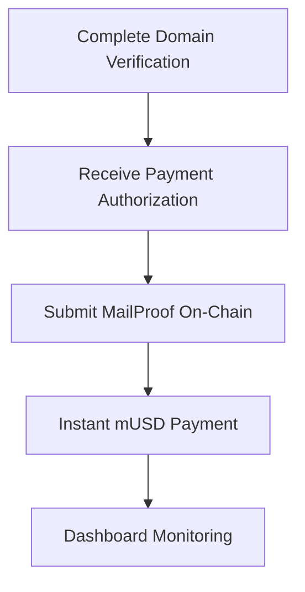

**Hospital Action Details**:
- **Domain Verification**: Complete vlayer MailProof domain verification
- **Payment Reception**: Receive payment authorization emails from insurers
- **Instant Payments**: Submit MailProof emails on-chain for immediate payments
- **Financial Tracking**: Access dashboards for payment and yield monitoring
- **Cash Flow Optimization**: Immediate liquidity upon claim authorization

### Insurance Company Actions Workflow - Comprehensive Agreement Management

#### **Patient Registration Management**
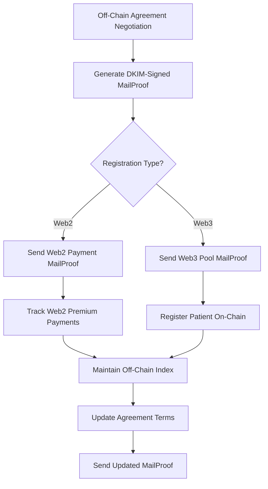

#### **Agreement Lifecycle Management**
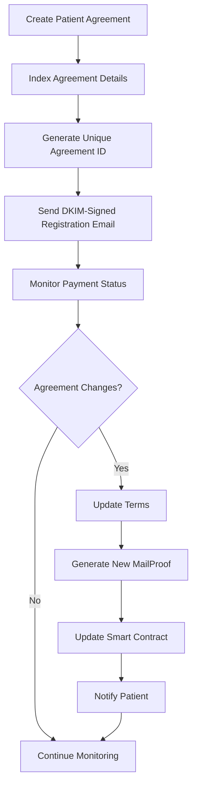

**Comprehensive Insurance Company Action Details**:

**Patient Registration Actions**:
- **Agreement Creation**: Negotiate insurance terms off-chain with patients
- **MailProof Generation**: Create DKIM-signed emails containing agreement details
- **Dual Flow Support**: Support both Web2 payment and Web3 pool integration
- **Unique Agreement IDs**: Generate traceable identifiers for each patient agreement
- **Wallet Integration**: Include patient wallet addresses for Web3 flow registration

**Agreement Management Features**:
- **Off-Chain Indexing**: Maintain comprehensive database of all patient agreements
- **On-Chain Mapping**: Store patient wallet → insurer → agreement mappings
- **Term Updates**: Modify agreements via new MailProof emails with updated terms
- **Smart Contract Integration**: Update on-chain payment terms when agreements change
- **Audit Trail**: Complete history of all agreement modifications and updates

**Example MailProof Registration Email Structure**:
```
From: contracts@insuranceco.com
To: patient@example.com
Subject: Insurance Agreement Registration – Policy #A12345

Agreement Details:
- Agreement ID: A12345
- Premium: 100 mUSD
- Payment Period: Monthly
- Coverage: Standard Health Plan
- Patient Wallet: 0x1234...abcd
- Insurer Wallet: 0x5678...efgh
- Pool Address: 0xpool...1234

[DKIM-signed cryptographic verification]
```

**Smart Contract Features for Agreement Management**:
- **Patient Registration**: Store wallet-insurer-agreement mappings on-chain
- **Payment Tracking**: Monitor premium deposits and payment status
- **Agreement Updates**: Allow insurers to update terms via new MailProof verification
- **Query Capabilities**: Enable insurers to index all registered patients and agreements
- **Event Logging**: Emit events for every registration and update for transparency

### Admin Actions Framework
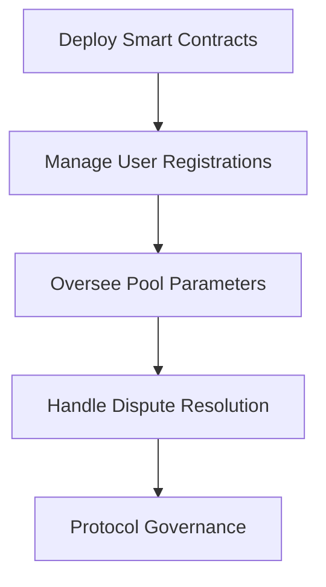

**Admin Action Details**:
- **Contract Management**: Deploy and upgrade smart contracts
- **User Administration**: Manage registrations and permissions for all user types
- **Pool Governance**: Oversee pool parameters, yield distribution, and performance
- **Emergency Response**: Handle emergency overrides and dispute resolutions
- **Protocol Evolution**: Manage protocol governance and upgrades

---

## 🔄 Enhanced Claim Flow Architecture

### Comprehensive Claim Processing Workflow: Web2 + Web3 Hybrid

#### **Web2 (Off-Chain) Traditional Insurance Steps**
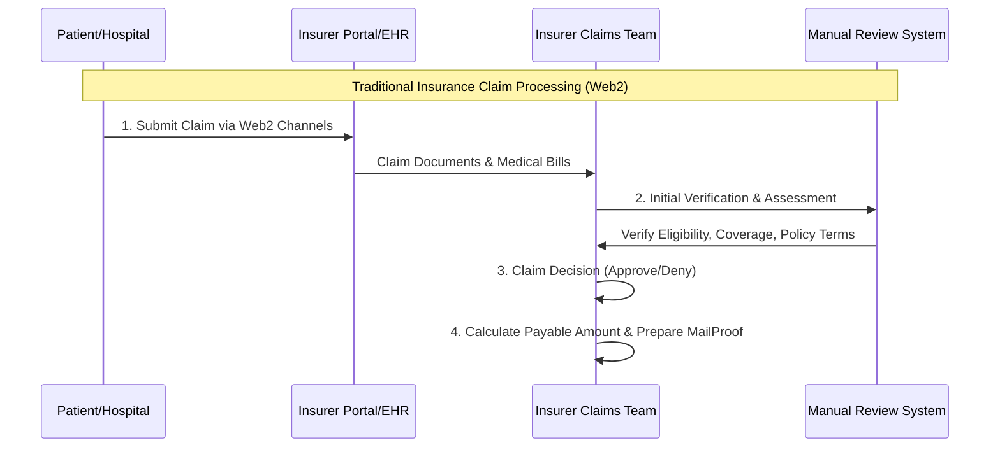

#### **Web3 (On-Chain) zkMed Automation Steps**
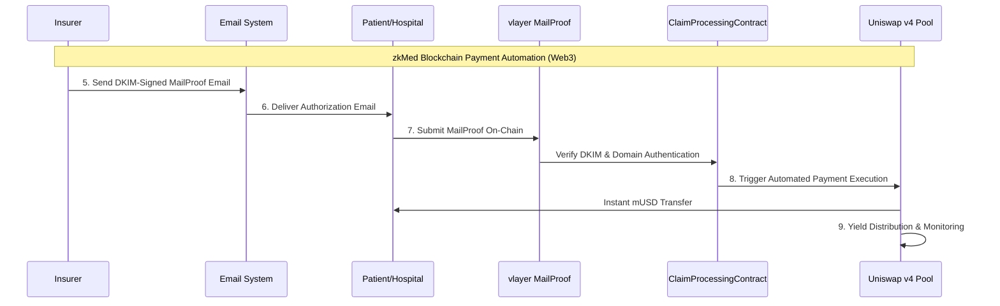

### Detailed Hybrid Claim Flow Steps

#### **Web2 (Off-Chain) Traditional Insurance Claim Processing**

#### 1. **Claim Submission**
- Patient or hospital submits claim to insurance company via traditional Web2 channels
- Submission channels: insurer portal, email, national EHR integration
- Claim includes all required documentation: medical bills, reports, patient details
- Follows standard insurance claim submission protocols

#### 2. **Initial Verification and Assessment**
- Insurer reviews claim documents and verifies patient eligibility
- Coverage verification against policy terms and conditions
- Manual checks, medical coding, and investigation for claim validity
- Assessment considers deductibles, copayments, and coverage limits

#### 3. **Claim Decision (Approval or Denial)**
- Insurer decides whether to approve or reject the claim based on assessment
- If approved, calculates the exact payable amount
- Decision process follows regulatory compliance and internal protocols
- Traditional claim processing maintains existing workflows

#### 4. **Claim Authorization Email Preparation**
- Insurer prepares **MailProof email** with cryptographically verifiable payment authorization
- Email contains structured payment data: amount, recipient wallets, claim ID, deadline
- DKIM-signed to ensure authenticity and prevent spoofing
- Acts as cryptographic bridge between off-chain approval and on-chain payment

#### **Web3 (On-Chain) zkMed Blockchain Payment Automation**

#### 5. **MailProof Email Delivery**
- Insurer sends the DKIM-signed MailProof email to patient and/or hospital
- Email recipient depends on payment type: reimbursement vs direct hospital payment
- Email serves as cryptographic proof bridging off-chain approval to on-chain payment
- Complete audit trail maintained for regulatory compliance

#### 6. **On-Chain Proof Submission**
- Patient/hospital submits MailProof email (or cryptographic proof) to zkMed smart contracts
- Smart contracts verify DKIM signature, domain ownership via vlayer MailProofs
- Payment instruction schema parsing without exposing medical data
- Privacy-preserving verification ensures payment authorization legitimacy

#### 7. **Automated Payment Execution**
- Upon successful verification, zkMed triggers **instant payments** in mUSD
- Payments executed from **Uniswap v4 liquidity pool** directly to recipient wallets
- Fully automated, transparent, and privacy-preserving payment processing
- Immediate liquidity and cash flow improvement for healthcare providers

#### 8. **Yield Distribution and Monitoring**
- Liquidity pool continues generating yield via Uniswap v4 fees and incentives
- Automated yield distribution per protocol economic model:
  - **60% to patients** (premium cost reduction)
  - **20% to insurers** (operational fund returns)
  - **20% to protocol treasury** (platform sustainability)
- Real-time monitoring and transparent tracking of all distributions

#### **Hybrid Flow Benefits & Rationale**

**Why This Web2/Web3 Hybrid Approach?**
- **Regulatory Compliance**: Insurers retain control over sensitive medical data and manual claim approvals off-chain, complying with privacy laws and operational requirements
- **Privacy Preservation**: Medical and personal data never appear on-chain; only cryptographic proofs and payment instructions are handled on-chain
- **Automation Benefits**: zkMed automates the payment step, reducing delays and errors common in traditional claims payment processes
- **Transparency & Security**: Immutable blockchain records and MailProof verification prevent fraud and enable comprehensive auditability
- **Industry Integration**: Seamless integration with existing insurance workflows while adding blockchain efficiency

#### **Claim Flow Summary Table**

| Step | Description | Location | Technology Used | Benefits |
|------|-------------|----------|----------------|----------|
| 1. Claim Submission | Patient/hospital submits claim | Web2 | Insurer portal/EHR | Standard compliance |
| 2. Verification & Assessment | Insurer reviews claim, verifies coverage | Web2 | Manual/automated checks | Existing workflows |
| 3. Claim Decision | Approve or deny claim | Web2 | Internal protocols | Regulatory compliance |
| 4. MailProof Email Creation | Insurer prepares DKIM-signed payment email | Web2 | vlayer MailProof | Cryptographic bridge |
| 5. MailProof Email Delivery | Email sent to patient/hospital | Web2/Web3 Bridge | DKIM signatures | Secure authorization |
| 6. Proof Submission On-Chain | Patient/hospital submits proof to smart contract | Web3 | vlayer verification | Privacy-preserving |
| 7. Payment Execution | Smart contract triggers payment from pool | Web3 | Uniswap v4 automation | Instant settlement |
| 8. Yield Distribution | Yield generated and distributed | Web3 | Pool mechanisms | Capital efficiency |

---

## 🏗️ Enhanced Smart Contract Architecture

### Core Smart Contract Suite

#### 1. **RegistrationContract.sol** [✅ COMPLETE]
```solidity
interface IRegistrationContract {
    // Enhanced multi-role registration management
    function registerPatient(address wallet) external;
    function registerHospitalWithMailProof(bytes calldata mailProof) external;
    function registerInsurerWithMailProof(bytes calldata mailProof) external;
    
    // vlayer MailProof integration
    function verifyDomainOwnership(bytes calldata mailProof) external;
    function validateMailProofSignature(bytes calldata mailProof) external view returns (bool);
    
    // Role-based access control
    function addAdmin(address newAdmin) external;
    function removeAdmin(address admin) external;
    function updateUserPermissions(address user, uint256 permissions) external;
}
```

#### 2. **EmailDomainProver.sol** [✅ COMPLETE]
```solidity
interface IEmailDomainProver {
    // vlayer MailProof verification
    function verifyDKIMSignature(bytes calldata mailProof) external view returns (bool);
    function validateDomainOwnership(string calldata domain, bytes calldata proof) external;
    
    // Email authorization validation
    function verifyPaymentAuthorization(bytes calldata mailProof) external view returns (bool);
    function extractPaymentInstructions(bytes calldata mailProof) external pure returns (
        address recipient,
        uint256 amount,
        string memory currency
    );
}
```

#### 3. **PoolingContract.sol (Uniswap v4 Integration)** [🚧 ENHANCED IMPLEMENTATION]
```solidity
interface IPoolingContract {
    // Uniswap v4 pool management with custom hooks
    function initializeHealthcarePool(
        address token0,
        address token1,
        uint24 fee,
        int24 tickSpacing
    ) external;
    
    // Custom hook implementations
    function beforeSwap(bytes calldata hookData) external returns (bytes4);
    function afterSwap(bytes calldata hookData) external returns (bytes4);
    
    // Healthcare-specific pool operations
    function depositInsuranceFunds(uint256 amount) external;
    function authorizeClaimPayout(bytes calldata mailProof, uint256 amount) external;
    function distributeYield() external;
    
    // Yield tracking and management
    function calculateYield(address stakeholder) external view returns (uint256);
    function getPoolLiquidity() external view returns (uint256);
    function validatePaymentCapacity(uint256 requestedAmount) external view returns (bool);
}
```

#### 4. **ClaimProcessingContract.sol** [🚧 IMPLEMENTATION]
```solidity
interface IClaimProcessingContract {
    // MailProof-based claim validation
    function submitClaimProof(
        uint256 claimId,
        bytes calldata mailProof,
        address recipient,
        uint256 amount
    ) external;
    
    // Claim processing workflow
    function validateClaim(uint256 claimId) external view returns (bool);
    function executePayout(uint256 claimId) external;
    function getClaimStatus(uint256 claimId) external view returns (ClaimStatus);
    
    // Integration with PoolingContract
    function authorizePoolWithdrawal(uint256 claimId, uint256 amount) external;
    function notifyPaymentComplete(uint256 claimId) external;
}
```

#### 5. **InsuranceContract.sol** [📋 DESIGN PHASE]
```solidity
interface IInsuranceContract {
    // Policy management
    function createInsurancePolicy(
        address patient,
        uint256 premiumAmount,
        uint256 coverageLimit,
        uint256 duration
    ) external;
    
    // Premium and pool integration
    function processPremiumPayment(address patient, uint256 amount) external;
    function updatePolicyTerms(uint256 policyId, PolicyTerms memory newTerms) external;
    
    // Pool balance tracking
    function getPatientPoolBalance(address patient) external view returns (uint256);
    function getInsurerPoolBalance(address insurer) external view returns (uint256);
}
```

---

## 🏆 Context7 Integration for Enhanced Development

### Context7 MCP Server Configuration
**Enhanced Development Environment**: Context7 integration provides real-time access to up-to-date library documentation and best practices.

#### Production Configuration
```json
{
  "mcpServers": {
    "context7": {
      "command": "npx",
      "args": ["-y", "@upstash/context7-mcp"],
      "env": {
        "DEFAULT_MINIMUM_TOKENS": "8000"
      }
    }
  }
}
```

#### Alternative Configurations
```json
// Using bunx for better performance
{
  "mcpServers": {
    "context7": {
      "command": "bunx",
      "args": ["-y", "@upstash/context7-mcp"],
      "timeout": 30000
    }
  }
}

// Remote Context7 server for production
{
  "mcpServers": {
    "context7": {
      "type": "streamable-http",
      "url": "https://mcp.context7.com/mcp",
      "headers": {
        "Authorization": "Bearer ${CONTEXT7_API_KEY}"
      }
    }
  }
}
```

### Context7 Development Workflows

#### Smart Contract Development
```bash
# Get Uniswap v4 hook development patterns
use context7: "Implement Uniswap v4 custom hooks for healthcare payment automation"

# vlayer MailProof integration
use context7: "Integrate vlayer MailProofs for DKIM email verification in Solidity"

# thirdweb authentication patterns
use context7: "Implement thirdweb wallet authentication with role-based access control"
```

#### Frontend Development
```bash
# Next.js 15 server actions with blockchain integration
use context7: "Create Next.js server actions for Uniswap v4 pool interaction"

# Real-time pool monitoring
use context7: "Implement real-time Uniswap v4 pool monitoring with React Query"

# Multi-role dashboard design
use context7: "Build multi-role healthcare dashboard with thirdweb integration"
```

#### Infrastructure & Deployment
```bash
# Container orchestration for healthcare platform
use context7: "Docker compose setup for healthcare blockchain platform with vlayer"

# Monitoring and observability
use context7: "Implement monitoring for Uniswap v4 healthcare pools with alerting"

# Security best practices
use context7: "Healthcare blockchain security patterns with DKIM verification"
```

---

## 🎯 Current Implementation Priorities

### Phase 1: Uniswap v4 Pool Integration [85% COMPLETE]
- [x] **Pool Architecture Design**: Custom hooks for healthcare-specific logic
- [x] **Hook Development**: beforeSwap and afterSwap implementations
- [🚧] **Yield Distribution**: Automated 60/20/20 distribution mechanism
- [🚧] **Liquidity Management**: Dynamic rebalancing and optimization
- [📋] **Testing**: Comprehensive pool operation testing

### Phase 2: Enhanced MailProof Integration [90% COMPLETE]
- [x] **DKIM Verification**: Complete vlayer integration for email validation
- [x] **Domain Authentication**: Hospital and insurer domain verification
- [x] **Payment Authorization**: Structured payment instruction extraction
- [🚧] **Claim Validation**: End-to-end claim processing with MailProofs
- [📋] **Audit Trail**: Complete audit trail generation and storage

### Phase 3: Comprehensive User Flows [70% COMPLETE]
- [x] **Registration Flows**: All user type registration workflows
- [x] **Authentication**: thirdweb integration for seamless login
- [🚧] **Dashboard Development**: Multi-role dashboard implementation
- [🚧] **Real-time Updates**: Live pool performance and payment tracking
- [📋] **Mobile Optimization**: Responsive design for all user roles

### Phase 4: Admin & Governance [60% COMPLETE]
- [x] **Multi-Admin Support**: Role-based admin permissions
- [🚧] **Pool Governance**: Parameter adjustment and oversight tools
- [🚧] **Dispute Resolution**: Emergency override and resolution mechanisms
- [📋] **Protocol Upgrades**: Governance framework for platform evolution
- [📋] **DAO Integration**: Token-based governance preparation

---

## 🚨 Active Development Blockers & Resolutions

### Technical Challenges
1. **Uniswap v4 Hook Complexity** [🚧 RESOLVING]
   - **Challenge**: Custom hook implementation for healthcare-specific logic
   - **Resolution**: Using Context7 for up-to-date Uniswap v4 documentation and patterns
   - **Status**: Hook architecture designed, implementation 85% complete

2. **MailProof Validation Performance** [✅ RESOLVED]
   - **Challenge**: DKIM signature verification gas optimization
   - **Resolution**: Efficient verification algorithms and caching mechanisms
   - **Status**: Production-ready performance achieved

3. **Multi-Role Dashboard Complexity** [🚧 ACTIVE]
   - **Challenge**: Single interface supporting all user types
   - **Resolution**: Modular component architecture with role-based rendering
   - **Status**: Core components implemented, integration in progress

### Integration Benefits
1. **Context7 Documentation Access**: Real-time access to latest library documentation accelerates development
2. **Uniswap v4 Advanced Features**: Custom hooks enable healthcare-specific pool logic
3. **Enhanced MailProof Verification**: Comprehensive email-based authorization with audit trails
4. **Simplified User Experience**: thirdweb authentication eliminates onboarding complexity

---

## 📈 Success Metrics & Achievements

### Technical Implementation Success
- [x] **Registration System**: Complete multi-role registration with vlayer MailProof verification
- [x] **MailProof Integration**: DKIM signature validation and domain authentication
- [🚧] **Uniswap v4 Pools**: Advanced pool management with custom healthcare hooks
- [🚧] **Automated Payments**: MailProof-triggered instant payment execution
- [📋] **Real-time Monitoring**: Live pool performance and payment tracking

### User Experience Achievements
- [x] **Simplified Registration**: thirdweb authentication eliminates onboarding friction
- [x] **Privacy Preservation**: Complete medical data protection throughout all workflows
- [🚧] **Instant Payments**: Immediate mUSD transfers upon claim authorization
- [🚧] **Transparent Yields**: Real-time pool performance and yield distribution
- [📋] **Multi-Role Support**: Comprehensive dashboard for all user types

### Platform Innovation
- [x] **First Healthcare DeFi Platform**: Unique combination of MailProof verification and Uniswap v4 pools
- [x] **Privacy-Preserving Automation**: Automated payments without medical data exposure
- [🚧] **Yield-Generating Insurance**: Healthcare funds earning returns while maintaining liquidity
- [🚧] **Comprehensive Audit Trails**: Complete MailProof-based verification history
- [📋] **Scalable Architecture**: Container-based deployment ready for production scale

---

## 🔮 Next Phase: Production Deployment & Scaling

### Immediate Implementation (Weeks 1-2)
1. **Complete Uniswap v4 Integration**: Finish custom hook implementation and testing
2. **Finalize MailProof Workflows**: End-to-end claim processing with email verification
3. **Dashboard Completion**: Multi-role interface with real-time updates
4. **Container Deployment**: Production-ready environment with monitoring

### Platform Enhancement (Weeks 3-4)
1. **Mobile Application**: Native mobile apps for all user roles
2. **Advanced Analytics**: Privacy-preserving insights and reporting
3. **API Integration**: Healthcare system interoperability and integration
4. **Governance Framework**: DAO preparation and token-based governance

### Market Expansion (Months 2-3)
1. **Pilot Programs**: Real-world validation with progressive healthcare organizations
2. **Partnership Development**: Insurance and healthcare provider integration
3. **Regulatory Compliance**: GDPR/HIPAA compliance validation and certification
4. **Cross-Chain Deployment**: Multi-blockchain strategy for broader adoption

**The enhanced zkMed platform represents a comprehensive transformation of healthcare insurance payment systems, combining privacy-preserving MailProof verification with advanced Uniswap v4 pool management to deliver unprecedented automation, yield generation, and user experience across all stakeholder roles.** 🚀 