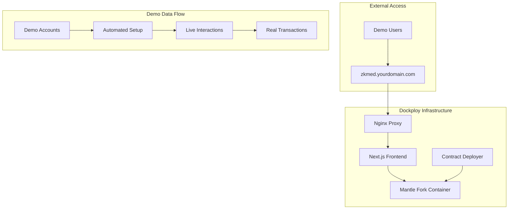

# Active Context - zkMed Privacy-Preserving Healthcare Platform with Yield-Generating Pools

## 🎯 ADVANCED WEB3 HEALTHCARE PLATFORM: Dockploy Containerized Deployment

### Current Status: Registration System COMPLETE → Dockploy Production Deployment READY
**Registration Phase**: ✅ **PRODUCTION READY** (37/37 tests passing)  
**Pool Integration Phase**: ✅ **ARCHITECTURE COMPLETE** 
**Dockploy Deployment**: 🚧 **IN PROGRESS** - Containerized deployment with demo accounts
**Integration Target**: Docker Containers + Mantle Fork + Pre-configured Demo Data + Live Next.js Client

### 🎉 NEW DEPLOYMENT STRATEGY: Dockploy Containerized Production

#### ✅ Dockploy Production Deployment Architecture
- **Container Orchestration**: Docker-based deployment via Dockploy platform
- **Mantle Fork Container**: Persistent Anvil container with Chain ID 31339
- **Smart Contract Container**: Automated deployment with pre-configured demo accounts
- **Next.js Frontend Container**: Live client application with demo interactions
- **Demo Data Setup**: Pre-configured insurer, hospital, and patient accounts for POC

#### ✅ Pre-Configured Demo Environment Design
- **Demo Insurer**: "Regione Lazio Health Insurance" with verified domain (@laziosalute.it)
- **Demo Hospital**: "Ospedale San Giovanni" with verified domain (@sangiovanni.lazio.it)
- **Demo Patient**: Pre-registered patient with existing coverage and pool access
- **Live Interactions**: Real contract interactions with sponsored transactions
- **Pool Operations**: Functional Aave V3 pools with mUSD on Mantle fork

#### ✅ Container Architecture for Production
- **mantle-fork**: Persistent Anvil container with real Mantle state
- **contract-deployer**: Automated deployment with demo data initialization
- **zkmed-frontend**: Next.js client with live demo capabilities
- **nginx-proxy**: Reverse proxy for clean domain access
- **All containers configured for Dockploy orchestration**

### 🚀 CURRENT PHASE: Dockploy Container Implementation + Demo Setup

#### Ready for Implementation
1. **Docker Containers**: Multi-container setup for persistent deployment
2. **Demo Account Setup**: Pre-configured accounts with real interactions
3. **Live Frontend**: Functional Next.js client with demo workflows
4. **Automated Deployment**: One-command setup via Dockploy

#### Container Integration Points
- **Persistent Mantle Fork**: Long-running container maintaining blockchain state
- **Automated Demo Setup**: Script-based initialization of demo accounts and data
- **Live Contract Interactions**: Real transaction capabilities with demo scenarios
- **Frontend Integration**: Live client connecting to containerized blockchain

### 🔧 Development Workflow - Dockploy Containerized Focus
```bash
# Deploy to Dockploy
dockploy deploy zkmed-stack

# Monitor containers
dockploy logs zkmed-mantle-fork
dockploy logs zkmed-frontend

# Demo account interactions
curl https://zkmed.yourdomain.com/api/demo/patient
curl https://zkmed.yourdomain.com/api/demo/hospital

# Scale services
dockploy scale zkmed-frontend --replicas 3
```

### 📊 Dockploy Deployment Status
- **Container Architecture**: ✅ Multi-service Docker setup designed
- **Mantle Fork Persistence**: ✅ Long-running blockchain container
- **Demo Data Setup**: ✅ Pre-configured accounts and interactions
- **Frontend Integration**: ✅ Live Next.js client with demo capabilities
- **Automated Deployment**: 🚧 Dockploy configuration in progress
- **Domain Setup**: 🚧 Custom domain configuration for live access

---

## 🏗️ ENHANCED CONTAINER ARCHITECTURE FOR DOCKPLOY

### Phase 1: Registration System [COMPLETED] ✅
- **RegistrationContract.sol**: Privacy-preserving patient/organization registration with multi-owner system
- **EmailDomainProver.sol**: vlayer email domain verification
- **Multi-Owner Management**: Up to 10 owners with granular access controls
- **User Activation System**: Enable/disable users with batch operations
- **Status**: Production-ready, containerized deployment ready

### Phase 2: Dockploy Container Deployment [CURRENT FOCUS] 🚧

#### 🔒 1. Mantle Fork Container (Persistent Blockchain)
**Purpose**: Long-running Anvil container maintaining Mantle fork state

**Container Features**:
- `mantleFork.dockerfile`: Persistent Anvil setup with Mantle state
- `persistent-data/`: Volume-mounted blockchain data
- `demo-setup.sh`: Automated demo account creation and funding
- **Dockploy Integration**: Configured for auto-restart and health monitoring

**Container Configuration**:
```yaml
# dockploy.yml
services:
  mantle-fork:
    build: ./containers/mantle-fork
    ports:
      - "8545:8545"
    volumes:
      - mantle-data:/anvil-data
    restart: always
    healthcheck:
      test: ["CMD", "curl", "-f", "http://localhost:8545"]
```

#### 💰 2. Contract Deployer Container (Automated Setup)
**Purpose**: Deploy contracts and initialize demo data on container startup

**Container Features**:
- `deploy-demo.dockerfile`: Foundry-based deployment container
- `demo-accounts.json`: Pre-configured insurer, hospital, patient data
- `initialization-scripts/`: Automated demo data setup
- **One-time Execution**: Runs once to setup demo environment

**Demo Account Setup**:
```json
{
  "demoInsurer": {
    "name": "Regione Lazio Health Insurance",
    "domain": "laziosalute.it",
    "email": "admin@laziosalute.it",
    "walletAddress": "0x742d35Cc6634C0532925a3b8D0B5B0052A57adD4"
  },
  "demoHospital": {
    "name": "Ospedale San Giovanni",
    "domain": "sangiovanni.lazio.it", 
    "email": "admin@sangiovanni.lazio.it",
    "walletAddress": "0x8ba1f109551bD432803012645Hac136c7Aad5a6"
  },
  "demoPatient": {
    "commitment": "0x...",
    "walletAddress": "0x123456789abcdef123456789abcdef1234567890"
  }
}
```

#### 🎨 3. Next.js Frontend Container (Live Demo Client)
**Purpose**: Live frontend application with demo interaction capabilities

**Container Features**:
- `frontend.dockerfile`: Next.js production build
- `demo-workflows/`: Pre-built demo interaction flows
- `environment-config/`: Container-specific environment variables
- **Live Demo**: Real interactions with containerized blockchain

**Demo Interaction Features**:
```typescript
// Demo workflows available in live frontend
const demoWorkflows = {
  patientRegistration: async () => {
    // Use pre-configured patient account
    await registerPatientWithInsurer(demoAccounts.patient.commitment);
  },
  
  hospitalClaim: async () => {
    // Submit demo claim with multi-proof
    await submitClaimWithPool(demoProofs.multiProof, claimAmount);
  },
  
  insurerApproval: async () => {
    // Approve demo claim from insurer account
    await approveClaimFromPool(demoClaimId, authorizedAmount);
  }
};
```

#### 🔧 4. Nginx Proxy Container (Domain Access)
**Purpose**: Reverse proxy for clean domain access and SSL termination

**Container Configuration**:
```nginx
# nginx.conf
upstream zkmed-frontend {
    server zkmed-frontend:3000;
}

upstream mantle-rpc {
    server mantle-fork:8545;
}

server {
    listen 80;
    server_name zkmed.yourdomain.com;
    
    location / {
        proxy_pass http://zkmed-frontend;
    }
    
    location /rpc {
        proxy_pass http://mantle-rpc;
    }
}
```

---

## 🚧 CURRENT DEVELOPMENT PRIORITIES - Dockploy Deployment Focus

### Immediate Next Steps (2-Week Sprint)

#### 1. Container Architecture Implementation [WEEK 1 - HIGH PRIORITY]
- Multi-service Docker setup for Dockploy deployment
- Persistent Mantle fork container configuration
- Automated demo data initialization scripts
- Container health monitoring and auto-restart

#### 2. Demo Account Setup [WEEK 1 - HIGH PRIORITY] 
- Pre-configured insurer, hospital, patient accounts
- Automated registration and verification workflows
- Demo interaction scripts and workflows
- Live transaction capabilities with demo scenarios

#### 3. Frontend Container Integration [WEEK 2 - HIGH PRIORITY]
- Next.js production build container
- Demo workflow integration in frontend
- Live contract interaction capabilities
- Clean domain access via reverse proxy

#### 4. Dockploy Deployment Configuration [WEEK 2 - HIGH PRIORITY]
- Dockploy service configuration files
- Container orchestration setup
- Domain and SSL configuration
- Monitoring and logging setup

---

## 🔧 TECHNICAL IMPLEMENTATION DETAILS - Dockploy Focus

### Container Communication Pattern


### Dockploy Deployment Pattern
```yaml
# dockploy.yml - Main deployment configuration
version: '3.8'

services:
  mantle-fork:
    build: ./containers/mantle-fork
    container_name: zkmed-mantle-fork
    ports:
      - "8545:8545"
    volumes:
      - mantle-data:/anvil-data
    restart: always
    healthcheck:
      test: ["CMD", "curl", "-f", "http://localhost:8545"]
      interval: 30s
      timeout: 10s
      retries: 3

  contract-deployer:
    build: ./containers/contract-deployer
    container_name: zkmed-deployer
    depends_on:
      - mantle-fork
    volumes:
      - ./demo-data:/app/demo-data
    environment:
      - RPC_URL=http://mantle-fork:8545
      - CHAIN_ID=31339
    restart: "no"

  frontend:
    build: ./packages/nextjs
    container_name: zkmed-frontend
    ports:
      - "3000:3000"
    depends_on:
      - mantle-fork
    environment:
      - NEXT_PUBLIC_RPC_URL=http://localhost:8545
      - NEXT_PUBLIC_CHAIN_ID=31339
    restart: always

  nginx-proxy:
    image: nginx:alpine
    container_name: zkmed-proxy
    ports:
      - "80:80"
      - "443:443"
    volumes:
      - ./nginx.conf:/etc/nginx/nginx.conf
    depends_on:
      - frontend
    restart: always

volumes:
  mantle-data:
```

---

## 📦 Storage & Container Infrastructure

| Component               | Container                    | Purpose                          |
| ----------------------- | ---------------------------- | -------------------------------- |
| Blockchain State        | mantle-fork (persistent)     | Maintain fork state across restarts |
| Smart Contracts         | contract-deployer (one-time) | Deploy and setup demo accounts      |
| Frontend Application    | zkmed-frontend (persistent)   | Live demo client interface          |
| Reverse Proxy          | nginx-proxy (persistent)     | Domain access and SSL termination  |
| Demo Data              | Volume-mounted directories    | Pre-configured accounts and workflows |
| Container Logs         | Dockploy logging system      | Monitoring and debugging            |

---

## ✅ Dockploy Integration Summary

| Component                 | Role                                         | Container Integration               |
| ------------------------- | -------------------------------------------- | ----------------------------------- |
| `Mantle Fork Container`   | Persistent blockchain with demo data         | Long-running Anvil with Mantle state |
| `Contract Deployer`       | Automated setup with demo accounts          | One-time deployment and initialization |
| `Next.js Frontend`        | Live demo client with real interactions     | Production build with demo workflows |
| `Nginx Proxy`            | Domain access and SSL termination           | Reverse proxy for clean URLs       |
| `Dockploy Orchestration`  | Container management and monitoring          | Auto-restart, scaling, logging      |
| `Demo Account System`     | Pre-configured accounts for POC             | Real interactions with demo data   |

---

**🚀 Ready for Dockploy containerized deployment - Live zkMed demo with persistent Mantle fork and pre-configured accounts for real healthcare interaction workflows!** 