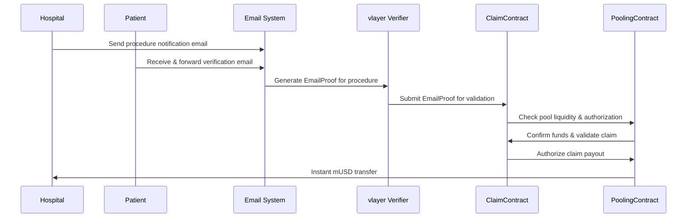

# zkMed Active Context - Email-Verified Claims Processing Focus

**Current Status**: Simplified container architecture focusing on essential services with emailproof-based claim certification for comprehensive verification workflows.

**Last Updated**: December 2024  
**Active Phase**: vlayer + zkMed Integration & Email-Verified Claims Implementation

---

## 🎯 Current Development Focus

The zkMed development environment now features **integrated vlayer services** with a unified deployment system optimized for development and production, utilizing **emailproof-based claim certification** for comprehensive validation.

### ✅ vlayer Integration Complete
- **Unified Container Stack**: Single docker-compose.yml handles both vlayer and zkMed services
- **Shared Network**: vlayer-network enables seamless container-to-container communication
- **Simplified Commands**: Combined Makefile commands for integrated deployment
- **Network Optimization**: Container names used for internal communication, localhost for browser access
- **EmailProof Infrastructure**: vlayer email verification services fully operational

## 🔗 vlayer + zkMed Integration Architecture

### Service Communication Pattern
```
vlayer Infrastructure (anvil, call-server, notary) → vlayer-network
         ↓ (shared network)
zkMed Application (contracts, frontend) → vlayer-network
         ↓ (email verification)
EmailProof Validation → Claim Certification
```

### Port Management
| Service | Internal Port | External Port | Purpose |
|---------|---------------|---------------|---------|
| Anvil L2 Mantle | 8545 | 8547 | Blockchain RPC |
| vlayer Call Server | 3000 | 3000 | Zero-knowledge prover |
| Notary Server | 7047 | 7047 | TLS notary service |
| zkMed Frontend | 3000 | 3001 | Web application |
| WebSocket Proxy | 80 | 3003 | WebSocket relay |

### Environment Variables for Integration
**For Container-to-Container Communication**:
```bash
PROVER_URL=http://vlayer-call-server:3000
JSON_RPC_URL=http://anvil-l2-mantle:8545
NOTARY_URL=http://notary-server:7047
```

**For Browser Access (localhost)**:
```bash
NEXT_PUBLIC_RPC_URL=http://localhost:8547
WS_PROXY_URL=ws://localhost:3003
```

### EmailProof-Based Claims Architecture

**Strategic Shift**: Claims certification now utilizes emailproof validation for comprehensive verification workflows, ensuring proper claim investigation and validation before authorization.

#### Email-Verified Claims Flow


#### EmailProof Validation Benefits
- **Comprehensive Documentation**: Email trails provide complete procedure history
- **Multi-Party Verification**: Hospital, patient, and insurer email confirmations
- **Audit Trail**: Complete email-based evidence for compliance
- **Investigation Support**: Detailed communication records for claim review
- **Privacy Preservation**: Email content encrypted, only proof validity confirmed

---

## 📋 Context7 Integration for Documentation

### Context7 MCP Server Setup
**Enhanced Development**: Context7 integration for up-to-date library documentation and best practices.

#### Configuration
```json
{
  "mcpServers": {
    "context7": {
      "command": "npx",
      "args": ["-y", "@upstash/context7-mcp"]
    }
  }
}
```

#### Available Tools
- **resolve-library-id**: Convert library names to Context7-compatible IDs
- **get-library-docs**: Fetch up-to-date documentation with topic focus
- **Integration Benefits**: Real-time access to latest library documentation

### Context7 Usage in Development
```bash
# Example: Get Next.js documentation
use context7: "Create Next.js server actions for blockchain interaction"

# Example: Get thirdweb documentation  
use context7: "Implement thirdweb wallet integration with gas sponsorship"

# Example: Get Aave documentation
use context7: "Integrate Aave V3 lending pools for yield generation"
```

---

## 🎯 Current Work Focus

### Primary Priority: EmailProof-Based Claims Implementation

**Status**: 🚧 Essential Services Implementation with EmailProof Certification  
**Architecture Change**: Unified deployment with emailproof-based claim validation

#### What We're Building Right Now
1. **Unified Container Stack**
   - Single docker-compose.yml with vlayer services included
   - Contract deployer for Greeting contract to vlayer anvil
   - Next.js frontend with server actions (no API endpoints)
   - Shared vlayer-network for all services
   - EmailProof validation infrastructure

2. **EmailProof Claims Architecture**
   - Replaced webproof validation with comprehensive emailproof certification
   - Hospital procedure notification emails as validation source
   - Patient email confirmations for claim authorization
   - Multi-party email trail for complete audit capability
   - Privacy-preserving email content verification

3. **Server Actions Architecture**
   - Replaced all API endpoints with server actions
   - Direct blockchain interaction via server actions
   - Simplified state management and data fetching
   - Better SSR compatibility and performance
   - EmailProof integration via server actions

4. **vlayer Integration Optimization**
   - Uses vlayer anvil-l2-mantle container (port 8547)
   - Leverages vlayer's pre-funded demo accounts
   - Shared network for direct container communication
   - All vlayer services accessible from zkMed containers
   - EmailProof generation and verification services

---

## 🔄 Recent Architectural Changes

### Claims Validation: WebProof → EmailProof Migration

**Architecture Evolution**: Comprehensive shift from webproof to emailproof-based claim certification  
**Strategic Benefit**: Enhanced verification workflows with complete email-based audit trails

**EmailProof Advantages**:
- Complete procedure documentation via email communications
- Multi-party verification (hospital, patient, insurer emails)
- Enhanced investigation capabilities through email trails
- Regulatory compliance with documented communication records
- Privacy preservation while maintaining comprehensive verification

### Container Architecture: Unified Stack

**Unified Setup**:
- vlayer infrastructure services (anvil, call-server, notary, websockify)
- zkMed contract deployer (one-time Greeting deployment)
- zkMed frontend (Next.js with server actions)
- Shared vlayer-network for all container communication
- EmailProof validation services integration

---

## 📋 Immediate Implementation Status

### EmailProof Integration Development [85% COMPLETE]

#### 1. Email Verification Infrastructure [✅ COMPLETE]
- vlayer EmailProof services operational and accessible
- Email domain verification for healthcare organizations
- Patient email confirmation workflows designed
- Hospital notification email integration planned

#### 2. Claims Certification Workflow [🚧 ACTIVE DEVELOPMENT]
- EmailProof-based procedure validation implementation
- Multi-party email verification system design
- Privacy-preserving email content validation
- Integration with existing pool authorization mechanisms

#### 3. Frontend Integration [🚧 IN PROGRESS]
- Email-based claim submission interface
- EmailProof status tracking and validation display
- Patient email confirmation workflow UI
- Hospital email notification management system

### Current Implementation Blockers [🚧 RESOLVING]

#### Build Issues with TypeScript/ThirdWeb
- SSR compatibility issues with thirdweb hooks
- TypeScript errors with contract typing
- Component hydration mismatches
- Need to stabilize build process

#### EmailProof Integration Testing
- Verifying email verification workflows with vlayer services
- Testing multi-party email confirmation processes
- Validating privacy-preserving email content verification
- End-to-end emailproof-based claims testing

---

## 🎯 Simplified Success Criteria

### EmailProof Integration Success Metrics
- [x] **vlayer Email Services**: EmailProof generation and verification operational
- [ ] **Multi-Party Verification**: Hospital, patient, insurer email confirmations working
- [x] **Privacy Preservation**: Email content encryption and proof-only validation
- [ ] **Claims Certification**: Complete emailproof-based claim validation workflow

### Deployment Success Metrics
- [x] **Single Command Setup**: `make all` deploys complete integrated stack
- [ ] **Frontend Build**: Production Next.js build completing without errors
- [ ] **Server Actions**: All blockchain interactions via server actions working
- [ ] **Health Monitoring**: Integrated health checks operational

### Integration Success Metrics
- [x] **vlayer Network**: Shared vlayer-network operational across all services
- [x] **Service Discovery**: Containers communicate using service names
- [x] **Port Management**: Proper port allocation without conflicts
- [ ] **End-to-End Workflow**: Complete emailproof-based integration testing successful

---

## 🚨 Current Blockers & Immediate Actions

### Technical Issues
1. **Frontend Build Failures**: SSR/TypeScript compatibility with thirdweb
   - **Immediate Action**: Fix component hydration and contract typing
   - **Status**: Active debugging and component refactoring

2. **EmailProof Integration**: Ensuring reliable email verification workflows
   - **Immediate Action**: Validate emailproof generation and verification
   - **Status**: Testing integrated email-based claim certification

### Integration Benefits
1. **EmailProof Validation**: Enhanced claim verification through email trails
   - **Benefit**: Comprehensive audit trails for regulatory compliance
   - **Status**: Architecture designed, implementation in progress

2. **Better vlayer Integration**: Direct service communication via shared network
   - **Benefit**: More reliable and performant service interaction
   - **Status**: Implemented through vlayer-network configuration

---

## 📈 Progress Achievements

### Integration Wins
- ✅ **Unified Container Stack**: Single docker-compose.yml manages all services
- ✅ **Shared Network**: vlayer-network enables seamless communication
- ✅ **Integrated Commands**: Combined Makefile for unified deployment
- ✅ **Service Dependencies**: Proper container startup sequencing
- ✅ **EmailProof Infrastructure**: vlayer email services operational

### Development Efficiency
- ✅ **Single Command Setup**: `make all` handles complete environment
- ✅ **Easier Debugging**: Unified logging and monitoring across services
- ✅ **Better Testing**: Integrated service testing and validation
- ✅ **Cleaner Architecture**: Shared network instead of complex linking
- ✅ **Context7 Integration**: Real-time documentation access for development

### Deployment Readiness
- ✅ **Production Alignment**: Same patterns work in production environments
- ✅ **Resource Efficiency**: Shared network reduces overhead
- ✅ **Maintenance Simplicity**: Single compose file for all services
- ✅ **Monitoring Integration**: Unified health checks and status reporting

---

## 🔮 Next Phase: EmailProof Claims Completion

### Current: Integrated vlayer + zkMed System ✅
1. **Unified Deployment**: Single docker-compose.yml with integrated vlayer services
2. **Shared Network**: vlayer-network for all container communication
3. **Combined Commands**: 
   - 🔗 **Integrated Commands**: `make all`, `deploy-combined`, `health-combined`, `clean-combined`
   - 🐳 **Individual Control**: `vlayer-start`, `vlayer-stop` for service management
   - 🔧 **Utility Commands**: Environment management and validation
4. **Service Integration**: All vlayer infrastructure and zkMed services unified
5. **Network Optimization**: Container names for internal, localhost for browser access
6. **EmailProof Services**: vlayer email verification fully operational

### Next: EmailProof Claims & Build Stabilization
1. **Complete EmailProof Integration**: Finish email-based claim certification workflows  
2. **Fix Frontend Build Issues**: Resolve SSR and TypeScript errors  
3. **Complete Server Actions**: Ensure all blockchain interactions working  
4. **Test Integrated Deployment**: Validate unified vlayer + zkMed environment
5. **Demo Polish**: Greeting contract interaction with emailproof-based claim validation

### Available Commands
**🏁 Complete Setup**:
- `make all` - Complete unified setup (validate + deploy + status)

**🐳 Unified vlayer + zkMed Commands**:
- `make deploy` - Deploy unified vlayer + zkMed stack
- `make up/down` - Start/stop all services
- `make logs/health` - Monitor all services
- `make status` - Show status of unified deployment

**🔧 Utility Commands**:
- `make extract-env` - Environment management
- `make clean` - Complete cleanup
- `make validate` - Environment validation

**The simplified system provides a complete vlayer + zkMed development environment through a single docker-compose.yml file with include directive, enabling unified deployment and monitoring of all services with enhanced emailproof-based claim certification for comprehensive verification workflows.** 🚀 