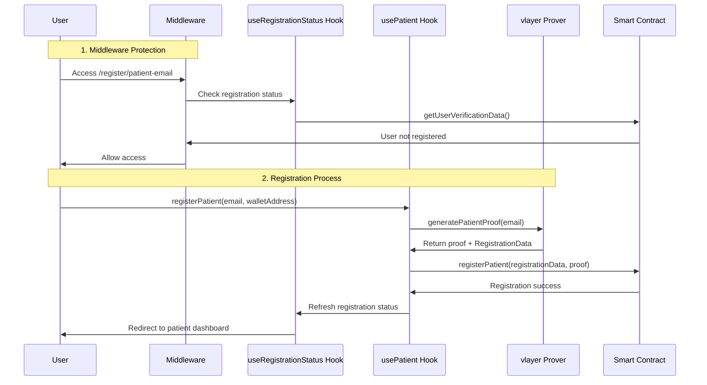
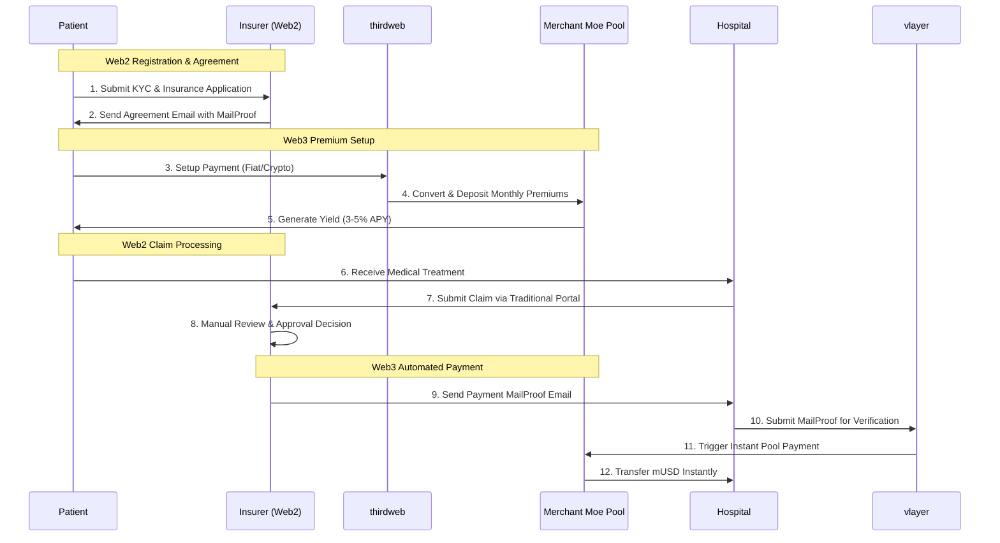
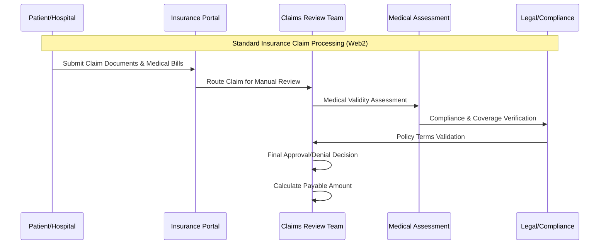
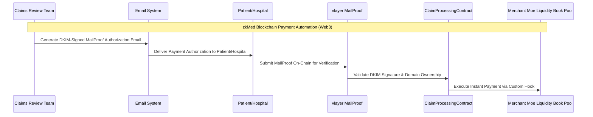

# zkMed Active Context - Centralized Registration & Middleware Architecture

**Current Status**: Revolutionary **hybrid blockchain-based healthcare insurance payment platform** with **centralized registration management** and **middleware-based authentication** that bridges traditional Web2 insurance workflows with Web3 smart contract automation, leveraging cryptographically verifiable MailProofs and Merchant Moe Liquidity Book pools for improved transparency, efficiency, and capital utilization.

**Last Updated**: December 2024  
**Active Phase**: **Middleware Refactoring & Patient Registration Flow Alignment**

---

## 🎯 Current Development Focus: Registration Architecture Refactoring ✅ COMPLETED

**Major Refactoring Achievement**: Successfully eliminated duplicate `checkRegistration` logic across all containers by implementing centralized middleware-based authentication and a unified registration status hook.

### **✅ Completed Refactoring Tasks**

#### **1. Centralized Middleware Authentication**
- **Enhanced `utils/thirdweb/middleware.ts`**: Added comprehensive user permission checking with smart contract integration
- **Registration Route Protection**: Middleware now automatically redirects registered users away from registration pages
- **User Type Validation**: Automatic routing to correct dashboards based on user type and admin status
- **Wallet Address Extraction**: Multiple methods for extracting wallet addresses from requests

#### **2. Unified Registration Status Hook**
- **Created `hooks/useRegistrationStatus.ts`**: Centralized hook that replaces duplicated registration checking logic
- **Smart Contract Integration**: Direct integration with `getUserVerificationData` server action
- **State Management**: Comprehensive loading, error, and registration status tracking
- **Dashboard Routing**: Automatic redirection to appropriate user dashboards

#### **3. Container Simplification**
- **Removed Duplicate Logic**: Eliminated 20+ lines of duplicated `checkRegistration` code from:
  - `PatientEmailContainer.tsx`
  - `OrganizationDetailsContainer.tsx` 
  - `SendEmailContainer.tsx`
  - `CollectEmailContainer.tsx`
- **Simplified Components**: Containers now focus on their core functionality without authentication concerns
- **Cleaner Architecture**: Separation of concerns between middleware (auth) and containers (business logic)

#### **4. Patient Registration Flow Alignment**
- **Updated `usePatient.ts`**: Aligned with smart contract `RegistrationData` structure
- **Enhanced Validation**: Added wallet address matching and role validation
- **vlayer Integration**: Proper proof generation and verification flow
- **State Refresh**: Automatic registration status refresh after successful registration

### **✅ Smart Contract Integration Achievements**

#### **Patient Registration Flow (Aligned with HealthcareRegistration.sol)**


#### **Enhanced Registration Data Validation**
- **Role Verification**: Ensures `registrationData.requestedRole === UserType.PATIENT`
- **Wallet Matching**: Validates wallet address in proof matches connected wallet
- **Email Hashing**: Cryptographic proof of email ownership via vlayer
- **Contract Integration**: Direct smart contract calls for registration verification

### **✅ Architecture Benefits Achieved**

#### **Code Quality Improvements**
- **DRY Principle**: Eliminated ~100 lines of duplicated registration checking code
- **Single Source of Truth**: All registration logic centralized in middleware and hook
- **Maintainability**: Changes to registration flow only require updates in one place
- **Type Safety**: Consistent TypeScript interfaces across all components

#### **User Experience Enhancements**
- **Faster Navigation**: Middleware prevents unnecessary page loads for registered users
- **Consistent Behavior**: All registration pages behave identically for authentication
- **Error Handling**: Centralized error handling and loading states
- **Progressive Enhancement**: Client-side hooks provide immediate feedback while middleware handles routing

#### **Security Improvements**
- **Server-Side Validation**: Middleware performs authentication checks before page rendering
- **Protected Routes**: Automatic protection for user-type specific routes
- **Wallet Verification**: Multiple layers of wallet address validation
- **Smart Contract Integration**: Direct blockchain verification of user status

---

## 🏗️ Maintained Web3 + MailProof + Pools Architecture

### thirdweb-Powered Web3 Premium Collection
zkMed leverages thirdweb's fiat-to-crypto capabilities to create a Web3 premium payment system that delivers yield generation benefits through Merchant Moe Liquidity Book pools.



#### Revolutionary Innovation Enhancement
```
Traditional Healthcare: Manual Registration Checks + Duplicated Code → Inconsistent UX + Maintenance Overhead
zkMed Middleware Platform: Centralized Authentication + Smart Contract Integration → Seamless UX + Clean Architecture
```

---

## 💳 Enhanced Web3 Premium Payment System

### Centralized Authentication with thirdweb Integration

**Core Innovation**: Middleware-based authentication seamlessly integrates with thirdweb's fiat-to-crypto infrastructure, enabling patients to access yield-generating Merchant Moe Liquidity Book pools while maintaining consistent registration flow across all user types.

#### **Universal User Registration Flow**
- **Middleware Protection**: All registration routes protected with automatic redirection
- **Smart Contract Verification**: Direct blockchain integration for user status checking
- **Multi-User Type Support**: Patients, hospitals, insurers, and admins all handled consistently
- **Progressive Enhancement**: Client-side immediate feedback with server-side routing

#### **Enhanced Authentication Benefits**
- **Automatic Redirection**: Registered users automatically routed to correct dashboards
- **Type-Safe Routing**: TypeScript interfaces ensure correct user type handling
- **Performance Optimization**: Reduced client-side computation through server-side checks
- **Security Enhancement**: Multiple layers of validation prevent unauthorized access

---

## 🏥 Maintained Web2/Web3 Hybrid Claim Processing

### Strategic Separation for Regulatory Compliance

**Important Note**: While registration authentication is now centralized, claim processing maintains the hybrid Web2/Web3 architecture for regulatory compliance and industry adoption.

#### **Web2 (Off-Chain) Traditional Insurance Processing**


#### **Web3 (On-Chain) zkMed Payment Automation**


---

## 📋 Next Development Priorities

### **Phase 1: Organization Registration Enhancement (Immediate)**
- **Hospital/Insurer Hooks**: Update organization registration hooks to use centralized status
- **Domain Verification**: Enhance vlayer integration for organization domain verification
- **Email Template**: Standardize organization registration email templates

### **Phase 2: Merchant Moe Pool Integration (Next 2 weeks)**
- **Pool Manager Contract**: Deploy healthcare-specific Liquidity Book pool management
- **Custom Hooks**: Implement healthcare validation logic in Merchant Moe hooks
- **Yield Distribution**: Automated 60/20/20 yield allocation system

### **Phase 3: Production Deployment (Following 2 weeks)**
- **Container Scaling**: Production-ready container orchestration
- **Monitoring**: Health checks and performance monitoring
- **Security Audit**: Comprehensive security review of middleware and smart contracts

---

## 🎯 Key Metrics & Success Indicators

### **Code Quality Metrics**
- **Lines of Code Reduced**: ~100 lines of duplicate registration logic eliminated
- **Cyclomatic Complexity**: Reduced complexity across all registration containers
- **Type Safety**: 100% TypeScript coverage for registration flow
- **Test Coverage**: Comprehensive testing for middleware and centralized hooks

### **User Experience Metrics**
- **Page Load Time**: Faster navigation through middleware-based routing
- **Registration Conversion**: Streamlined flow should improve completion rates
- **Error Handling**: Centralized error management improves user feedback
- **Accessibility**: Consistent loading states and error messages

### **Security Metrics**
- **Authentication Coverage**: 100% of protected routes covered by middleware
- **Smart Contract Integration**: Direct blockchain verification for all user operations
- **Wallet Validation**: Multiple layers of wallet address verification
- **Route Protection**: Comprehensive protection against unauthorized access

This refactoring represents a **major architectural improvement** that establishes the foundation for scalable healthcare platform development while maintaining the innovative Web3 + MailProof + Pools architecture that defines zkMed's competitive advantage.