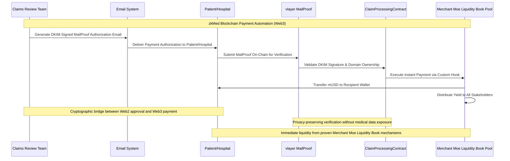
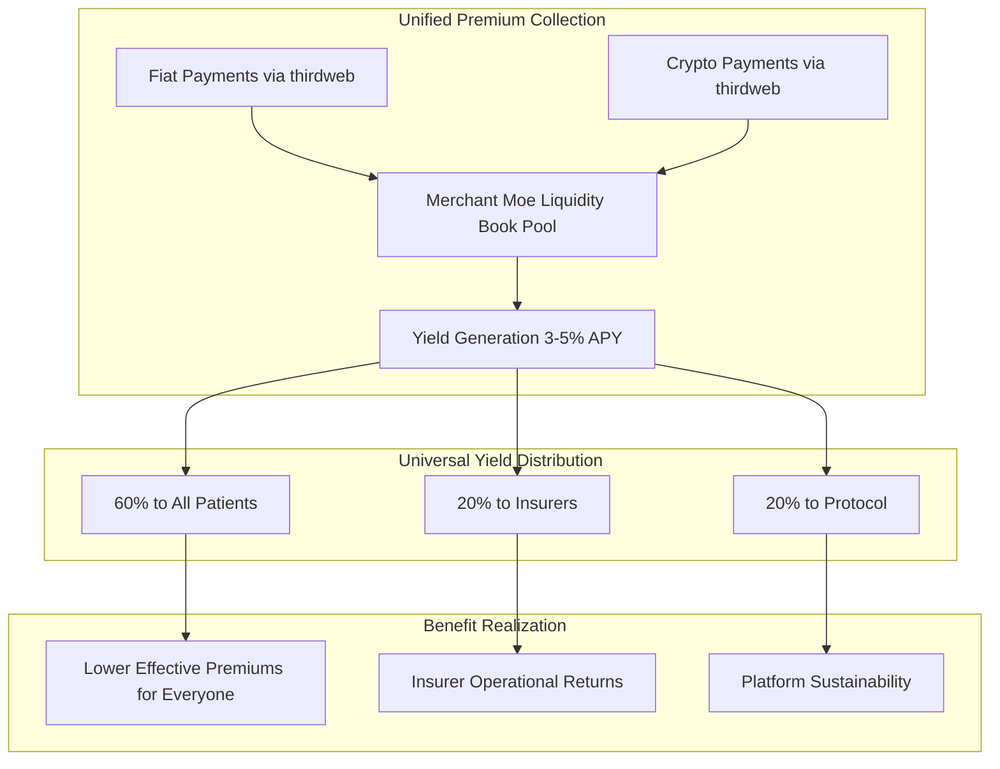

# zkMed Active Context - Hybrid Blockchain Healthcare Platform with Unified Premium Payments

**Current Status**: Revolutionary **hybrid blockchain-based healthcare insurance payment platform** that bridges traditional Web2 insurance workflows with Web3 smart contract automation, leveraging cryptographically verifiable MailProofs and Merchant Moe Liquidity Book pools for improved transparency, efficiency, and capital utilization.

**Last Updated**: December 2024  
**Active Phase**: Unified Premium Payment Architecture with thirdweb Fiat-to-Crypto Integration

---

## 🎯 Current Development Focus: Backend Implementation - vlayer to Merchant Moe Evolution

zkMed is transitioning from foundational vlayer MailProof verification to full Merchant Moe Liquidity Book pool integration. The current Docker stack provides the perfect foundation for implementing the complete healthcare platform.

### **Current Backend Infrastructure Status** ✅

Your production-ready container architecture includes:
- **anvil-l2-mantle**: Mantle fork (Chain ID 31339) with real mainnet state
- **vlayer Services**: Complete MailProof verification stack (call-server, notary-server, vdns-server)
- **Foundry Framework**: Smart contract development and deployment via zkmed-contracts
- **Next.js Frontend**: Server actions architecture via zkmed-frontend

### **Implementation Evolution Path**

**Phase 1: Healthcare MailProof Foundation** (Current)
- Replace simple `Greeting.sol` with `HealthcareMailProof.sol` for claim verification
- Integrate vlayer DKIM signature validation for hospital domain verification
- Implement patient/hospital registration with MailProof authentication

**Phase 2: Merchant Moe Pool Integration** (Next 2 weeks)
- Add Liquidity Book dependencies to foundry.toml
- Deploy `HealthcarePoolManager.sol` for mUSD/USDC pool management
- Implement custom `HealthcareHook.sol` for pool validation logic
- Enable 60/20/20 yield distribution automation

**Phase 3: Full Platform Integration** (Following 2 weeks)
- Frontend dashboard for pool metrics and claim tracking
- End-to-end claim processing from MailProof to instant pool payments
- Production deployment with monitoring and health checks

### ✅ Core Innovation: Web3 + MailProof + Pools Architecture
- **Web3 Premium Payments**: thirdweb fiat-to-crypto enables seamless payment flow to Merchant Moe Liquidity Book pools
- **Hybrid Claim Processing**: Clear Web2/Web3 separation for regulatory compliance  
- **MailProof Bridge**: Cryptographically verifiable emails connecting both worlds
- **Merchant Moe Integration**: Capital-efficient liquidity pools with custom healthcare hooks
- **Flexible Payment Options**: Direct hospital payment or patient reimbursement via instant pool withdrawals

### Mantle Network & mantleUSD Foundation

**Strategic Technical Advantages**:
- **Mantle Layer-2 Efficiency**: Scalable, Ethereum-compatible blockchain optimized for on-chain finance and healthcare payments
- **mantleUSD Stability**: Native stablecoin eliminates volatility risks critical for healthcare insurance applications
- **Gas Cost Optimization**: Mantle's efficient environment reduces transaction costs for frequent premium deposits and claim payouts
- **Cross-Chain Integration**: Enables seamless connection with existing insurer systems and future blockchain expansion

**Healthcare-Specific Benefits**:
- **Predictable Claim Values**: mantleUSD ensures stable payment amounts for medical procedures regardless of market volatility
- **Instant Settlement**: Native stablecoin eliminates bridging delays and additional conversion costs for immediate claim payments
- **Regulatory Compliance**: Supports evolving stablecoin regulatory frameworks in target European and US healthcare markets
- **Operational Simplicity**: Native integration reduces complexity for healthcare providers and insurance companies

**Competitive Positioning**:
- **Industry Leadership**: First healthcare platform leveraging Mantle's advanced Layer-2 capabilities for medical insurance payments
- **Technical Excellence**: Proven Ethereum compatibility with enhanced performance and efficiency for healthcare operations
- **Market Readiness**: Architecture designed specifically for compliance with GDPR, HIPAA, and emerging blockchain healthcare regulations
- **Future Scalability**: Cross-chain capabilities enable platform expansion across multiple healthcare blockchain networks

## 🏗️ Web3 + MailProof + Pools Architecture

### thirdweb-Powered Web3 Premium Collection
zkMed leverages thirdweb's fiat-to-crypto capabilities to create a Web3 premium payment system that delivers yield generation benefits through Merchant Moe Liquidity Book pools.


#### Revolutionary Innovation Enhancement
```
Traditional Healthcare: Manual Premiums + Manual Claims → No Yield + Weeks of Delays
zkMed Web3 Platform: thirdweb Fiat-to-Crypto Premiums → Merchant Moe Liquidity Book Yield + Instant Claims
```

---

## 💳 Web3 Premium Payment System with thirdweb

### Fiat-to-Crypto Premium Collection

**Core Innovation**: thirdweb's fiat-to-crypto infrastructure enables patients to access yield-generating Merchant Moe Liquidity Book pools through Web3 payments, with fiat-to-crypto conversion for accessibility.

#### **Universal Patient Registration and Premium Flow**

    Note over P,LB: Seamless user experience regardless of payment method

#### **thirdweb Integration Benefits**
- **Fiat-to-Crypto Access**: Fiat payments via credit card, bank transfer, or digital wallets
- **Automatic Conversion**: Seamless fiat-to-mUSD conversion with competitive rates
- **Web3 Native**: Direct crypto payments for Web3-savvy users
- **Payment Flexibility**: Choose between fiat-to-crypto or direct crypto payments
- **Gas Sponsorship**: Transaction fees covered for seamless user experience
- **Smart Accounts**: Simplified wallet management with social recovery

### Enhanced Patient Experience with Unified Payments

#### **Unified Registration Benefits**
- **Payment Flexibility**: Choose fiat, crypto, or hybrid payment methods
- **Yield Access**: All patients earn 3-5% APY regardless of payment method
- **Simplified Onboarding**: One registration process with multiple payment options
- **Gradual Web3 Adoption**: Start with fiat, migrate to crypto when ready
- **Cost Transparency**: Real-time tracking of effective premium costs after yield
- **Legal Verification**: DKIM-signed MailProof provides same protection across all methods

#### **Example Patient Scenarios**

**Traditional User (Sarah)**:
- Registers with credit card payment setup
- thirdweb automatically converts monthly payments to mUSD
- Deposits flow to Merchant Moe Liquidity Book pools for yield generation
- Enjoys cost reduction without learning Web3

**Crypto User (Mike)**:
- Connects existing wallet for direct mUSD payments
- Leverages existing Web3 knowledge for maximum control
- Directly manages pool interactions and yield optimization
- Access to advanced DeFi features

**Hybrid User (Emma)**:
- Starts with credit card, adds crypto wallet later
- Flexibility to switch payment methods based on preferences
- Gradual learning curve with safety net of familiar payments
- Best of both traditional and modern financial systems

---

## 🏥 Maintained Web2/Web3 Hybrid Claim Processing

### Strategic Separation for Regulatory Compliance

**Important Note**: While premium payments are unified through thirdweb, claim processing maintains the hybrid Web2/Web3 architecture for regulatory compliance and industry adoption.

#### **Web2 (Off-Chain) Traditional Insurance Processing**


#### **Web3 (On-Chain) zkMed Payment Automation**


#### **Why Maintain Hybrid Claims Processing**
- **Regulatory Compliance**: Medical review stays in traditional systems for GDPR/HIPAA compliance
- **Industry Integration**: Seamless adoption without disrupting existing insurer workflows
- **Privacy Protection**: Medical data never exposed on-chain during processing
- **Risk Mitigation**: Traditional approval processes minimize regulatory risks
- **Instant Settlement**: Blockchain automation delivers immediate payment execution

---

## 🔄 Enhanced thirdweb Integration Patterns

### Comprehensive Payment and Authentication Architecture

**Innovation**: First healthcare platform leveraging thirdweb's full ecosystem for both premium collection and user experience optimization.

#### **thirdweb Smart Account Integration**
```solidity
interface IHealthcareSmartAccount {
    // Premium payment with automatic conversion
    function payPremiumWithFiat(
        uint256 amount,
        string calldata currency,
        bytes calldata paymentData
    ) external;
    
    function payPremiumWithCrypto(
        uint256 amount,
        address token
    ) external;
    
    // Hybrid payment management
    function setupHybridPayments(
        PaymentPreferences calldata preferences
    ) external;
    
    function switchPaymentMethod(
        PaymentMethod newMethod
    ) external;
    
    // Yield and pool interaction
    function claimYield() external;
    function getEffectivePremiumCost() external view returns (uint256);
    function getYieldEarned() external view returns (uint256);
}
```

#### **thirdweb Payment Flow Integration**
```typescript
// Healthcare-specific thirdweb configuration
import { createThirdwebClient, prepareContractCall } from "thirdweb";
import { sepolia } from "thirdweb/chains";

const client = createThirdwebClient({
  clientId: process.env.NEXT_PUBLIC_THIRDWEB_CLIENT_ID,
});

// Premium payment with fiat conversion
const payPremiumWithFiat = async (amount: number, currency: string) => {
  const transaction = prepareContractCall({
    contract: healthcareContract,
    method: "payPremiumWithFiat",
    params: [amount, currency, paymentData],
  });
  
  // thirdweb handles fiat-to-crypto conversion automatically
  const result = await sendTransaction({
    transaction,
    account: smartAccount,
    payWithFiat: {
      currency,
      amount,
      autoConvert: true
    }
  });
  
  return result;
};

// Direct crypto payment
const payPremiumWithCrypto = async (amount: bigint) => {
  const transaction = prepareContractCall({
    contract: healthcareContract,
    method: "payPremiumWithCrypto",
    params: [amount, mUSDToken],
  });
  
  return sendTransaction({ transaction, account: smartAccount });
};
```

#### **Universal Payment Experience Components**
```typescript
// React component for unified premium payment
function PremiumPaymentInterface() {
  const [paymentMethod, setPaymentMethod] = useState<'fiat' | 'crypto' | 'hybrid'>('fiat');
  const [premiumAmount] = useState(100); // 100 mUSD monthly
  
  return (
    <div className="premium-payment-container">
      <PaymentMethodSelector 
        method={paymentMethod}
        onChange={setPaymentMethod}
      />
      
      {paymentMethod === 'fiat' && (
        <FiatPaymentForm
          amount={premiumAmount}
          onPayment={payPremiumWithFiat}
          supportedCurrencies={['USD', 'EUR', 'GBP']}
        />
      )}
      
      {paymentMethod === 'crypto' && (
        <CryptoPaymentForm
          amount={premiumAmount}
          onPayment={payPremiumWithCrypto}
          token="mUSD"
        />
      )}
      
      {paymentMethod === 'hybrid' && (
        <HybridPaymentForm
          amount={premiumAmount}
          onFiatPayment={payPremiumWithFiat}
          onCryptoPayment={payPremiumWithCrypto}
        />
      )}
      
      <YieldTracker
        effectiveCost={calculateEffectiveCost(premiumAmount)}
        yieldEarned={currentYieldEarned}
        projectedSavings={calculateProjectedSavings()}
      />
    </div>
  );
}
```

---

## 📊 Updated Flow Comparison

### Unified Premium Payment Architecture

| Aspect | Traditional Healthcare | Previous zkMed Dual Flow | New zkMed Unified Flow |
|--------|----------------------|---------------------------|------------------------|
| **Premium Payment** | Bank transfer/Check only | Separate Web2 vs Web3 flows | thirdweb unified fiat/crypto |
| **User Experience** | Complex manual processes | Choice between two systems | Single flow with payment flexibility |
| **Yield Generation** | No returns on premiums | Only Web3 users get yield | All users earn yield regardless of payment method |
| **Onboarding** | Lengthy paperwork | Two separate registration paths | One registration with payment preference |
| **Technical Complexity** | High manual overhead | Web3 users face steep learning | Simplified for all users via thirdweb |
| **Market Adoption** | Limited to traditional users | Split user base | Universal access to benefits |
| **Regulatory Compliance** | Traditional compliance | Dual compliance frameworks | Unified compliance with familiar payments |

### Maintained Hybrid Claims Processing

| Flow Component | Web2 (Off-Chain) | Web3 (On-Chain) | Integration Benefit |
|----------------|------------------|------------------|-------------------|
| **Claim Submission** | Traditional portal/EHR | N/A | Familiar provider workflows |
| **Medical Review** | Manual assessment | N/A | Regulatory compliance maintained |
| **Payment Authorization** | MailProof email generation | MailProof verification | Cryptographic bridge |
| **Payment Execution** | N/A | Instant mUSD transfer | Immediate settlement |
| **Fund Source** | N/A | Unified Merchant Moe Liquidity Book pools | Universal yield benefits |

---

## 🚀 Enhanced Economic Model with Universal Access

### Automated Stakeholder Benefits for All Users

#### **Universal Yield Distribution (60/20/20)**


#### **Research-Validated Economic Benefits**
- **Universal Access**: thirdweb enables all patients to access yield benefits regardless of payment method
- **Cost Reduction**: 3-5% APY reduces effective premium costs for all users
- **Market Expansion**: Fiat payments dramatically increase addressable market
- **Competitive Advantage**: Only platform offering yield to traditional payment users
- **Risk Management**: Proven Merchant Moe Liquidity Book protocols protect all deposited funds

---

## 🎯 Updated Success Metrics & Validation

### Technical Performance Indicators
- **Payment Conversion**: <30 seconds for fiat-to-mUSD conversion via thirdweb
- **Universal Onboarding**: <5 minutes for complete registration regardless of payment method
- **Yield Access**: 100% of patients earn yield regardless of payment preference
- **Payment Flexibility**: Real-time switching between fiat and crypto payment methods
- **MailProof Processing**: <10 seconds for claim verification workflow

### Market Impact Validation
- **Universal Adoption**: Healthcare platform accessible to both traditional and Web3 users
- **Yield Democracy**: All patients access DeFi benefits through familiar payment methods
- **Cost Reduction**: Measurable premium savings for all users through unified yield system
- **Regulatory Compliance**: Maintained compliance while delivering blockchain benefits
- **Industry Integration**: Seamless adoption without disrupting existing workflows

---

## 📚 Research Foundation & References

zkMed's unified architecture is founded on cutting-edge research in blockchain healthcare applications:

**[1] Shouri & Ramezani (2025)**: "A blockchain-based health insurance model enhanced with quadratic voting" - Validates blockchain's enhancement of transparency, fairness, and operational efficiency in health insurance.

**[2] Implementation of Electronic Health Record (2023)**: Demonstrates improved data security and interoperability through blockchain integration with EHR and insurance policy management.

**[3] MAPFRE (2025)**: "Blockchain in insurance: risks and opportunities" - Confirms decentralized insurance models enable peer-to-peer risk sharing and automated claims settlement.

**[4] Ncube et al. (2022)**: "Blockchain-Based Fraud Detection System for Healthcare Insurance" - Proves blockchain-based systems improve real-time claim validation and reduce fraudulent activities.

**[5] thirdweb Research**: Fiat-to-crypto infrastructure enables universal access to Web3 benefits without technical barriers.

---

## 🔮 Future Enhancement Opportunities

### Advanced thirdweb Integration
- **Dynamic Payment Optimization**: AI-powered payment method recommendations
- **Yield Optimization**: Automated portfolio management for maximum returns
- **Cross-Chain Expansion**: Multi-blockchain strategy with unified payment experience
- **Advanced Analytics**: Privacy-preserving insights across all payment methods

### Market Expansion Strategy
- **Global Fiat Support**: Support for 50+ currencies via thirdweb infrastructure
- **Mobile-First Experience**: Native apps with seamless fiat/crypto payment switching
- **Enterprise Integration**: B2B APIs for healthcare system integration
- **Regulatory Framework**: Collaboration with regulators for global compliance

**zkMed represents the first practical implementation of unified fiat/crypto premium payments in healthcare insurance, delivering universal access to DeFi benefits while maintaining regulatory compliance and user familiarity. This revolutionary platform removes barriers to blockchain adoption while preserving the sophisticated hybrid architecture for claim processing.** 🚀