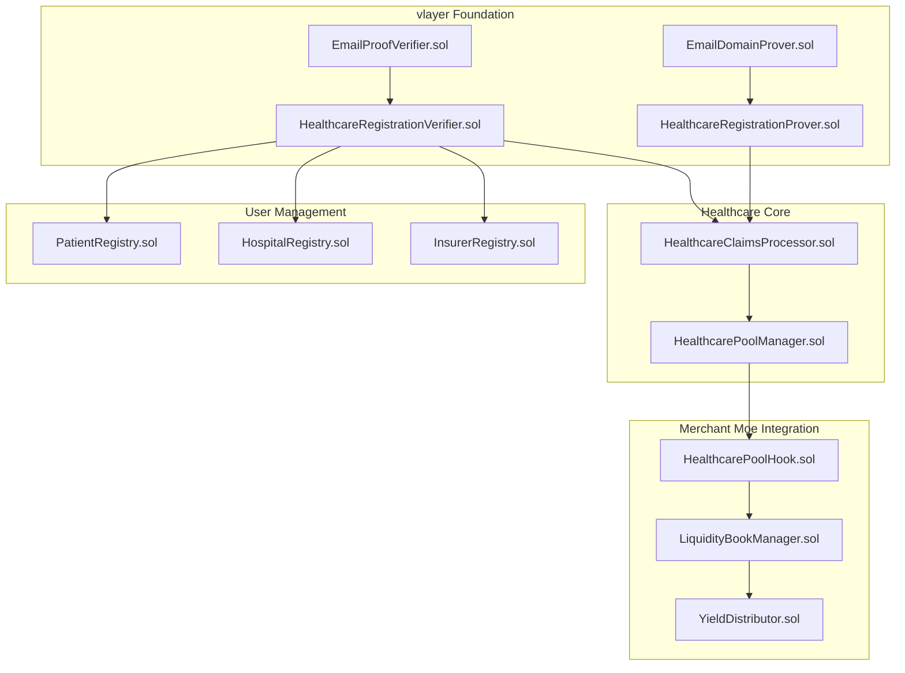
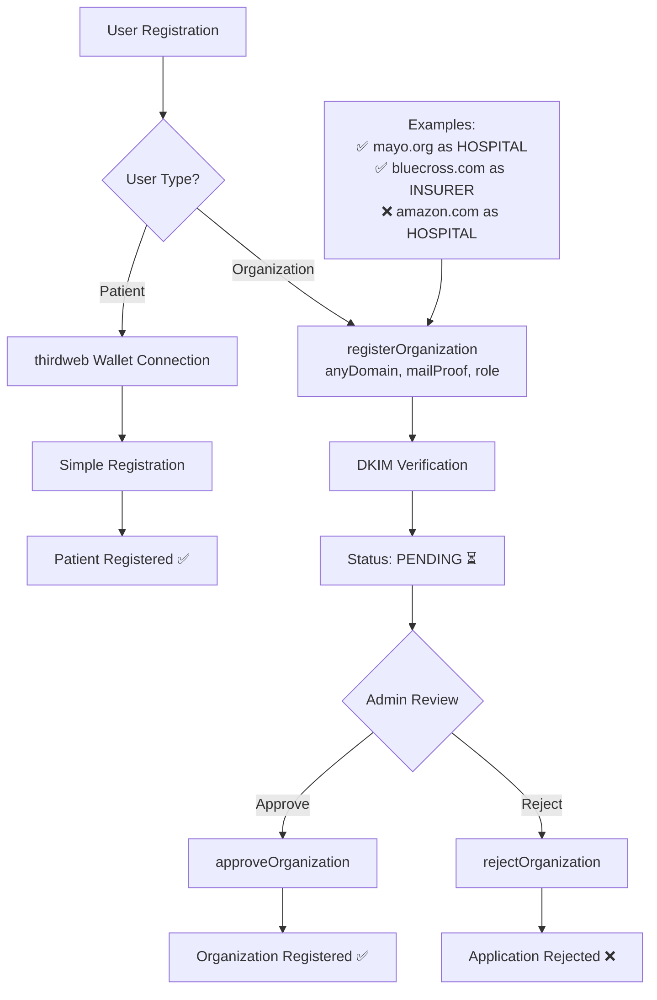
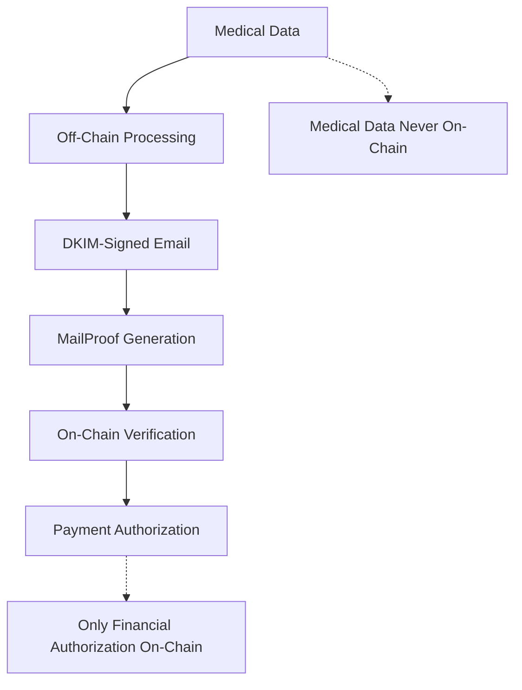

# zkMed Smart Contract Architecture - Healthcare Platform Contracts

**Purpose**: Comprehensive documentation of all smart contracts powering zkMed's revolutionary healthcare insurance platform with yield-generating Merchant Moe Liquidity Book pools and vlayer MailProof verification.

**Last Updated**: December 2024  
**Contract Framework**: Foundry with Solidity ^0.8.21

---

## 🏗️ Contract Architecture Overview

### Core Philosophy
zkMed employs a **hybrid Web2/Web3 contract architecture** where:
- **Web2 Layer**: Traditional insurance claim processing and medical review (off-chain)
- **Web3 Layer**: MailProof verification, instant payments, and yield generation (on-chain)
- **Bridge Contracts**: Cryptographic verification connecting both layers via DKIM-signed emails

### Contract Hierarchy


---

## 📋 Contract Specifications

### 1. **HealthcareRegistrationProver.sol** - vlayer MailProof Registration
**Status**: 🚧 In Development  
**Purpose**: Organization domain ownership verification (any domain allowed)

#### Core Functions
```solidity
contract HealthcareRegistrationProver is Prover {
    enum UserType { PATIENT, HOSPITAL, INSURER, ADMIN }
    enum OrganizationStatus { PENDING, APPROVED, REJECTED }
    
    struct RegistrationData {
        UserType requestedRole;
        address walletAddress;
        string domain;
        string organizationName;
        bytes32 emailHash;
    }
    
    // Universal organization registration: "Register organization [Name] as [Role] with wallet: 0x..."
    function proveOrganizationRegistration(UnverifiedEmail calldata unverifiedEmail)
        public view returns (Proof memory, RegistrationData memory);
}
```

#### Registration Function Signature
```solidity
function registerOrganization(
    string calldata anyDomain,        // Any domain (amazon.com, hospital.org, etc.)
    Proof calldata mailProof,         // Proof of owning email at that domain  
    UserType requestedRole            // HOSPITAL, INSURER, etc.
) external;
```

#### Email Pattern (Any Organization)
- **Universal**: `"Register organization [Name] as [HOSPITAL/INSURER] with wallet: 0x[address]"`
- **Examples**:
  - `"Register organization Mayo Clinic as HOSPITAL with wallet: 0x123..."` ← Likely approved
  - `"Register organization Blue Cross as INSURER with wallet: 0x456..."` ← Likely approved  
  - `"Register organization Amazon as HOSPITAL with wallet: 0x789..."` ← Would be rejected by admins
  - `"Register organization vlayer as INSURER with wallet: 0xabc..."` ← Would be rejected by admins

#### Domain Validation
- **Any Domain Accepted**: amazon.com, google.com, vlayer.xyz, hospital.org - all valid for registration
- **DKIM Verification**: Proves ownership of email at that domain
- **Admin Review Required**: All organizations must be manually approved/rejected by contract admins

### 2. **HealthcareRegistrationVerifier.sol** - Registration State Management
**Status**: 🚧 In Development  
**Purpose**: Manages registered users, pending organizations, and admin approval workflow

#### Core Features
```solidity
contract HealthcareRegistrationVerifier {
    struct UserRecord {
        UserType userType;
        address walletAddress;
        string domain;           // Empty for patients
        string organizationName; // Empty for patients
        bytes32 emailHash;       // Only for organizations
        uint256 registrationTime;
        bool isActive;
    }
    
    struct PendingOrganization {
        UserType requestedRole;
        address walletAddress;
        string domain;
        string organizationName;
        bytes32 emailHash;
        uint256 applicationTime;
        OrganizationStatus status;
    }
    
    // Role mappings (only for approved users)
    mapping(address => bool) public isPatient;
    mapping(address => bool) public isHospital;
    mapping(address => bool) public isInsurer;
    mapping(address => bool) public isAdmin;
    
    // Organization application tracking
    mapping(address => PendingOrganization) public pendingOrganizations;
    mapping(string => bool) public domainApplicationExists; // Prevent duplicate domain applications
    
    // Registration functions
    function registerPatient(address patientWallet) external; // Simple thirdweb registration
    function registerOrganization(
        string calldata domain,
        Proof calldata proof,
        UserType requestedRole
    ) external; // Submit application - requires admin approval
    
    // Admin functions
    function approveOrganization(address organizationWallet) external onlyAdmin;
    function rejectOrganization(address organizationWallet, string calldata reason) external onlyAdmin;
    function getPendingOrganizations() external view returns (PendingOrganization[] memory);
    
    // View functions
    function getUserRecord(address user) external view returns (UserRecord memory);
    function isUserRegistered(address user) external view returns (bool);
    function getUserType(address user) external view returns (UserType);
    function getOrganizationStatus(address org) external view returns (OrganizationStatus);
}
```

### 3. **HealthcareClaimsProcessor.sol** - MailProof Claims Engine
**Status**: 📋 Planned  
**Purpose**: Process medical claims using MailProof verification

#### Architecture
```solidity
contract HealthcareClaimsProcessor {
    struct ClaimData {
        uint256 claimId;
        address patient;
        address hospital;
        address insurer;
        uint256 amount;
        bytes mailProof;
        ClaimStatus status;
        uint256 submitTime;
        uint256 approvalTime;
    }
    
    enum ClaimStatus { SUBMITTED, VERIFIED, APPROVED, PAID, REJECTED }
    
    // Claim processing workflow
    function submitClaim(bytes calldata mailProof, uint256 amount) external returns (uint256 claimId);
    function verifyMailProof(uint256 claimId) external;
    function approveClaim(uint256 claimId) external;
    function processPayment(uint256 claimId) external;
    
    // Integration with pool manager
    function triggerPoolPayment(uint256 claimId, address recipient) internal;
}
```

#### MailProof Claim Patterns
- **Hospital Payment**: `"Approve payment to [Hospital] for claim [ID]: $[amount]"`
- **Patient Reimbursement**: `"Approve reimbursement to patient [address] for claim [ID]: $[amount]"`
- **Claim Authorization**: DKIM-signed emails from verified insurance domains

### 4. **HealthcarePoolManager.sol** - Merchant Moe Liquidity Book Integration
**Status**: 📋 Planned  
**Purpose**: Manage healthcare liquidity pools with custom hooks

#### Pool Architecture
```solidity
contract HealthcarePoolManager {
    // Mantle Network Merchant Moe Integration
    ILBFactory public constant LB_FACTORY = ILBFactory(0xa6630671775c4EA2743840F9A5016dCf2A104054);
    IERC20 public constant MUSD = IERC20(0x09Bc4E0D864854c6aFB6eB9A9cdF58AC190D0dF9);
    
    // Pool management
    function initializeHealthcarePool() external returns (ILBPair);
    function depositPremium(uint256 amount) external;
    function processClaimPayment(address recipient, uint256 amount, bytes calldata mailProof) external;
    
    // Yield distribution (60/20/20)
    function distributeYield() external;
    function calculateYieldDistribution() external view returns (YieldBreakdown memory);
    
    // Pool metrics
    function getCurrentPoolMetrics() external view returns (
        uint256 totalLiquidity,
        uint256 currentYield,
        uint24 activeId,
        uint256 patientCount
    );
}
```

#### Yield Distribution Model
```
Total Pool Yield: 100%
├── 60% → Patient Premium Reduction
├── 20% → Insurer Operations
└── 20% → Protocol Treasury
```

### 5. **HealthcarePoolHook.sol** - Custom Liquidity Book Logic
**Status**: 📋 Planned  
**Purpose**: Healthcare-specific validation and automation for Merchant Moe pools

#### Hook Implementation
```solidity
contract HealthcarePoolHook is BaseHook {
    // Premium validation
    function beforeMint(
        address sender,
        PoolKey calldata key,
        MintParams calldata params,
        bytes calldata hookData
    ) external override returns (bytes4);
    
    // Claim authorization validation
    function beforeSwap(
        address sender,
        PoolKey calldata key,
        SwapParams calldata params,
        bytes calldata hookData
    ) external override returns (bytes4);
    
    // Automated yield distribution
    function afterSwap(
        address sender,
        PoolKey calldata key,
        SwapParams calldata params,
        BalanceDelta delta,
        bytes calldata hookData
    ) external override returns (bytes4);
}
```

#### Hook Validation Logic
- **beforeMint**: Validate patient registration and premium eligibility
- **beforeSwap**: Verify MailProof authorization for claim payments
- **afterSwap**: Trigger automated 60/20/20 yield distribution

### 6. **YieldDistributor.sol** - Automated Stakeholder Rewards
**Status**: 📋 Planned  
**Purpose**: Manage automated yield allocation to all stakeholders

#### Distribution Logic
```solidity
contract YieldDistributor {
    struct YieldBreakdown {
        uint256 totalYield;
        uint256 patientShare;     // 60%
        uint256 insurerShare;     // 20%
        uint256 protocolShare;    // 20%
    }
    
    // Distribution functions
    function calculateYieldDistribution(uint256 totalYield) external pure returns (YieldBreakdown memory);
    function distributeToPatients(uint256 amount) external;
    function distributeToInsurers(uint256 amount) external;
    function sendToProtocolTreasury(uint256 amount) external;
    
    // Patient yield tracking
    function getPatientYieldEarned(address patient) external view returns (uint256);
    function claimPatientYield() external;
}
```

---

## 📝 Registration Flow Clarification

### **Who Needs MailProofs vs Simple Registration**

#### **Patients** - Simple thirdweb Registration
- **No MailProof Required**: Patients are individuals with personal emails (@gmail.com, @yahoo.com, etc.)
- **Registration Method**: Direct wallet connection via thirdweb smart accounts
- **Verification**: Optional KYC for regulatory compliance
- **Domain**: Not applicable (personal email addresses)

#### **Organizations (Hospitals & Insurers)** - MailProof + Admin Approval Required
- **MailProof Required**: Must prove ownership of ANY domain (amazon.com, vlayer.xyz, hospital.org, etc.)
- **Registration Method**: 
  1. Submit `registerOrganization(domain, mailProof, requestedRole)`
  2. Status becomes `PENDING` 
  3. Admins review application manually
  4. Admins call `approveOrganization()` or `rejectOrganization()`
- **Verification**: Domain ownership proven by DKIM + human admin review for legitimacy
- **Purpose**: Prevent fraudulent organizations while allowing flexible domain registration

### **Registration Architecture Summary**


---

## 🔧 Contract Integration Patterns

### vlayer MailProof Integration
```solidity
// Example integration pattern
import {VerifiedEmail, UnverifiedEmail, EmailProofLib} from "vlayer-0.1.0/EmailProof.sol";
import {Proof} from "vlayer-0.1.0/Proof.sol";
import {Prover} from "vlayer-0.1.0/Prover.sol";

contract HealthcareContract is Prover {
    using EmailProofLib for UnverifiedEmail;
    
    function verifyHealthcareEmail(UnverifiedEmail calldata unverifiedEmail) public view {
        VerifiedEmail memory email = unverifiedEmail.verify();
        // Process verified email data
    }
}
```

### Merchant Moe Liquidity Book Integration
```solidity
// Example pool integration
import {ILBFactory} from "joe-v2/src/interfaces/ILBFactory.sol";
import {ILBPair} from "joe-v2/src/interfaces/ILBPair.sol";

contract HealthcarePoolIntegration {
    ILBFactory public constant LB_FACTORY = ILBFactory(0xa6630671775c4EA2743840F9A5016dCf2A104054);
    
    function createHealthcarePool() external {
        ILBPair pool = LB_FACTORY.createLBPair(
            MUSD,
            USDC,
            2**23, // Active ID (1:1 price)
            100    // 1% bin step
        );
    }
}
```

### thirdweb Patient Registration Integration
```solidity
// Patient registration via thirdweb (no MailProof needed)
contract HealthcarePatientRegistration {
    mapping(address => bool) public registeredPatients;
    
    modifier onlyRegisteredPatient() {
        require(registeredPatients[msg.sender], "Patient not registered");
        _;
    }
    
    function registerPatient(address patientWallet) external {
        // Simple registration for patients via thirdweb
        registeredPatients[patientWallet] = true;
    }
    
    function registerPatientWithKYC(address patientWallet, bytes calldata kycData) external {
        // Enhanced registration with basic KYC verification
        // Verify KYC data off-chain or via trusted oracle
        registeredPatients[patientWallet] = true;
    }
}
```

---

## 📊 Contract Deployment Strategy

### Development Environment
```bash
# Foundry configuration
[profile.default]
src = "src"
out = "out"
libs = ["lib", "dependencies"]

[dependencies]
"@openzeppelin-contracts" = "5.0.1"
forge-std = "1.9.4"
vlayer = "1.0.3"
```

### Deployment Sequence
1. **Phase 1**: Deploy vlayer-based registration contracts
2. **Phase 2**: Deploy healthcare claims processing contracts
3. **Phase 3**: Deploy Merchant Moe pool integration contracts
4. **Phase 4**: Deploy yield distribution and governance contracts

### Contract Addresses (Mantle Testnet)
```json
{
  "chainId": 31339,
  "contracts": {
    "HealthcareRegistrationProver": "0x...",
    "HealthcareRegistrationVerifier": "0x...",
    "HealthcareClaimsProcessor": "0x...",
    "HealthcarePoolManager": "0x...",
    "HealthcarePoolHook": "0x...",
    "YieldDistributor": "0x..."
  },
  "integrations": {
    "vlayer": {
      "callServer": "http://vlayer-call-server:3000",
      "notaryServer": "http://notary-server:7047"
    },
    "merchantMoe": {
      "factory": "0xa6630671775c4EA2743840F9A5016dCf2A104054",
      "router": "0x013e138EF6008ae5FDFDE29700e3f2Bc61d21E3a"
    }
  }
}
```

---

## 🧪 Testing Strategy

### Contract Testing Approach
```solidity
// Example test structure
contract HealthcareRegistrationTest is Test {
    HealthcareRegistrationProver public prover;
    HealthcareRegistrationVerifier public verifier;
    
    function setUp() public {
        prover = new HealthcareRegistrationProver();
        verifier = new HealthcareRegistrationVerifier(address(prover));
    }
    
    function testPatientRegistration() public {
        // Test patient registration with valid MailProof
    }
    
    function testHospitalRegistration() public {
        // Test hospital registration with domain verification
    }
    
    function testClaimProcessing() public {
        // Test end-to-end claim processing with pool payments
    }
}
```

### Test Coverage Requirements
- **Unit Tests**: 100% coverage for all contract functions
- **Integration Tests**: End-to-end workflows with vlayer and Merchant Moe
- **MailProof Tests**: Real email verification with DKIM signatures
- **Pool Tests**: Liquidity operations and yield distribution
- **Security Tests**: Access control and vulnerability scanning

---

## 🔒 Security & Compliance

### Security Features
- **Multi-Signature Administration**: Critical functions require multiple signatures
- **MailProof Replay Prevention**: Email hash tracking prevents duplicate submissions
- **Domain Validation**: Comprehensive healthcare and insurance domain verification
- **Access Control**: Role-based permissions for all user types
- **Emergency Pausing**: Circuit breakers for critical system functions

### Compliance Framework
- **GDPR Compliance**: Medical data never stored on-chain
- **HIPAA Compliance**: Healthcare privacy through MailProof verification
- **Financial Regulations**: Transparent yield distribution and audit trails
- **Smart Contract Audits**: Professional security reviews before mainnet

### Privacy Architecture


---

## 🚀 Future Contract Development

### Roadmap
- **Q1 2025**: Complete core registration and claims contracts
- **Q2 2025**: Full Merchant Moe pool integration with custom hooks
- **Q3 2025**: Advanced yield optimization and cross-chain expansion
- **Q4 2025**: DAO governance and protocol upgrades

### Planned Enhancements
- **Cross-Chain Contracts**: Multi-blockchain healthcare platform
- **AI Integration**: Predictive analytics for pool optimization
- **Governance Tokens**: Community-driven protocol development
- **Advanced Privacy**: Zero-knowledge proof enhancements

**zkMed's smart contract architecture represents the first comprehensive implementation of hybrid Web2/Web3 healthcare insurance contracts, delivering privacy-preserving verification, yield-generating pools, and instant payment automation while maintaining regulatory compliance.** 🚀 