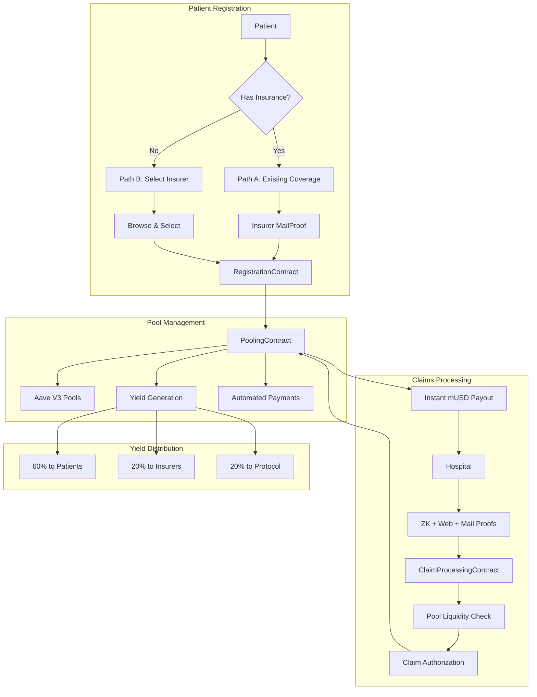
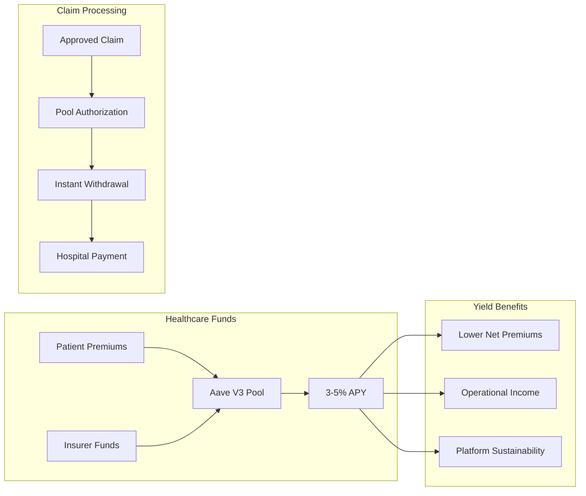

# zkMed Contracts Overview - Pool-Enabled Healthcare Platform

**Purpose**: Complete overview of the zkMed privacy-preserving healthcare platform with revolutionary Aave V3 pool integration, dual patient registration paths, and native Mantle USD (mUSD) processing.

---

## 🏗️ CONTRACT HIERARCHY & RESPONSIBILITIES

### 1. EmailDomainProver.sol (vlayer Prover)

**Role**: Off-chain ZK engine that vlayer uses to verify institutional control of email domains and generate MailProofs for organization verification.

**Core Function**: Inspects incoming emails (captured by vlayer's notaries), extracts "From:" address, target wallet (from subject), and domain, then builds ZK-proof showing:
1. Sender's `From:` address belonged to approved admin addresses (`admin@hospital.org`, `info@insurer.com`, etc.)
2. `Subject:` contained correct target wallet (`"Register organization Hospital for 0x1234..."`)
3. Domain (`hospital.org`) was consistent across email's "From:" and JSON data

**Key Functions**:
- `verifyDomainOwnership(UnverifiedEmail calldata) → (Proof, domain, emailHash, targetWallet)`
- `verifyOrganization(UnverifiedEmail calldata) → (Proof, OrganizationVerificationData)`
- `verifyInsurerForPatient(UnverifiedEmail calldata) → (Proof, insurerDomain, patientWallet)`

**Privacy Guarantee**: Prevents anyone from impersonating legitimate healthcare organizations. Only genuine admin-sent emails yield valid ZK-proofs.

---

### 2. RegistrationContract.sol (Enhanced Registry with Dual Patient Paths)

**Role**: Root of trust for all user identities with revolutionary dual patient registration system supporting both existing and new insurance coverage paths.

**Primary Responsibilities**:

#### Enhanced Patient Registration (Dual Paths):

**Path A: Existing Insurance Coverage**
```solidity
registerPatientWithInsurer(bytes32 commitment, address existingInsurer, bytes mailProof)
```
- Verifies patient has existing coverage via insurer mailproof
- Stores privacy-preserving commitment
- Grants immediate access to insurer's Aave pool funds
- Links patient to verified insurer's pool ecosystem

**Path B: New Insurance Selection**
```solidity
registerPatientWithSelection(bytes32 commitment, address selectedInsurer, uint256 monthlyPremium)
```
- Patient browses and selects from verified insurers
- Sets up automated monthly mUSD payments to Aave pools
- Creates new patient pool with chosen premium amount
- Enables yield generation on monthly contributions

#### Organization Registration (MailProof Verification):
```solidity
registerOrganization(Proof proof, OrganizationVerificationData orgData, Role role)
```
- Validates `EmailDomainProver.verifyOrganization` MailProof
- Immediately registers organizations with verified domain ownership
- Supports hospitals, insurers, and administrative entities
- Integrates with pool creation for insurers

#### Pool Integration Features:
- `setupPoolAccess(address patient, address insurer)`: Links patients to pools
- `enableMonthlyPayments(address patient, uint256 amount)`: Automated premium setup
- `trackPoolParticipation(address user)`: Monitor pool engagement

**Key State Variables**:
- `mapping(address → Role) roles;`
- `mapping(address → bool) verified;`
- `mapping(address → Organization) organizations;`
- `mapping(string → address) domainToAddress;`
- `mapping(bytes32 → bool) usedEmailHashes;`
- `mapping(address → bytes32) patientCommitments;`
- `mapping(address → address) patientToInsurer;` // New: track patient-insurer relationships
- `mapping(address → RegistrationPath) registrationPaths;` // New: track registration method

---

### 3. PoolingContract.sol (NEW - Core Innovation)

**Role**: Revolutionary Aave V3 healthcare pool management enabling yield generation on idle healthcare funds while maintaining instant liquidity for claims.

**Primary Responsibilities**:

#### Patient Pool Management:
```solidity
createPatientPool(address patient, address insurer, uint256 monthlyPremium)
```
- Creates dedicated Aave V3 pool for patient premium deposits
- Links patient to specific insurer pool ecosystem
- Enables automated monthly mUSD deposits earning yield
- Tracks individual patient contributions and earned returns

#### Insurer Pool Management:
```solidity
createInsurerPool(address insurer, uint256 operationalFunds)
```
- Establishes insurer operational fund pools earning yield
- Manages large-scale liquidity for claim processing
- Tracks insurer pool performance and fund utilization
- Enables insurer yield generation on idle funds

#### Automated Premium Processing:
```solidity
depositMonthlyPremium(address patient)
```
- Processes scheduled monthly mUSD premium payments
- Automatically supplies funds to Aave V3 pools
- Updates patient pool balances and yield tracking
- Maintains real-time yield distribution calculations

#### Claim Authorization & Instant Payouts:
```solidity
authorizeClaimPayout(uint256 claimId, address patient, address hospital, uint256 amount)
```
- Validates sufficient pool liquidity for claim amount
- Withdraws approved funds from Aave pools instantly
- Transfers mUSD directly to hospital wallet
- Updates pool balances while preserving yield tracking

#### Yield Distribution System:
```solidity
distributeYield()
```
- Calculates accrued yield from Aave lending protocols
- Distributes returns proportionally to stakeholders
- Maintains 60% to patients, 20% to insurers, 20% to protocol
- Automates reward mechanisms without manual intervention

**Aave V3 Integration Features**:
- **Supply Management**: Healthcare funds earn 3-5% APY via Aave lending
- **Instant Liquidity**: Proven mechanisms ensure claim funds always available
- **Risk Management**: Battle-tested parameters protect deposited funds
- **Multi-Asset Support**: Native mUSD integration with Mantle ecosystem compatibility

**Key State Variables**:
- `mapping(address → PatientPool) patientPools;`
- `mapping(address → InsurerPool) insurerPools;`
- `mapping(uint256 → ClaimAuthorization) claimAuthorizations;`
- `IAavePool public aavePool;` // Aave V3 lending pool
- `IERC20 public mUSD;` // Native Mantle USD
- `uint256 public totalYieldGenerated;` // Global yield tracking

---

### 4. PatientModule.sol (Enhanced with Insurance Selection)

**Role**: Advanced patient operations including insurance selection, automated payments, and pool interaction management.

**Primary Responsibilities**:

#### Insurance Selection Interface:
```solidity
browseAvailableInsurers()
```
- Displays verified insurers with real-time pool performance
- Shows average yield rates, claim processing times, and coverage options
- Enables comparison shopping based on pool performance metrics
- Updates insurer profiles with live Aave pool data

#### Automated Payment Setup:
```solidity
selectInsurerAndSetupPayments(address insurer, uint256 monthlyPremium)
```
- Records patient's insurer selection and premium amount
- Creates patient pool via PoolingContract integration
- Enables automated monthly mUSD payments to Aave pools
- Tracks selection history and payment performance

#### Pool Performance Monitoring:
```solidity
getPatientPoolDashboard(address patient)
```
- Real-time visibility into pool contributions and yield earned
- Tracks total deposited, yield generated, and pool balance
- Monitors next payment due dates and payment history
- Displays yield earnings compared to traditional insurance

#### WebProof Operation Proposals:
```solidity
proposeOperationWithPool(bytes webProof, uint256 estimatedCost)
```
- Validates operation proposal via vlayer WebProofs
- Checks pool liquidity for estimated procedure costs
- Links proposal to patient's pool for authorization
- Maintains privacy while validating fund availability

**Pool Integration Benefits**:
- **Yield Tracking**: Real-time monitoring of premium returns
- **Cost Transparency**: Clear visibility into effective premium costs after yield
- **Automated Management**: Set-and-forget monthly payment system
- **Performance Comparison**: Compare insurer pool performance metrics

---

### 5. OrganizationModule.sol (Enhanced for Pool-Enabled Claims)

**Role**: Hospital and insurer operations with sophisticated pool-enabled claim processing and instant withdrawals.

**Primary Responsibilities**:

#### Pool-Enabled Claim Submission:
```solidity
submitClaimWithPoolAuth(bytes multiProof, uint256 requestedAmount)
```
- Submits claims with automatic pool liquidity validation
- Combines ZK + Web + Mail proofs for maximum security
- Pre-validates sufficient pool funds before processing
- Links claim to patient's pool for authorization tracking

#### Instant Pool Withdrawals:
```solidity
withdrawFromPool(uint256 claimId)
```
- Enables hospitals to withdraw approved funds instantly
- Processes withdrawals directly from Aave pools
- Maintains audit trail of pool-to-hospital transfers
- Updates pool balances while preserving yield calculations

#### Insurer Pool Management:
```solidity
manageInsurerPool(uint256 operationalDeposit)
```
- Allows insurers to contribute additional operational funds
- Manages large-scale pool liquidity for claim processing
- Tracks insurer pool performance and fund utilization
- Optimizes yield generation on insurer deposits

#### Pool Performance Analytics:
```solidity
trackPoolPerformance()
```
- Monitors yield generation across all managed pools
- Tracks claim processing efficiency and payout times
- Analyzes fund utilization and liquidity management
- Provides insights for pool optimization strategies

**Multi-Proof Validation with Pool Integration**:
- **MailProof**: Verify organization domain ownership
- **WebProof**: Validate procedures from hospital systems  
- **ZK Proof**: Confirm encrypted EHR contains valid covered procedures
- **Pool Liquidity**: Ensure sufficient funds available for instant payout

---

### 6. InsuranceContract.sol (Simplified with Native mUSD)

**Role**: Streamlined policy management with native Mantle USD processing and direct Aave pool integration.

**Primary Responsibilities**:

#### Pool-Integrated Policy Management:
```solidity
createPolicyWithPool(address patient, uint256 coverageAmount)
```
- Creates policies directly linked to Aave pool systems
- Uses native mUSD for stable value coverage amounts
- Integrates with patient pool for automated premium processing
- Tracks coverage utilization against pool contributions

#### Pool-Enabled Claim Approval:
```solidity
approveClaimFromPool(uint256 claimId, uint256 amount)
```
- Approves claims with automatic pool withdrawal authorization
- Validates coverage against pool contribution history
- Triggers instant mUSD payout from Aave pools to hospitals
- Maintains privacy while ensuring fund availability

#### Yield-Aware Coverage Calculation:
```solidity
calculateEffectivePremium(address patient)
```
- Calculates net premium cost after yield generation
- Displays effective coverage cost including pool returns
- Enables dynamic pricing based on pool performance
- Reduces premium burden through yield benefits

**Simplified Benefits vs Traditional Insurance**:
- **No Oracle Dependencies**: Direct mUSD processing eliminates price conversion complexity
- **Instant Payouts**: Aave pool integration enables immediate claim payments
- **Yield Benefits**: Pool returns reduce effective premium costs for patients
- **Enhanced Security**: Native stablecoin eliminates volatility and bridge risks

**Key State Variables**:
- `mapping(address → Policy) policies;`
- `mapping(uint256 → Claim) claims;`
- `IPoolingContract public poolingContract;` // Direct pool integration
- `IERC20 public mUSD;` // Native Mantle USD
- `mapping(address → uint256) poolContributions;` // Track pool-linked coverage

---

### 7. ClaimProcessingContract.sol (Pool-Aware Validation Engine)

**Role**: Advanced multi-proof validation with pool liquidity checks and automated authorization triggers.

**Primary Responsibilities**:

#### Pool-Integrated Claim Validation:
```solidity
submitClaimWithPool(bytes multiProof, uint256 amount)
```
- Validates claims using ZK + Web + Mail proofs simultaneously
- Pre-checks Aave pool liquidity before processing
- Ensures sufficient funds available for instant authorization
- Links validated claims to pool withdrawal mechanisms

#### Multi-Proof Security Architecture:
```solidity
validateMultiProof(uint256 claimId)
```
- **ZK Proof Validation**: Confirms encrypted EHR contains covered procedure
- **WebProof Validation**: Verifies procedure from hospital systems
- **MailProof Validation**: Ensures hospital domain ownership
- **Pool Liquidity Validation**: Confirms sufficient funds for payout

#### Automated Pool Authorization:
```solidity
triggerPoolPayout(uint256 claimId, address hospital)
```
- Automatically triggers pool withdrawal upon validation
- Processes instant mUSD transfer to hospital wallet
- Updates pool balances while maintaining yield tracking
- Maintains complete audit trail of authorizations

#### Streamlined Processing Benefits:
- **No Price Conversion**: Direct mUSD amounts eliminate oracle dependencies
- **Instant Authorization**: Pool integration enables immediate fund release
- **Enhanced Security**: Multi-proof validation prevents fraud
- **Yield Preservation**: Funds earn interest until authorization moment

**Pool Processing Workflow**:
1. **Liquidity Check**: Validate sufficient pool funds
2. **Multi-Proof Validation**: Verify all proof types
3. **Authorization Trigger**: Activate pool withdrawal
4. **Instant Payout**: Transfer mUSD to hospital
5. **Balance Update**: Maintain pool accounting integrity

---

## 🔄 ENHANCED CONTRACT INTERACTION FLOW

### Pool-Enabled Claims Workflow with Dual Registration



### Aave V3 Pool Integration Flow



---

## 🎯 REVOLUTIONARY INTEGRATION BENEFITS

### Pool-Enabled Advantages vs Traditional Healthcare

#### Capital Efficiency Revolution
- **Traditional Healthcare**: Premiums sit idle in insurance company accounts
- **zkMed Pools**: Healthcare funds earn 3-5% APY via Aave V3 protocols
- **Patient Benefit**: Effective premium reduction through yield generation
- **Insurer Benefit**: Operational funds generate returns while awaiting claims
- **System Benefit**: Maximum capital utilization across healthcare ecosystem

#### Instant Liquidity Innovation
- **Traditional Healthcare**: Complex claims processing with weeks of delays
- **zkMed Pools**: Instant claim payouts upon authorization via Aave mechanisms
- **Hospital Benefit**: Immediate cash flow upon approved claims
- **Patient Benefit**: Faster treatment access through streamlined payments
- **Risk Mitigation**: Proven liquidity mechanisms eliminate payout delays

#### Simplified Architecture Benefits
- **Traditional Systems**: Complex integrations with multiple payment processors
- **zkMed Native mUSD**: Direct Mantle USD handling eliminates conversion complexity
- **Development Benefit**: Reduced dependencies and faster implementation
- **Security Benefit**: Native asset reduces bridge risks and oracle dependencies
- **Cost Benefit**: Lower transaction fees and processing costs

### Dual Registration Innovation

#### Flexible Patient Onboarding
- **Existing Coverage Path**: Seamless integration for patients with current insurance
- **Selection Path**: Empowered choice for patients seeking new coverage
- **Pool Benefits**: Both paths enable yield generation on healthcare funds
- **Privacy Preservation**: Medical details remain encrypted regardless of path

#### Enhanced Market Dynamics
- **Insurer Competition**: Performance-based selection drives pool optimization
- **Transparent Metrics**: Real-time pool performance enables informed decisions
- **Yield Incentives**: Better pool management attracts more patients
- **Market Efficiency**: Competition improves yields and reduces effective costs

---

## ✅ COMPLETE SYSTEM BENEFITS

| Component                 | Traditional Role                         | Pool-Enhanced Role                           |
| ------------------------- | ---------------------------------------- | -------------------------------------------- |
| `RegistrationContract`    | Basic identity registration              | Dual-path registration + pool access        |
| `PoolingContract`         | N/A (No pooling systems exist)          | Yield generation + instant liquidity        |
| `PatientModule`           | Simple patient management                | Insurance selection + automated payments    |
| `OrganizationModule`      | Basic organization functions             | Pool-enabled claims + instant withdrawals   |
| `InsuranceContract`       | Policy management only                   | Pool-integrated coverage + yield benefits   |
| `ClaimProcessingContract` | Manual validation processes              | Multi-proof validation + pool authorization |

---

## 🚀 INNOVATION HIGHLIGHTS

### 🔐 **Privacy-First with Yield Generation**
- Medical data never exposed during pool operations
- Yield tracking maintains privacy while showing returns
- Pool authorization triggered only by validated claims
- Privacy-preserving pool performance metrics

### 💰 **Revolutionary Capital Efficiency**
- Healthcare funds earn 3-5% APY while awaiting claims
- Automated yield distribution to all stakeholders
- Reduced effective premium costs through pool returns
- Maximum fund utilization across healthcare ecosystem

### ⚡ **Instant Processing with Pool Integration**
- Real-time liquidity validation before claim processing
- Automatic pool withdrawals upon claim authorization
- Instant mUSD payouts directly to hospital wallets
- Seamless integration between validation and payment

### 🎯 **Patient-Centric Design with Choice**
- Dual registration paths accommodate all patient situations
- Insurance selection based on pool performance metrics
- Automated payment systems with yield tracking
- Transparent costs including yield benefits

**zkMed represents the first healthcare platform to combine privacy-preserving claims processing with yield-generating fund pools, delivering revolutionary capital efficiency while maintaining complete medical privacy!** 🚀 