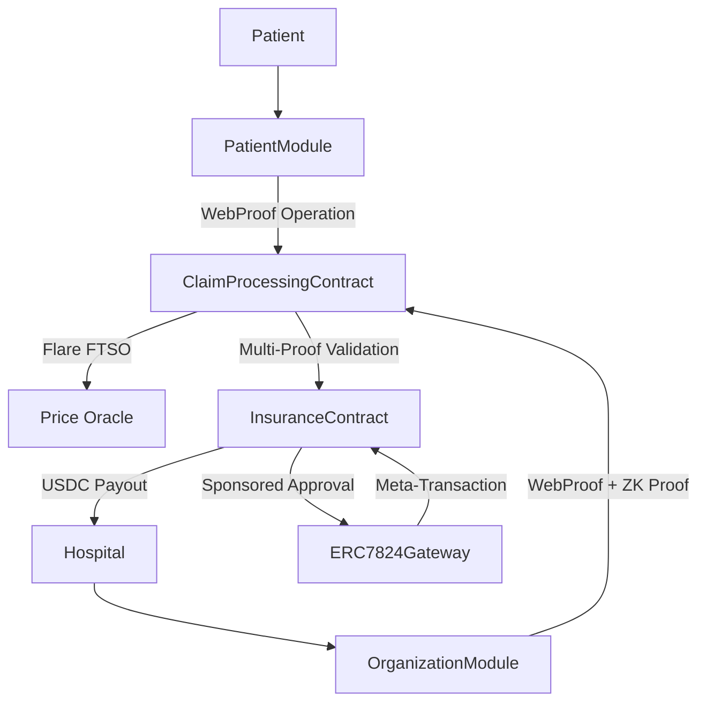

# zkMed Contracts Overview - Advanced Web3 System Architecture

**Purpose**: Birds-eye view of every on-chain contract in the zkMed privacy-preserving healthcare platform with advanced Web3 integrations including ERC-7824 abstract accounts, vlayer WebProofs/MailProofs, Flare FTSO, and thirdweb authentication.

---

## 🏗️ CONTRACT HIERARCHY & RESPONSIBILITIES

### 1. EmailDomainProver.sol (vlayer Prover)

**Role**: Off-chain ZK engine that vlayer uses to verify institutional control of email domains and generate MailProofs.

**Core Function**: Inspects incoming emails (captured by vlayer's notaries), extracts "From:" address, target wallet (from subject), and domain, then builds ZK-proof showing:
1. Sender's `From:` address belonged to approved admin addresses (`admin@mountsinai.org`, `info@...`, etc.)
2. `Subject:` contained correct target wallet (`"Register organization Mount Sinai for 0x1234..."`)
3. Domain (`mountsinai.org`) was consistent across email's "From:" and JSON data

**Key Functions**:
- `verifyDomainOwnership(UnverifiedEmail calldata) → (Proof, domain, emailHash, targetWallet)`
- `verifyOrganization(UnverifiedEmail calldata) → (Proof, OrganizationVerificationData)`
- `simpleDomainVerification(UnverifiedEmail calldata, address) → (Proof, domain, emailHash)`

**Privacy Guarantee**: Prevents anyone from impersonating `admin@mountsinai.org`. Only genuine admin-sent emails yield valid ZK-proofs.

---

### 2. RegistrationContract.sol (Main Verifier & Registry)

**Role**: Root of trust for all user identities (Patients, Hospitals, Insurers, Admins). Enforces vlayer proofs and records verified addresses, roles, domains, and timestamps. Enhanced with ERC-7824 compatibility.

**Primary Responsibilities**:

#### Patient Registration (Privacy-Preserving):
```solidity
registerPatient(bytes32 commitment)
```
- Stores keccak256-style commitment (secret ∥ address)
- Auto-verifies patient (no off-chain proof needed)
- Compatible with ERC-7824 sponsored transactions

#### Organization Registration (Multiple Options):

**MailProof Registration**:
```solidity
registerOrganization(Proof proof, OrganizationVerificationData orgData, Role role)
```
- Validates `EmailDomainProver.verifyOrganization` MailProof
- Immediately registers `organizations[msg.sender]` with `verified = true`
- Supports meta-transactions via ERC-7824 Gateway

**WebProof Registration** (Future):
```solidity
registerWithWebProof(Proof webProof, OrganizationData data, Role role)
```
- Validates vlayer WebProof from organization's website
- Proves control of domain via web-based verification
- Alternative to email-based verification

#### ERC-7824 Integration:
- All functions support meta-transaction routing
- Gas sponsorship for organization onboarding
- Batch operations for multiple registrations

**Key State Variables**:
- `mapping(address → Role) roles;`
- `mapping(address → bool) verified;`
- `mapping(address → Organization) organizations;`
- `mapping(string → address) domainToAddress;`
- `mapping(bytes32 → bool) usedEmailHashes;`
- `mapping(address → bytes32) patientCommitments; // for patients`
- `mapping(address → bool) erc7824Enabled; // for abstract accounts`

---

### 3. PatientModule.sol (Patient EHR & WebProof Manager)

**Role**: Handles patient-specific actions including encrypted EHR management and WebProof-based operation proposals.

**Primary Responsibilities**:

#### Encrypted EHR Management:
```solidity
uploadEncryptedEHR(string cid, bytes preKey)
```
- Stores IPFS CID of encrypted medical records
- Records PRE (Proxy Re-Encryption) key for post-approval decryption
- Links EHR to patient's commitment hash

#### WebProof Operation Proposals:
```solidity
proposeOperation(bytes webProof, bytes32 procedureHash, uint256 estimatedCost)
```
- Validates vlayer WebProof from patient portal
- Proves patient has legitimate medical need
- Creates operation proposal without revealing details

#### ERC-7824 Sponsored Actions:
```solidity
proposeOperationSponsored(ERC7824ForwardRequest req, bytes signature)
```
- Allows insurers to sponsor patient operation proposals
- Seamless UX without requiring patient to hold gas tokens
- Maintains patient privacy in sponsored transactions

**Key Features**:
- **WebProof Integration**: Prove medical necessity from patient portals
- **PRE Encryption**: Post-approval decryption for authorized parties
- **Sponsored Transactions**: ERC-7824 compatibility for gas-free patient interactions

---

### 4. OrganizationModule.sol (Hospital/Insurer Operations)

**Role**: Manages post-verification actions for hospitals and insurers with advanced proof validation.

**Primary Responsibilities**:

#### Hospital Operations:
```solidity
approveOperation(address patient, uint256 opId)
```
- Hospital confirms ability to perform requested operation
- Links to patient's WebProof-validated proposal
- Creates pending operation record

```solidity
submitClaimWithWebProof(bytes webProof, ClaimData data)
```
- Submits insurance claim with WebProof validation
- Proves procedure was actually performed via hospital system
- Forwards to ClaimProcessingContract for validation

#### Insurer Operations:
```solidity
reviewClaimWithProofs(uint256 claimId, bool approved)
```
- Reviews claims with multiple proof validations
- Approves/rejects based on WebProof + ZK proof results
- Maintains privacy while ensuring validity

#### Multi-Proof Validation:
- **MailProof**: Verify organization domain ownership
- **WebProof**: Validate procedure from hospital systems
- **ZK Proof**: Confirm encrypted EHR contains valid covered procedure

---

### 5. ERC7824Gateway.sol (Nitrolite Abstract Account Router)

**Role**: Meta-transaction router enabling sponsored transactions and abstract account functionality.

**Primary Responsibilities**:

#### Meta-Transaction Execution:
```solidity
function execute(
    ERC7824ForwardRequest calldata req,
    bytes calldata signature
) external
```
- Validates request signature and nonce
- Executes sponsored transactions on behalf of users
- Maintains replay protection and security

#### Gas Sponsorship Management:
```solidity
function addSponsor(address sponsor, uint256 gasLimit) external onlyOwner
function removeSponsor(address sponsor) external onlyOwner
```
- Manages approved sponsors (insurers, hospitals)
- Sets gas limits for different sponsor types
- Controls sponsorship permissions

#### Batch Operations:
```solidity
function batchExecute(
    ERC7824ForwardRequest[] calldata requests,
    bytes[] calldata signatures
) external
```
- Executes multiple sponsored transactions atomically
- Optimizes gas usage for bulk operations
- Supports complex multi-step workflows

**Integration Benefits**:
- **Patient UX**: Gas-free claim submissions
- **Hospital UX**: Sponsored claim processing
- **Insurer UX**: Bulk operation sponsorship
- **Security**: Nonce-based replay protection

---

### 6. InsuranceContract.sol (Enhanced Policy & Claims Manager)

**Role**: Manages insurance policies, processes claims with real-time pricing, and handles payouts with advanced Web3 integrations.

**Primary Responsibilities**:

#### Policy Management:
```solidity
createPolicy(address patient, string policyId, uint256 totalCoverageUSD, string metadataCID)
```
- Creates policy with USD-denominated coverage
- Stores encrypted policy metadata on IPFS
- Links policy to patient's commitment hash

#### Advanced Claim Processing:
```solidity
submitClaim(
    address patient,
    address hospital,
    bytes32 procedureCodeHash,
    uint256 requestedUSD,
    string encryptedEHRCID,
    bytes ehrPREKey,
    bytes[] multiProofs  // WebProof + ZK Proof array
) external
```
- Processes claims with multiple proof validations
- Converts USD amounts using Flare FTSO real-time pricing
- Maintains privacy while ensuring claim validity

#### Flare FTSO Integration:
```solidity
function _getUSDCPrice() internal view returns (uint256) {
    return ftsoV2.getCurrentPrice(USDC_USD);
}
```
- Real-time USD to USDC conversion
- Live oracle data for accurate claim amounts
- Support for multiple currency pairs

#### ERC-7824 Sponsored Approvals:
```solidity
function approveClaimSponsored(uint256 claimId, ERC7824ForwardRequest req) external
```
- Insurers can sponsor their own claim approvals
- Reduces gas costs for high-volume claim processing
- Maintains audit trail through sponsored transactions

**Key State Variables**:
- `mapping(address → Policy) patientPolicies;`
- `mapping(uint256 → Claim) claims;`
- `mapping(address → uint256) hospitalEscrow;`
- `IERC20 public stablecoin; // USDC token`
- `IFlareFtsoV2 public ftsoV2; // Real-time price oracle`
- `ERC7824Gateway public gateway; // Meta-transaction router`

---

### 7. ClaimProcessingContract.sol (Advanced Multi-Proof Validator)

**Role**: Enhanced claim validation with multiple proof types, real-time pricing, and sponsored transaction support.

**Primary Responsibilities**:

#### Multi-Proof Claim Submission:
```solidity
function submitClaimWithMultiProof(
    address patient,
    bytes32 procedureCodeHash,
    uint256 requestedUSD,
    string encryptedEHRCID,
    bytes ehrPREKey,
    bytes zkProof,        // ZK proof of covered procedure
    bytes webProof,       // WebProof from patient portal
    bytes hospitalProof   // WebProof from hospital system
) external onlyVerifiedHospital
```

**Enhanced Validation Process**:
1. **ZK Proof Validation**: Confirms encrypted EHR contains covered procedure
2. **WebProof Validation**: Verifies procedure from patient portal
3. **Hospital WebProof**: Confirms procedure performed in hospital system
4. **Flare FTSO Pricing**: Real-time USD to USDC conversion
5. **Coverage Check**: Validates sufficient policy coverage
6. **Forward to Insurance**: Submits validated claim

#### Sponsored Transaction Support:
```solidity
function submitClaimSponsored(
    ClaimData calldata data,
    ERC7824ForwardRequest calldata req,
    bytes calldata signature
) external
```
- Processes sponsored claim submissions
- Validates meta-transaction signature
- Forwards to InsuranceContract with sponsorship context

#### Real-Time Price Integration:
- Live Flare FTSO price feeds
- Automatic USD to stablecoin conversion
- Multi-currency support capability

---

## 🔄 CONTRACT INTERACTION FLOW

### Enhanced Multi-Proof Claims Workflow



### ERC-7824 Sponsored Transaction Flow


---

## 🎯 HACKATHON PRIZE INTEGRATION

### Target Prize Tracks

#### vlayer Integration → **Best use of vlayer** + **Most innovative use**
- **MailProofs**: Organization domain verification via email
- **WebProofs**: Patient portal and hospital system verification
- **Multi-Proof Architecture**: Combined proof validation for maximum security

#### Flare Integration → **Flare FTSO Track** + **Real-time data**
- **FTSO Price Feeds**: Live USD to USDC conversion for claims
- **Multi-Currency Support**: Flexible pricing across different tokens
- **Real-time Validation**: Dynamic claim amount calculation

#### ERC-7824 Integration → **Abstract Account Innovation**
- **Sponsored Transactions**: Gas-free patient interactions
- **Meta-Transaction Router**: Seamless UX for all users
- **Batch Operations**: Efficient bulk transaction processing

---

## ✅ SYSTEM BENEFITS

| Component                 | Role                                         | Protocol Integration               |
| ------------------------- | -------------------------------------------- | ---------------------------------- |
| `RegistrationContract`    | Identity & role registration                 | MailProofs, ERC-7824, thirdweb     |
| `PatientModule`           | EHR management, operation proposals          | WebProofs, ERC-7824 sponsorship    |
| `OrganizationModule`      | Hospital/insurer operations                  | WebProofs, multi-proof validation  |
| `ERC7824Gateway`          | Meta-transaction routing                     | Sponsored transactions, batch ops  |
| `InsuranceContract`       | Policy management, claim processing          | Flare FTSO, ERC-7824, WebProofs   |
| `ClaimProcessingContract` | Multi-proof validation, price conversion     | ZK+Web proofs, FTSO, sponsorship  |

---

## 🚀 INNOVATION HIGHLIGHTS

- **Privacy-First**: Medical data never exposed, only validated
- **Multi-Proof Security**: WebProofs + MailProofs + ZK proofs combined
- **Sponsored UX**: Gas-free interactions via ERC-7824
- **Real-time Pricing**: Live oracle data for accurate claim amounts
- **Modular Architecture**: Each contract has specific, well-defined roles
- **Advanced Authentication**: thirdweb integration for seamless onboarding 