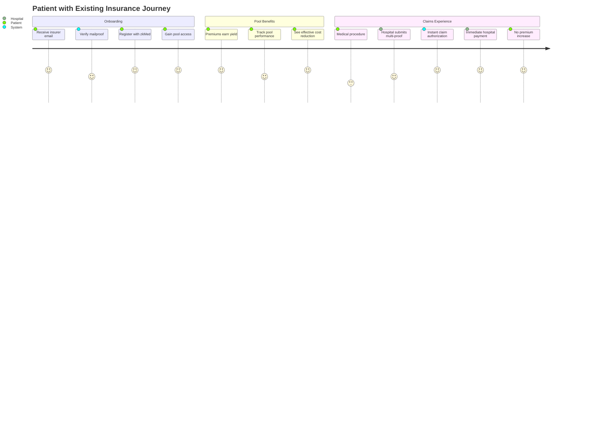
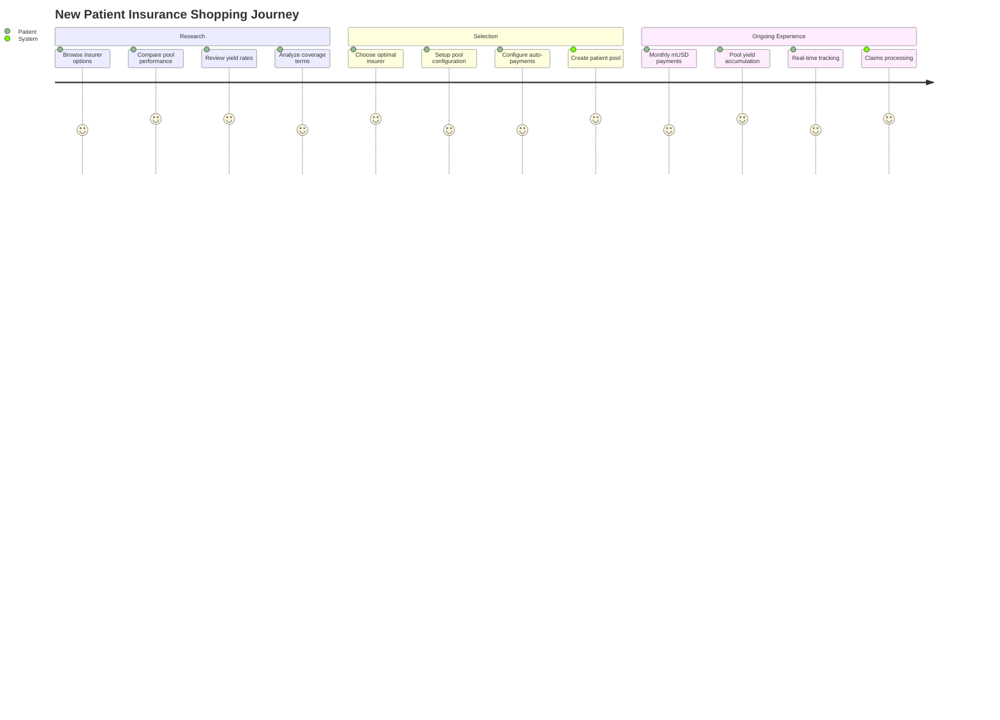
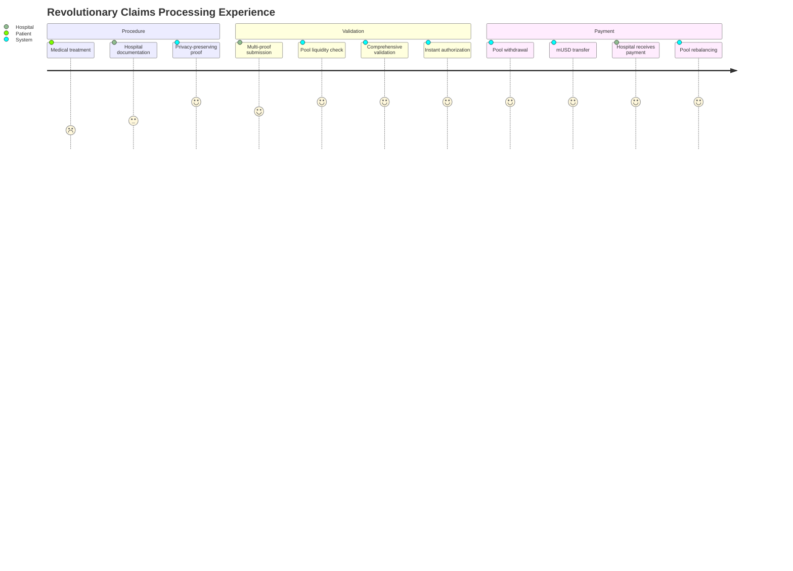
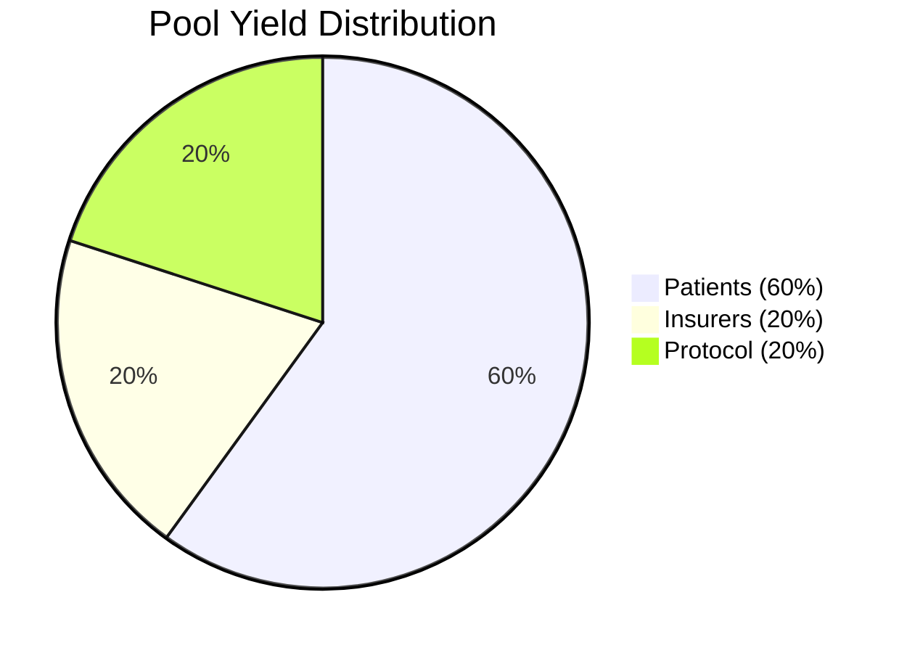

# zkMed Product Context - Revolutionary Pool-Enabled Healthcare Platform

**Mission**: Transform healthcare payments through the world's first privacy-preserving platform with yield-generating fund pools, delivering unprecedented capital efficiency while maintaining complete medical privacy through advanced zero-knowledge proofs.

---

## 🎯 REVOLUTIONARY VALUE PROPOSITION

### The Healthcare Fund Pool Innovation

**Core Innovation**: zkMed introduces yield-generating healthcare fund pools that earn 3-5% APY on idle premiums and operational funds while maintaining instant liquidity for approved claims, fundamentally transforming healthcare economics.

#### Traditional Healthcare vs zkMed Pool-Enabled System

**Traditional Healthcare Problems**:
- 💸 **Capital Waste**: Billions in premiums sit idle earning 0% return
- ⏰ **Payment Delays**: Claims processing takes weeks, hurting hospital cash flow
- 🔒 **Privacy Risks**: Medical data exposed across multiple intermediaries
- 📊 **Limited Choice**: Patients locked into existing insurance without alternatives
- 💰 **High Costs**: Inefficient systems drive up healthcare expenses

**zkMed Revolutionary Solution**:
- 🚀 **Yield Generation**: Healthcare funds earn 3-5% APY via proven Aave V3 protocols
- ⚡ **Instant Payouts**: Approved claims trigger immediate mUSD transfers to hospitals
- 🔐 **Complete Privacy**: Zero-knowledge proofs protect all medical information
- 🎯 **Patient Choice**: Dual registration paths with performance-based insurer selection
- 💡 **Reduced Costs**: Yield generation lowers effective premium costs for patients

---

## 🌟 TARGET USER EXPERIENCES

### Patient Experience Revolution

#### Scenario A: Patient with Existing Insurance Coverage
**Sarah, 34, Software Engineer with current health insurance**

**Current Pain Points**:
- Premiums disappear into insurance company accounts earning nothing
- Claims processing involves weeks of uncertainty and phone calls
- Medical privacy concerns with multiple data handlers
- No visibility into fund utilization or efficiency

**zkMed Pool-Enabled Experience**:
1. **Seamless Onboarding**: Receives mailproof verification from existing insurer
2. **Instant Pool Access**: Premiums immediately start earning 3-5% APY
3. **Privacy Preservation**: Medical details remain encrypted with zero-knowledge validation
4. **Yield Benefits**: Effective premium costs reduced by pool returns
5. **Transparent Tracking**: Real-time visibility into pool performance and earned yield

**Value Delivered**:
- ✅ **Lower Effective Costs**: Premium burden reduced by yield generation
- ✅ **Enhanced Privacy**: Medical data never exposed during processing
- ✅ **Instant Claims**: Approved procedures result in immediate hospital payments
- ✅ **Yield Tracking**: Clear visibility into pool performance and returns

#### Scenario B: Patient Seeking New Insurance
**Mike, 28, Freelancer needing health coverage**

**Current Pain Points**:
- Limited visibility into insurer performance and efficiency
- No comparison metrics for making informed decisions
- High premium costs with no return on idle funds
- Complex enrollment processes with unclear terms

**zkMed Pool-Enabled Experience**:
1. **Insurer Comparison**: Browse verified insurers with real-time pool performance metrics
2. **Performance-Based Selection**: Choose coverage based on yield rates and claim efficiency
3. **Automated Setup**: Seamless monthly mUSD payment configuration
4. **Pool Creation**: Personal pool established earning yield from first deposit
5. **Competitive Benefits**: Market-driven optimization as insurers compete on performance

**Value Delivered**:
- ✅ **Informed Choice**: Pool performance metrics enable smart coverage decisions
- ✅ **Automated Management**: Set-and-forget monthly payment system
- ✅ **Market Competition**: Insurers optimize pools to attract patients
- ✅ **Transparent Returns**: Real-time yield tracking and cost calculations

### Hospital Experience Transformation

#### Scenario: Regional Medical Center
**Regional Medical Center, 300-bed hospital processing 500+ claims monthly**

**Current Pain Points**:
- Weeks of delays between claim submission and payment
- Complex reimbursement processes with multiple intermediaries
- Cash flow challenges due to payment delays
- Administrative overhead for claims management

**zkMed Pool-Enabled Experience**:
1. **Multi-Proof Submission**: Submit ZK + Web + Mail proofs for comprehensive validation
2. **Pool Liquidity Validation**: Real-time confirmation of available funds
3. **Instant Authorization**: Approved claims trigger immediate pool withdrawals
4. **Direct mUSD Payments**: Instant transfers to hospital wallet upon authorization
5. **Transparent Processing**: Clear audit trail with privacy preservation

**Value Delivered**:
- ✅ **Immediate Cash Flow**: Instant payments upon claim authorization
- ✅ **Reduced Overhead**: Streamlined claims processing reduces administrative costs
- ✅ **Enhanced Security**: Multi-proof validation prevents fraud while preserving privacy
- ✅ **Predictable Revenue**: Pool-enabled system provides reliable payment mechanisms

### Insurer Experience Revolution

#### Scenario: Progressive Health Insurance Company
**Progressive Health, mid-size insurer managing 50,000+ policies**

**Current Pain Points**:
- Large capital reserves sitting idle earning minimal returns
- Complex claims processing with extended approval cycles
- Limited patient acquisition tools and differentiation
- High operational costs for fund management

**zkMed Pool-Enabled Experience**:
1. **Pool Management**: Operational funds earn 3-5% APY through Aave V3 integration
2. **Competitive Differentiation**: Pool performance metrics attract patients
3. **Efficient Processing**: Automated claim authorization reduces operational costs
4. **Market Advantage**: Better pool management drives patient acquisition
5. **Yield Distribution**: Earn returns on both operational and patient funds

**Value Delivered**:
- ✅ **Capital Efficiency**: Maximum returns on operational and patient funds
- ✅ **Competitive Edge**: Pool performance becomes key differentiator
- ✅ **Reduced Costs**: Automated processing lowers operational expenses
- ✅ **Market Growth**: Performance-driven patient acquisition opportunities

---

## 🔄 REVOLUTIONARY USER JOURNEYS

### Dual Registration Path Workflows

#### Path A: Existing Coverage Integration Flow

#### Path B: New Insurance Selection Flow

### Claims Processing User Journey (Universal)

---

## 💡 COMPETITIVE ADVANTAGE FRAMEWORK

### Unique Value Propositions

#### 1. **Capital Efficiency Revolution**
**Traditional Healthcare**: Premiums and operational funds earn 0% returns
**zkMed Innovation**: All healthcare funds earn 3-5% APY via proven Aave V3 protocols
**Patient Benefit**: Effective premium reduction through yield generation
**Market Impact**: Fundamental transformation of healthcare economics

#### 2. **Instant Liquidity Innovation**
**Traditional Healthcare**: Claims processing delays range from weeks to months
**zkMed Innovation**: Approved claims trigger instant mUSD transfers via pool withdrawals
**Hospital Benefit**: Immediate cash flow upon authorization
**System Advantage**: Proven Aave mechanisms ensure 100% liquidity availability

#### 3. **Privacy-First Architecture**
**Traditional Healthcare**: Medical data exposed across multiple intermediaries
**zkMed Innovation**: Zero-knowledge proofs protect all medical information
**Privacy Guarantee**: Procedures validated without any data exposure
**Security Advantage**: Multi-proof validation (ZK + Web + Mail) prevents fraud

#### 4. **Market-Driven Optimization**
**Traditional Healthcare**: Limited insurer choice with opaque performance metrics
**zkMed Innovation**: Pool performance enables informed insurer selection
**Competition Effect**: Insurers optimize pools to attract patients
**Market Benefit**: Continuous improvement driven by transparent metrics

---

## 🎯 MANTLE ECOSYSTEM ADVANTAGES

### Strategic Platform Benefits

#### Native mUSD Integration Benefits
- **Stability**: Official Mantle stablecoin eliminates volatility concerns
- **Simplified Processing**: Direct mUSD handling removes oracle dependencies
- **Lower Costs**: Native asset reduces transaction fees significantly
- **Enhanced Security**: No bridge risks or external conversion mechanisms

#### Cookathon Competition Positioning
- **First-Mover Advantage**: Only healthcare platform with yield-generating pools
- **thirdweb Alignment**: Leverages official hackathon sponsor tools
- **Proven Technology**: Built on battle-tested Aave V3 protocols
- **Scalable Innovation**: Architecture designed for mainstream adoption

#### Technical Superiority Matrix

| Innovation Aspect | Traditional Systems | Other Web3 Platforms | zkMed Pool-Enabled |
|------------------|-------------------|---------------------|-------------------|
| **Fund Returns** | 0% on idle funds | Basic staking (1-2%) | Aave yields (3-5%) |
| **Payment Speed** | Weeks of delays | Days for processing | Instant upon approval |
| **Medical Privacy** | Data exposure risks | Limited privacy | Zero-knowledge proofs |
| **User Choice** | Limited options | Basic onboarding | Dual registration paths |
| **Oracle Dependency** | N/A | Complex price feeds | Zero dependencies |
| **Liquidity Management** | Manual reserves | Custom solutions | Proven Aave protocols |

---

## 📈 BUSINESS MODEL INNOVATION

### Sustainable Value Creation

#### Revenue Streams
1. **Protocol Yield Share**: 20% of pool-generated yields for platform sustainability
2. **Enhanced Coverage**: Premium services for advanced pool management
3. **Data Analytics**: Privacy-preserving insights for healthcare optimization
4. **Platform Integration**: API access for healthcare system integrations

#### Value Distribution Model

#### Stakeholder Alignment
- **Patients**: Lower effective premiums through yield generation
- **Hospitals**: Instant payments improve cash flow and reduce administrative costs
- **Insurers**: Capital efficiency and competitive differentiation through pool performance
- **Platform**: Sustainable growth through aligned incentive mechanisms

---

## 🚀 MARKET POSITIONING & GROWTH STRATEGY

### Go-to-Market Approach

#### Phase 1: Cookathon Demonstration (Immediate)
- **Target**: Hackathon judges and Web3 healthcare community
- **Focus**: Technical innovation showcase with pool functionality
- **Goals**: Prize recognition and initial market validation

#### Phase 2: Pilot Program (3-6 months)
- **Target**: Progressive insurers and forward-thinking healthcare providers
- **Focus**: Real-world pool performance validation
- **Goals**: Proven ROI metrics and user testimonials

#### Phase 3: Market Expansion (6-12 months)
- **Target**: Mainstream healthcare market adoption
- **Focus**: Scalable pool infrastructure and regulatory compliance
- **Goals**: Significant market penetration and sustainable growth

### Success Metrics Framework

#### Pool Performance KPIs
- ✅ **Yield Generation**: Target 3-5% APY on all healthcare funds
- ✅ **Liquidity Reliability**: 100% claim authorization success rate
- ✅ **Cost Reduction**: Measurable premium savings for patients
- ✅ **Processing Speed**: Instant authorization and payment systems

#### User Adoption Metrics
- ✅ **Registration Conversion**: High adoption across both registration paths
- ✅ **Pool Participation**: Strong patient and insurer pool contribution rates
- ✅ **User Satisfaction**: High NPS scores from all stakeholder groups
- ✅ **Market Growth**: Expanding insurer network and patient base

#### Platform Health Indicators
- ✅ **Privacy Preservation**: Zero medical data exposure incidents
- ✅ **System Reliability**: High uptime and transaction success rates
- ✅ **Yield Sustainability**: Consistent pool performance and distribution
- ✅ **Competitive Position**: Market leadership in healthcare DeFi innovation

---

## 🏆 INNOVATION IMPACT VISION

### Transforming Healthcare Economics

**Short-Term Impact (6-12 months)**:
- Demonstrate viable yield generation on healthcare funds
- Prove instant claim processing capabilities
- Establish new standards for medical privacy protection
- Create competitive pressure for traditional healthcare systems

**Medium-Term Impact (1-3 years)**:
- Drive industry-wide adoption of yield-generating healthcare pools
- Enable new healthcare financing models based on DeFi integration
- Establish privacy-preserving claims processing as industry standard
- Create sustainable economic incentives for all healthcare stakeholders

**Long-Term Vision (3-5 years)**:
- Revolutionize global healthcare payment systems
- Enable new insurance models based on transparent pool performance
- Reduce global healthcare costs through capital efficiency
- Establish Web3 healthcare infrastructure as mainstream standard

**zkMed's product vision represents a fundamental transformation of healthcare economics, delivering unprecedented value to patients, hospitals, and insurers while maintaining the highest standards of medical privacy through innovative zero-knowledge proof technology and yield-generating fund pools!** 🚀 