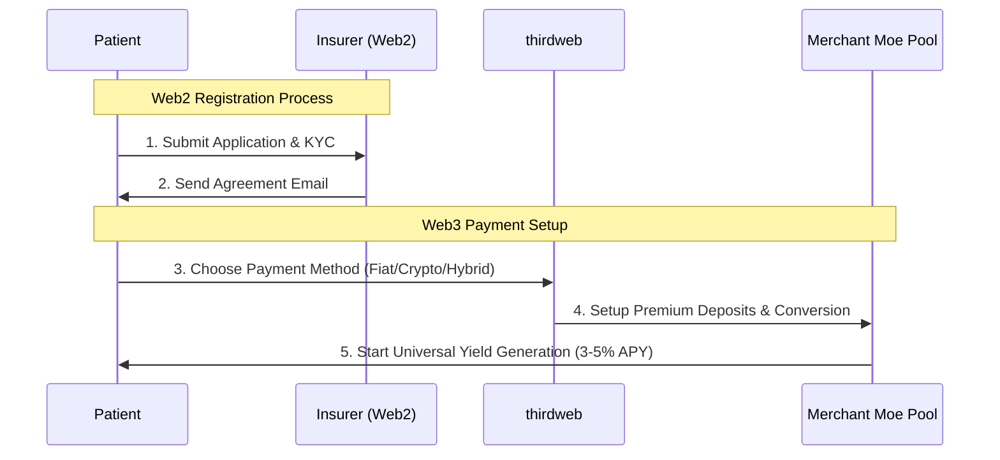
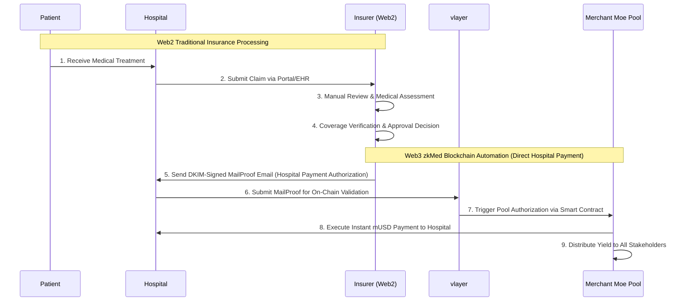
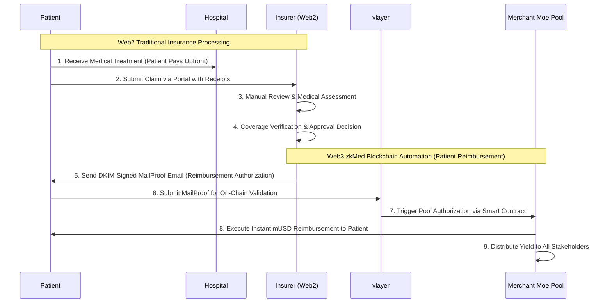
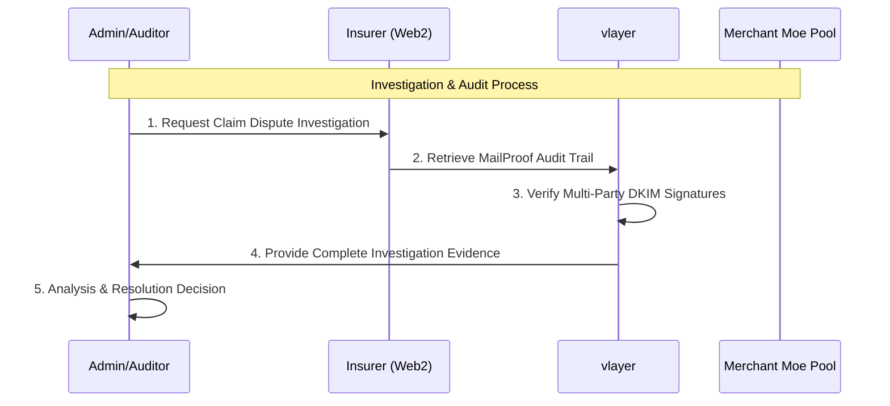

# zkMed Product Context - Revolutionary Healthcare Economics with Merchant Moe

**Mission**: Transform healthcare payments through the world's first privacy-preserving platform with yield-generating Merchant Moe Liquidity Book pools, delivering unprecedented capital efficiency while maintaining complete medical privacy through advanced vlayer MailProof-based claim certification.

---

## 🎯 Why zkMed Exists

### The Healthcare Capital Inefficiency Crisis

**Global Problem**: Healthcare systems worldwide waste trillions in idle premium and operational funds that sit in traditional accounts earning 0% returns while patients face rising costs and hospitals struggle with delayed payments.

**Privacy Crisis**: Current healthcare claims expose sensitive medical data across multiple intermediaries, creating privacy risks and limiting patient control over personal health information.

**Payment Delays**: Traditional claims processing takes weeks or months, creating cash flow problems for healthcare providers and uncertainty for patients.

**Investigation Challenges**: Healthcare organizations need comprehensive verification and audit capabilities to ensure claim legitimacy and support proper investigation workflows.

---

## 💡 Revolutionary Solution

### Merchant Moe Healthcare Economics with vlayer MailProof Certification

**Core Innovation**: zkMed enables healthcare funds to earn yield through proven Merchant Moe Liquidity Book protocols with custom healthcare hooks while maintaining instant liquidity for claims and complete medical privacy through vlayer MailProof-based verification workflows.

#### Traditional vs zkMed Model

**Traditional Healthcare**:
- Premiums sit idle earning 0% return
- Claims processing takes weeks
- Medical data exposed to multiple parties
- High administrative overhead
- Limited investigation capabilities

**zkMed Merchant Moe Healthcare System**:
- Funds earn yield via custom healthcare hooks until claims
- Instant payouts upon authorization
- Complete medical privacy preservation
- Automated pool management with custom logic
- Comprehensive vlayer MailProof-based audit trails

---

## 🌟 Target User Experiences

### Patient Experience Revolution

#### Scenario A: Sarah - Traditional User with thirdweb-Powered Premium Payments
**Background**: 34-year-old software engineer seeking health insurance with familiar payment methods

**Current Pain Points**:
- Complex insurance paperwork and verification processes
- No cryptographic proof of agreement terms
- Difficulty tracking payment history and modifications
- Limited recourse during coverage disputes
- No return on premium payments

**zkMed Web3 + MailProof Experience**:
1. **Off-Chain Agreement**: Negotiate insurance terms with insurer (Premium: 100 mUSD monthly)
2. **MailProof Reception**: Receive DKIM-signed agreement email with unique ID (A12345)
3. **thirdweb Payment Setup**: Choose fiat-to-crypto or direct crypto for automatic conversion
4. **Merchant Moe Pool Deposits**: thirdweb converts payments and deposits to Merchant Moe Liquidity Book pools
5. **Yield Generation**: Earn 3-5% APY through custom healthcare hooks
6. **Cost Tracking**: Monitor real-time premium cost reduction through yield
7. **Agreement Updates**: Receive updated terms via new MailProof emails when changes occur

**Value Delivered**: Legal verification + familiar payments + yield benefits + dispute protection

#### Scenario B: Mike - Crypto-Native User with Direct Pool Access
**Background**: 28-year-old freelancer wanting cost-effective insurance with modern payment methods

**Current Pain Points**:
- High insurance costs with no return on premiums
- Limited control over fund management
- No transparency in insurer performance
- Lack of DeFi integration opportunities

**zkMed Web3 Native Experience**:
1. **Agreement with Wallet**: Negotiate insurance including wallet address (0x1234...abcd)
2. **MailProof Registration**: Receive DKIM-signed email with pool deposit instructions
3. **Direct Crypto Payments**: Use existing mUSD or other crypto via thirdweb
4. **Advanced Pool Interaction**: Direct management of Merchant Moe Liquidity Book position
5. **Optimized Yield**: Access to advanced DeFi strategies and custom healthcare hooks
6. **Performance Analytics**: Deep insights into pool performance and yield optimization
7. **Cross-Platform Integration**: Connect with other DeFi protocols and strategies

**Value Delivered**: Maximum control + optimized yields + transparency + DeFi integration

#### Scenario C: Emma - Hybrid User with Payment Flexibility
**Background**: 45-year-old teacher transitioning from traditional to modern insurance

**zkMed Web3 + MailProof Experience**:
- **Flexible Entry**: Begin with fiat-to-crypto via thirdweb or direct crypto payments
- **Learn Gradually**: Educational resources about yield generation and Merchant Moe pools
- **Pool Optimization**: Optimize liquidity positions for maximum yield
- **Switch Strategies**: Flexible pool management based on market conditions
- **Consistent Benefits**: Earn yield through Merchant Moe Liquidity Book pools
- **Unified Interface**: Same dashboard for all Web3 + MailProof interactions

**Value Delivered**: Flexibility + education + gradual adoption + consistent benefits

### Hospital Experience Transformation

#### Scenario: Regional Medical Center
**Background**: 300-bed hospital processing 500+ claims monthly

**Current Pain Points**:
- Weeks of delays between submission and payment
- Complex reimbursement with multiple intermediaries
- Cash flow challenges from payment delays
- High administrative overhead
- Limited audit trail for claim disputes

**zkMed Experience**:
1. **Traditional Claim Submission**: Submit claims via existing Web2 channels (portal/EHR integration)
2. **Standard Insurance Review**: Insurer performs traditional verification and approval process
3. **MailProof Authorization Receipt**: Receive DKIM-signed payment authorization emails from approved claims
4. **On-Chain Proof Submission**: Submit MailProof to zkMed smart contracts for validation
5. **Instant Payment Execution**: Automatic mUSD transfer from Merchant Moe pools upon verification
6. **Real-Time Yield Tracking**: Monitor pool performance and yield distribution
7. **Comprehensive Audit Trail**: Complete Web2-to-Web3 documentation for compliance and dispute resolution

**Value Delivered**: Immediate cash flow + reduced overhead + enhanced security + comprehensive investigation support

---

## 🔄 Revolutionary User Journeys

### Unified Registration Workflow with Payment Flexibility

#### Universal Registration Flow

### Comprehensive Web2/Web3 Hybrid Claims Processing Journey

#### Option A: Direct Hospital Payment

#### Option B: Patient Reimbursement

### Enhanced Investigation Workflow

---

## 💰 Economic Value Creation

### Stakeholder Benefits

#### For Patients
- **Lower Effective Costs**: Premium burden reduced by yield generation
- **Enhanced Privacy**: Medical data never exposed during processing
- **Instant Claims**: Approved procedures result in immediate payments
- **Transparent Returns**: Clear visibility into pool performance
- **Comprehensive Verification**: MailProof-based claim certification ensures legitimacy

#### For Hospitals
- **Immediate Cash Flow**: Instant payments upon claim authorization
- **Reduced Admin Costs**: Streamlined processing reduces overhead
- **Enhanced Security**: MailProof validation prevents fraud
- **Predictable Revenue**: Merchant Moe pool-enabled system provides reliability
- **Investigation Support**: Complete MailProof audit trails for dispute resolution

#### For Insurers
- **Capital Efficiency**: Operational funds earn returns
- **Competitive Edge**: Pool performance becomes differentiator
- **Reduced Costs**: Automated processing lowers expenses
- **Market Growth**: Performance-driven patient acquisition
- **Enhanced Investigation**: MailProof trails support comprehensive claim review

---

## 🎯 How zkMed Should Work

### Seamless User Experience

#### Patient Onboarding
1. **Payment Flexibility**: Choose fiat, crypto, or hybrid payment methods during signup
2. **Universal Yield Access**: All patients earn 3-5% APY regardless of payment method
3. **Privacy-First**: Personal data never exposed during setup
4. **Immediate Benefits**: Pool access and yield generation from day one
5. **Transparent Costs**: Real-time tracking of effective premium costs after yield

#### MailProof-Based Claims Processing
1. **Privacy-Preserving**: MailProof validation without data exposure
2. **Multi-Party Verification**: Hospital, patient, and insurer DKIM-signed email confirmations
3. **Instant Validation**: Real-time verification through MailProof workflows
4. **Automated Authorization**: Merchant Moe pool withdrawal triggered by validation
5. **Flexible Payment Options**: 
   - **Direct Hospital Payment**: Instant mUSD transfer to hospital upon claim approval
   - **Patient Reimbursement**: Instant mUSD reimbursement to patient for upfront payments
6. **Complete Audit Trail**: Comprehensive MailProof-based evidence for investigation

#### Pool Management
1. **Automated Yield**: Funds earn returns without manual intervention
2. **Real-Time Tracking**: Live monitoring of pool performance
3. **Stakeholder Distribution**: Automated yield allocation
4. **Liquidity Assurance**: Always sufficient funds for claims

---

## 🚀 User Experience Goals

### Primary UX Objectives

#### Simplicity
- One-click registration with flexible payment method selection
- thirdweb-powered automatic fiat-to-crypto conversion
- Automated monthly payments with real-time yield tracking
- Clear dashboard showing effective costs after yield for all users
- Intuitive claim submission with real-time status
- Seamless MailProof-based verification workflow

#### Transparency
- Real-time pool performance and yield tracking
- Clear breakdown of costs vs returns
- Instant notification of claim authorization
- Complete audit trail while preserving privacy
- EmailProof validation status and history

#### Security
- EmailProof validation prevents fraud through comprehensive verification
- Medical data never exposed during processing
- Cryptographic proof of coverage without revelation
- Domain verification prevents impersonation
- Multi-party email confirmation ensures claim legitimacy

#### Performance
- Instant claim authorization and payment
- Real-time pool yield calculation and distribution
- Seamless thirdweb gas sponsorship
- Mobile-responsive access across devices
- Efficient emailproof generation and verification

---

## 🏆 Market Differentiation

### Unique Value Propositions

#### Capital Efficiency Revolution
- **Only Platform**: Healthcare funds earning 3-5% APY via Merchant Moe Liquidity Book pools
- **Proven Infrastructure**: Battle-tested DeFi protocols with custom healthcare hooks
- **Instant Liquidity**: Pool mechanisms ensure claim funds always available
- **Stakeholder Alignment**: All parties benefit from pool performance

#### Privacy Leadership
- **Zero Data Exposure**: Medical information never on-chain
- **EmailProof Architecture**: Comprehensive verification without data compromise
- **Cryptographic Validation**: Prove coverage without revealing procedures
- **Complete Anonymity**: Pool benefits without identity compromise

#### Investigation & Compliance Innovation
- **Comprehensive Audit Trail**: Complete email-based evidence for all claims
- **Multi-Party Verification**: Hospital, patient, insurer email confirmations
- **Investigation Support**: Detailed communication records for claim review
- **Regulatory Compliance**: EmailProof trails meet compliance requirements
- **Dispute Resolution**: Complete documentation supports fair resolution

#### User Experience Innovation
- **Dual Registration**: Accommodates all patient scenarios
- **Performance-Based Selection**: Insurers compete on pool metrics
- **Automated Management**: Set-and-forget payment systems
- **Real-Time Benefits**: Immediate visibility into yield and costs
- **EmailProof Integration**: Seamless verification without complexity

---

## 🎯 Success Vision

### Short-Term Impact (6-12 months)
- Demonstrate viable yield generation on healthcare funds
- Prove instant claim processing capabilities with emailproof verification
- Establish new standards for medical privacy protection
- Create comprehensive investigation and audit capabilities
- Create competitive pressure for traditional systems

### Long-Term Transformation (3-5 years)
- Revolutionize global healthcare payment systems
- Enable new insurance models based on pool performance
- Reduce global healthcare costs through capital efficiency
- Establish Web3 healthcare infrastructure as mainstream standard
- Set new standards for healthcare claim investigation and compliance

---

## 📚 Research Foundation & Industry Context

zkMed's product development is grounded in cutting-edge blockchain healthcare research:

- **Blockchain Healthcare Models**: Decentralized ledger and smart contracts enhance transparency, fairness, and operational efficiency in health insurance (Shouri & Ramezani, 2025)
- **EHR Integration**: Blockchain integration with insurance systems improves data security and interoperability (Implementation of Electronic Health Record, 2023)
- **Decentralized Insurance**: Peer-to-peer risk sharing and automated claims settlement without intermediaries (MAPFRE, 2025)
- **Fraud Prevention**: Real-time claim validation reduces fraudulent activities (Ncube et al., 2022)
- **Advanced DeFi**: Merchant Moe's Liquidity Book with hooks provides gas-efficient, customizable liquidity pools

---

## 📊 Summary Table of Payment Flows

| Flow Type | Agreement Formation | Payment Method | Change Management | On-Chain? | Yield Generation |
|-----------|-------------------|---------------|------------------|-----------|-----------------|
| **Web3 + MailProof + Pools** | Off-chain contract + DKIM email | On-chain deposit to Merchant Moe Liquidity Book pool | New MailProof + contract call | Yes | Yes (3-5% APY) |

**zkMed's revolutionary product vision represents the first practical implementation of hybrid Web2/Web3 architecture in healthcare insurance, delivering research-validated benefits while maintaining regulatory compliance and user familiarity. This approach balances regulatory compliance, privacy, and user experience with blockchain-enabled automation, transparency, and capital efficiency, creating unprecedented value for all stakeholders.** 🚀 

### Comprehensive Registration Flow Comparison

#### Patient Registration Flow Summary Table

| Flow Type | How Agreement Is Made | How Payment Is Made | How Changes Are Handled | On-Chain? | Yield Generation |
|-----------|----------------------|-------------------|------------------------|-----------|-----------------|
| **Web3 + MailProof + Pools** | Off-chain negotiation + DKIM-signed email | thirdweb fiat-to-crypto OR direct crypto to Merchant Moe Liquidity Book pools | New MailProof email with updated terms | Yes | Yes (3-5% APY for ALL users) |

#### Universal Registration Benefits Matrix

| Aspect | Traditional Healthcare | zkMed Web3 + MailProof + Pools Flow |
|--------|----------------------|-------------------------------------|
| **User Experience** | Complex paperwork + bank setup | Streamlined Web3 setup with payment flexibility |
| **Legal Protection** | Paper contracts only | DKIM-signed cryptographic proof |
| **Payment Methods** | Bank transfers only | Fiat-to-crypto or direct crypto via thirdweb |
| **Cost Efficiency** | No return on premiums | 3-5% APY through Merchant Moe pools |
| **Technical Complexity** | High manual processes | Simplified via thirdweb automation |
| **Dispute Resolution** | Limited paper trail | Complete MailProof audit trail |
| **Agreement Updates** | Manual paperwork | New MailProof email updates |
| **Fund Utilization** | 0% return, idle funds | Yield generation via Liquidity Book pools |
| **Transparency** | Opaque traditional systems | Full blockchain transparency |
| **Market Access** | Traditional users only | Web3-enabled users with fiat-to-crypto bridge |

#### Key Innovation: Web3 + MailProof + Pools Integration

**Revolutionary Approach**: zkMed is the first healthcare platform combining Web3 yield generation with privacy-preserving MailProof verification, powered by Merchant Moe Liquidity Book pools:

1. **Yield Generation**: All patients earn 3-5% APY through custom healthcare hooks
2. **Payment Flexibility**: Fiat-to-crypto conversion or direct crypto payments via thirdweb
3. **Privacy-First**: MailProof verification without exposing medical data
4. **Instant Settlement**: Immediate claim payments through pool automation
5. **Legal Framework**: DKIM-signed MailProof provides cryptographic legal protection 