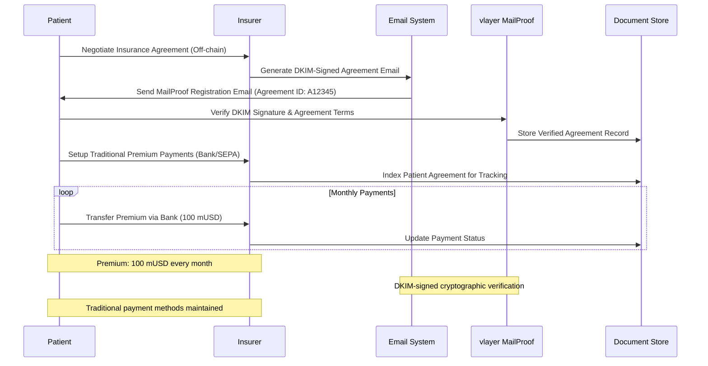
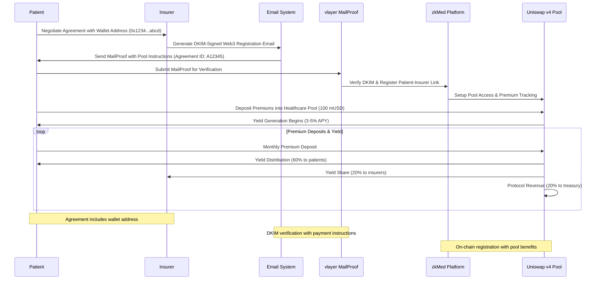
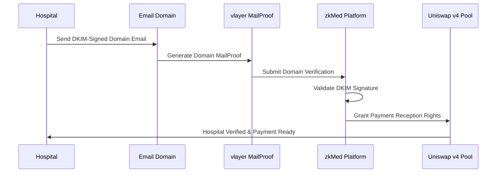
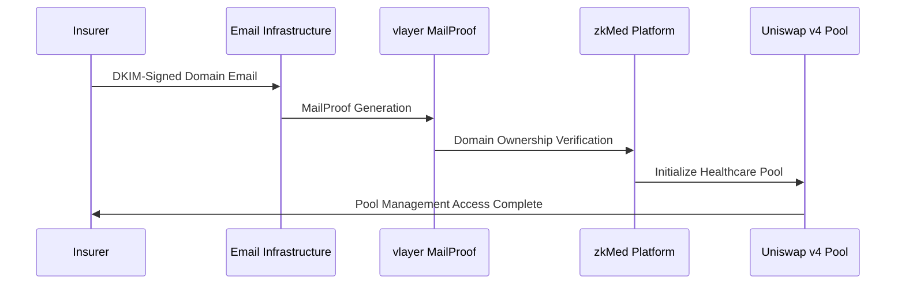
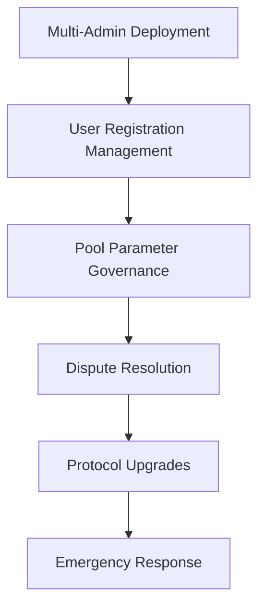
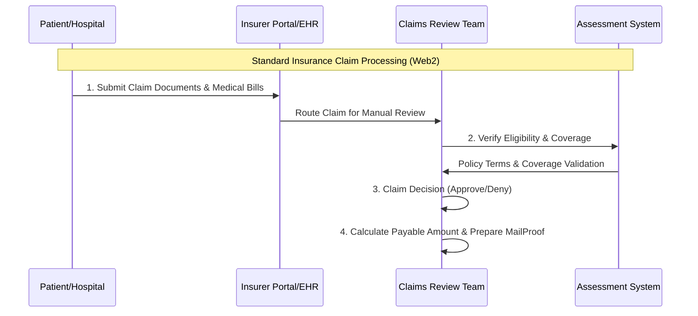
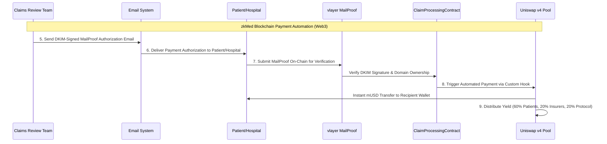

# zkMed Project Brief - Comprehensive Healthcare Insurance Platform with Uniswap v4

## 🎯 Project Vision

**zkMed** is the world's first privacy-preserving healthcare insurance payment platform that automates payments from insurers to hospitals and patients by leveraging cryptographically verifiable email proofs (vlayer MailProofs) and yield-generating liquidity pools built on **Uniswap v4 with custom hooks**. Built on Mantle Network with native mUSD integration and containerized production deployment, zkMed transforms healthcare economics through comprehensive multi-role user management and Context7-enhanced development workflows.

**Core Innovation**: Healthcare funds earn yield in Uniswap v4 pools with custom healthcare-specific hooks until MailProof-authorized claims trigger instant mUSD payouts to hospitals - all while preserving complete medical privacy through advanced DKIM-based email verification.

**Deployment Strategy**: Container-first production with persistent Mantle fork, multi-role demo accounts, live frontend accessible via custom domain with SSL, and real-time development acceleration through Context7 integration.

---

## 🚀 Revolutionary Value Proposition

### The Healthcare Insurance Automation Innovation

**Problem**: Traditional healthcare systems waste $2T+ in idle premiums (0% return) while exposing sensitive medical data during manual claims processing, creating weeks of payment delays, privacy risks, high administrative overhead, and complex multi-party verification challenges.

**Solution**: zkMed enables healthcare funds to earn yield via proven Uniswap v4 protocols with custom healthcare hooks while maintaining instant claim liquidity and complete medical privacy through cryptographically verifiable MailProof authorization - all with comprehensive multi-role user management supporting patients, hospitals, insurers, and administrators.

### Key Innovations
- **Uniswap v4 Healthcare Pools**: Custom hooks for healthcare-specific payment logic and yield generation
- **MailProof Automation**: DKIM-signed email verification for instant payment authorization
- **Multi-Role Architecture**: Comprehensive user management for all healthcare stakeholders  
- **Complete Privacy**: Medical data never exposed during verification or payment processing
- **Instant Payouts**: Pool-authorized claims trigger immediate mUSD transfers
- **Native Processing**: Direct mUSD handling eliminates oracle dependencies
- **Container Deployment**: Production-ready scalable infrastructure with live demo
- **Context7 Integration**: Real-time documentation access for accelerated development

---

## 🏗️ Comprehensive User Flow Architecture

### Patient Registration & Actions - Dual Path Support

#### **Option A: Pure Web2 Registration with MailProof Verification**


#### **Option B: Web3 Payment Registration with MailProof and Pool Integration**


**Patient Registration Experience Details**:

**Pure Web2 Flow Benefits**:
- **Familiar Process**: Traditional bank transfer/SEPA payment methods
- **Legal Verification**: DKIM-signed MailProof serves as cryptographically verifiable agreement
- **No Blockchain Learning**: Works without wallet or Web3 knowledge
- **Regulatory Compliance**: Web2 payments meet existing financial regulations
- **Easy Updates**: Insurers modify terms via new MailProof emails
- **Audit Trail**: Complete email-based evidence for dispute resolution

**Web3 Enhanced Flow Benefits**:
- **Cost Reduction**: Premium costs reduced by yield generation (3-5% APY)
- **Pool Participation**: Deposits earn returns in Uniswap v4 healthcare pools
- **Transparent Performance**: Real-time visibility into pool performance and yields
- **Smart Contract Security**: Terms secured by blockchain with MailProof authentication
- **Instant Verification**: Cryptographic proof of coverage and payment capacity
- **Modern Payment Experience**: Seamless wallet-based premium management

### Hospital Registration & Actions


**Hospital Experience**:
- **Domain Verification**: Cryptographic proof of official email domain control
- **Payment Setup**: Immediate access to MailProof-triggered instant payments
- **Cash Flow Optimization**: Real-time payment reception upon claim authorization
- **Financial Tracking**: Comprehensive dashboard for payment and yield monitoring

### Insurance Company Registration & Actions


**Insurance Company Experience**:
- **Pool Creation**: Automatic Uniswap v4 pool initialization with custom healthcare hooks
- **Claim Management**: Traditional off-chain review with on-chain automation
- **MailProof Authorization**: Send DKIM-signed payment authorization emails
- **Performance Monitoring**: Real-time pool management and yield optimization

### Admin & Governance Framework


**Admin Capabilities**:
- **Distributed Administration**: Multiple admins with specialized role-based permissions
- **User Management**: Oversight of all registration and verification processes
- **Pool Governance**: Parameter adjustment and performance optimization
- **Emergency Controls**: Rapid response capabilities for critical situations

---

## 💰 Enhanced Claim Processing Flow

### Comprehensive Web2/Web3 Hybrid Claim Processing

#### **Web2 (Off-Chain) Traditional Insurance Processing**


#### **Web3 (On-Chain) zkMed Payment Automation**


### Hybrid Approach: Why Web2 + Web3?

**Regulatory Compliance & Industry Integration**:
- **Existing Workflow Preservation**: Insurers maintain current claim review processes, ensuring regulatory compliance
- **Privacy Law Adherence**: Medical data remains in traditional systems, never exposed on-chain (GDPR/HIPAA compliant)
- **Gradual Adoption**: Seamless integration without disrupting existing insurer operations
- **Risk Mitigation**: Traditional approval processes minimize regulatory and operational risks

**Technology Innovation Benefits**:
- **Proven Infrastructure**: Web2 handles complex medical assessments, Web3 automates payments
- **Enhanced Efficiency**: Blockchain automation only for payment execution, not sensitive data processing
- **Fraud Prevention**: Cryptographic MailProof verification prevents payment authorization spoofing
- **Instant Settlement**: Immediate liquidity through Uniswap v4 pools upon claim approval

### Detailed Hybrid Claim Flow Steps

#### **Web2 (Off-Chain) Traditional Insurance Processing**

#### 1. **Claim Submission**
- Patient or hospital submits claim to insurance company via traditional Web2 channels
- Submission through insurer portal, email, or national EHR integration
- Claim includes all required documentation: medical bills, reports, patient details
- Follows standard insurance claim submission protocols for regulatory compliance

#### 2. **Initial Verification and Assessment**
- Insurer reviews claim documents and verifies patient eligibility and coverage
- Manual checks, medical coding, and investigation for claim validity
- Assessment considers deductibles, copayments, and coverage limits
- Verification against policy terms and conditions using existing systems

#### 3. **Claim Decision (Approval or Denial)**
- Insurer decides whether to approve or reject the claim based on comprehensive assessment
- If approved, calculates the exact payable amount according to policy terms
- Decision process follows internal protocols and regulatory compliance requirements
- Traditional claim processing maintains existing workflows and audit requirements

#### 4. **MailProof Authorization Email Preparation**
- Insurer prepares **MailProof email** with cryptographically verifiable payment authorization
- Email contains structured payment data: amount, recipient wallets, claim ID, deadline
- DKIM-signed to ensure authenticity and prevent spoofing or fraud
- Acts as cryptographic bridge between off-chain approval and on-chain payment execution

#### **Web3 (On-Chain) zkMed Blockchain Payment Automation**

#### 5. **MailProof Email Delivery**
- Insurer sends the DKIM-signed MailProof email to patient and/or hospital
- Email recipient depends on payment type: reimbursement vs direct hospital payment
- Email serves as cryptographic proof bridging off-chain approval to on-chain payment
- Complete audit trail maintained for regulatory compliance and investigation

#### 6. **On-Chain Proof Submission**
- Patient/hospital submits MailProof email (or cryptographic proof) to zkMed smart contracts
- Smart contracts verify DKIM signature, domain ownership via vlayer MailProofs
- Payment instruction schema parsing without exposing medical data
- Privacy-preserving verification ensures payment authorization legitimacy

#### 7. **Automated Payment Execution**
- Upon successful verification, zkMed triggers **instant payments** in mUSD
- Payments executed from **Uniswap v4 liquidity pool** directly to recipient wallets
- Uniswap v4 custom hooks validate payment authorization and execute transfer
- Fully automated, transparent, and privacy-preserving payment processing

#### 8. **Yield Distribution and Monitoring**
- Liquidity pool continues generating yield via Uniswap v4 fees and incentives
- Automated yield distribution per protocol economic model (60/20/20 split)
- Real-time monitoring and transparent tracking of all distributions
- Immediate liquidity and cash flow improvement for healthcare providers

---

## 🏗️ Smart Contract Architecture

### Core Smart Contract Suite

#### 1. **RegistrationContract.sol** - Multi-Role Management
```solidity
interface IEnhancedRegistrationContract {
    // Patient registration (simplified thirdweb flow)
    function registerPatient(address wallet) external;
    function linkInsuranceCompany(address patient, address insurer) external;
    
    // Hospital registration (MailProof verification)
    function registerHospitalWithMailProof(bytes calldata mailProof) external;
    function validateHospitalDomain(string calldata domain) external view returns (bool);
    
    // Insurer registration (MailProof + Pool setup)
    function registerInsurerWithMailProof(bytes calldata mailProof) external;
    function initializeInsurerPool(address insurer, PoolParameters calldata params) external;
    
    // Multi-admin governance
    function addAdmin(address newAdmin, AdminRole role) external;
    function updateAdminPermissions(address admin, uint256 permissions) external;
}
```

#### 2. **EmailDomainProver.sol** - vlayer MailProof Integration
```solidity
interface IEmailDomainProver {
    // DKIM signature verification
    function verifyDKIMSignature(bytes calldata mailProof) external view returns (bool);
    function validateDomainOwnership(string calldata domain, bytes calldata proof) external;
    
    // Payment authorization extraction
    function verifyPaymentAuthorization(bytes calldata mailProof) external view returns (bool);
    function extractPaymentInstructions(bytes calldata mailProof) external pure returns (
        address recipient,
        uint256 amount,
        string memory currency,
        uint256 deadline
    );
}
```

#### 3. **PoolingContract.sol** - Uniswap v4 Healthcare Pools
```solidity
interface IHealthcarePoolManager {
    // Pool initialization with custom healthcare hooks
    function initializeHealthcarePool(
        PoolKey calldata key,
        uint160 sqrtPriceX96,
        address hookContract
    ) external returns (PoolId);
    
    // Healthcare payment processing
    function processHealthcarePayment(
        PoolKey calldata key,
        bytes calldata mailProof,
        HealthcarePaymentParams calldata params
    ) external returns (BalanceDelta);
    
    // Automated yield distribution (60/20/20 split)
    function distributeHealthcareYield(
        PoolId poolId,
        YieldDistributionParams calldata params
    ) external;
}
```

#### 4. **ClaimProcessingContract.sol** - MailProof Validation Engine
```solidity
interface IClaimProcessingContract {
    // Claim submission with MailProof
    function submitClaim(
        uint256 claimId,
        bytes calldata mailProof,
        ClaimData calldata claimData
    ) external;
    
    // Validation and processing
    function validateMailProof(bytes calldata mailProof) external view returns (bool);
    function processValidatedClaim(uint256 claimId) external;
    function executePayout(uint256 claimId) external;
    
    // Compliance and audit
    function getClaimAuditTrail(uint256 claimId) external view returns (AuditEntry[] memory);
}
```

#### 5. **InsuranceContract.sol** - Policy & Premium Management
```solidity
interface IInsuranceContract {
    // Policy management
    function createInsurancePolicy(
        address patient,
        uint256 premiumAmount,
        uint256 coverageLimit,
        uint256 duration
    ) external;
    
    // Premium processing
    function processPremiumPayment(address patient, uint256 amount) external;
    function updatePolicyTerms(uint256 policyId, PolicyTerms memory newTerms) external;
    
    // Pool integration
    function getPatientPoolBalance(address patient) external view returns (uint256);
    function getInsurerPoolBalance(address insurer) external view returns (uint256);
}
```

#### 6. **Enhanced InsuranceContract.sol** - Comprehensive Agreement Management
```solidity
interface IEnhancedInsuranceContract {
    // Dual flow patient registration
    function registerPatientWeb2(
        bytes calldata mailProof,
        string calldata agreementId,
        string calldata patientIdentifier
    ) external;
    
    function registerPatientWeb3(
        bytes calldata mailProof,
        string calldata agreementId,
        address patientWallet
    ) external;
    
    // Agreement management
    function updateAgreementTerms(
        bytes calldata mailProof,
        string calldata agreementId,
        AgreementTerms calldata newTerms
    ) external;
    
    // Patient indexing and querying
    function getPatientAgreement(address patient) external view returns (Agreement memory);
    function getInsurerPatients(address insurer) external view returns (PatientRecord[] memory);
    function indexPatientAgreements(address insurer) external view returns (Agreement[] memory);
    
    // Payment tracking (dual flow support)
    function trackWeb2Payment(string calldata agreementId, uint256 amount) external;
    function processWeb3Premium(address patient, uint256 amount) external;
    
    // Pool integration for Web3 flow
    function getPatientPoolBalance(address patient) external view returns (uint256);
    function getInsurerPoolBalance(address insurer) external view returns (uint256);
    function calculateYieldDistribution(address insurer) external view returns (YieldBreakdown memory);
    
    // Agreement structures
    struct Agreement {
        string agreementId;        // Unique identifier (e.g., A12345)
        address insurer;           // Insurer contract address
        address patientWallet;     // Patient wallet (Web3 flow only)
        string patientIdentifier;  // Patient ID (Web2 flow only)
        uint256 premium;           // Monthly premium amount
        uint256 period;            // Payment period in seconds
        string coverage;           // Coverage type description
        bool isWeb3;              // Flow type identifier
        uint256 createdAt;        // Agreement creation timestamp
        uint256 updatedAt;        // Last update timestamp
    }
    
    struct PatientRecord {
        address wallet;
        string identifier;
        string agreementId;
        uint256 totalPaid;
        uint256 yieldEarned;
        bool isActive;
    }
    
    struct YieldBreakdown {
        uint256 totalYield;
        uint256 patientShare;     // 60%
        uint256 insurerShare;     // 20%
        uint256 protocolShare;    // 20%
    }
    
    // Events for transparency and indexing
    event PatientRegisteredWeb2(string indexed agreementId, address indexed insurer, string patientId);
    event PatientRegisteredWeb3(string indexed agreementId, address indexed insurer, address indexed patient);
    event AgreementUpdated(string indexed agreementId, uint256 timestamp);
    event PremiumProcessed(string indexed agreementId, uint256 amount, bool isWeb3);
    event YieldDistributed(address indexed insurer, uint256 totalYield, uint256 timestamp);
}
```

#### Registration Flow Comparison Summary

| Flow Type | Agreement Creation | Payment Method | Smart Contract Integration | Yield Generation | Legal Protection |
|-----------|-------------------|---------------|---------------------------|-----------------|-----------------|
| **Pure Web2 + MailProof** | Off-chain negotiation + DKIM email | Bank transfer/SEPA | MailProof verification only | No | DKIM-signed legal record |
| **Web3 + MailProof + Pools** | Off-chain negotiation + DKIM email | Wallet deposits to pools | Full on-chain integration | Yes (3-5% APY) | DKIM + blockchain verification |

**Key Innovation: Universal MailProof Verification**
- Both flows use identical DKIM-signed email verification for legal consistency
- Smart contracts support dual indexing for both registration types
- Insurers can manage both Web2 and Web3 patients from single interface
- Patients can migrate between flows without losing agreement history
- Complete audit trail maintained across both traditional and blockchain systems

---

## 💡 Uniswap v4 Custom Healthcare Hooks

### Revolutionary Pool Logic Integration

**Innovation**: First healthcare platform leveraging Uniswap v4's advanced hook system for specialized medical payment validation and automated yield distribution.

#### Healthcare Hook Architecture
```solidity
contract HealthcarePoolHook is BaseHook {
    // Before swap: Validate MailProof authorization
    function beforeSwap(
        address sender,
        PoolKey calldata key,
        IPoolManager.SwapParams calldata params,
        bytes calldata hookData
    ) external override returns (bytes4) {
        // Decode MailProof from hook data
        HealthcareSwapParams memory healthcareParams = abi.decode(hookData, (HealthcareSwapParams));
        
        // Validate MailProof authorization
        require(vlayerVerifier.verifyMailProof(healthcareParams.mailProof), "Invalid MailProof");
        
        // Verify payment authorization and limits
        (address recipient, uint256 amount) = extractPaymentInstructions(healthcareParams.mailProof);
        require(recipient == healthcareParams.hospital, "Unauthorized recipient");
        
        return BaseHook.beforeSwap.selector;
    }
    
    // After swap: Automated yield distribution
    function afterSwap(
        address sender,
        PoolKey calldata key,
        IPoolManager.SwapParams calldata params,
        BalanceDelta delta,
        bytes calldata hookData
    ) external override returns (bytes4) {
        // Calculate and distribute yield (60/20/20 split)
        uint256 swapFees = calculateSwapFees(delta);
        distributeHealthcareYield(key, swapFees, healthcareParams);
        
        return BaseHook.afterSwap.selector;
    }
}
```

### Healthcare-Specific Pool Benefits
- **Custom Validation Logic**: MailProof verification integrated into swap operations
- **Automated Yield Distribution**: 60% patients, 20% insurers, 20% protocol
- **Instant Liquidity**: Proven Uniswap mechanisms ensure immediate claim payouts
- **Gas Optimization**: Efficient hook implementations reduce transaction costs

---

## 🏆 Context7 Integration for Enhanced Development

### Revolutionary Development Acceleration

**Innovation**: First healthcare platform integrating Context7 MCP for real-time access to up-to-date library documentation and development best practices.

#### Context7 Configuration
```json
{
  "mcpServers": {
    "context7": {
      "command": "npx",
      "args": ["-y", "@upstash/context7-mcp"],
      "env": {
        "DEFAULT_MINIMUM_TOKENS": "12000",
        "CONTEXT7_CACHE_TTL": "3600"
      }
    }
  }
}
```

#### Development Workflow Enhancement
```bash
# Uniswap v4 integration with real-time documentation
use context7: "Implement Uniswap v4 custom hooks for healthcare payment automation"

# vlayer MailProof best practices  
use context7: "Integrate vlayer MailProofs for DKIM email verification in healthcare contracts"

# Next.js healthcare dashboard development
use context7: "Build multi-role healthcare dashboard with real-time pool monitoring"

# Container orchestration for healthcare platform
use context7: "Docker compose setup for healthcare platform with Uniswap v4 and vlayer"
```

#### Context7 Benefits
- **Real-Time Documentation**: Always current information on rapidly evolving DeFi protocols
- **Rapid Prototyping**: Accelerated development with proven code patterns
- **Security Enhancement**: Current security practices and vulnerability prevention
- **Healthcare Specialization**: Domain-specific patterns for medical privacy and compliance

---

## 💰 Economic Model & Yield Distribution

### Automated Stakeholder Benefits
- **Patients (60% yield)**: Effective premium reduction through yield generation
- **Hospitals**: Instant payments upon MailProof claim authorization  
- **Insurers (20% yield)**: Operational funds earn returns while awaiting claims
- **Protocol (20% yield)**: Sustainable development funding

### Uniswap v4 Pool Economics
- **Trading Fees**: Generated from mUSD/USDC pool operations
- **Custom Hook Yield**: Healthcare-specific fee structures and incentives
- **Instant Liquidity**: Proven AMM mechanisms ensure claim funds always available
- **Risk Management**: Battle-tested Uniswap parameters protect deposited funds

### Revenue Distribution Model (60/20/20)
```
Total Yield Generated: 100%
├── 60% → Patient Premium Reduction (yield lowers effective costs)
├── 20% → Insurer Operations (pool management returns)
└── 20% → Protocol Treasury (platform sustainability)
```

---

## 🔐 Advanced Privacy & Security Architecture

### MailProof-Based Privacy Preservation
- **Medical Data Isolation**: Healthcare details never transmitted or stored on-chain
- **DKIM Signature Validation**: Cryptographic proof of email authenticity
- **Domain Ownership Verification**: Ensures emails originate from verified organizations
- **Payment-Only Processing**: Only financial authorization data extracted from emails
- **Zero Knowledge Architecture**: Verification without revealing sensitive information

### Security Features
- **Multi-Signature Administration**: All critical functions require multiple signatures
- **MailProof Replay Prevention**: Email hash tracking prevents duplicate submissions
- **Custom Hook Validation**: Comprehensive authorization checks in Uniswap v4 operations
- **Emergency Controls**: Circuit breakers for critical system functions
- **Complete Audit Trail**: Full verification history for regulatory compliance

---

## 🚀 Production Deployment & Demo Strategy

### Container-First Healthcare Platform
zkMed employs a **comprehensive container architecture** using Docker for scalable, reliable deployment with live multi-role demo capabilities.

#### Production Container Requirements
- **Healthcare Contract Deployment**: Automated smart contract deployment with verification
- **Uniswap v4 Pool Management**: Custom hook integration and pool initialization
- **vlayer MailProof Services**: DKIM verification and domain authentication
- **Multi-Role Frontend**: Specialized interfaces for all user types
- **Context7 Integration**: Real-time documentation server for development
- **Monitoring Stack**: Comprehensive health monitoring and alerting

#### Live Demo Workflows
1. **Multi-Role Registration**: Experience registration for patients, hospitals, insurers, and admins
2. **MailProof Verification**: Live domain verification and DKIM signature validation
3. **Pool Operations**: Real-time Uniswap v4 pool management and yield tracking
4. **Claim Processing**: Complete MailProof-based claim authorization and instant payments
5. **Yield Distribution**: Live demonstration of automated 60/20/20 yield allocation

### Target: The Cookathon on Mantle
- **Healthcare DeFi Innovation**: First platform combining insurance automation with yield generation
- **thirdweb Partnership**: Official Cookathon sponsor integration for seamless UX
- **Native mUSD Optimization**: Direct Mantle ecosystem integration eliminates complexity
- **Production Readiness**: Containerized deployment with comprehensive live demo
- **Prize Positioning**: Best DeFi Application, Most Innovative Healthcare Solution, Best Overall

---

## 🏆 Success Metrics & Competitive Advantages

### Technical Achievements
- [x] **Multi-Role Registration**: Complete user management for all healthcare stakeholders
- [ ] **Uniswap v4 Pool Performance**: Custom hooks delivering 3-5% APY on healthcare funds
- [ ] **MailProof Processing**: <10 seconds for email verification and payment authorization
- [ ] **Instant Payments**: Real-time claim authorization and hospital payment execution
- [ ] **Automated Yield Distribution**: Seamless 60/20/20 allocation to stakeholders

### Market Impact Metrics  
- [ ] **Industry First**: Healthcare platform with yield-generating Uniswap v4 pools
- [ ] **Cost Reduction**: Measurable premium savings for patients through yield generation
- [ ] **Cash Flow Enhancement**: Improved liquidity for healthcare providers
- [ ] **Privacy Leadership**: New standard for medical privacy in Web3 healthcare
- [ ] **Regulatory Compliance**: MailProof audit trails supporting GDPR/HIPAA requirements

### Platform Health Indicators
- [ ] **Pool Liquidity**: 100% claim authorization success rate with instant payouts
- [ ] **User Experience**: Seamless multi-role registration and automated payment management
- [ ] **Privacy Security**: Zero medical data exposure during MailProof verification
- [ ] **System Reliability**: High uptime and transaction success rates across all services
- [ ] **Development Velocity**: Accelerated feature development through Context7 integration

---

## 📋 Development Status & Implementation

### Completed Foundation ✅
- **Multi-Role Registration**: Complete vlayer MailProof integration with role-based access control
- **MailProof Architecture**: DKIM signature verification and domain authentication system
- **Container Infrastructure**: Multi-service Docker setup for production deployment
- **Local Development**: Mantle fork environment with Uniswap v4 integration preparation
- **Context7 Integration**: Real-time documentation access for enhanced development workflows

### Current Implementation Phase 🚧
- **Uniswap v4 Pool Integration**: Custom healthcare hooks for payment validation and yield distribution
- **Enhanced User Flows**: Complete registration and action workflows for all user roles
- **MailProof Claims Processing**: End-to-end claim processing with email-based authorization
- **Multi-Role Frontend**: Specialized dashboard interfaces for patients, hospitals, insurers, and admins

### Final Integration 📋
- **Live Demo Environment**: Complete containerized deployment with multi-role demo accounts
- **Pool Operations**: Functional yield generation and instant claim payouts via custom hooks
- **MailProof Workflows**: End-to-end email verification with real payment authorization
- **Cookathon Submission**: Live demonstration platform showcasing complete healthcare automation

---

## 🎯 Competitive Advantages & Market Position

### Unique Value Propositions

#### Technical Innovation Leadership
- **Industry First**: Only healthcare platform with Uniswap v4 custom hooks for medical payments
- **Proven Infrastructure**: Built on battle-tested Uniswap v4 and vlayer protocols
- **Healthcare Specialization**: Custom hooks and logic specifically designed for medical payments
- **Context7 Acceleration**: Real-time documentation access for rapid feature development

#### User Experience Excellence
- **Multi-Role Architecture**: Comprehensive platform supporting all healthcare stakeholders
- **Simplified Onboarding**: thirdweb authentication eliminates Web3 complexity for patients
- **Performance-Based Selection**: Insurers compete on transparent pool performance metrics
- **Instant Benefits**: Real-time yield tracking and immediate claim payouts

#### Privacy & Compliance Leadership
- **Zero Data Exposure**: Medical information never compromised during verification or payments
- **MailProof Security**: Advanced DKIM-based authentication prevents fraud while preserving privacy
- **Complete Audit Trails**: MailProof verification history supports regulatory compliance
- **Cryptographic Validation**: Prove payment authorization without revealing medical procedures

### Market Differentiation Matrix

| Feature | Traditional Healthcare | Basic Blockchain | Advanced DeFi | zkMed Comprehensive |
|---------|----------------------|----------------|---------------|-------------------|
| **User Onboarding** | Complex paperwork | Basic wallet connection | Simple registration | Multi-role MailProof verification |
| **Payment Processing** | Weeks of manual processing | Basic automation | DeFi integration | Instant MailProof-triggered payouts |
| **Fund Management** | 0% returns on idle funds | Basic staking mechanisms | Standard yield farming | Uniswap v4 with custom healthcare hooks |
| **Privacy Protection** | Centralized data exposure | Limited privacy features | Basic encryption | Complete MailProof verification |
| **Admin Governance** | Single administrator control | Basic permission systems | DAO voting mechanisms | Multi-admin with specialized healthcare roles |
| **Development Speed** | Slow manual iterations | Standard documentation | Library integration | Real-time Context7 documentation access |

**zkMed represents a fundamental transformation of healthcare insurance economics, delivering the world's first privacy-preserving platform with yield-generating Uniswap v4 pools, comprehensive MailProof verification, and multi-role user management. Built for The Cookathon on Mantle Network with production-ready containerized deployment, native mUSD integration, Context7-enhanced development workflows, and live demo capabilities showcasing the revolutionary future of Web3 healthcare automation.** 🚀 