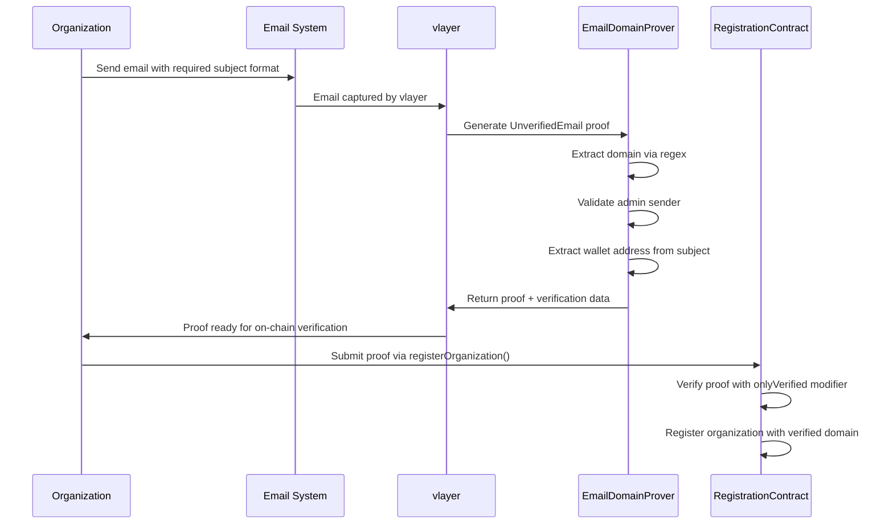
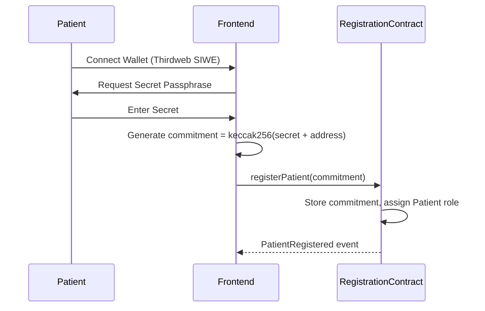
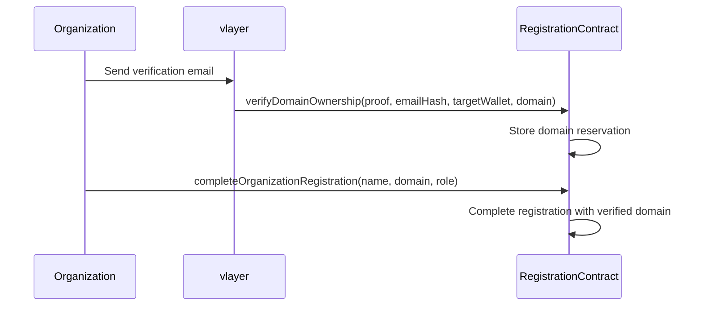
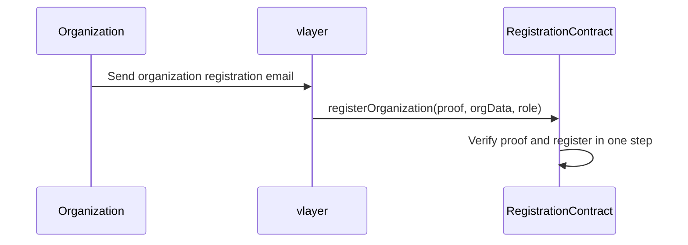
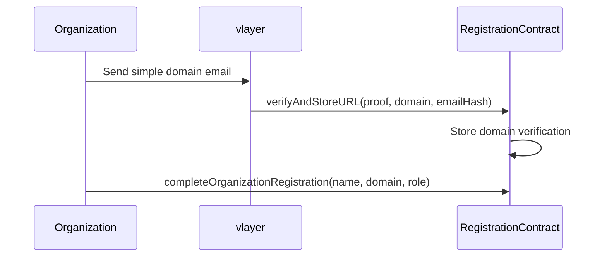

# zkMed Registration System

A privacy-preserving registration system for healthcare stakeholders using vlayer email proofs and cryptographic commitments.

## Overview

The zkMed Registration system implements role-based access control for three types of users:
- **Patients**: Register with privacy-preserving commitments
- **Hospitals**: Verify domain ownership via vlayer email proofs
- **Insurance Companies**: Verify domain ownership via vlayer email proofs

## Architecture

### Core Contracts

1. **EmailDomainProver.sol** - vlayer Prover contract
   - Inherits from `vlayer-0.1.0/Prover`
   - Uses `UnverifiedEmail` and `VerifiedEmail` from vlayer EmailProof library
   - Extracts domains and wallet addresses using regex patterns
   - Validates admin email senders (admin@, info@, contact@, support@)

2. **RegistrationContract.sol** - Main verifier and registration contract
   - Inherits from `vlayer-0.1.0/Verifier`
   - Uses `onlyVerified` modifier for vlayer proof verification
   - Manages user roles and verification status
   - Implements privacy-preserving patient registration
   - Tracks email hashes to prevent replay attacks

## vlayer Email Proof Integration

### Email Format Requirements

**Domain Verification Email:**
- **Subject**: `"Verify domain ownership for address: 0x[wallet_address]"`
- **From**: `admin@domain.com` (or info@, contact@, support@)
- **To**: Any address
- **Body**: Any content

**Organization Registration Email:**
- **Subject**: `"Register organization [Organization Name] for address: 0x[wallet_address]"`
- **From**: `admin@domain.com` (or info@, contact@, support@)
- **To**: Any address
- **Body**: Any content

### Proof Generation Flow



### EmailDomainProver Functions

```solidity
// Main domain verification
function verifyDomainOwnership(UnverifiedEmail calldata unverifiedEmail)
    returns (Proof memory, bytes32 emailHash, address targetWallet, string memory domain)

// Complete organization verification  
function verifyOrganization(UnverifiedEmail calldata unverifiedEmail)
    returns (Proof memory, OrganizationVerificationData memory)

// Simple domain verification for backward compatibility
function simpleDomainVerification(UnverifiedEmail calldata unverifiedEmail, address targetWallet)
    returns (Proof memory, string memory domain, bytes32 emailHash)
```

### Email Security Features

- **Admin Validation**: Only emails from admin@, info@, contact@, or support@ accounts accepted
- **Regex Extraction**: Robust email parsing using vlayer's RegexLib
- **Hash Tracking**: Email hashes stored to prevent replay attacks
- **Target Wallet Validation**: Wallet address in email must match msg.sender

## User Registration Flows

### Patient Registration



### Organization Registration (Three Flows)

#### 1. Two-Step Flow


#### 2. Single-Step Flow


#### 3. Legacy Flow


## Smart Contract Interface

### Patient Functions

```solidity
// Register with privacy-preserving commitment
function registerPatient(bytes32 _commitment) external

// Verify commitment with secret (view function)
function verifyPatientCommitment(string memory _secret) external view returns (bool)
```

### Organization Functions

```solidity
// Single-step registration with complete email proof
function registerOrganization(
    Proof calldata proof,
    OrganizationVerificationData calldata orgData,
    Role _role
) external

// Two-step: Step 1 - Verify domain ownership
function verifyDomainOwnership(
    Proof calldata proof,
    bytes32 emailHash,
    address targetWallet,
    string calldata domain
) external

// Two-step: Step 2 - Complete registration
function completeOrganizationRegistration(
    string calldata organizationName,
    string calldata domain,
    Role _role
) external

// Legacy: Simple domain verification
function verifyAndStoreURL(
    Proof calldata proof,
    string calldata domain,
    bytes32 emailHash
) external
```

### View Functions

```solidity
// Get complete user registration info
function getUserRegistration(address _user) external view returns (
    Role role,
    bool isVerified,
    uint256 timestamp,
    string memory organizationName,
    string memory domain
)

// Check if user is registered and verified
function isUserVerified(address _user) external view returns (bool)

// Get organization details (includes emailHash)
function getOrganization(address _organization) external view returns (Organization memory)

// Check domain and email hash usage
function isDomainRegistered(string calldata _domain) external view returns (bool)
function isEmailHashUsed(bytes32 _emailHash) external view returns (bool)
function getEmailHashOwner(bytes32 _emailHash) external view returns (address)
```

## Privacy & Security Features

### Patient Privacy
- **No Personal Data**: Only cryptographic commitments stored
- **Local Secrets**: Passphrases never transmitted or stored
- **Verifiable Identity**: Patients can prove identity without revealing secrets

### Organization Privacy & Security
- **Email Hash Only**: Email addresses never stored, only SHA256 hashes
- **Domain Verification**: Cryptographic proof of domain ownership
- **Replay Protection**: Email hashes tracked to prevent reuse
- **Admin Validation**: Only authorized email accounts accepted
- **Target Wallet Matching**: Prevents proof stealing attacks

### Access Control
- **Role-Based Permissions**: Separate roles for Patients, Hospitals, Insurers, Admins
- **Verification Requirements**: All roles must be verified to interact
- **Admin Controls**: Emergency functions for verification management

## Integration Examples

### vlayer Email Proof Generation

```typescript
import { createVlayerClient } from "@vlayer/sdk";

const vlayerClient = createVlayerClient();

// Generate organization registration proof
const generateOrgProof = async (orgName: string, walletAddress: string) => {
  // User sends email: "Register organization [OrgName] for address: 0x..."
  // from admin@domain.com
  
  const proof = await vlayerClient.prove({
    prover: EmailDomainProver,
    functionName: "verifyOrganization",
    args: [unverifiedEmail] // vlayer provides this
  });
  
  return proof;
};

// Generate simple domain proof
const generateDomainProof = async (walletAddress: string) => {
  // User sends email: "Verify domain ownership for address: 0x..."
  // from admin@domain.com
  
  const proof = await vlayerClient.prove({
    prover: EmailDomainProver,
    functionName: "verifyDomainOwnership",
    args: [unverifiedEmail]
  });
  
  return proof;
};
```

### Frontend Integration (Next.js + Thirdweb)

```typescript
import { useContract, useContractWrite } from "@thirdweb-dev/react";

// Patient registration
const registerPatient = async (secret: string, userAddress: string) => {
  const commitment = keccak256(encodePacked(["string", "address"], [secret, userAddress]));
  await contract.call("registerPatient", [commitment]);
};

// Organization registration (single-step)
const registerOrganization = async (proof: Proof, orgData: OrganizationVerificationData) => {
  await contract.call("registerOrganization", [proof, orgData, Role.Hospital]);
};

// Organization registration (two-step)
const registerOrgTwoStep = async (
  domainProof: Proof, 
  emailHash: string, 
  domain: string,
  orgName: string
) => {
  // Step 1: Verify domain
  await contract.call("verifyDomainOwnership", [domainProof, emailHash, userAddress, domain]);
  
  // Step 2: Complete registration
  await contract.call("completeOrganizationRegistration", [orgName, domain, Role.Hospital]);
};
```

## Email Examples

### Domain Verification Email
```
To: admin@general-hospital.com
Subject: Verify domain ownership for address: 0x742d35Cc6634C0532925a3b8D0B5B0052A57adD4

Hello,

Please confirm domain ownership for blockchain registration.

Best regards,
Registration System
```

### Organization Registration Email
```
To: admin@health-insurance.com
Subject: Register organization [Health Insurance Co] for address: 0x8ba1f109551bD432803012645Hac136c7Aad5a6

Hello,

Please confirm registration for your organization.

Best regards,
Registration System
```

## Testing

The test suite covers:
- ✅ Patient registration and commitment verification
- ✅ Organization registration flows (single, two-step, legacy)
- ✅ vlayer email proof integration patterns
- ✅ Email hash tracking and replay prevention
- ✅ Role-based access control
- ✅ Privacy guarantees (no personal data on-chain)
- ✅ Admin functions and emergency controls
- ✅ Target wallet validation
- ✅ Domain uniqueness enforcement

Run tests with:
```bash
forge test -vv
```

## Deployment

### Prerequisites
```bash
# Install dependencies
forge soldeer install

# Build contracts
forge build

# Run tests
forge test
```

### Deploy Script
```bash
# Deploy to local network
forge script script/DeployRegistration.s.sol --rpc-url <RPC_URL> --private-key <PRIVATE_KEY> --broadcast

# Deploy to testnet
forge script script/DeployRegistration.s.sol --rpc-url sepolia --private-key <PRIVATE_KEY> --broadcast --verify
```

### Environment Variables
After deployment, add these to your frontend environment:
```env
NEXT_PUBLIC_REGISTRATION_CONTRACT=<RegistrationContract_Address>
NEXT_PUBLIC_EMAIL_DOMAIN_PROVER=<EmailDomainProver_Address>
```

## Security Considerations

### Email Security
- **Admin-Only Sending**: Only admin accounts can verify domains
- **Hash Tracking**: Prevents email replay attacks
- **Target Validation**: Prevents proof theft
- **Regex Validation**: Robust email parsing

### Blockchain Security
- **Reentrancy Protection**: All state-changing functions protected
- **Input Validation**: Comprehensive validation of all user inputs
- **Access Control**: Layered permissions with emergency overrides
- **Audit Trail**: Complete event logging for transparency

### Privacy Guarantees
- **No Email Storage**: Only SHA256 hashes stored on-chain
- **No Personal Data**: Patient commitments are cryptographically secure
- **Domain-Only**: Only domain names stored, never full email addresses

This implementation provides a production-ready foundation for the zkMed platform's privacy-preserving healthcare claims processing system. 