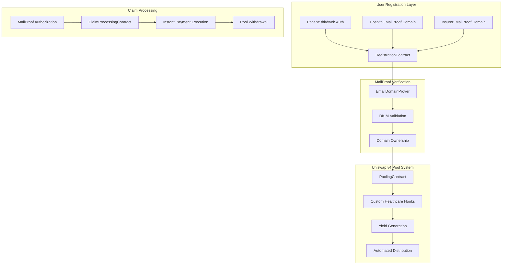
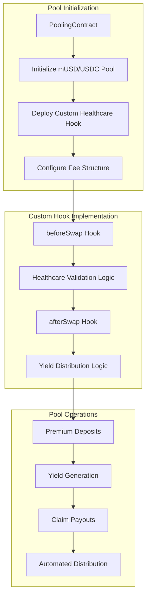
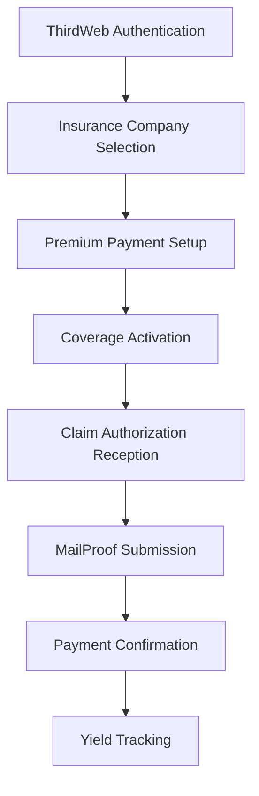
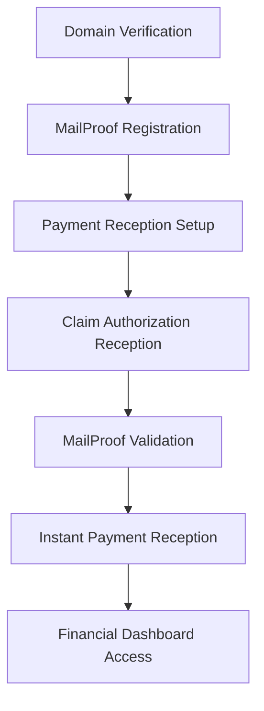
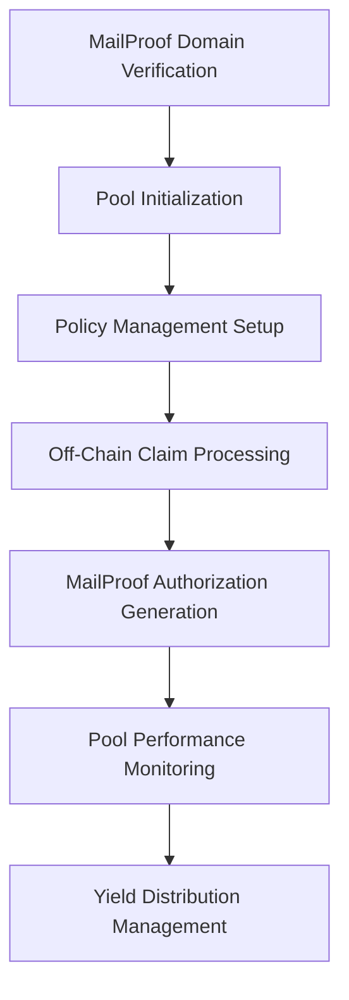
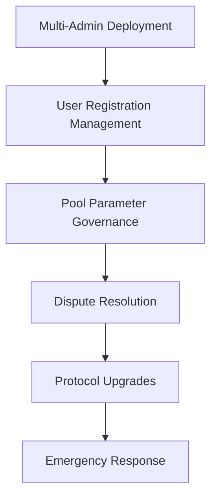
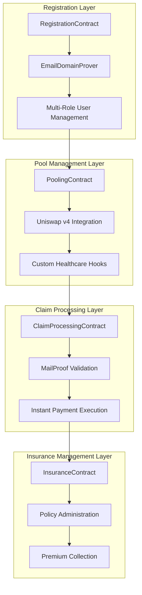
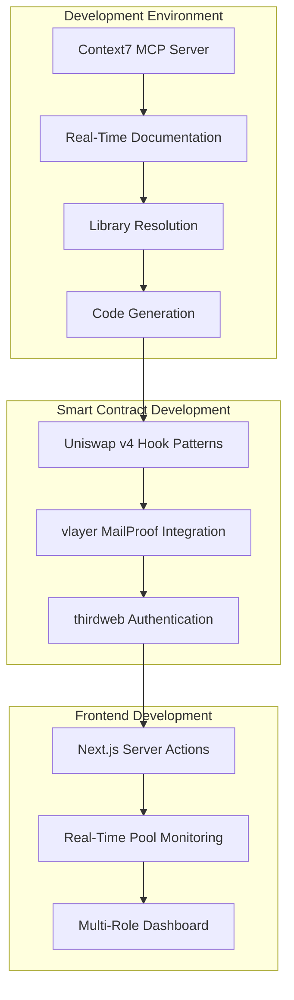
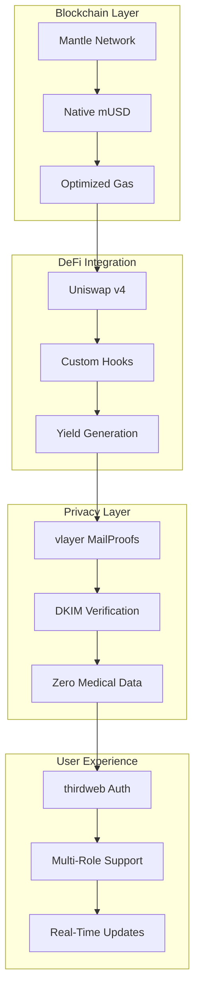

# zkMed System Patterns - Comprehensive Healthcare Platform with Uniswap v4

**Purpose**: Advanced architecture patterns enabling privacy-preserving healthcare with yield-generating Uniswap v4 pools, comprehensive vlayer MailProof verification, and multi-role user management for complete healthcare insurance automation.

---

## 🏗️ Revolutionary Healthcare Insurance Architecture

### Comprehensive Platform Pattern

**Fundamental Innovation**: First healthcare platform integrating yield-generating Uniswap v4 pools with privacy-preserving MailProof claims processing and comprehensive multi-role user management.



#### Revolutionary Benefits Matrix

| Aspect | Traditional Healthcare | Other Blockchain Platforms | zkMed Comprehensive Platform |
|--------|----------------------|----------------------------|----------------------------|
| **User Onboarding** | Complex paperwork | Basic wallet connection | Multi-role authentication with MailProof |
| **Payment Processing** | Weeks of manual processing | Basic automation | Instant MailProof-triggered payments |
| **Fund Utilization** | 0% return on idle funds | Simple staking mechanisms | Uniswap v4 yield with custom hooks |
| **Privacy Protection** | Centralized data exposure | Limited privacy features | Complete MailProof verification |
| **Admin Management** | Single admin control | Basic permissions | Multi-admin governance framework |

---

## 🎭 Multi-Role User Management Pattern

### Comprehensive Registration Architecture

**Innovation**: First healthcare platform offering role-specific registration workflows with MailProof verification for organizations and seamless authentication for patients.

#### Unified Patient Registration Pattern with thirdweb Integration

##### **Universal Pattern: thirdweb-Powered Flexible Premium Collection**
*See detailed sequence diagram in activeContext.md*

#### **Unified Web3 + MailProof Architecture with thirdweb Payment Integration**

*See detailed unified architecture diagram in activeContext.md*

**Unified Architecture Benefits**: *See detailed benefits in activeContext.md*


**Universal Patient Registration Benefits**: *See comprehensive benefits in activeContext.md and projectbrief.md*

#### Hospital Registration Pattern
*See detailed hospital registration flow in projectbrief.md*

**Hospital Registration Benefits**: *See detailed benefits in projectbrief.md*

#### Insurance Company Registration & Patient Agreement Management Patterns

*See detailed patterns and flows in projectbrief.md*

**Comprehensive Insurance Company Benefits**: *See detailed benefits and smart contract interfaces in projectbrief.md*

---

## 🔐 Enhanced MailProof Verification Architecture

*See comprehensive MailProof architecture and patterns in activeContext.md and projectbrief.md*

---

## 💰 Uniswap v4 Pool Integration Architecture

### Advanced Pool Management with Custom Healthcare Hooks

**Strategic Innovation**: Leverage Uniswap v4's advanced hook system to implement healthcare-specific pool logic while maintaining proven DeFi infrastructure.

#### Uniswap v4 Healthcare Pool Pattern


#### Healthcare-Specific Hook Implementation
```solidity
contract HealthcarePoolHook is BaseHook {
    using PoolIdLibrary for PoolKey;
    
    // Custom hook for healthcare payment validation
    function beforeSwap(
        address sender,
        PoolKey calldata key,
        IPoolManager.SwapParams calldata params,
        bytes calldata hookData
    ) external override returns (bytes4) {
        // Validate healthcare payment authorization
        require(validateMailProofPayment(hookData), "Invalid payment authorization");
        
        // Check patient coverage and pool liquidity
        require(validatePatientCoverage(sender), "Insufficient coverage");
        require(validatePoolLiquidity(params.amountSpecified), "Insufficient liquidity");
        
        return BaseHook.beforeSwap.selector;
    }
    
    // Custom hook for yield distribution
    function afterSwap(
        address sender,
        PoolKey calldata key,
        IPoolManager.SwapParams calldata params,
        BalanceDelta delta,
        bytes calldata hookData
    ) external override returns (bytes4) {
        // Trigger automated yield distribution
        distributeHealthcareYield(key, delta);
        
        // Update patient and insurer balances
        updateStakeholderBalances(sender, params, delta);
        
        // Emit healthcare-specific events
        emitHealthcarePaymentEvent(sender, params, delta);
        
        return BaseHook.afterSwap.selector;
    }
    
    // Healthcare-specific yield distribution
    function distributeHealthcareYield(PoolKey calldata key, BalanceDelta delta) internal {
        uint256 yield = calculateYield(delta);
        
        // 60% to patients (premium cost reduction)
        uint256 patientYield = (yield * 6000) / 10000;
        distributeToPatients(key, patientYield);
        
        // 20% to insurers (operational returns)
        uint256 insurerYield = (yield * 2000) / 10000;
        distributeToInsurers(key, insurerYield);
        
        // 20% to protocol treasury
        uint256 protocolYield = (yield * 2000) / 10000;
        allocateToProtocol(key, protocolYield);
    }
}
```

#### Pool Management Benefits
- **Custom Healthcare Logic**: Specialized hooks for medical payment validation
- **Automated Yield Distribution**: 60/20/20 split without manual intervention
- **Instant Liquidity**: Proven Uniswap mechanisms ensure immediate claim payouts
- **Gas Optimization**: Efficient hook implementations reduce transaction costs
- **Proven Infrastructure**: Built on battle-tested Uniswap v4 architecture

---

## 🎯 Comprehensive User Action Patterns

### Multi-Role Workflow Architecture

**Innovation**: Complete user action frameworks supporting all healthcare stakeholder roles with specialized interfaces and workflows.

#### Patient Action Flow Pattern


**Patient Action Details**:
- **Seamless Authentication**: One-click wallet connection via thirdweb
- **Flexible Insurance Selection**: Browse insurers by pool performance
- **Automated Premium Payments**: Set-and-forget monthly mUSD transfers
- **Real-time Claim Tracking**: Live status updates for submitted claims
- **Yield Monitoring**: Transparent tracking of premium cost reductions

#### Hospital Action Flow Pattern


**Hospital Action Details**:
- **Domain Authentication**: Cryptographic proof of official email domain
- **Instant Payment Setup**: Immediate access to MailProof-triggered payments
- **Cash Flow Optimization**: Real-time payment reception upon claim approval
- **Financial Tracking**: Comprehensive dashboard for payment monitoring
- **Yield Participation**: Share in pool yield based on payment volume

#### Insurer Action Flow Pattern


**Insurer Action Details**:
- **Pool Creation**: Automatic Uniswap v4 pool setup with custom hooks
- **Claim Processing**: Traditional off-chain review with on-chain automation
- **MailProof Generation**: DKIM-signed payment authorization emails
- **Performance Optimization**: Real-time pool management and optimization
- **Competitive Positioning**: Pool performance as market differentiator

#### Admin Action Flow Pattern


**Admin Action Details**:
- **Distributed Administration**: Multiple admins with role-based permissions
- **User Management**: Oversight of all registration and verification processes
- **Pool Governance**: Parameter adjustment and performance optimization
- **Emergency Controls**: Rapid response capabilities for critical situations
- **Protocol Evolution**: Coordinated upgrades and feature enhancements

---

## 🏆 Enhanced Smart Contract Architecture

### Comprehensive Contract Integration Pattern

**Innovation**: Complete smart contract suite with clear separation of concerns and enhanced integration capabilities.

#### Contract Interaction Flow


#### Enhanced Contract Interfaces

**RegistrationContract.sol - Multi-Role Management**:
```solidity
interface IEnhancedRegistrationContract {
    // Patient registration (simplified flow)
    function registerPatient(address wallet) external;
    function linkInsuranceCompany(address patient, address insurer) external;
    
    // Hospital registration (MailProof verification)
    function registerHospitalWithMailProof(bytes calldata mailProof) external;
    function validateHospitalDomain(string calldata domain) external view returns (bool);
    
    // Insurer registration (MailProof + Pool setup)
    function registerInsurerWithMailProof(bytes calldata mailProof) external;
    function initializeInsurerPool(address insurer, PoolParameters calldata params) external;
    
    // Multi-admin management
    function addAdmin(address newAdmin, AdminRole role) external;
    function removeAdmin(address admin) external;
    function updateAdminPermissions(address admin, uint256 permissions) external;
    
    // Role verification
    function getUserRole(address user) external view returns (UserRole);
    function isVerifiedHospital(address hospital) external view returns (bool);
    function isVerifiedInsurer(address insurer) external view returns (bool);
}
```

**PoolingContract.sol - Uniswap v4 Healthcare Pools**:
```solidity
interface IHealthcarePoolingContract {
    // Pool initialization with custom hooks
    function initializeHealthcarePool(
        address token0,
        address token1,
        uint24 fee,
        int24 tickSpacing,
        address hookContract
    ) external returns (PoolId);
    
    // Premium and claim operations
    function depositPremium(address patient, uint256 amount) external;
    function processClaimPayout(
        bytes calldata mailProof,
    uint256 claimId, 
        address recipient,
    uint256 amount
    ) external;
    
    // Yield management
    function distributeYield(PoolId poolId) external;
    function calculateStakeholderYield(address stakeholder) external view returns (uint256);
    function claimYield(address stakeholder) external;
    
    // Pool monitoring
    function getPoolLiquidity(PoolId poolId) external view returns (uint256);
    function getPoolPerformance(PoolId poolId) external view returns (PoolMetrics memory);
    function validatePaymentCapacity(PoolId poolId, uint256 amount) external view returns (bool);
}
```

**ClaimProcessingContract.sol - MailProof Integration**:
```solidity
interface IClaimProcessingContract {
    // Claim submission and validation
    function submitClaim(
        uint256 claimId,
        bytes calldata mailProof,
        ClaimData calldata claimData
    ) external;
    
    // MailProof verification
    function validateMailProof(bytes calldata mailProof) external view returns (bool);
    function extractPaymentInstructions(bytes calldata mailProof) external pure returns (
        address recipient,
        uint256 amount,
        address token,
        uint256 deadline
    );
    
    // Claim processing workflow
    function processValidatedClaim(uint256 claimId) external;
    function executePayout(uint256 claimId) external;
    function getClaimStatus(uint256 claimId) external view returns (ClaimStatus);
    
    // Audit and compliance
    function getClaimAuditTrail(uint256 claimId) external view returns (AuditEntry[] memory);
    function generateComplianceReport(uint256 fromTime, uint256 toTime) external view returns (ComplianceReport memory);
}
```

---

## 🔄 Context7 Integration Patterns

### Enhanced Development Workflow with Real-Time Documentation

**Innovation**: First healthcare platform integrating Context7 for real-time access to up-to-date library documentation and development best practices.

#### Context7 Development Enhancement Pattern


#### Context7 Usage Patterns

**Smart Contract Development Enhancement**:
```bash
# Get latest Uniswap v4 hook implementation patterns
use context7: "Implement Uniswap v4 beforeSwap and afterSwap hooks for healthcare payments"

# vlayer MailProof integration best practices
use context7: "Integrate vlayer MailProofs for DKIM email verification in Solidity contracts"

# Gas optimization techniques for healthcare transactions
use context7: "Optimize Solidity gas usage for healthcare payment processing contracts"
```

**Frontend Development Acceleration**:
```bash
# Next.js 15 server actions with blockchain integration
use context7: "Create Next.js server actions for Uniswap v4 pool management and monitoring"

# Real-time data fetching patterns
use context7: "Implement React Query for real-time Uniswap v4 pool data with WebSocket updates"

# Multi-role authentication and authorization
use context7: "Build role-based authentication system with thirdweb and Next.js middleware"
```

**Infrastructure and Deployment**:
```bash
# Container orchestration for complex healthcare platform
use context7: "Docker Compose setup for healthcare platform with Uniswap v4 and vlayer integration"

# Monitoring and observability for DeFi healthcare platform
use context7: "Implement comprehensive monitoring for Uniswap v4 healthcare pools with alerting"

# Security best practices for healthcare blockchain applications
use context7: "Healthcare blockchain security patterns with DKIM verification and audit trails"
```

#### Context7 Benefits for Healthcare Development
- **Up-to-Date Documentation**: Always current information on rapidly evolving DeFi protocols
- **Best Practice Integration**: Latest patterns and recommendations for secure development
- **Rapid Prototyping**: Accelerated development with proven code patterns
- **Security Enhancement**: Current security practices and vulnerability prevention
- **Performance Optimization**: Latest optimization techniques for gas efficiency

---

## 🎯 Advanced Integration Patterns

### Comprehensive System Integration Architecture

**Innovation**: Seamless integration of multiple advanced technologies creating unprecedented healthcare platform capabilities.

#### Technology Integration Matrix


#### Integration Benefits Matrix

| Technology | Healthcare Benefit | Integration Advantage | Competitive Edge |
|------------|-------------------|----------------------|------------------|
| **Uniswap v4** | Proven liquidity + custom healthcare logic | Custom hooks for specialized workflows | Only healthcare platform with advanced DeFi |
| **vlayer MailProofs** | Secure verification without data exposure | DKIM-based authentication | Privacy-preserving automation |
| **thirdweb** | Simplified user onboarding | Gas sponsorship for healthcare transactions | Seamless user experience |
| **Context7** | Accelerated development | Real-time documentation access | Rapid feature development |
| **Mantle Network** | Low-cost transactions | Native mUSD integration | Simplified financial operations |

---

## 🏆 Revolutionary Architecture Advantages

### Competitive Superiority Framework

**Comprehensive Innovation**: zkMed's architecture combines proven technologies in revolutionary ways to create unprecedented healthcare platform capabilities.

#### Technical Superiority Matrix

| Innovation Area | Traditional Healthcare | Basic Blockchain | Advanced DeFi | zkMed Comprehensive |
|----------------|----------------------|----------------|---------------|-------------------|
| **User Registration** | Manual paperwork | Basic wallet connect | Simple onboarding | Multi-role MailProof verification |
| **Payment Processing** | Weeks of delays | Basic automation | DeFi integration | Instant MailProof-triggered payouts |
| **Fund Management** | 0% returns | Basic staking | Standard yield | Uniswap v4 with custom healthcare hooks |
| **Privacy Protection** | Centralized risk | Limited privacy | Basic encryption | Complete MailProof verification |
| **Admin Governance** | Single control | Basic permissions | DAO voting | Multi-admin with specialized roles |
| **Development Speed** | Slow iterations | Standard docs | Library integration | Real-time Context7 documentation |

#### Architectural Innovation Benefits

**System-Level Advantages**:
- **Proven Infrastructure**: Built on battle-tested Uniswap v4 and vlayer protocols
- **Healthcare Specialization**: Custom hooks and logic specifically for medical payments
- **Privacy Leadership**: Advanced MailProof verification without data compromise
- **User Experience Excellence**: thirdweb integration eliminates Web3 complexity
- **Development Acceleration**: Context7 integration for rapid feature development
- **Scalable Architecture**: Container-based deployment ready for global scale

**Market Differentiation**:
- **First-Mover Position**: Only comprehensive healthcare platform with advanced DeFi integration
- **Technology Convergence**: Unique combination of proven technologies for healthcare innovation
- **Complete Solution**: End-to-end platform supporting all healthcare stakeholder roles
- **Regulatory Readiness**: MailProof audit trails support compliance requirements
- **Competitive Moat**: Complex integration creates significant barriers to entry

---

## 📚 Research Foundation & Academic Validation

zkMed's system patterns are founded on cutting-edge research validating hybrid blockchain healthcare approaches:

**Research-Validated Pattern Benefits**:
- **Enhanced Transparency**: Blockchain's decentralized ledger improves fairness and operational efficiency (Shouri & Ramezani, 2025)
- **Data Security**: Integration with EHR and insurance systems enhances security and interoperability (Implementation of Electronic Health Record, 2023)  
- **Automated Settlement**: Decentralized models enable peer-to-peer risk sharing without intermediaries (MAPFRE, 2025)
- **Fraud Reduction**: Real-time validation reduces fraudulent activities (Ncube et al., 2022)
- **Capital Efficiency**: Uniswap v4's advanced features provide gas-efficient, customizable liquidity management

---

## 📊 Summary Table of Payment Flows

| Flow Type | Agreement Formation | Payment Method | Change Management | On-Chain? | Yield Generation |
|-----------|-------------------|---------------|------------------|-----------|-----------------|
| **Unified thirdweb + MailProof + Pools** | Off-chain contract + DKIM email | thirdweb fiat-to-crypto OR direct crypto to Uniswap v4 pool | New MailProof email | Yes | Yes (3-5% APY for ALL users) |

**zkMed's revolutionary system patterns establish the foundation for the first practical implementation of universal yield-generating healthcare insurance through thirdweb's fiat-to-crypto infrastructure. This unified premium collection approach combined with hybrid claim processing delivers research-validated benefits while maintaining regulatory compliance, enabling all patients to access DeFi yield regardless of their Web3 knowledge across all healthcare stakeholder roles.** 🚀 