# zkMed System Patterns - Pool-Enabled Healthcare Architecture

**Purpose**: Comprehensive overview of the revolutionary system architecture patterns enabling privacy-preserving healthcare with yield-generating fund pools, multi-proof validation, and seamless Mantle USD integration.

---

## 🏗️ REVOLUTIONARY POOL-ENABLED ARCHITECTURE

### Core Innovation: Healthcare Fund Pools with Yield Generation

**Fundamental Innovation**: zkMed is the first healthcare platform to integrate yield-generating fund pools with privacy-preserving claims processing, delivering unprecedented capital efficiency while maintaining complete medical privacy.

#### Pool Architecture Patterns

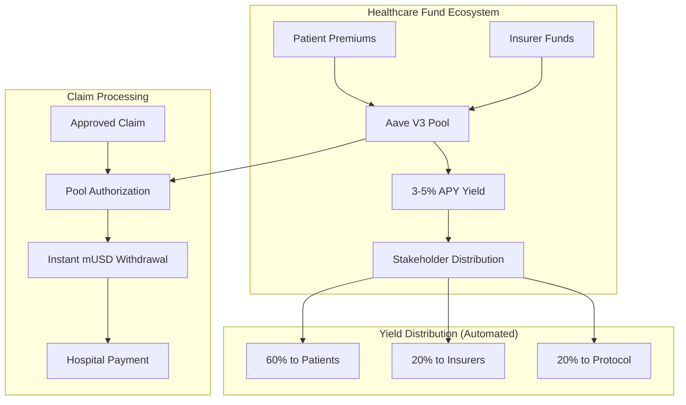

#### Advantages vs Traditional Healthcare Systems

| Aspect | Traditional Healthcare | zkMed Pool-Enabled System |
|--------|----------------------|---------------------------|
| **Fund Utilization** | Premiums sit idle in bank accounts | Funds earn 3-5% APY via Aave V3 |
| **Claim Payouts** | Weeks of processing delays | Instant withdrawals upon authorization |
| **Capital Efficiency** | 0% return on waiting funds | Maximum yield generation on all deposits |
| **Patient Benefits** | Full premium costs | Reduced effective costs via yield returns |
| **Liquidity Management** | Manual reserve management | Automated Aave protocol mechanisms |

---

## 🎭 DUAL REGISTRATION INNOVATION PATTERNS

### Flexible Patient Onboarding Architecture

**Innovation**: First healthcare platform offering dual registration paths accommodating both existing coverage and new insurance selection scenarios.

#### Registration Path A: Existing Coverage Integration
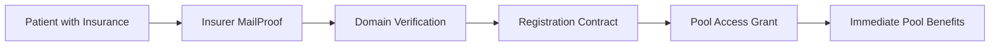

**Pattern Benefits**:
- **Zero Friction**: Existing patients get immediate platform access
- **Pool Integration**: Instant yield generation on existing coverage
- **Privacy Preservation**: No medical data exposure during verification
- **Insurer Verification**: MailProofs prevent impersonation

#### Registration Path B: Insurance Selection & Pool Creation


**Pattern Benefits**:
- **Informed Choice**: Pool performance metrics enable smart decisions
- **Competitive Market**: Insurers compete on pool yield and efficiency
- **Automated Management**: Set-and-forget monthly payment systems
- **Transparent Returns**: Real-time yield tracking and effective cost calculation

### Market Dynamics Enhancement
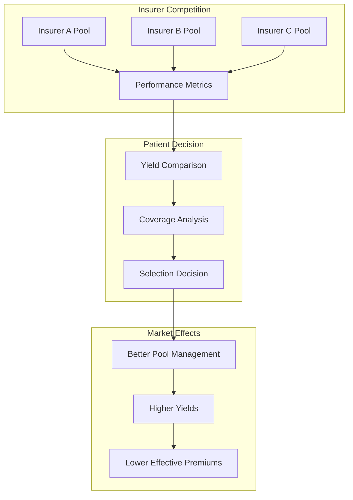

---

## 🔐 MULTI-PROOF PRIVACY ARCHITECTURE PATTERNS

### Comprehensive Privacy-Preserving Validation

**Core Pattern**: Triple-proof validation ensuring maximum security while maintaining complete medical data privacy.

#### Multi-Proof Validation Workflow
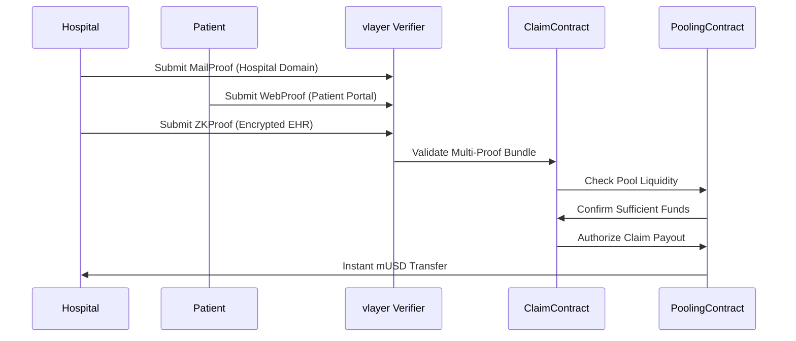

#### Proof Type Responsibilities

**1. MailProof Pattern (Organization Verification)**
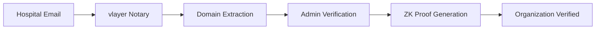

**2. WebProof Pattern (System Verification)**
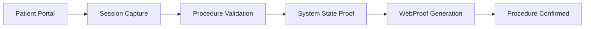

**3. ZKProof Pattern (Privacy-Preserving Validation)**
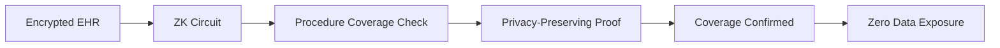

---

## 💰 NATIVE STABLECOIN ARCHITECTURE PATTERNS

### Simplified Mantle USD (mUSD) Integration

**Core Innovation**: Direct native stablecoin processing eliminates oracle dependencies and reduces system complexity while enhancing security.

#### Traditional vs zkMed Architecture Comparison

**Traditional Healthcare Payment Flow**:
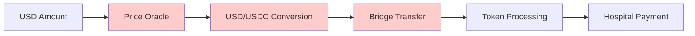

**zkMed Simplified Flow**:
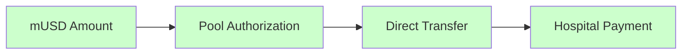

#### Technical Benefits Pattern
- **Eliminated Dependencies**: No price oracles, conversion mechanisms, or bridge risks
- **Enhanced Security**: Native asset reduces attack surface significantly
- **Lower Costs**: Direct processing eliminates multiple transaction fees
- **Faster Processing**: Instant transfers without conversion delays

#### Smart Contract Integration Pattern
```solidity
// Traditional Complex Pattern (Eliminated)
// 1. Oracle price fetch
// 2. USD to token conversion
// 3. Bridge validation
// 4. Multiple contract calls

// zkMed Simplified Pattern
function processDirectPayment(address hospital, uint256 mUSDAmount) external {
    mUSD.transferFrom(poolContract, hospital, mUSDAmount);
    emit PaymentProcessed(hospital, mUSDAmount, block.timestamp);
}
```

---

## 🚀 AAVE V3 INTEGRATION ARCHITECTURE PATTERNS

### Battle-Tested DeFi Integration for Healthcare

**Strategic Decision**: Leverage proven Aave V3 protocols for healthcare fund management rather than building custom pooling mechanisms.

#### Aave Integration Benefits Pattern
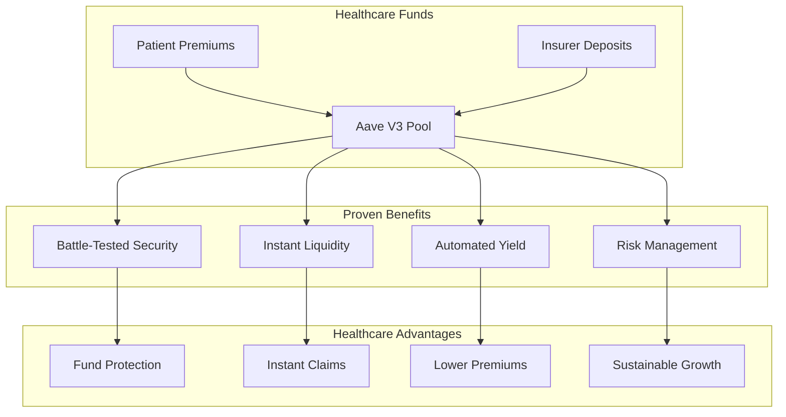

#### Technical Integration Patterns

**Pool Supply Pattern**:
```solidity
function depositToHealthcarePool(address patient, uint256 premiumAmount) external {
    // Transfer mUSD from patient
    mUSD.transferFrom(patient, address(this), premiumAmount);
    
    // Supply to Aave for yield generation
    mUSD.approve(address(aavePool), premiumAmount);
    aavePool.supply(address(mUSD), premiumAmount, address(this), 0);
    
    // Update patient pool tracking
    patientPools[patient].totalDeposited += premiumAmount;
    emit PremiumDeposited(patient, premiumAmount, block.timestamp);
}
```

**Pool Withdrawal Pattern**:
```solidity
function authorizeClaimPayout(uint256 claimId, uint256 amount) external {
    // Validate authorization
    require(validateClaim(claimId), "Invalid claim");
    
    // Instant withdrawal from Aave
    aavePool.withdraw(address(mUSD), amount, hospitalAddress);
    
    // Update pool accounting
    updatePoolBalances(claimId, amount);
    emit ClaimPaid(claimId, hospitalAddress, amount, block.timestamp);
}
```

---

## 📊 AUTOMATED YIELD DISTRIBUTION PATTERNS

### Stakeholder-Aligned Incentive Architecture

**Innovation**: Automated yield distribution system ensuring all stakeholders benefit from pool performance while maintaining sustainable platform growth.

#### Yield Distribution Architecture
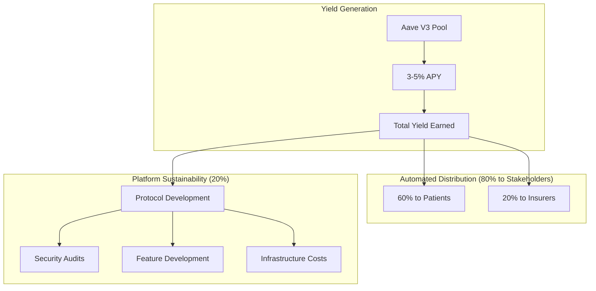

#### Distribution Logic Pattern
```solidity
function distributeYield() external {
    uint256 totalYield = calculateAccruedYield();
    
    // 80% to stakeholders, 20% to protocol
    uint256 stakeholderYield = (totalYield * 8000) / 10000;
    uint256 protocolYield = totalYield - stakeholderYield;
    
    // Stakeholder distribution: 75% patients, 25% insurers
    uint256 patientYield = (stakeholderYield * 7500) / 10000;
    uint256 insurerYield = stakeholderYield - patientYield;
    
    // Automated proportional distribution
    distributeToPatients(patientYield);
    distributeToInsurers(insurerYield);
    allocateToProtocol(protocolYield);
}
```

---

## 🔄 SEAMLESS CLAIMS PROCESSING PATTERNS

### Pool-Enabled Instant Authorization Workflow

**Revolutionary Pattern**: Claims authorization automatically triggers pool withdrawals, enabling instant hospital payments while maintaining all privacy guarantees.

#### Complete Claims Processing Flow
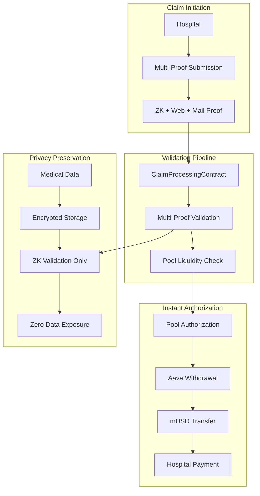

#### Claim Authorization Pattern
```solidity
function processClaimWithPoolAuth(
    uint256 claimId,
    bytes memory multiProof,
    uint256 requestedAmount
) external {
    // 1. Validate all proof types
    require(validateMultiProof(multiProof), "Invalid proof bundle");
    
    // 2. Check pool liquidity
    require(poolingContract.validateLiquidity(requestedAmount), "Insufficient funds");
    
    // 3. Authorize instant payout
    poolingContract.authorizeClaimPayout(claimId, msg.sender, requestedAmount);
    
    // 4. Update claim status
    claims[claimId].status = ClaimStatus.Paid;
    claims[claimId].paymentTimestamp = block.timestamp;
    
    emit ClaimProcessedInstantly(claimId, msg.sender, requestedAmount);
}
```

---

## 🎯 LOCAL FORK DEVELOPMENT PATTERNS

### Comprehensive Mantle Testing Environment

**Development Philosophy**: Local-first development with comprehensive Mantle fork testing ensures reliable deployment to mainnet with minimal risk.

#### Development Environment Architecture
```mermaid
graph TB
    subgraph "Development Stack"
        A[Mantle Fork (31339)] --> B[Real Mainnet State]
        B --> C[Aave V3 Contracts]
        B --> D[mUSD Token]
        B --> E[thirdweb Integration]
    end
    
    subgraph "Testing Framework"
        F[Foundry Suite] --> G[Unit Tests]
        F --> H[Integration Tests]
        F --> I[E2E Tests]
        F --> J[Gas Optimization]
    end
    
    subgraph "Deployment Pipeline"
        K[Local Testing] --> L[Fork Validation]
        L --> M[Security Audit]
        M --> N[Mainnet Deployment]
    end
    
    A --> F
    I --> K
```

#### Testing Pattern Implementation
```bash
# Complete testing workflow
make start-mantle-fork     # Start local Mantle environment
make deploy-contracts      # Deploy all contracts to fork
make setup-aave-pools     # Configure Aave V3 integration
make test-registration    # Test dual registration paths
make test-pool-operations # Test pool deposits and withdrawals
make test-claims-flow     # Test end-to-end claim processing
make test-yield-generation # Test automated yield distribution
```

---

## ✨ INNOVATION PATTERN HIGHLIGHTS

### Breakthrough Architecture Combinations

#### 1. **Privacy + Yield Generation Pattern**
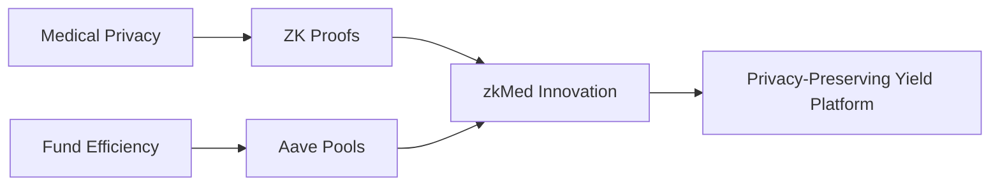

#### 2. **Dual Registration + Pool Integration Pattern**
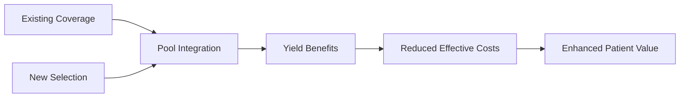

#### 3. **Multi-Proof + Instant Payout Pattern**
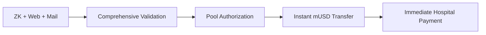

#### 4. **Native Asset + Simplified Processing Pattern**
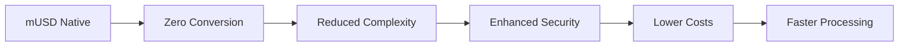

---

## 🏆 COMPETITIVE ARCHITECTURE ADVANTAGES

### Unique System Design Benefits

#### Technical Superiority Matrix

| Innovation Area | Traditional Healthcare | Other Web3 Platforms | zkMed Pool-Enabled |
|----------------|----------------------|---------------------|-------------------|
| **Fund Utilization** | 0% return on premiums | Basic staking (~2%) | 3-5% Aave yields |
| **Payment Speed** | Weeks of delays | Days for processing | Instant upon approval |
| **Medical Privacy** | Centralized databases | Limited privacy features | Zero-knowledge proofs |
| **Registration Flexibility** | Single path only | Basic onboarding | Dual-path innovation |
| **Oracle Dependencies** | N/A (traditional) | Complex price feeds | Zero dependencies |
| **Pool Integration** | None | Custom solutions | Battle-tested Aave |

#### Market Positioning Advantages
- **First-Mover**: Only healthcare platform with yield-generating pools
- **Proven Technology**: Built on battle-tested Aave V3 protocols
- **Privacy Leadership**: Advanced multi-proof validation architecture
- **User Experience**: Dual registration paths accommodate all scenarios
- **Economic Model**: Sustainable yield distribution benefiting all stakeholders

---

## 🎯 ARCHITECTURAL SUCCESS METRICS

### System Performance Indicators

#### Pool Performance Metrics
- ✅ **Yield Generation**: Target 3-5% APY on all healthcare funds
- ✅ **Instant Liquidity**: 100% claim authorization success rate
- ✅ **Yield Distribution**: Automated 60/20/20 stakeholder allocation
- ✅ **Pool Utilization**: Optimal balance of deposits vs withdrawals

#### Privacy Preservation Metrics
- ✅ **Zero Data Exposure**: No medical information leaked during processing
- ✅ **Multi-Proof Validation**: 100% proof verification success rate
- ✅ **Privacy-Preserving Yields**: Tracking without compromising anonymity

#### Platform Efficiency Metrics
- ✅ **Processing Speed**: Instant claim authorization and payout
- ✅ **Cost Reduction**: Lower effective premiums through yield generation
- ✅ **User Experience**: Seamless registration and payment automation
- ✅ **Market Competition**: Insurer optimization driven by pool performance

**zkMed's revolutionary pool-enabled architecture patterns establish the foundation for the world's first privacy-preserving healthcare platform with yield-generating fund pools, setting new standards for both capital efficiency and medical privacy in Web3 healthcare innovation!** 🚀 