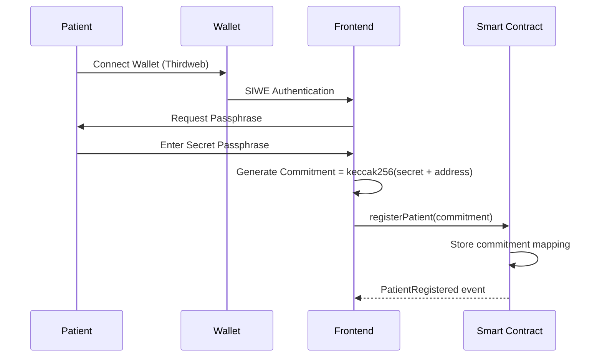
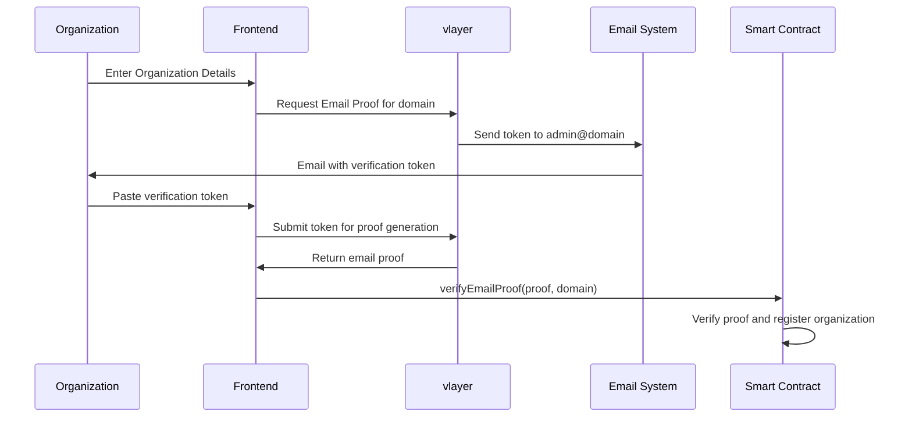

# System Patterns - zkMed Technical Architecture

## Overall Architecture Pattern

### Multi-Layer Privacy-First Design

zkMed implements a **Layered Privacy Architecture** where each layer maintains specific privacy guarantees:

```
┌─────────────────────────────────────────────────────────────┐
│                    Application Layer                        │
│  ┌─────────────────┐  ┌─────────────────┐  ┌─────────────┐ │
│  │   Next.js UI    │  │  Thirdweb Auth  │  │   Mobile    │ │
│  │   Components    │  │   (SIWE)        │  │    PWA      │ │
│  └─────────────────┘  └─────────────────┘  └─────────────┘ │
└─────────────────────────────────────────────────────────────┘
┌─────────────────────────────────────────────────────────────┐
│                   Integration Layer                         │
│  ┌─────────────────┐  ┌─────────────────┐  ┌─────────────┐ │
│  │ Server Actions  │  │  vlayer Client  │  │    Flare    │ │
│  │  (Private RPC)  │  │ (Email Proofs)  │  │  Oracles    │ │
│  └─────────────────┘  └─────────────────┘  └─────────────┘ │
└─────────────────────────────────────────────────────────────┘
┌─────────────────────────────────────────────────────────────┐
│                   Blockchain Layer                          │
│  ┌─────────────────┐  ┌─────────────────┐  ┌─────────────┐ │
│  │ Registration    │  │     Claims      │  │   Merits    │ │
│  │   Contract      │  │   Contract      │  │  Contract   │ │
│  └─────────────────┘  └─────────────────┘  └─────────────┘ │
└─────────────────────────────────────────────────────────────┘
```

## Core Smart Contract Patterns

### 1. Role-Based Access Control (RBAC)

```solidity
// Base pattern for all contracts
contract RoleBasedContract {
    enum Role { Patient, Hospital, Insurer, Admin }
    
    mapping(address => Role) public roles;
    mapping(address => bool) public verified;
    
    modifier onlyRole(Role _role) {
        require(roles[msg.sender] == _role, "Unauthorized role");
        require(verified[msg.sender], "Address not verified");
        _;
    }
}
```

**Key Design Decisions:**
- Single role per address for clarity
- Verification requirement separate from role assignment
- Immutable once set (prevents role hijacking)

### 2. Commitment-Reveal Pattern for Privacy

```solidity
contract PrivacyCommitment {
    mapping(address => bytes32) public commitments;
    
    function registerPatient(bytes32 _commitment) external {
        require(commitments[msg.sender] == bytes32(0), "Already registered");
        commitments[msg.sender] = _commitment;
        emit PatientRegistered(msg.sender, _commitment);
    }
    
    // Local computation: keccak256(abi.encodePacked(secret, msg.sender))
    function verifyCommitment(string memory _secret) external view returns (bool) {
        bytes32 computed = keccak256(abi.encodePacked(_secret, msg.sender));
        return commitments[msg.sender] == computed;
    }
}
```

**Privacy Guarantees:**
- No personal data stored on-chain
- Only patient can reveal their commitment
- Secret remains local to patient's device

### 3. Event-Driven Audit Trail

```solidity
contract AuditableContract {
    event OrganizationRegistered(
        address indexed organization,
        string domain,
        Role role,
        uint256 timestamp
    );
    
    event ClaimSubmitted(
        address indexed patient,
        bytes32 indexed claimHash,
        uint256 timestamp
    );
    
    event ClaimProcessed(
        bytes32 indexed claimHash,
        bool approved,
        uint256 amount,
        uint256 timestamp
    );
}
```

**Audit Benefits:**
- Complete transaction history
- No personal data in events
- Blockchain-native immutability
- Easy indexing for analytics

## vlayer Integration Patterns

### 1. Email Proof Architecture

```typescript
// vlayer email proof workflow
class EmailProofService {
    async generateEmailProof(domain: string): Promise<EmailProofData> {
        // 1. vlayer sends email token to admin@domain
        const emailToken = await vlayer.sendEmailToken(`admin@${domain}`);
        
        // 2. User pastes token back
        const userProvidedToken = await this.getUserInput();
        
        // 3. Generate proof without exposing email
        const proof = await vlayer.generateEmailProof({
            domain,
            token: userProvidedToken,
            claimedEmail: `admin@${domain}`
        });
        
        return proof;
    }
}
```

**Privacy Preservation:**
- Email address never stored on-chain
- Only domain ownership proven
- vlayer handles sensitive email interaction

### 2. Web Proof Pattern (Future)

```solidity
contract DomainVerifier {
    mapping(address => string) public verifiedDomains;
    
    function verifyDomainWithWebProof(
        Proof calldata webProof,
        string calldata domain
    ) external onlyVerified(VLAYER_WEB_PROVER, WebProver.verifyDomain.selector) {
        // vlayer web proof confirms domain still hosts expected JSON
        verifiedDomains[msg.sender] = domain;
        emit DomainVerified(msg.sender, domain);
    }
}
```

## Data Flow Patterns

### 1. Patient Registration Flow



**Security Properties:**
- Secret never leaves patient's device
- On-chain commitment provides verifiable identity
- No reversible data stored publicly

### 2. Organization Verification Flow



## State Management Patterns

### 1. On-Chain State Minimization

```solidity
contract RegistrationContract {
    // STORE: Only essential verification data
    mapping(address => bytes32) public patientCommitments;
    mapping(address => string) public organizationDomains;
    mapping(address => Role) public roles;
    
    // DON'T STORE: Personal data, email addresses, medical records
    // EMIT EVENTS: For off-chain indexing and analytics
}
```

### 2. Off-Chain Data Coordination

```typescript
// Server-side coordination without exposing private keys
class ContractInteraction {
    async submitTransaction(
        userAddress: string,
        contractCall: ContractCall
    ): Promise<TransactionResult> {
        // Use server's RPC endpoint (private)
        const result = await this.ethClient.writeContract({
            address: contractCall.address,
            abi: contractCall.abi,
            functionName: contractCall.functionName,
            args: contractCall.args,
            account: userAddress // User signs, server submits
        });
        
        return result;
    }
}
```

## Error Handling Patterns

### 1. Graceful Proof Failures

```solidity
contract ProofVerifier {
    function verifyEmailProof(
        Proof calldata proof,
        string calldata domain
    ) external {
        try this.vlayerVerify(proof) {
            // Success path: register organization
            _registerOrganization(msg.sender, domain);
        } catch Error(string memory reason) {
            // Graceful failure: emit event for retry
            emit ProofVerificationFailed(msg.sender, domain, reason);
            revert(string(abi.encodePacked("Proof failed: ", reason)));
        }
    }
}
```

### 2. Frontend Error Recovery

```typescript
class ClaimSubmissionService {
    async submitClaim(claimData: ClaimData): Promise<ClaimResult> {
        try {
            // Attempt primary flow
            return await this.submitWithProof(claimData);
        } catch (ProofGenerationError) {
            // Fallback: queue for manual review
            return await this.queueForManualReview(claimData);
        } catch (NetworkError) {
            // Retry mechanism
            return await this.retryWithBackoff(claimData);
        }
    }
}
```

## Gas Optimization Patterns

### 1. Batch Operations

```solidity
contract GasOptimizedClaims {
    struct ClaimBatch {
        bytes32[] claimHashes;
        uint256[] amounts;
        bool[] approvals;
    }
    
    function processBatchClaims(ClaimBatch calldata batch) external {
        require(
            batch.claimHashes.length == batch.amounts.length &&
            batch.amounts.length == batch.approvals.length,
            "Mismatched batch lengths"
        );
        
        for (uint256 i = 0; i < batch.claimHashes.length; i++) {
            _processSingleClaim(
                batch.claimHashes[i],
                batch.amounts[i],
                batch.approvals[i]
            );
        }
    }
}
```

### 2. Storage Optimization

```solidity
contract StorageOptimized {
    // Pack multiple values into single storage slot
    struct PackedRegistration {
        address user;      // 20 bytes
        uint32 timestamp;  // 4 bytes
        Role role;         // 1 byte (enum)
        bool verified;     // 1 byte
        // Total: 26 bytes < 32 bytes (1 storage slot)
    }
    
    mapping(bytes32 => PackedRegistration) public registrations;
}
```

## Integration Patterns

### 1. Oracle Integration (Flare)

```solidity
contract FlareIntegration {
    IFlarePriceOracle public priceOracle;
    IFlareDataConnector public dataConnector;
    
    function getClaimCost(
        string calldata procedureCode
    ) external view returns (uint256) {
        // Get current market price for procedure
        uint256 baseCost = dataConnector.getDataFeed("MEDICAL_PROCEDURES", procedureCode);
        
        // Apply regional cost adjustments
        uint256 adjustment = priceOracle.getPrice("HEALTHCARE_CPI");
        
        return (baseCost * adjustment) / 1e18;
    }
}
```

### 2. Merit System Integration (Blockscout)

```typescript
class MeritSystemClient {
    async creditMerits(userAddress: string, amount: number): Promise<void> {
        // 1. Mint merit tokens on-chain
        await this.meritContract.mint(userAddress, amount);
        
        // 2. Notify Blockscout for indexing
        await this.blockscoutApi.notifyMeritUpdate({
            address: userAddress,
            amount: amount,
            reason: 'CLAIM_PROCESSED'
        });
    }
    
    async getMeritsBalance(userAddress: string): Promise<number> {
        // Query Blockscout API for formatted display
        const balance = await this.blockscoutApi.getMeritsBalance(userAddress);
        return balance.totalMerits;
    }
}
```

## Security Patterns

### 1. Reentrancy Protection

```solidity
contract ReentrancyGuarded {
    uint256 private constant _NOT_ENTERED = 1;
    uint256 private constant _ENTERED = 2;
    uint256 private _status;
    
    modifier nonReentrant() {
        require(_status != _ENTERED, "ReentrancyGuard: reentrant call");
        _status = _ENTERED;
        _;
        _status = _NOT_ENTERED;
    }
    
    function processClaimPayout(bytes32 claimHash) external nonReentrant {
        // Safe payout logic
        _transferFunds(claimHash);
    }
}
```

### 2. Access Control Layering

```solidity
contract LayeredAccessControl {
    modifier onlyVerifiedInsurer() {
        require(roles[msg.sender] == Role.Insurer, "Not insurer");
        require(verified[msg.sender], "Not verified");
        require(block.timestamp <= verificationExpiry[msg.sender], "Verification expired");
        _;
    }
}
```

## Testing Patterns

### 1. Proof Testing Strategy

```typescript
describe('vlayer Email Proof Integration', () => {
    it('should verify valid domain ownership', async () => {
        // Mock vlayer response
        const mockProof = generateMockEmailProof('example.com');
        
        // Test contract verification
        const result = await registrationContract.verifyEmailProof(
            mockProof,
            'example.com'
        );
        
        expect(result).to.emit('OrganizationRegistered');
    });
});
```

### 2. Privacy Testing

```typescript
describe('Privacy Guarantees', () => {
    it('should never expose personal data on-chain', async () => {
        const secret = 'patient-secret-123';
        const commitment = generateCommitment(secret, patientAddress);
        
        await registrationContract.registerPatient(commitment);
        
        // Verify no personal data in storage
        const onChainData = await getAllContractStorage(registrationContract);
        expect(onChainData).to.not.include(secret);
        expect(onChainData).to.not.include('patient-secret');
    });
});
```

These patterns establish a robust, privacy-preserving architecture that can scale with the platform's growth while maintaining security and user trust. 