# zkMed System Patterns - Comprehensive Healthcare Platform with Uniswap v4

**Purpose**: Advanced architecture patterns enabling privacy-preserving healthcare with yield-generating Uniswap v4 pools, comprehensive vlayer MailProof verification, and multi-role user management for complete healthcare insurance automation.

---

## 🏗️ Revolutionary Healthcare Insurance Architecture

### Comprehensive Platform Pattern

**Fundamental Innovation**: First healthcare platform integrating yield-generating Uniswap v4 pools with privacy-preserving MailProof claims processing and comprehensive multi-role user management.

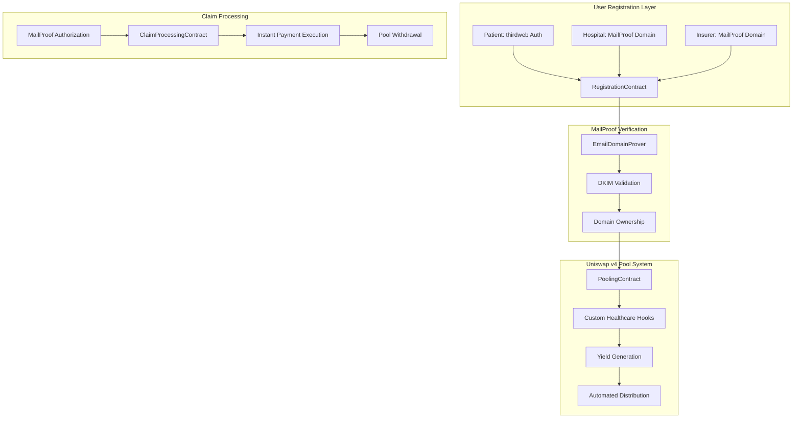

#### Revolutionary Benefits Matrix

| Aspect | Traditional Healthcare | Other Blockchain Platforms | zkMed Comprehensive Platform |
|--------|----------------------|----------------------------|----------------------------|
| **User Onboarding** | Complex paperwork | Basic wallet connection | Multi-role authentication with MailProof |
| **Payment Processing** | Weeks of manual processing | Basic automation | Instant MailProof-triggered payments |
| **Fund Utilization** | 0% return on idle funds | Simple staking mechanisms | Uniswap v4 yield with custom hooks |
| **Privacy Protection** | Centralized data exposure | Limited privacy features | Complete MailProof verification |
| **Admin Management** | Single admin control | Basic permissions | Multi-admin governance framework |

---

## 🎭 Multi-Role User Management Pattern

### Comprehensive Registration Architecture

**Innovation**: First healthcare platform offering role-specific registration workflows with MailProof verification for organizations and seamless authentication for patients.

#### Comprehensive Patient Registration Patterns

##### **Pattern A: Pure Web2 Registration with MailProof Verification**
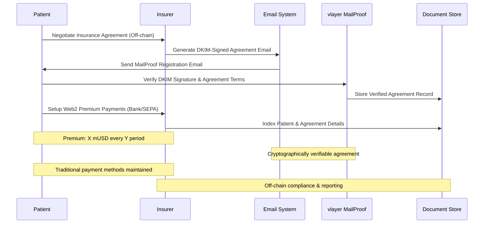

##### **Pattern B: Web3 Payment Registration with MailProof and Smart Contract Integration**
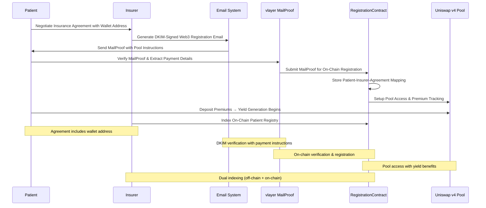

**Comprehensive Patient Registration Benefits**:

**Pure Web2 Flow Advantages**:
- **Legal Verification**: MailProof serves as cryptographically verifiable legal record
- **Familiar Process**: Traditional payment methods (bank transfer, SEPA, direct debit)
- **Timestamped Audit**: DKIM-signed emails provide immutable dispute resolution records
- **Easy Updates**: Insurers modify terms via new MailProof emails
- **Regulatory Alignment**: Web2 payments comply with existing financial regulations
- **No Blockchain Dependency**: Works without wallet or blockchain knowledge

**Web3 Enhanced Flow Advantages**:
- **Yield Generation**: Premium deposits immediately earn returns in Uniswap v4 pools
- **Cost Reduction**: Yield reduces effective premium costs over time
- **Instant Verification**: Cryptographic proof of coverage and payment capacity
- **Automated Tracking**: Real-time on-chain monitoring of payments and yields
- **Smart Contract Security**: Terms secured by blockchain with MailProof authentication
- **Transparent Performance**: Pool metrics provide insurer performance comparison

#### Hospital Registration Pattern
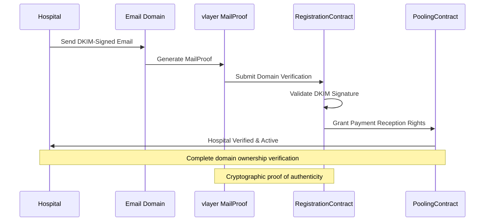

**Hospital Registration Benefits**:
- **Domain Verification**: Cryptographic proof of official email domain
- **Payment Authorization**: Immediate access to instant payment reception
- **Fraud Prevention**: DKIM signature validation prevents impersonation
- **Audit Trail**: Complete verification history for compliance

#### Insurance Company Registration & Patient Agreement Management Patterns

##### **Core Insurer Registration Pattern**
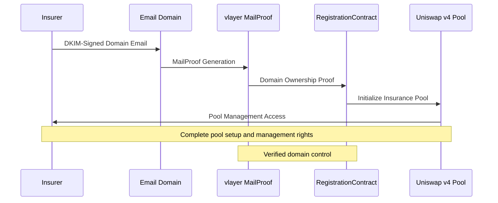

##### **Patient Agreement Management Pattern**
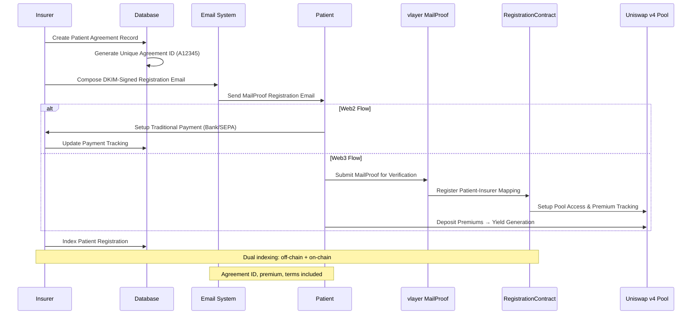

##### **Agreement Update & Modification Pattern**
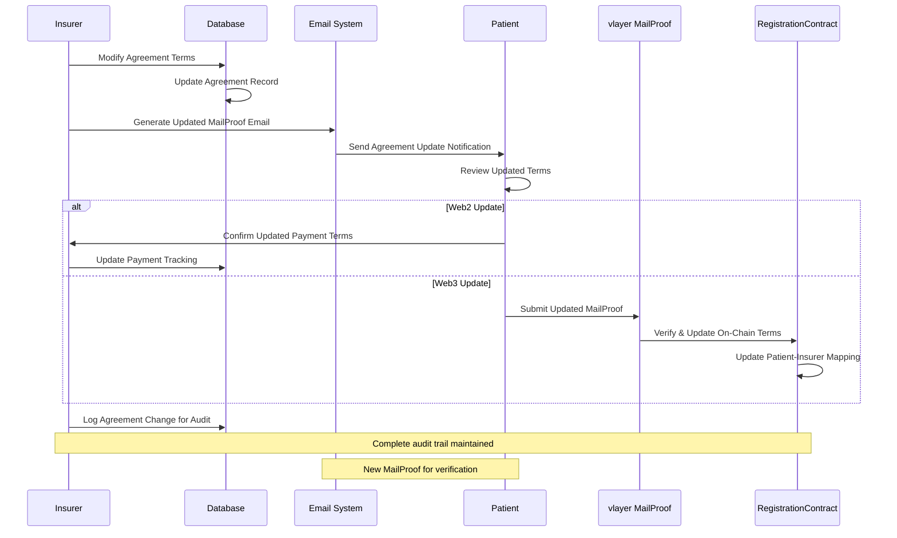

**Comprehensive Insurance Company Benefits**:

**Registration & Setup**:
- **Domain Verification**: Cryptographic proof of organizational authenticity
- **Pool Initialization**: Automatic Uniswap v4 healthcare pool creation
- **Payment Infrastructure**: Authority to issue MailProof payment authorizations
- **Multi-Patient Management**: Scalable patient agreement infrastructure

**Patient Agreement Management**:
- **Dual Flow Support**: Manage both Web2 and Web3 patient registrations
- **Unique Agreement IDs**: Traceable identifiers (e.g., A12345) for all patient agreements
- **On-Chain Integration**: Patient-insurer mappings stored in smart contracts
- **Off-Chain Indexing**: Comprehensive database for compliance and reporting
- **Real-Time Updates**: Modify agreement terms via new MailProof verification

**Example MailProof Registration Email Structure**:
```
From: contracts@insuranceco.com
To: patient@example.com
Subject: Insurance Agreement Registration – Policy #A12345

Agreement Details:
- Agreement ID: A12345
- Premium: 100 mUSD
- Payment Period: Monthly
- Coverage: Standard Health Plan
- Patient Wallet: 0x1234...abcd (Web3 flow only)
- Pool Instructions: Deposit to healthcare pool for yield

[DKIM-signed cryptographic verification]
```

**Smart Contract Integration Features**:
```solidity
// Insurance Agreement Management Interface
interface IInsuranceAgreementManager {
    // Patient registration with MailProof
    function registerPatientWithMailProof(
        bytes calldata mailProof,
        string calldata agreementId,
        address patientWallet
    ) external;
    
    // Update agreement terms
    function updateAgreementTerms(
        bytes calldata mailProof,
        string calldata agreementId,
        AgreementTerms calldata newTerms
    ) external;
    
    // Query functions
    function getPatientAgreement(address patient) external view returns (Agreement memory);
    function getInsurerPatients(address insurer) external view returns (address[] memory);
    function indexPatientAgreements(address insurer) external view returns (Agreement[] memory);
    
    // Event logging for transparency
    event PatientRegistered(address indexed patient, address indexed insurer, string agreementId);
    event AgreementUpdated(address indexed patient, string agreementId, uint256 timestamp);
}
```

---

## 🔐 Enhanced MailProof Verification Architecture

### Comprehensive DKIM-Based Authentication Pattern

**Core Innovation**: vlayer MailProof integration ensuring maximum security while maintaining complete medical data privacy through cryptographically verifiable email authentication.

#### Comprehensive Web2/Web3 Hybrid Claim Authorization Pattern

**Innovation**: First healthcare platform implementing hybrid Web2/Web3 claim processing that maintains regulatory compliance while adding blockchain automation.

#### **Web2 (Off-Chain) Traditional Insurance Processing**
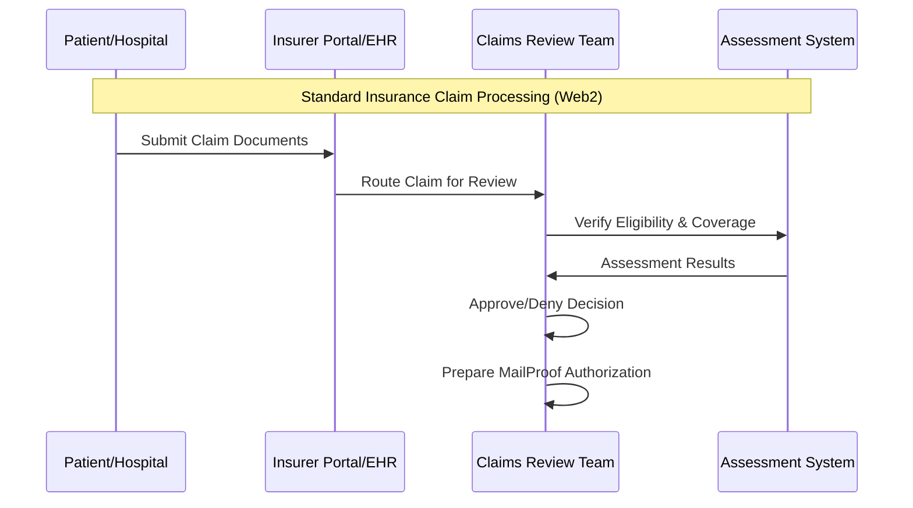

#### **Web3 (On-Chain) zkMed Payment Automation**
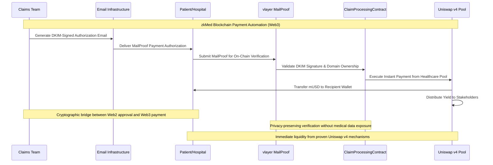

#### Hybrid Flow Benefits & Industry Integration

**Regulatory Compliance Strategy**:
- **Existing Workflow Preservation**: Insurers maintain current claim review processes off-chain
- **Privacy Law Compliance**: Medical data remains in traditional systems, never exposed on-chain
- **Audit Trail Continuity**: Complete documentation from Web2 review through Web3 execution
- **Industry Standards**: Compatible with GDPR, HIPAA, and existing insurance regulations

**Technology Integration Benefits**:
- **Seamless Adoption**: No disruption to existing insurer operations and workflows
- **Gradual Migration**: Insurers can integrate zkMed without replacing existing systems
- **Risk Mitigation**: Traditional approval processes minimize regulatory and operational risks
- **Enhanced Efficiency**: Blockchain automation only for payment execution, not sensitive data

#### Enhanced MailProof Security Architecture
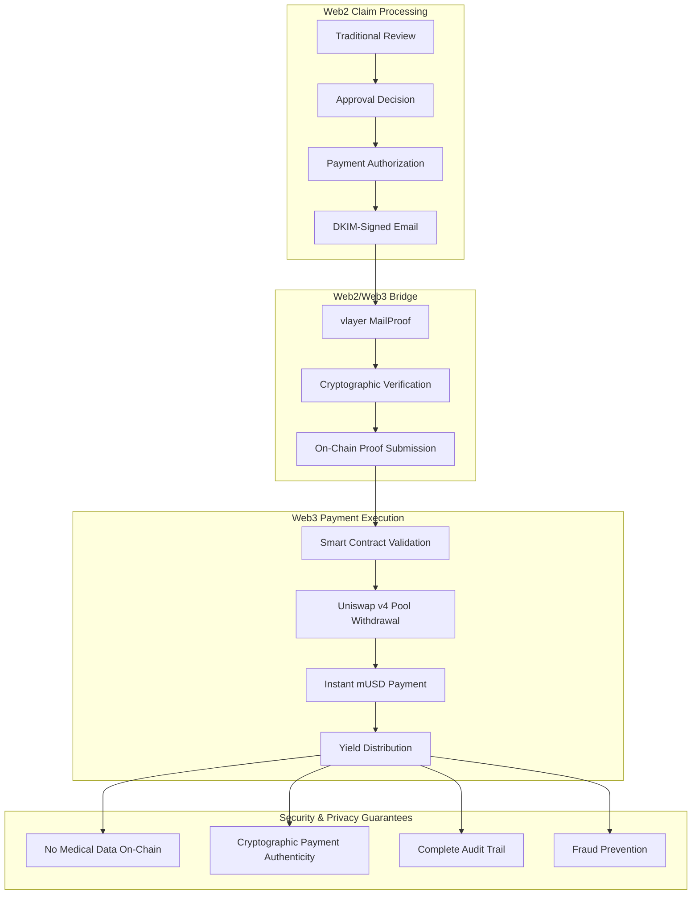

#### MailProof Integration Benefits

**Enhanced Security Features**:
- **DKIM Signature Validation**: Cryptographic proof of email authenticity
- **Domain Ownership Verification**: Ensures emails originate from verified healthcare organizations
- **Payment Instruction Extraction**: Structured data parsing without exposing medical content
- **Replay Attack Prevention**: Email hash tracking prevents duplicate submissions
- **Complete Audit Trail**: Full verification history for regulatory compliance

**Privacy Preservation Mechanisms**:
- **Medical Data Isolation**: Healthcare details never transmitted or stored on-chain
- **Payment-Only Processing**: Only financial authorization data extracted from emails
- **Encrypted Communication**: Email content remains encrypted throughout process
- **Zero Knowledge Architecture**: Verification without revealing sensitive information

---

## 💰 Uniswap v4 Pool Integration Architecture

### Advanced Pool Management with Custom Healthcare Hooks

**Strategic Innovation**: Leverage Uniswap v4's advanced hook system to implement healthcare-specific pool logic while maintaining proven DeFi infrastructure.

#### Uniswap v4 Healthcare Pool Pattern
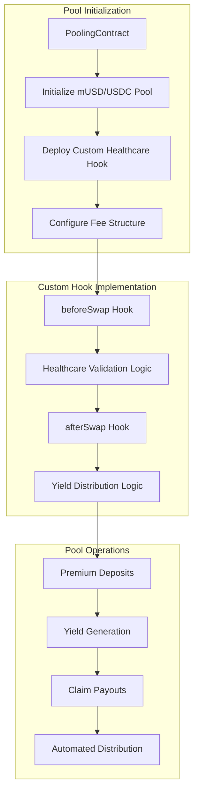

#### Healthcare-Specific Hook Implementation
```solidity
contract HealthcarePoolHook is BaseHook {
    using PoolIdLibrary for PoolKey;
    
    // Custom hook for healthcare payment validation
    function beforeSwap(
        address sender,
        PoolKey calldata key,
        IPoolManager.SwapParams calldata params,
        bytes calldata hookData
    ) external override returns (bytes4) {
        // Validate healthcare payment authorization
        require(validateMailProofPayment(hookData), "Invalid payment authorization");
        
        // Check patient coverage and pool liquidity
        require(validatePatientCoverage(sender), "Insufficient coverage");
        require(validatePoolLiquidity(params.amountSpecified), "Insufficient liquidity");
        
        return BaseHook.beforeSwap.selector;
    }
    
    // Custom hook for yield distribution
    function afterSwap(
        address sender,
        PoolKey calldata key,
        IPoolManager.SwapParams calldata params,
        BalanceDelta delta,
        bytes calldata hookData
    ) external override returns (bytes4) {
        // Trigger automated yield distribution
        distributeHealthcareYield(key, delta);
        
        // Update patient and insurer balances
        updateStakeholderBalances(sender, params, delta);
        
        // Emit healthcare-specific events
        emitHealthcarePaymentEvent(sender, params, delta);
        
        return BaseHook.afterSwap.selector;
    }
    
    // Healthcare-specific yield distribution
    function distributeHealthcareYield(PoolKey calldata key, BalanceDelta delta) internal {
        uint256 yield = calculateYield(delta);
        
        // 60% to patients (premium cost reduction)
        uint256 patientYield = (yield * 6000) / 10000;
        distributeToPatients(key, patientYield);
        
        // 20% to insurers (operational returns)
        uint256 insurerYield = (yield * 2000) / 10000;
        distributeToInsurers(key, insurerYield);
        
        // 20% to protocol treasury
        uint256 protocolYield = (yield * 2000) / 10000;
        allocateToProtocol(key, protocolYield);
    }
}
```

#### Pool Management Benefits
- **Custom Healthcare Logic**: Specialized hooks for medical payment validation
- **Automated Yield Distribution**: 60/20/20 split without manual intervention
- **Instant Liquidity**: Proven Uniswap mechanisms ensure immediate claim payouts
- **Gas Optimization**: Efficient hook implementations reduce transaction costs
- **Proven Infrastructure**: Built on battle-tested Uniswap v4 architecture

---

## 🎯 Comprehensive User Action Patterns

### Multi-Role Workflow Architecture

**Innovation**: Complete user action frameworks supporting all healthcare stakeholder roles with specialized interfaces and workflows.

#### Patient Action Flow Pattern
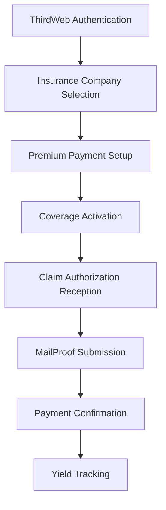

**Patient Action Details**:
- **Seamless Authentication**: One-click wallet connection via thirdweb
- **Flexible Insurance Selection**: Browse insurers by pool performance
- **Automated Premium Payments**: Set-and-forget monthly mUSD transfers
- **Real-time Claim Tracking**: Live status updates for submitted claims
- **Yield Monitoring**: Transparent tracking of premium cost reductions

#### Hospital Action Flow Pattern
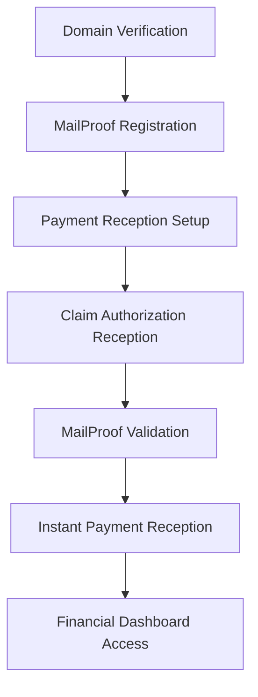

**Hospital Action Details**:
- **Domain Authentication**: Cryptographic proof of official email domain
- **Instant Payment Setup**: Immediate access to MailProof-triggered payments
- **Cash Flow Optimization**: Real-time payment reception upon claim approval
- **Financial Tracking**: Comprehensive dashboard for payment monitoring
- **Yield Participation**: Share in pool yield based on payment volume

#### Insurer Action Flow Pattern
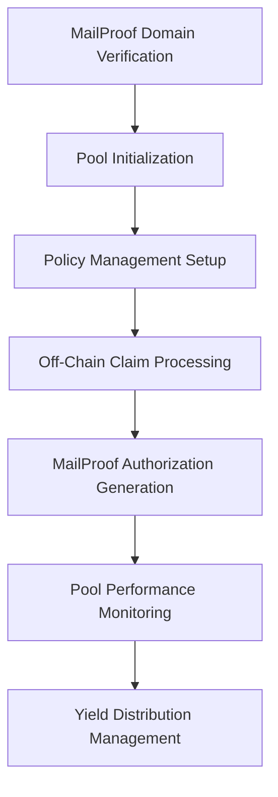

**Insurer Action Details**:
- **Pool Creation**: Automatic Uniswap v4 pool setup with custom hooks
- **Claim Processing**: Traditional off-chain review with on-chain automation
- **MailProof Generation**: DKIM-signed payment authorization emails
- **Performance Optimization**: Real-time pool management and optimization
- **Competitive Positioning**: Pool performance as market differentiator

#### Admin Action Flow Pattern
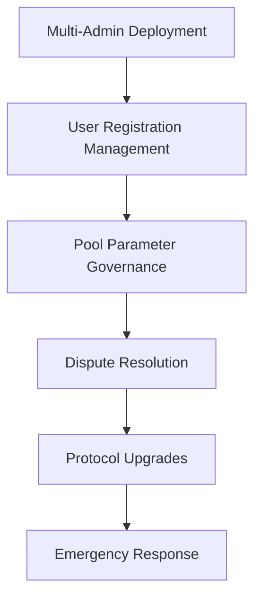

**Admin Action Details**:
- **Distributed Administration**: Multiple admins with role-based permissions
- **User Management**: Oversight of all registration and verification processes
- **Pool Governance**: Parameter adjustment and performance optimization
- **Emergency Controls**: Rapid response capabilities for critical situations
- **Protocol Evolution**: Coordinated upgrades and feature enhancements

---

## 🏆 Enhanced Smart Contract Architecture

### Comprehensive Contract Integration Pattern

**Innovation**: Complete smart contract suite with clear separation of concerns and enhanced integration capabilities.

#### Contract Interaction Flow
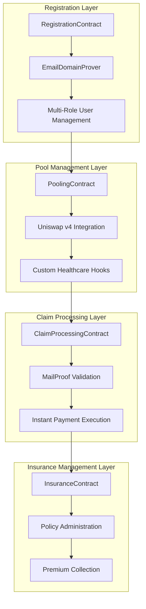

#### Enhanced Contract Interfaces

**RegistrationContract.sol - Multi-Role Management**:
```solidity
interface IEnhancedRegistrationContract {
    // Patient registration (simplified flow)
    function registerPatient(address wallet) external;
    function linkInsuranceCompany(address patient, address insurer) external;
    
    // Hospital registration (MailProof verification)
    function registerHospitalWithMailProof(bytes calldata mailProof) external;
    function validateHospitalDomain(string calldata domain) external view returns (bool);
    
    // Insurer registration (MailProof + Pool setup)
    function registerInsurerWithMailProof(bytes calldata mailProof) external;
    function initializeInsurerPool(address insurer, PoolParameters calldata params) external;
    
    // Multi-admin management
    function addAdmin(address newAdmin, AdminRole role) external;
    function removeAdmin(address admin) external;
    function updateAdminPermissions(address admin, uint256 permissions) external;
    
    // Role verification
    function getUserRole(address user) external view returns (UserRole);
    function isVerifiedHospital(address hospital) external view returns (bool);
    function isVerifiedInsurer(address insurer) external view returns (bool);
}
```

**PoolingContract.sol - Uniswap v4 Healthcare Pools**:
```solidity
interface IHealthcarePoolingContract {
    // Pool initialization with custom hooks
    function initializeHealthcarePool(
        address token0,
        address token1,
        uint24 fee,
        int24 tickSpacing,
        address hookContract
    ) external returns (PoolId);
    
    // Premium and claim operations
    function depositPremium(address patient, uint256 amount) external;
    function processClaimPayout(
        bytes calldata mailProof,
    uint256 claimId, 
        address recipient,
    uint256 amount
    ) external;
    
    // Yield management
    function distributeYield(PoolId poolId) external;
    function calculateStakeholderYield(address stakeholder) external view returns (uint256);
    function claimYield(address stakeholder) external;
    
    // Pool monitoring
    function getPoolLiquidity(PoolId poolId) external view returns (uint256);
    function getPoolPerformance(PoolId poolId) external view returns (PoolMetrics memory);
    function validatePaymentCapacity(PoolId poolId, uint256 amount) external view returns (bool);
}
```

**ClaimProcessingContract.sol - MailProof Integration**:
```solidity
interface IClaimProcessingContract {
    // Claim submission and validation
    function submitClaim(
        uint256 claimId,
        bytes calldata mailProof,
        ClaimData calldata claimData
    ) external;
    
    // MailProof verification
    function validateMailProof(bytes calldata mailProof) external view returns (bool);
    function extractPaymentInstructions(bytes calldata mailProof) external pure returns (
        address recipient,
        uint256 amount,
        address token,
        uint256 deadline
    );
    
    // Claim processing workflow
    function processValidatedClaim(uint256 claimId) external;
    function executePayout(uint256 claimId) external;
    function getClaimStatus(uint256 claimId) external view returns (ClaimStatus);
    
    // Audit and compliance
    function getClaimAuditTrail(uint256 claimId) external view returns (AuditEntry[] memory);
    function generateComplianceReport(uint256 fromTime, uint256 toTime) external view returns (ComplianceReport memory);
}
```

---

## 🔄 Context7 Integration Patterns

### Enhanced Development Workflow with Real-Time Documentation

**Innovation**: First healthcare platform integrating Context7 for real-time access to up-to-date library documentation and development best practices.

#### Context7 Development Enhancement Pattern
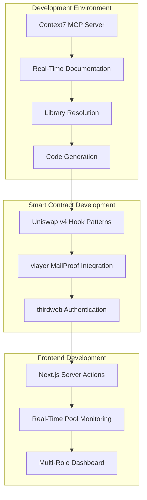

#### Context7 Usage Patterns

**Smart Contract Development Enhancement**:
```bash
# Get latest Uniswap v4 hook implementation patterns
use context7: "Implement Uniswap v4 beforeSwap and afterSwap hooks for healthcare payments"

# vlayer MailProof integration best practices
use context7: "Integrate vlayer MailProofs for DKIM email verification in Solidity contracts"

# Gas optimization techniques for healthcare transactions
use context7: "Optimize Solidity gas usage for healthcare payment processing contracts"
```

**Frontend Development Acceleration**:
```bash
# Next.js 15 server actions with blockchain integration
use context7: "Create Next.js server actions for Uniswap v4 pool management and monitoring"

# Real-time data fetching patterns
use context7: "Implement React Query for real-time Uniswap v4 pool data with WebSocket updates"

# Multi-role authentication and authorization
use context7: "Build role-based authentication system with thirdweb and Next.js middleware"
```

**Infrastructure and Deployment**:
```bash
# Container orchestration for complex healthcare platform
use context7: "Docker Compose setup for healthcare platform with Uniswap v4 and vlayer integration"

# Monitoring and observability for DeFi healthcare platform
use context7: "Implement comprehensive monitoring for Uniswap v4 healthcare pools with alerting"

# Security best practices for healthcare blockchain applications
use context7: "Healthcare blockchain security patterns with DKIM verification and audit trails"
```

#### Context7 Benefits for Healthcare Development
- **Up-to-Date Documentation**: Always current information on rapidly evolving DeFi protocols
- **Best Practice Integration**: Latest patterns and recommendations for secure development
- **Rapid Prototyping**: Accelerated development with proven code patterns
- **Security Enhancement**: Current security practices and vulnerability prevention
- **Performance Optimization**: Latest optimization techniques for gas efficiency

---

## 🎯 Advanced Integration Patterns

### Comprehensive System Integration Architecture

**Innovation**: Seamless integration of multiple advanced technologies creating unprecedented healthcare platform capabilities.

#### Technology Integration Matrix
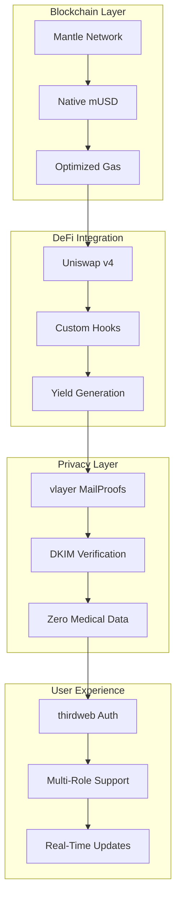

#### Integration Benefits Matrix

| Technology | Healthcare Benefit | Integration Advantage | Competitive Edge |
|------------|-------------------|----------------------|------------------|
| **Uniswap v4** | Proven liquidity + custom healthcare logic | Custom hooks for specialized workflows | Only healthcare platform with advanced DeFi |
| **vlayer MailProofs** | Secure verification without data exposure | DKIM-based authentication | Privacy-preserving automation |
| **thirdweb** | Simplified user onboarding | Gas sponsorship for healthcare transactions | Seamless user experience |
| **Context7** | Accelerated development | Real-time documentation access | Rapid feature development |
| **Mantle Network** | Low-cost transactions | Native mUSD integration | Simplified financial operations |

---

## 🏆 Revolutionary Architecture Advantages

### Competitive Superiority Framework

**Comprehensive Innovation**: zkMed's architecture combines proven technologies in revolutionary ways to create unprecedented healthcare platform capabilities.

#### Technical Superiority Matrix

| Innovation Area | Traditional Healthcare | Basic Blockchain | Advanced DeFi | zkMed Comprehensive |
|----------------|----------------------|----------------|---------------|-------------------|
| **User Registration** | Manual paperwork | Basic wallet connect | Simple onboarding | Multi-role MailProof verification |
| **Payment Processing** | Weeks of delays | Basic automation | DeFi integration | Instant MailProof-triggered payouts |
| **Fund Management** | 0% returns | Basic staking | Standard yield | Uniswap v4 with custom healthcare hooks |
| **Privacy Protection** | Centralized risk | Limited privacy | Basic encryption | Complete MailProof verification |
| **Admin Governance** | Single control | Basic permissions | DAO voting | Multi-admin with specialized roles |
| **Development Speed** | Slow iterations | Standard docs | Library integration | Real-time Context7 documentation |

#### Architectural Innovation Benefits

**System-Level Advantages**:
- **Proven Infrastructure**: Built on battle-tested Uniswap v4 and vlayer protocols
- **Healthcare Specialization**: Custom hooks and logic specifically for medical payments
- **Privacy Leadership**: Advanced MailProof verification without data compromise
- **User Experience Excellence**: thirdweb integration eliminates Web3 complexity
- **Development Acceleration**: Context7 integration for rapid feature development
- **Scalable Architecture**: Container-based deployment ready for global scale

**Market Differentiation**:
- **First-Mover Position**: Only comprehensive healthcare platform with advanced DeFi integration
- **Technology Convergence**: Unique combination of proven technologies for healthcare innovation
- **Complete Solution**: End-to-end platform supporting all healthcare stakeholder roles
- **Regulatory Readiness**: MailProof audit trails support compliance requirements
- **Competitive Moat**: Complex integration creates significant barriers to entry

**zkMed's revolutionary system patterns establish the foundation for the world's most advanced privacy-preserving healthcare platform, combining yield-generating Uniswap v4 pools with comprehensive vlayer MailProof verification to deliver unprecedented automation, security, and user experience across all healthcare stakeholder roles while maintaining the highest standards of medical privacy and regulatory compliance.** 🚀 