# zkMed System Patterns - Pool-Enabled Healthcare Architecture

**Purpose**: Comprehensive architecture patterns enabling privacy-preserving healthcare with yield-generating fund pools, emailproof-based claim certification, and seamless Mantle USD integration.

---

## 🏗️ Core Architecture Patterns

### Revolutionary Pool-Enabled Pattern

**Fundamental Innovation**: First healthcare platform integrating yield-generating fund pools with privacy-preserving claims processing.

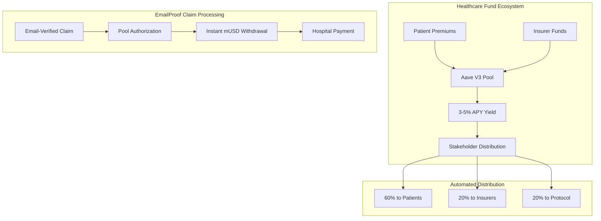

#### Pattern Benefits vs Traditional Systems

| Aspect | Traditional Healthcare | zkMed Pool-Enabled |
|--------|----------------------|-------------------|
| **Fund Utilization** | 0% return on idle premiums | 3-5% APY via Aave V3 |
| **Claim Payouts** | Weeks of processing delays | Instant withdrawals |
| **Capital Efficiency** | Manual reserve management | Automated protocol mechanisms |
| **Patient Benefits** | Full premium costs | Reduced effective costs via yield |

---

## 🎭 Dual Registration Architecture Pattern

### Flexible Patient Onboarding Design

**Innovation**: First healthcare platform offering dual registration paths accommodating both existing coverage and new insurance selection.

#### Registration Path A: Existing Coverage Integration
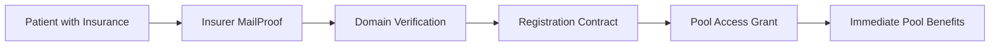

#### Registration Path B: Insurance Selection & Pool Creation
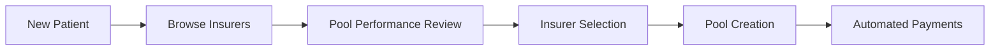

#### Market Dynamics Enhancement
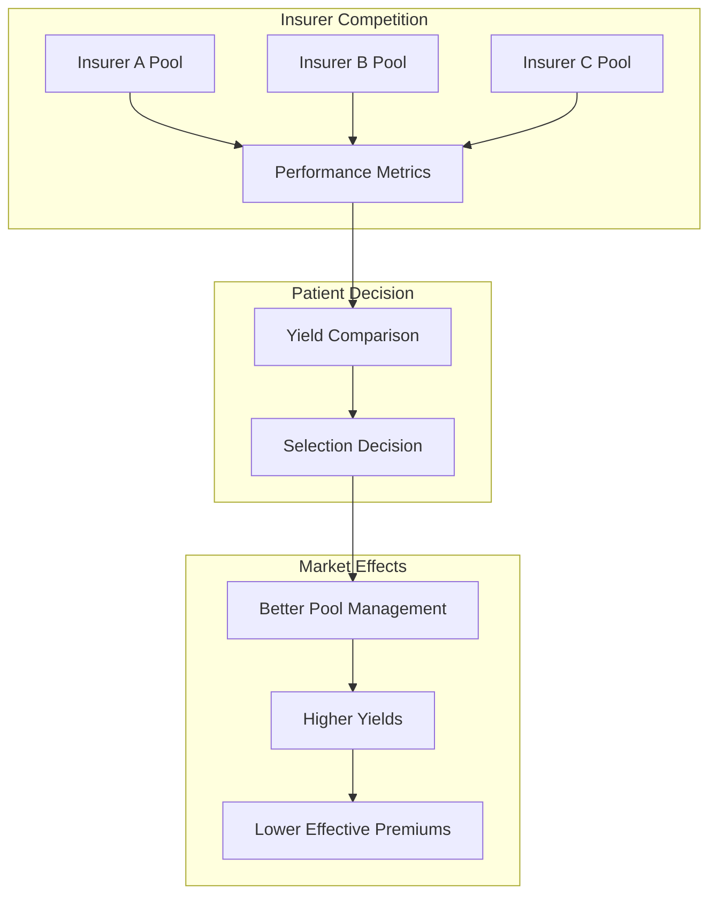

---

## 🔐 EmailProof-Based Claim Validation Architecture

### Comprehensive Email Verification Pattern

**Core Pattern**: EmailProof validation ensuring maximum security while maintaining complete medical data privacy through comprehensive email-based audit trails.

#### EmailProof Claim Validation Workflow
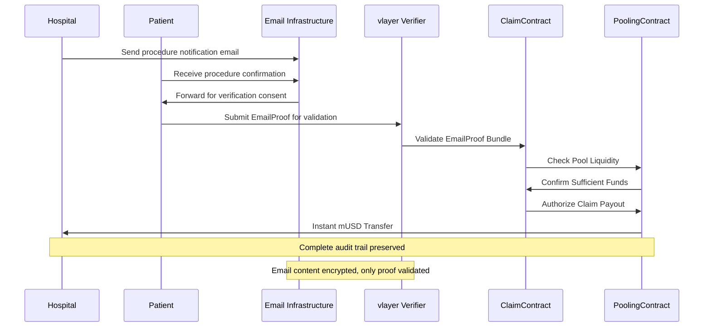

#### EmailProof Validation Responsibilities

**EmailProof Pattern (Comprehensive Claim Verification)**:
- Hospital procedure notification email capture and verification
- Patient email confirmation and consent validation
- Multi-party email trail establishment for audit compliance
- Privacy-preserving email content validation without exposure
- Complete communication history for investigation support

**Enhanced Investigation Capabilities**:
- Detailed email communication records for claim review
- Multi-party verification through email confirmations
- Comprehensive audit trail for regulatory compliance
- Privacy preservation with encrypted email content
- Investigation support through documented communication workflows

#### EmailProof Security Benefits
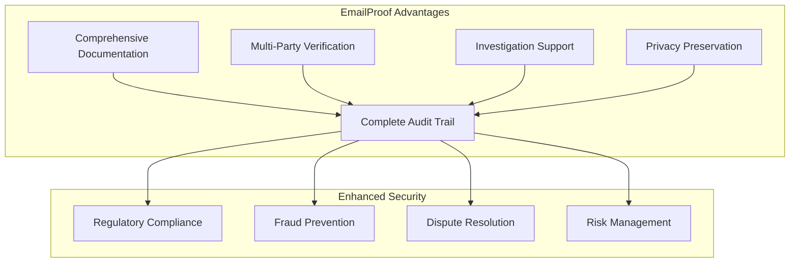

---

## 💰 Native Stablecoin Architecture

### Simplified Mantle USD (mUSD) Integration

**Core Innovation**: Direct native stablecoin processing eliminates oracle dependencies and reduces system complexity.

#### Traditional vs zkMed Architecture

**Traditional Healthcare Payment Flow**:
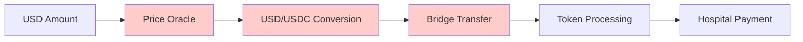

**zkMed Simplified Flow**:
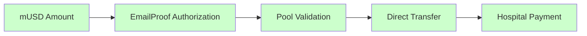

#### Technical Benefits
- **Eliminated Dependencies**: No price oracles or conversion mechanisms
- **Enhanced Security**: Native asset reduces attack surface
- **Lower Costs**: Direct processing eliminates transaction fees
- **Faster Processing**: Instant transfers without conversion delays

---

## 🚀 Aave V3 Integration Patterns

### Battle-Tested DeFi Integration

**Strategic Decision**: Leverage proven Aave V3 protocols for healthcare fund management rather than custom pooling mechanisms.

#### Pool Supply Pattern
```solidity
function depositToHealthcarePool(address patient, uint256 premiumAmount) external {
    // Transfer mUSD from patient
    mUSD.transferFrom(patient, address(this), premiumAmount);
    
    // Supply to Aave for yield generation
    mUSD.approve(address(aavePool), premiumAmount);
    aavePool.supply(address(mUSD), premiumAmount, address(this), 0);
    
    // Update patient pool tracking
    patientPools[patient].totalDeposited += premiumAmount;
    emit PremiumDeposited(patient, premiumAmount, block.timestamp);
}
```

#### EmailProof-Authorized Pool Withdrawal Pattern
```solidity
function authorizeClaimPayoutWithEmailProof(
    uint256 claimId, 
    bytes calldata emailProof,
    uint256 amount
) external {
    // Validate EmailProof first
    require(vlayerVerifier.verifyEmailProof(emailProof), "Invalid email proof");
    require(validateEmailProofClaim(claimId, emailProof), "Email proof doesn't match claim");
    
    // Instant withdrawal from Aave
    aavePool.withdraw(address(mUSD), amount, hospitalAddress);
    
    // Update pool accounting with email verification
    updatePoolBalancesWithEmailProof(claimId, amount, emailProof);
    emit ClaimPaidWithEmailProof(claimId, hospitalAddress, amount, block.timestamp);
}
```

---

## 📊 Automated Yield Distribution Pattern

### Stakeholder-Aligned Incentive Architecture

**Innovation**: Automated yield distribution ensuring all stakeholders benefit from pool performance.

#### Yield Distribution Architecture
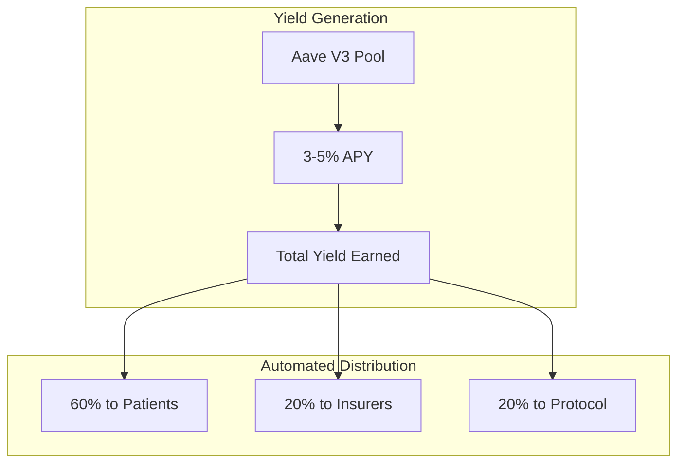

#### Distribution Logic Pattern
```solidity
function distributeYield() external {
    uint256 totalYield = calculateAccruedYield();
    
    // Stakeholder distribution
    uint256 patientYield = (totalYield * 6000) / 10000;
    uint256 insurerYield = (totalYield * 2000) / 10000;
    uint256 protocolYield = (totalYield * 2000) / 10000;
    
    // Automated proportional distribution
    distributeToPatients(patientYield);
    distributeToInsurers(insurerYield);
    allocateToProtocol(protocolYield);
}
```

---

## 🔄 Container Interaction Patterns

### Simplified Container Architecture

**Essential Pattern**: Two-container stack leveraging existing vlayer infrastructure for reliable deployment.

#### Essential Container Communication Flow
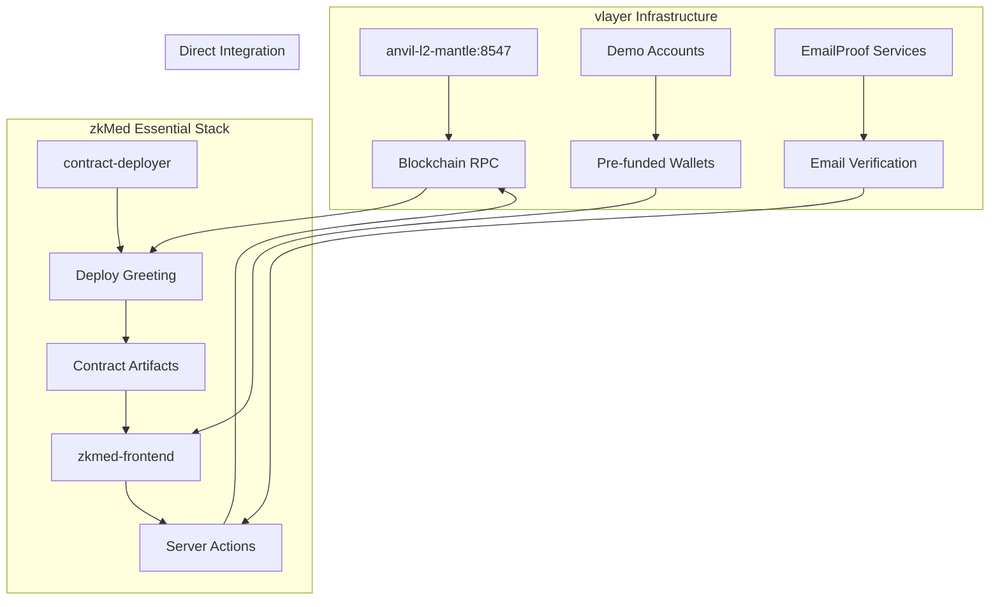

#### Essential Service Relationships

**Simplified Component Stack**:
1. **contract-deployer** - One-time Greeting contract deployment to vlayer anvil
2. **zkmed-frontend** - Next.js application with server actions and direct blockchain integration
3. **Server Actions** - Replace API endpoints for blockchain interaction
4. **vlayer Integration** - Direct connection to existing anvil-l2-mantle infrastructure
5. **Demo Components** - Greeting contract interaction with wallet connectivity
6. **EmailProof Services** - vlayer email verification for comprehensive claim validation

---

## 🎯 Development Environment Patterns

### Local Fork Development Architecture

**Development Philosophy**: Local-first development with comprehensive Mantle fork testing.

#### Development Stack Pattern
```mermaid
graph TB
    subgraph "Development Environment"
        A[Mantle Fork (31339)] --> B[Real Mainnet State]
        B --> C[Aave V3 Contracts]
        B --> D[mUSD Token]
        B --> E[thirdweb Integration]
        B --> F[vlayer EmailProof Services]
    end
    
    subgraph "Testing Framework"
        G[Foundry Suite] --> H[Unit Tests]
        G --> I[Integration Tests]
        G --> J[Pool Operations Tests]
        G --> K[Gas Optimization]
        G --> L[EmailProof Validation Tests]
    end
```

#### Testing Workflow Pattern
```bash
# Complete testing pipeline
make start-mantle-fork     # Local Mantle environment
make deploy-contracts      # Deploy all contracts
make setup-aave-pools     # Configure Aave V3 integration
make test-registration    # Dual registration paths
make test-pool-operations # Pool deposits and withdrawals
make test-emailproof-claims # EmailProof-based claim processing
make test-claims-flow     # End-to-end claim processing
```

---

## ✨ Innovation Pattern Highlights

### Breakthrough Architecture Combinations

#### Privacy + Yield Generation Pattern
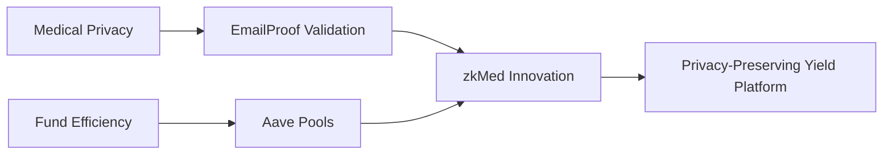

#### Dual Registration + Pool Integration Pattern
- Existing coverage path enables immediate pool benefits
- New selection path drives competitive pool optimization
- Both paths result in yield generation for patients
- Market dynamics improve overall pool performance

#### EmailProof + Instant Payout Pattern
- Comprehensive email validation ensures claim legitimacy
- Multi-party email verification prevents fraud
- Pool authorization triggers immediate transfers
- Medical privacy preserved throughout process
- Complete audit trail supports investigation workflows
- Instant hospital payments improve cash flow

---

## 🏆 Competitive Architecture Advantages

### Technical Superiority Matrix

| Innovation Area | Traditional Healthcare | Other Web3 Platforms | zkMed Pool-Enabled |
|----------------|----------------------|---------------------|-------------------|
| **Fund Utilization** | 0% return on premiums | Basic staking (~2%) | 3-5% Aave yields |
| **Payment Speed** | Weeks of delays | Days for processing | Instant upon approval |
| **Medical Privacy** | Centralized databases | Limited privacy | EmailProof validation |
| **Registration Flexibility** | Single path only | Basic onboarding | Dual-path innovation |
| **Oracle Dependencies** | N/A | Complex price feeds | Zero dependencies |
| **Pool Integration** | None | Custom solutions | Battle-tested Aave |
| **Claim Verification** | Manual investigation | Basic validation | EmailProof audit trails |

### Design Pattern Benefits

#### Modularity
- Independent contract modules with clear responsibilities
- Pool integration layer enabling easy expansion
- EmailProof validation abstraction for comprehensive verification
- Native asset handling simplifying processing logic

#### Scalability
- Aave V3 protocols proven at scale with $10B+ TVL
- Pool-based architecture supports unlimited participants
- Automated yield distribution reduces operational overhead
- Container deployment enables horizontal scaling
- EmailProof validation scales with email infrastructure

#### Security
- Battle-tested Aave integration reduces smart contract risks
- EmailProof validation prevents fraud across attack vectors
- Native asset processing eliminates bridge vulnerabilities
- Zero medical data exposure maintains privacy guarantees
- Comprehensive audit trails support regulatory compliance

#### Investigation & Compliance
- EmailProof provides complete communication history
- Multi-party email verification enables thorough investigation
- Regulatory compliance through documented email trails
- Privacy preservation with encrypted email content validation
- Dispute resolution supported by comprehensive audit capabilities

**zkMed's revolutionary system patterns establish the foundation for the world's first privacy-preserving healthcare platform with yield-generating fund pools and comprehensive emailproof-based claim certification, setting new standards for both capital efficiency and medical privacy in Web3 healthcare innovation while ensuring thorough investigation capabilities for all stakeholders.** 🚀 