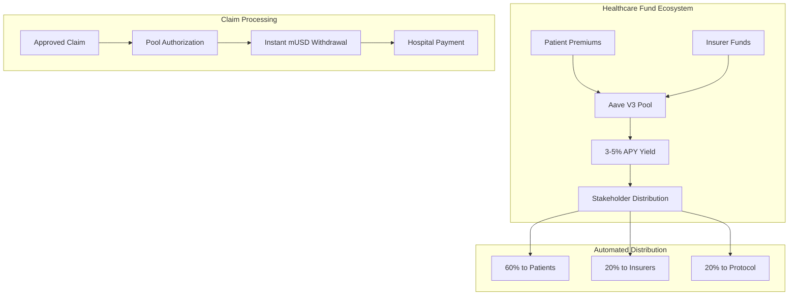
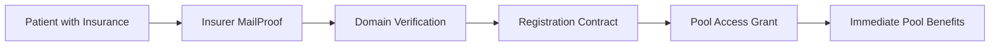
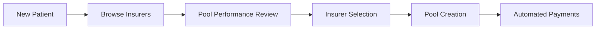
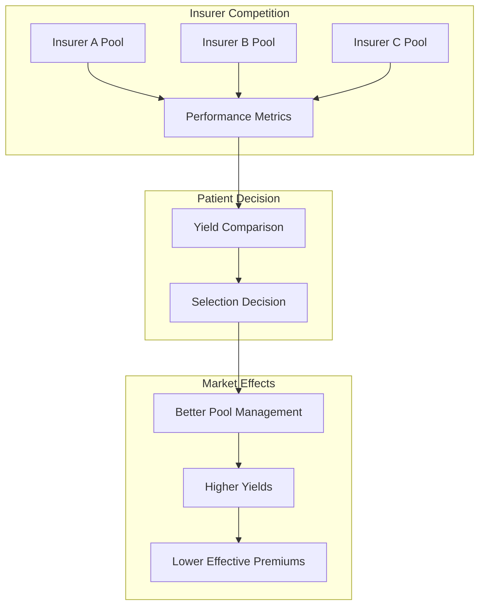
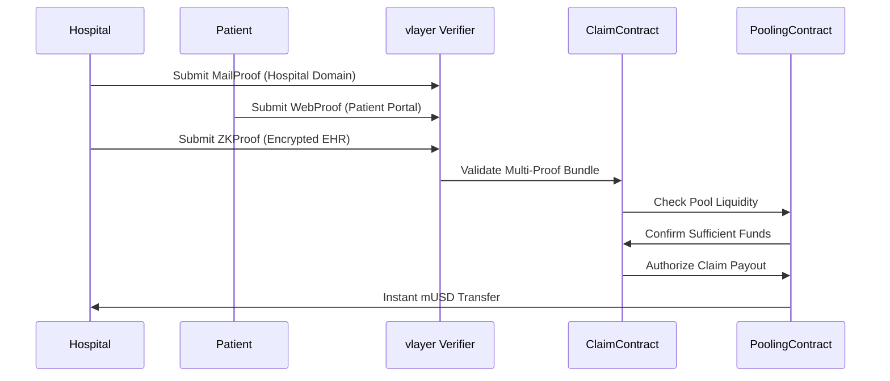
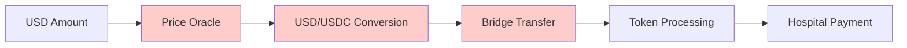
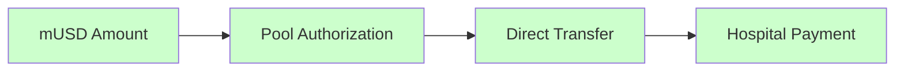
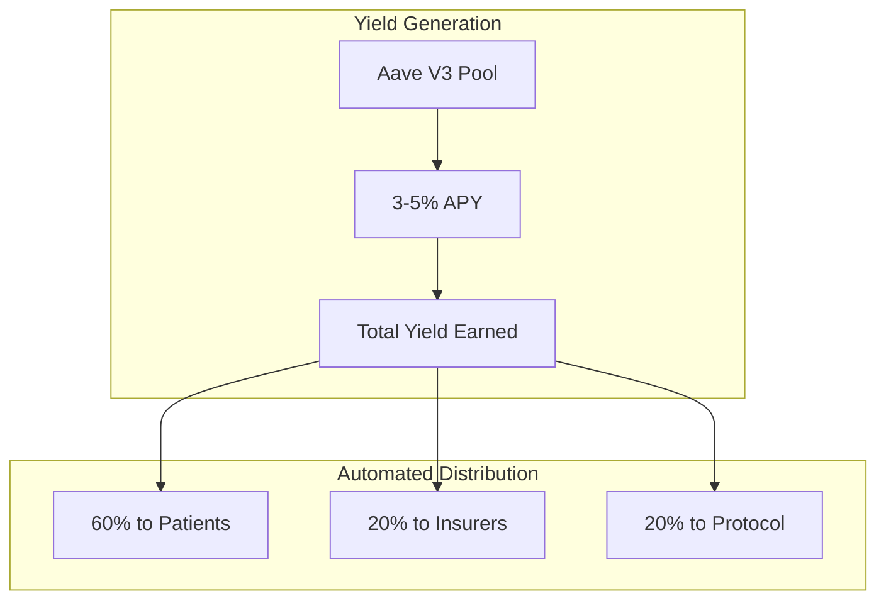
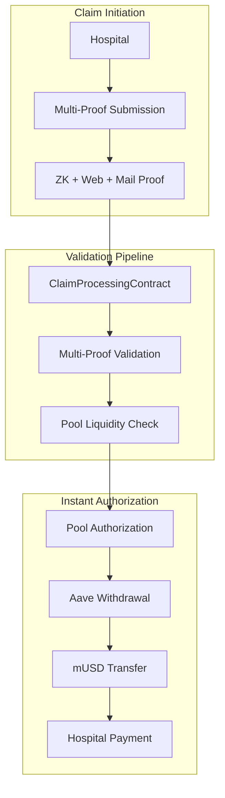
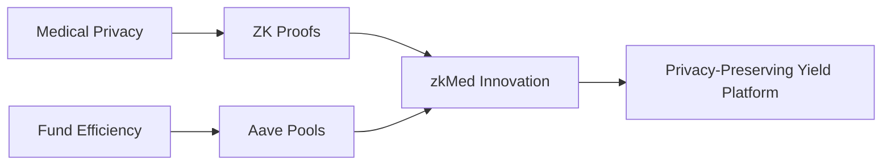

# zkMed System Patterns - Pool-Enabled Healthcare Architecture

**Purpose**: Comprehensive architecture patterns enabling privacy-preserving healthcare with yield-generating fund pools, multi-proof validation, and seamless Mantle USD integration.

---

## 🏗️ Core Architecture Patterns

### Revolutionary Pool-Enabled Pattern

**Fundamental Innovation**: First healthcare platform integrating yield-generating fund pools with privacy-preserving claims processing.



#### Pattern Benefits vs Traditional Systems

| Aspect | Traditional Healthcare | zkMed Pool-Enabled |
|--------|----------------------|-------------------|
| **Fund Utilization** | 0% return on idle premiums | 3-5% APY via Aave V3 |
| **Claim Payouts** | Weeks of processing delays | Instant withdrawals |
| **Capital Efficiency** | Manual reserve management | Automated protocol mechanisms |
| **Patient Benefits** | Full premium costs | Reduced effective costs via yield |

---

## 🎭 Dual Registration Architecture Pattern

### Flexible Patient Onboarding Design

**Innovation**: First healthcare platform offering dual registration paths accommodating both existing coverage and new insurance selection.

#### Registration Path A: Existing Coverage Integration


#### Registration Path B: Insurance Selection & Pool Creation


#### Market Dynamics Enhancement


---

## 🔐 Multi-Proof Privacy Architecture

### Comprehensive Validation Pattern

**Core Pattern**: Triple-proof validation ensuring maximum security while maintaining complete medical data privacy.

#### Multi-Proof Validation Workflow


#### Proof Type Responsibilities

**MailProof Pattern (Organization Verification)**:
- Domain extraction and validation
- Admin account verification
- ZK proof generation for organization authenticity

**WebProof Pattern (System Verification)**:
- Patient portal session capture
- Hospital system state validation
- Procedure confirmation without data exposure

**ZKProof Pattern (Privacy-Preserving Validation)**:
- Encrypted EHR processing
- Coverage verification without revelation
- Zero medical data exposure guarantee

---

## 💰 Native Stablecoin Architecture

### Simplified Mantle USD (mUSD) Integration

**Core Innovation**: Direct native stablecoin processing eliminates oracle dependencies and reduces system complexity.

#### Traditional vs zkMed Architecture

**Traditional Healthcare Payment Flow**:


**zkMed Simplified Flow**:


#### Technical Benefits
- **Eliminated Dependencies**: No price oracles or conversion mechanisms
- **Enhanced Security**: Native asset reduces attack surface
- **Lower Costs**: Direct processing eliminates transaction fees
- **Faster Processing**: Instant transfers without conversion delays

---

## 🚀 Aave V3 Integration Patterns

### Battle-Tested DeFi Integration

**Strategic Decision**: Leverage proven Aave V3 protocols for healthcare fund management rather than custom pooling mechanisms.

#### Pool Supply Pattern
```solidity
function depositToHealthcarePool(address patient, uint256 premiumAmount) external {
    // Transfer mUSD from patient
    mUSD.transferFrom(patient, address(this), premiumAmount);
    
    // Supply to Aave for yield generation
    mUSD.approve(address(aavePool), premiumAmount);
    aavePool.supply(address(mUSD), premiumAmount, address(this), 0);
    
    // Update patient pool tracking
    patientPools[patient].totalDeposited += premiumAmount;
    emit PremiumDeposited(patient, premiumAmount, block.timestamp);
}
```

#### Pool Withdrawal Pattern
```solidity
function authorizeClaimPayout(uint256 claimId, uint256 amount) external {
    // Validate authorization
    require(validateClaim(claimId), "Invalid claim");
    
    // Instant withdrawal from Aave
    aavePool.withdraw(address(mUSD), amount, hospitalAddress);
    
    // Update pool accounting
    updatePoolBalances(claimId, amount);
    emit ClaimPaid(claimId, hospitalAddress, amount, block.timestamp);
}
```

---

## 📊 Automated Yield Distribution Pattern

### Stakeholder-Aligned Incentive Architecture

**Innovation**: Automated yield distribution ensuring all stakeholders benefit from pool performance.

#### Yield Distribution Architecture


#### Distribution Logic Pattern
```solidity
function distributeYield() external {
    uint256 totalYield = calculateAccruedYield();
    
    // Stakeholder distribution
    uint256 patientYield = (totalYield * 6000) / 10000;
    uint256 insurerYield = (totalYield * 2000) / 10000;
    uint256 protocolYield = (totalYield * 2000) / 10000;
    
    // Automated proportional distribution
    distributeToPatients(patientYield);
    distributeToInsurers(insurerYield);
    allocateToProtocol(protocolYield);
}
```

---

## 🔄 Contract Interaction Patterns

### Pool-Enabled Claims Workflow

**Revolutionary Pattern**: Claims authorization automatically triggers pool withdrawals, enabling instant hospital payments.

#### Complete Claims Processing Flow


#### Smart Contract Component Relationships

**Core Contract Hierarchy**:
1. **RegistrationContract.sol** - Identity foundation
2. **PoolingContract.sol** - Core innovation (Aave V3 integration)
3. **PatientModule.sol** - Enhanced with insurance selection
4. **OrganizationModule.sol** - Multi-proof claims processing
5. **ClaimProcessingContract.sol** - Pool-aware validation
6. **InsuranceContract.sol** - Native mUSD policy management

---

## 🎯 Development Environment Patterns

### Local Fork Development Architecture

**Development Philosophy**: Local-first development with comprehensive Mantle fork testing.

#### Development Stack Pattern
```mermaid
graph TB
    subgraph "Development Environment"
        A[Mantle Fork (31339)] --> B[Real Mainnet State]
        B --> C[Aave V3 Contracts]
        B --> D[mUSD Token]
        B --> E[thirdweb Integration]
    end
    
    subgraph "Testing Framework"
        F[Foundry Suite] --> G[Unit Tests]
        F --> H[Integration Tests]
        F --> I[Pool Operations Tests]
        F --> J[Gas Optimization]
    end
```

#### Testing Workflow Pattern
```bash
# Complete testing pipeline
make start-mantle-fork     # Local Mantle environment
make deploy-contracts      # Deploy all contracts
make setup-aave-pools     # Configure Aave V3 integration
make test-registration    # Dual registration paths
make test-pool-operations # Pool deposits and withdrawals
make test-claims-flow     # End-to-end claim processing
```

---

## ✨ Innovation Pattern Highlights

### Breakthrough Architecture Combinations

#### Privacy + Yield Generation Pattern


#### Dual Registration + Pool Integration Pattern
- Existing coverage path enables immediate pool benefits
- New selection path drives competitive pool optimization
- Both paths result in yield generation for patients
- Market dynamics improve overall pool performance

#### Multi-Proof + Instant Payout Pattern
- Comprehensive validation ensures security
- Pool authorization triggers immediate transfers
- Medical privacy preserved throughout process
- Instant hospital payments improve cash flow

---

## 🏆 Competitive Architecture Advantages

### Technical Superiority Matrix

| Innovation Area | Traditional Healthcare | Other Web3 Platforms | zkMed Pool-Enabled |
|----------------|----------------------|---------------------|-------------------|
| **Fund Utilization** | 0% return on premiums | Basic staking (~2%) | 3-5% Aave yields |
| **Payment Speed** | Weeks of delays | Days for processing | Instant upon approval |
| **Medical Privacy** | Centralized databases | Limited privacy | Zero-knowledge proofs |
| **Registration Flexibility** | Single path only | Basic onboarding | Dual-path innovation |
| **Oracle Dependencies** | N/A | Complex price feeds | Zero dependencies |
| **Pool Integration** | None | Custom solutions | Battle-tested Aave |

### Design Pattern Benefits

#### Modularity
- Independent contract modules with clear responsibilities
- Pool integration layer enabling easy expansion
- Proof validation abstraction for multiple verification types
- Native asset handling simplifying processing logic

#### Scalability
- Aave V3 protocols proven at scale with $10B+ TVL
- Pool-based architecture supports unlimited participants
- Automated yield distribution reduces operational overhead
- Container deployment enables horizontal scaling

#### Security
- Battle-tested Aave integration reduces smart contract risks
- Multi-proof validation prevents fraud across attack vectors
- Native asset processing eliminates bridge vulnerabilities
- Zero medical data exposure maintains privacy guarantees

**zkMed's revolutionary system patterns establish the foundation for the world's first privacy-preserving healthcare platform with yield-generating fund pools, setting new standards for both capital efficiency and medical privacy in Web3 healthcare innovation.** 🚀 