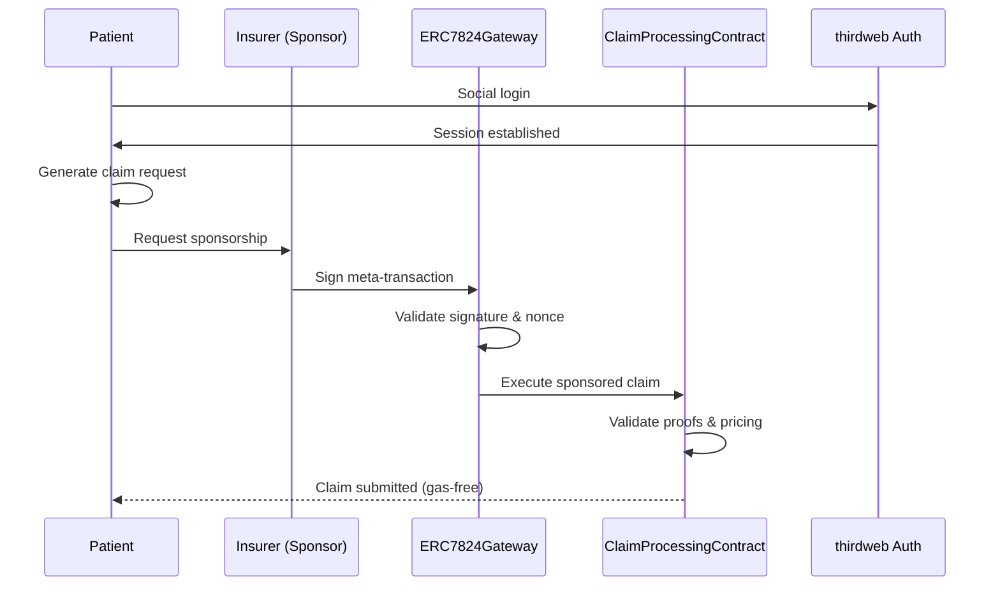
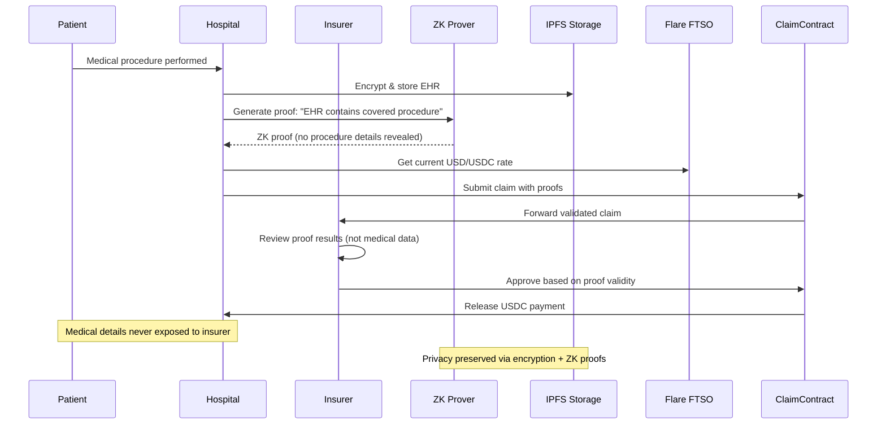

# System Patterns - zkMed Advanced Web3 Architecture

## Overall Architecture Pattern

### Comprehensive Multi-Layer Privacy-First Design

zkMed implements a **Layered Privacy Architecture** with advanced Web3 integrations where each layer maintains specific privacy guarantees while enabling seamless user experience through sponsored transactions and multi-proof validation.

## 🏗️ Complete System Integration Diagram

```mermaid
flowchart TD

  %% Onboarding Layer
  subgraph Onboarding & Identity
    A1[Patient]
    A2[Hospital]
    A3[Insurer]
    RC[RegistrationContract]
    ED[EmailDomainProver]
  end

  %% Claims Layer
  subgraph Claims & Approvals
    CP[ClaimProcessingContract]
    IC[InsuranceContract]
    GW[ERC7824Gateway]
    ZKV[ZKVerifier]
  end

  %% Off-chain Infra
  subgraph Off-Chain Proofs
    IPFS[Encrypted EHR on IPFS]
    ZK[ZK-SNARK of Covered Procedure]
    FTSO[Flare Oracle (USD → USDC)]
    PRE[Proxy Re-Encryption Key]
    WP[WebProofs from Patient Portal]
    MP[MailProofs from Organization Email]
  end

  %% Execution Layer
  subgraph Payment & Escrow
    USDC[Stablecoin (USDC)]
    HWallet[Hospital Wallet]
    TWAuth[thirdweb Authentication]
  end

  %% Relationships

  %% Identity Setup
  A1 -->|registerPatient(commitment)| RC
  A1 -->|thirdweb social login| TWAuth
  A2 -->|MailProof| ED --> RC
  A2 -->|WebProof validation| WP --> RC
  A3 -->|MailProof| ED --> RC
  A3 -->|Sponsored registration| GW --> RC

  %% Claim Submission
  A2 -->|Encrypted EHR to IPFS| IPFS
  A2 -->|ZK Proof| ZK --> CP
  A2 -->|WebProof| WP --> CP
  CP -->|verifyZKProof| ZKV
  CP -->|verifyWebProof| WP
  CP -->|check Role: Hospital| RC
  CP -->|fetch USD price| FTSO
  CP -->|submitClaim(...)| IC

  %% Sponsored Transactions
  A1 -->|sponsored claim proposal| GW
  A2 -->|sponsored claim submission| GW
  GW -->|execute meta-transactions| CP
  GW -->|execute meta-transactions| IC

  %% Claim Evaluation
  A3 -->|sponsored approveClaim(tx)| GW
  GW -->|execute(...)| IC

  IC -->|escrow payout| USDC
  IC -->|escrow balance| HWallet
  HWallet -->|withdrawPayout()| USDC

  %% Final Confirmation
  A2 -->|confirmOperation| IC
  A1 -->|confirmOperation| IC
  
  %% Authentication Layer
  TWAuth -->|account binding| GW
  TWAuth -->|session management| A1
  TWAuth -->|wallet abstraction| A2
  TWAuth -->|social login| A3
```

## 🧠 Complete Contract Roles & Responsibilities

| Contract | Primary Role | Key Features | Integrations |
|----------|-------------|--------------|--------------|
| **RegistrationContract** | Identity/role management via multi-proof | Patient commitments, organization MailProofs, ERC-7824 compatibility | vlayer MailProofs, ERC-7824 Gateway, thirdweb |
| **EmailDomainProver** | Verifies organization domain ownership (ZK) | Email-based domain verification without exposing emails | vlayer SDK, RegistrationContract |
| **ERC7824Gateway** | Executes sponsored meta-transactions | Gas-free interactions, batch operations, nonce management | All contracts, thirdweb authentication |
| **PatientModule** | Patient EHR & WebProof management | Encrypted EHR storage, WebProof operation proposals | vlayer WebProofs, ERC-7824, IPFS |
| **OrganizationModule** | Hospital/insurer multi-proof operations | WebProof validation, multi-proof claim submissions | vlayer WebProofs, ERC-7824 Gateway |
| **ClaimProcessingContract** | ZK proof gatekeeper + multi-proof validator | ZK+Web+Mail proof validation, FTSO price conversion | vlayer proofs, Flare FTSO, ERC-7824 |
| **InsuranceContract** | Policy management, claims approval, escrow | Real-time pricing, sponsored approvals, USDC payouts | Flare FTSO, ERC-7824, USDC token |
| **ZKVerifier** | Verifies ZK-SNARKs (Circom-based) | Privacy-preserving procedure validation | ClaimProcessingContract, vlayer |

---

## Advanced Integration Patterns

### 1. Multi-Proof Validation Architecture

```solidity
contract MultiProofValidator {
    struct ProofBundle {
        bytes zkProof;        // Privacy-preserving procedure validation
        bytes webProof;       // Patient portal verification
        bytes mailProof;      // Organization domain ownership
        bytes32 combinedHash; // Hash of all proofs combined
    }
    
    function validateMultiProof(ProofBundle calldata proofs) external returns (bool) {
        bool zkValid = zkVerifier.verify(proofs.zkProof);
        bool webValid = webProofVerifier.verify(proofs.webProof);
        bool mailValid = mailProofVerifier.verify(proofs.mailProof);
        
        require(zkValid && webValid && mailValid, "Multi-proof validation failed");
        return true;
    }
}
```

**Security Benefits:**
- Multiple proof types prevent single point of failure
- Cross-validation ensures claim legitimacy
- Privacy preservation through ZK components
- Domain ownership verification prevents impersonation

### 2. ERC-7824 Sponsored Transaction Flow



**UX Benefits:**
- Gas-free patient interactions
- Seamless onboarding via social login
- Sponsored operations reduce barriers
- Batch transactions optimize costs

### 3. Real-Time Price Integration Pattern

```solidity
contract FlareIntegration {
    IFlareFtsoV2 public ftsoV2;
    
    function getRealtimeUSDCPrice() external view returns (uint256 price, uint256 timestamp) {
        (price, timestamp) = ftsoV2.getCurrentPrice("USDC/USD");
        require(block.timestamp - timestamp < 300, "Price too stale"); // 5 min max
        return (price, timestamp);
    }
    
    function convertUSDToTokens(uint256 usdAmount) external view returns (uint256 tokens) {
        (uint256 price,) = getRealtimeUSDCPrice();
        // price is 8 decimals, USDC is 18 decimals
        return (usdAmount * 1e18 * 1e8) / price;
    }
}
```

**Oracle Benefits:**
- Decentralized price feeds
- Real-time accuracy within 5 minutes
- Protection against stale data
- Multi-currency support capability

### 4. Privacy-Preserving Claims Workflow



**Privacy Guarantees:**
- Medical data never exposed on-chain
- Insurers approve without seeing procedure details
- ZK proofs validate coverage without revealing data
- Post-approval decryption only for authorized parties

### 5. thirdweb Authentication Integration

```typescript
// Enhanced authentication with ERC-7824 binding
class zkMedAuth {
    async authenticateUser(role: 'patient' | 'hospital' | 'insurer') {
        // Step 1: thirdweb social login
        const user = await thirdweb.auth.login({
            domain: "zkmed.health",
            type: "eoa" // or "smart-wallet"
        });
        
        // Step 2: Check registration status
        const isRegistered = await registrationContract.read.verified([user.address]);
        
        if (!isRegistered) {
            // Step 3: Sponsored registration if needed
            await this.sponsorRegistration(user, role);
        }
        
        // Step 4: Bind to ERC-7824 abstract account
        const gateway = await this.bindToGateway(user.address);
        
        return {
            user,
            gateway,
            role,
            canSubmitClaims: role === 'hospital',
            canApproveClaims: role === 'insurer',
            hasGasSponsorship: true
        };
    }
    
    async sponsorRegistration(user: any, role: string) {
        const sponsorTx = await gateway.execute({
            from: user.address,
            to: registrationContract.address,
            data: registrationContract.interface.encodeFunctionData(
                role === 'patient' ? 'registerPatient' : 'registerOrganization',
                [/* registration data */]
            ),
            nonce: await gateway.nonces(user.address)
        });
        
        return sponsorTx;
    }
}
```

### 6. vlayer WebProof Generation Patterns

```typescript
// Patient Portal WebProof
async function generatePatientPortalProof(patientId: string) {
    const webProof = await vlayer.generateWebProof({
        url: `https://mychart.mountsinai.org/patient/${patientId}`,
        selector: "#medical-records .procedure-code",
        claim: "Patient has legitimate medical procedure requiring coverage",
        privacy: {
            hideSelector: true,
            hashContent: true
        }
    });
    
    return {
        proof: webProof.proof,
        claimedProcedure: webProof.outputs.procedureHash,
        portalVerified: true
    };
}

// Hospital System WebProof
async function generateHospitalSystemProof(hospitalId: string, procedureId: string) {
    const webProof = await vlayer.generateWebProof({
        url: `https://epic.mountsinai.org/procedures/${procedureId}`,
        selector: ".procedure-status",
        claim: "Procedure completed successfully in hospital system",
        authentication: {
            method: "oauth",
            credentials: process.env.HOSPITAL_API_KEY
        }
    });
    
    return {
        proof: webProof.proof,
        procedureCompleted: webProof.outputs.status === "completed",
        hospitalVerified: true
    };
}
```

## 🔐 Security Patterns

### 1. Defense in Depth
- **Layer 1**: Role-based access control (RegistrationContract)
- **Layer 2**: Multi-proof validation (ZK + Web + Mail)
- **Layer 3**: Sponsored transaction verification (ERC-7824)
- **Layer 4**: Real-time price validation (Flare FTSO)
- **Layer 5**: Encrypted storage with controlled access (IPFS + PRE)

### 2. Privacy by Design
- **Commitment-Reveal**: Patient data as hashed commitments
- **Zero-Knowledge Proofs**: Validate without revealing medical details
- **Proxy Re-Encryption**: Controlled post-approval access
- **Domain Verification**: Prove ownership without exposing emails
- **Sponsored Privacy**: Gas-free interactions maintain anonymity

### 3. Economic Security
- **Real-Time Pricing**: Live oracle data prevents arbitrage
- **Escrow System**: Guaranteed payments for valid claims
- **Sponsored Incentives**: Insurers cover gas for better UX
- **Multi-Signature Approvals**: Large claims require multiple signatures

## 🚀 Performance Optimization Patterns

### 1. Gas Optimization
```solidity
contract GasOptimized {
    // Pack structs to minimize storage slots
    struct Claim {
        uint128 amount;      // Fits with timestamp in one slot
        uint128 timestamp;
        address patient;     // 20 bytes
        bytes12 padding;     // Pad to 32 bytes
        bytes32 proofHash;   // Separate slot
    }
    
    // Batch operations for efficiency
    function batchProcessClaims(uint256[] calldata claimIds) external {
        for (uint256 i = 0; i < claimIds.length;) {
            _processClaim(claimIds[i]);
            unchecked { ++i; }
        }
    }
}
```

### 2. Proof Verification Optimization
- **Parallel Verification**: Validate multiple proof types simultaneously
- **Caching**: Store verification results to avoid re-computation
- **Batching**: Process multiple proofs in single transaction
- **Selective Verification**: Skip redundant checks based on trust levels

### 3. Oracle Integration Efficiency
- **Price Caching**: Cache recent FTSO prices with staleness checks
- **Fallback Mechanisms**: Multiple oracle sources for reliability
- **Update Triggers**: Smart price update frequency based on volatility
- **Gas Estimation**: Predict transaction costs before execution

## 📊 Monitoring & Analytics Patterns

### 1. Event-Driven Analytics
```solidity
event ClaimProcessed(
    address indexed patient,
    address indexed hospital,
    address indexed insurer,
    uint256 claimId,
    uint256 amount,
    bytes32 proofHash,
    uint256 timestamp
);

event ProofValidated(
    bytes32 indexed proofHash,
    string proofType, // "ZK", "Web", "Mail"
    bool isValid,
    uint256 timestamp
);

event SponsoredTransaction(
    address indexed sponsor,
    address indexed user,
    address indexed targetContract,
    uint256 gasUsed,
    uint256 timestamp
);
```

### 2. Privacy-Preserving Metrics
- **Aggregated Statistics**: Claims volume without individual details
- **Proof Success Rates**: Validation success percentages by type
- **Performance Metrics**: Transaction times and gas usage
- **User Experience**: Sponsored transaction adoption rates

This comprehensive system architecture enables zkMed to provide privacy-preserving healthcare claims processing with advanced Web3 features including sponsored transactions, multi-proof validation, real-time pricing, and seamless authentication. 🚀 