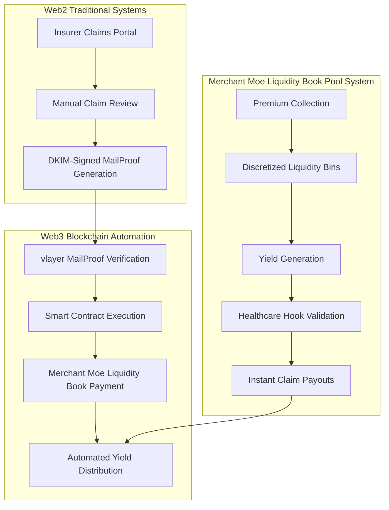
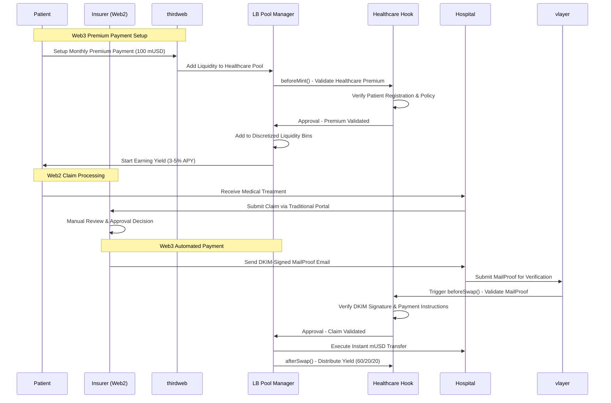
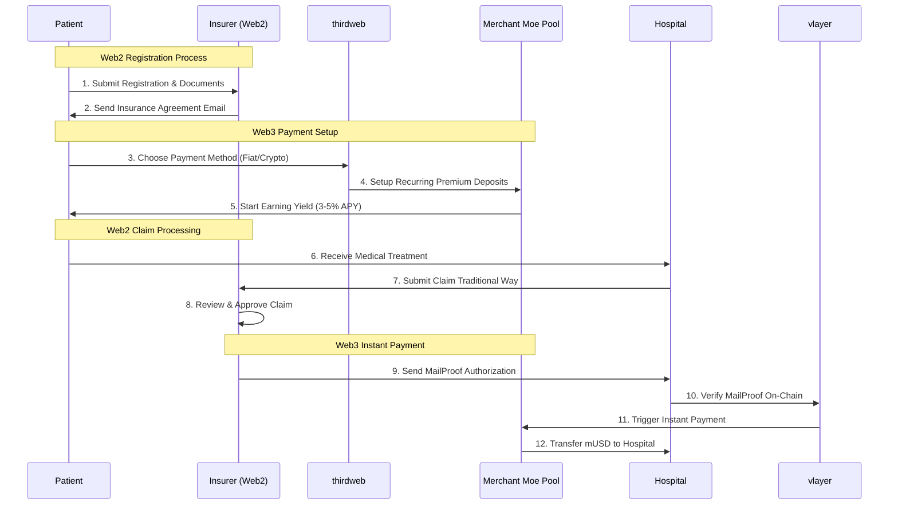
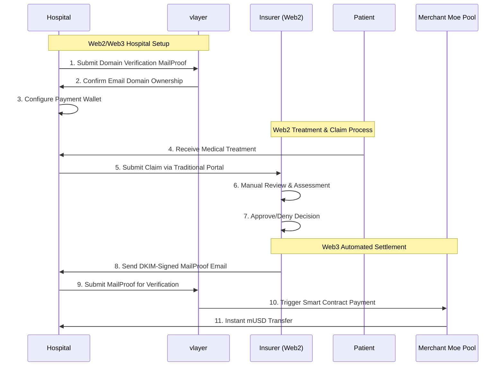
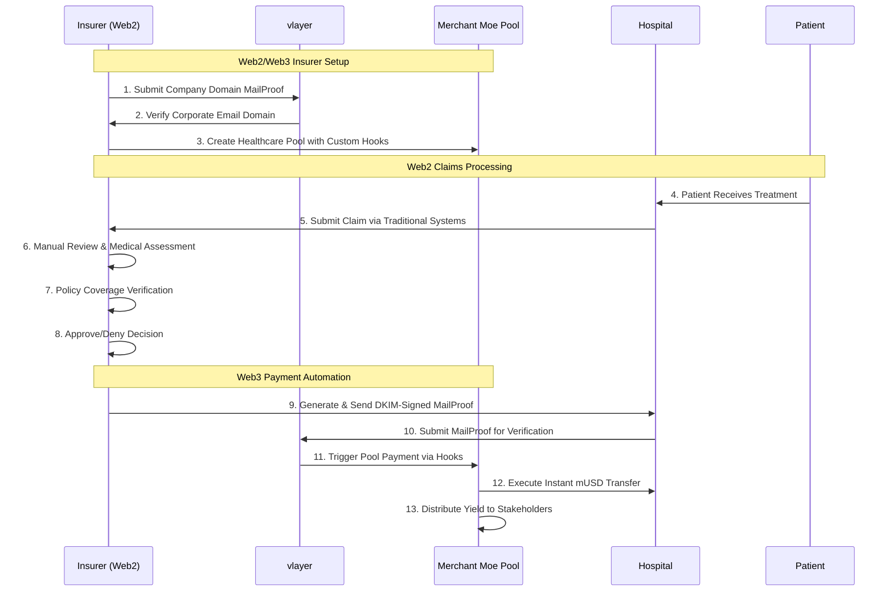
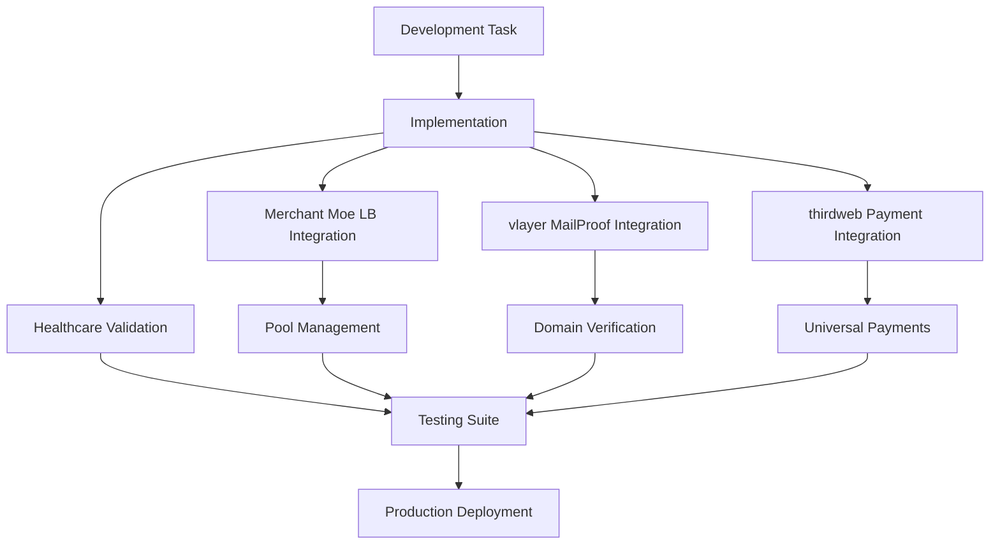
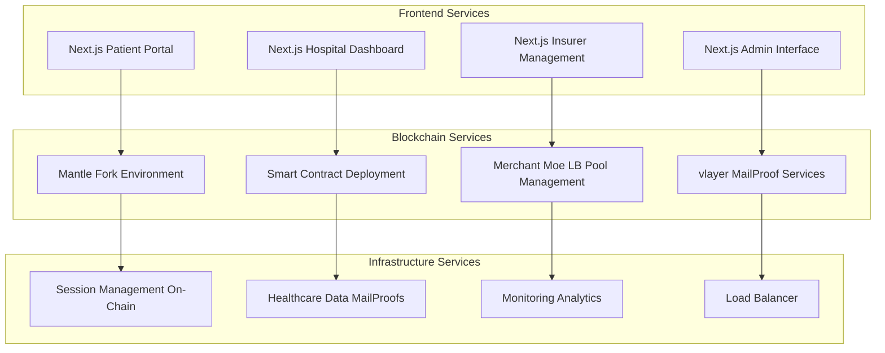
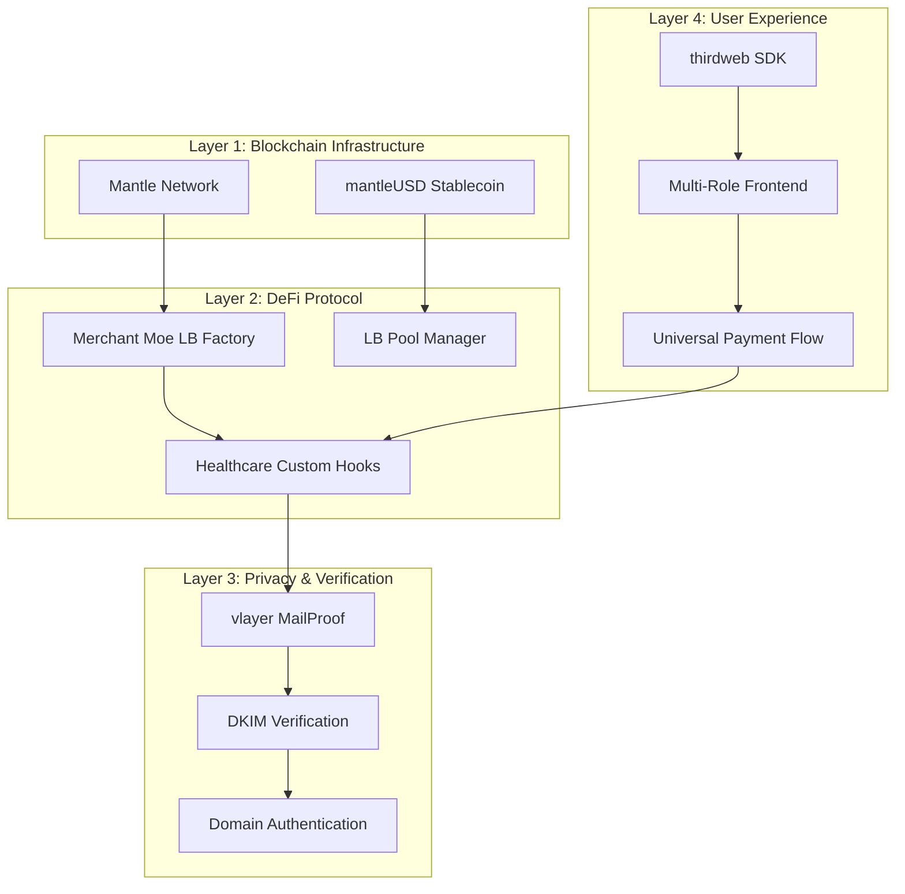

# zkMed System Patterns - Comprehensive Healthcare Platform with Merchant Moe Liquidity Book

**Purpose**: Advanced architecture patterns enabling privacy-preserving healthcare with yield-generating Merchant Moe Liquidity Book pools, comprehensive vlayer MailProof verification, and multi-role user management for complete healthcare insurance automation.

---

## 🎯 Architectural Foundation

**Core Design Philosophy**: Web3 + MailProof + Pools architecture that maintains regulatory compliance while delivering revolutionary blockchain benefits through proven DeFi infrastructure and comprehensive user management.

**Fundamental Innovation**: First healthcare platform integrating yield-generating Merchant Moe Liquidity Book pools with privacy-preserving MailProof claims processing, supporting both direct hospital payments and patient reimbursements.

### Revolutionary System Integration



### Competitive Architecture Analysis

| **Feature** | **Traditional** | **Basic Blockchain** | **DeFi Integration** | **zkMed (Web3 + MailProof + Pools)** |
|-------------|----------------|---------------------|---------------------|-------------------------------------|
| **Premium Processing** | Manual bank processing | Simple token transfers | Basic staking mechanisms | Merchant Moe discretized liquidity bins |
| **Yield Generation** | 0% return | Limited staking rewards | Standard DeFi yields | 3-5% APY via custom healthcare hooks |
| **Fund Utilization** | 0% return on idle funds | Simple staking mechanisms | Merchant Moe Liquidity Book yield with custom hooks |
| **Claim Speed** | Weeks | Days | Hours | Instant via MailProof |
| **Payment Options** | Single payment method | Limited flexibility | Basic options | Direct hospital payment or patient reimbursement |
| **Privacy Protection** | Centralized exposure | Basic encryption | Limited anonymity | Complete MailProof privacy |
| **Regulatory Compliance** | Traditional only | Blockchain compliance risk | Partial compliance | Hybrid compliance framework |

---

## 💰 Merchant Moe Liquidity Book Pool Integration Architecture

### Advanced DeFi Healthcare Infrastructure

**Strategic Innovation**: Leverage Merchant Moe Liquidity Book's advanced discretized liquidity system to implement healthcare-specific pool logic while maintaining proven DeFi infrastructure.

#### Merchant Moe Liquidity Book Healthcare Pool Pattern


#### Healthcare Hook Implementation
```solidity
contract HealthcareHook is LBBaseHooks {
    // Healthcare-specific validation
    function beforeMint(
        address sender,
        LBPair.PoolKey calldata key,
        ILBPair.MintParams calldata params,
        bytes calldata hookData
    ) external override returns (bytes4) {
        // Validate patient registration and premium eligibility
        _validateHealthcarePremium(sender, params.liquidityConfigs);
        return LBBaseHooks.beforeMint.selector;
    }
    
    function beforeSwap(
        address sender,
        LBPair.PoolKey calldata key,
        ILBPair.SwapParams calldata params,
        bytes calldata hookData
    ) external override returns (bytes4) {
        // Validate MailProof and claim authorization
        _validateClaimAuthorization(hookData);
        return LBBaseHooks.beforeSwap.selector;
    }
    
    function afterSwap(
        address sender,
        LBPair.PoolKey calldata key,
        ILBPair.SwapParams calldata params,
        BalanceDelta delta,
        bytes calldata hookData
    ) external override returns (bytes4) {
        // Distribute healthcare yield and update records
        _distributeHealthcareYield(delta);
        return LBBaseHooks.afterSwap.selector;
    }
}
```

#### Pool Economic Benefits
- **Capital Efficiency**: Discretized liquidity bins optimize capital deployment
- **Instant Liquidity**: Proven Merchant Moe mechanisms ensure immediate claim payouts
- **Risk Management**: Battle-tested protocols minimize loss exposure
- **Proven Infrastructure**: Built on battle-tested Merchant Moe Liquidity Book architecture
- **Healthcare Specialization**: Custom hooks designed for medical payment workflows

---

## 🏥 Multi-Role User Management Patterns

### Comprehensive Stakeholder Architecture

#### **Patient Experience Pattern**


#### **Hospital Integration Pattern**


#### **Insurance Company Pattern**


### Advanced Registration Patterns

#### **Universal Patient Registration (thirdweb-Enhanced)**
```typescript
interface IPatientRegistration {
  // Unified registration supporting multiple payment methods
  registerPatientUnified(
    mailProof: bytes,
    paymentPreference: PaymentMethod, // Fiat, Crypto, or Hybrid
    thirdwebConfig: ThirdwebPaymentConfig,
    insuranceDetails: InsurancePolicy
  ): Promise<PatientRecord>;
  
  // Payment method switching
  updatePaymentMethod(
    patient: address,
    newMethod: PaymentMethod,
    authData: bytes
  ): Promise<boolean>;
  
  // Yield tracking across payment methods
  getPatientYieldHistory(patient: address): Promise<YieldRecord[]>;
}
```

#### **Enhanced Hospital Registration (MailProof-Verified)**
```typescript
interface IHospitalRegistration {
  // Domain-verified hospital registration
  registerHospitalWithDomain(
    mailProof: bytes,
    hospitalDetails: HospitalInformation,
    paymentWallet: address
  ): Promise<HospitalRecord>;
  
  // Claim processing integration
  setupClaimProcessing(
    hospital: address,
    systemIntegration: EHRIntegration
  ): Promise<boolean>;
}
```

#### **Insurer Pool Management**
```typescript
interface IInsurerPoolManagement {
  // Pool creation with custom healthcare hooks
  createHealthcarePool(
    insurer: address,
    poolParams: PoolConfiguration,
    hookConfig: HealthcareHookConfig
  ): Promise<PoolId>;
  
  // Patient relationship management
  addPatientToPool(
    poolId: PoolId,
    patient: address,
    policyTerms: PolicyConfiguration
  ): Promise<boolean>;
  
  // Performance monitoring
  getPoolMetrics(poolId: PoolId): Promise<PoolPerformanceMetrics>;
}
```

---

## 🔧 Advanced Development Patterns

### Healthcare Platform Integration

**Enhanced Development**: Streamlined development workflow with comprehensive testing and deployment automation for healthcare-specific requirements.

#### Development Architecture



---

## 🏗️ Production Architecture Patterns

### Container Orchestration for Healthcare Platform

#### **Multi-Service Architecture**


#### **Enhanced Container Configuration**
```yaml
# docker-compose.healthcare.yml
version: '3.8'
services:
  healthcare-platform:
    build: ./zkMed
    environment:
      - MERCHANT_MOE_LB_ENABLED=true
      - MANTLE_NETWORK_URL=${MANTLE_RPC}
      - VLAYER_MAILPROOF_ENDPOINT=${VLAYER_API}
    volumes:
      - blockchain-data:/app/blockchain
      - mailproof-cache:/app/mailproofs
    
  merchant-moe-pools:
    image: merchant-moe/liquidity-book:latest
    environment:
      - POOL_MANAGER_ADDRESS=${LB_POOL_MANAGER}
      - HEALTHCARE_HOOK_ADDRESS=${HEALTHCARE_HOOK}
    depends_on:
      - healthcare-platform
```

### Production Deployment Strategy

| **Component** | **Traditional** | **Basic Blockchain** | **DeFi Platform** | **zkMed (Merchant Moe)** |
|---------------|----------------|---------------------|-------------------|--------------------------|
| **Infrastructure** | Single server deployment | Basic node setup | Standard DeFi deployment | Multi-service healthcare architecture |
| **Pool Management** | N/A | Simple staking pools | Basic AMM pools | Merchant Moe Liquidity Book with custom healthcare hooks |
| **User Management** | Basic user roles | Single user type | Limited role differentiation | Comprehensive multi-role healthcare management |
| **Monitoring** | Basic server monitoring | Node health only | Pool performance tracking | Complete healthcare platform observability |
| **Compliance** | Traditional audit trail | Blockchain transparency | DeFi protocol compliance | GDPR/HIPAA + blockchain compliance framework |

---

## 🔄 Integration Patterns Summary

### Technology Stack Integration



### Comparative Analysis: zkMed vs Traditional Healthcare

| **Capability** | **Traditional Insurance** | **Basic Blockchain** | **DeFi Integration** | **zkMed (Merchant Moe LB)** |
|----------------|---------------------------|---------------------|---------------------|----------------------------|
| **Premium ROI** | 0% returns | Basic staking | Standard yield | 3-5% via custom hooks |
| **Claim Speed** | 2-8 weeks | Days | Hours | Instant MailProof |
| **Fund Management** | 0% returns on idle funds | Basic staking mechanisms | Standard yield farming | Merchant Moe Liquidity Book with custom healthcare hooks |
| **User Experience** | Complex processes | Technical barriers | DeFi complexity | Universal thirdweb integration |
| **Privacy** | Centralized data risk | Basic blockchain privacy | Limited anonymity | Complete MailProof privacy |
| **Compliance** | Traditional frameworks | Compliance uncertainty | Limited regulatory support | Hybrid regulatory compliance |

**zkMed represents the first comprehensive implementation of yield-generating healthcare insurance through Merchant Moe Liquidity Book integration, delivering measurable benefits while maintaining regulatory compliance through sophisticated hybrid architecture.** 🚀 