# System Patterns - zkMed Technical Architecture

## Overall Architecture Pattern

### Multi-Layer Privacy-First Design

zkMed implements a **Layered Privacy Architecture** where each layer maintains specific privacy guarantees:

```
┌─────────────────────────────────────────────────────────────┐
│                    Application Layer                        │
│  ┌─────────────────┐  ┌─────────────────┐  ┌─────────────┐ │
│  │   Next.js UI    │  │  Thirdweb Auth  │  │   Mobile    │ │
│  │   Components    │  │   (SIWE)        │  │    PWA      │ │
│  └─────────────────┘  └─────────────────┘  └─────────────┘ │
└─────────────────────────────────────────────────────────────┘
┌─────────────────────────────────────────────────────────────┐
│                   Integration Layer                         │
│  ┌─────────────────┐  ┌─────────────────┐  ┌─────────────┐ │
│  │ Server Actions  │  │  vlayer Client  │  │    Flare    │ │
│  │  (Private RPC)  │  │ (Email Proofs)  │  │  Oracles    │ │
│  └─────────────────┘  └─────────────────┘  └─────────────┘ │
└─────────────────────────────────────────────────────────────┘
┌─────────────────────────────────────────────────────────────┐
│                   Blockchain Layer                          │
│  ┌─────────────────┐  ┌─────────────────┐  ┌─────────────┐ │
│  │ Registration    │  │     Claims      │  │   Merits    │ │
│  │   Contract      │  │   Contract      │  │  Contract   │ │
│  └─────────────────┘  └─────────────────┘  └─────────────┘ │
└─────────────────────────────────────────────────────────────┘
```

## Core Smart Contract Patterns

### 1. Role-Based Access Control (RBAC)

```solidity
// Base pattern for all contracts
contract RoleBasedContract {
    enum Role { Patient, Hospital, Insurer, Admin }
    
    mapping(address => Role) public roles;
    mapping(address => bool) public verified;
    
    modifier onlyRole(Role _role) {
        require(roles[msg.sender] == _role, "Unauthorized role");
        require(verified[msg.sender], "Address not verified");
        _;
    }
}
```

**Key Design Decisions:**
- Single role per address for clarity
- Verification requirement separate from role assignment
- Immutable once set (prevents role hijacking)

### 2. Commitment-Reveal Pattern for Privacy

```solidity
contract PrivacyCommitment {
    mapping(address => bytes32) public commitments;
    
    function registerPatient(bytes32 _commitment) external {
        require(commitments[msg.sender] == bytes32(0), "Already registered");
        commitments[msg.sender] = _commitment;
        emit PatientRegistered(msg.sender, _commitment);
    }
    
    // Local computation: keccak256(abi.encodePacked(secret, msg.sender))
    function verifyCommitment(string memory _secret) external view returns (bool) {
        bytes32 computed = keccak256(abi.encodePacked(_secret, msg.sender));
        return commitments[msg.sender] == computed;
    }
}
```

**Privacy Guarantees:**
- No personal data stored on-chain
- Only patient can reveal their commitment
- Secret remains local to patient's device

### 3. Event-Driven Audit Trail

```solidity
contract AuditableContract {
    event OrganizationRegistered(
        address indexed organization,
        string domain,
        Role role,
        uint256 timestamp
    );
    
    event ClaimSubmitted(
        address indexed patient,
        bytes32 indexed claimHash,
        uint256 timestamp
    );
    
    event ClaimProcessed(
        bytes32 indexed claimHash,
        bool approved,
        uint256 amount,
        uint256 timestamp
    );
}
```

**Audit Benefits:**
- Complete transaction history
- No personal data in events
- Blockchain-native immutability
- Easy indexing for analytics

## vlayer Integration Patterns

### 1. Email Proof Architecture

```typescript
// vlayer email proof workflow
class EmailProofService {
    async generateEmailProof(domain: string): Promise<EmailProofData> {
        // 1. vlayer sends email token to admin@domain
        const emailToken = await vlayer.sendEmailToken(`admin@${domain}`);
        
        // 2. User pastes token back
        const userProvidedToken = await this.getUserInput();
        
        // 3. Generate proof without exposing email
        const proof = await vlayer.generateEmailProof({
            domain,
            token: userProvidedToken,
            claimedEmail: `admin@${domain}`
        });
        
        return proof;
    }
}
```

**Privacy Preservation:**
- Email address never stored on-chain
- Only domain ownership proven
- vlayer handles sensitive email interaction

### 2. Web Proof Pattern (Future)

```solidity
contract DomainVerifier {
    mapping(address => string) public verifiedDomains;
    
    function verifyDomainWithWebProof(
        Proof calldata webProof,
        string calldata domain
    ) external onlyVerified(VLAYER_WEB_PROVER, WebProver.verifyDomain.selector) {
        // vlayer web proof confirms domain still hosts expected JSON
        verifiedDomains[msg.sender] = domain;
        emit DomainVerified(msg.sender, domain);
    }
}
```

## Data Flow Patterns

### 1. Patient Registration Flow


**Security Properties:**
- Secret never leaves patient's device
- On-chain commitment provides verifiable identity
- No reversible data stored publicly

### 2. Organization Verification Flow


## State Management Patterns

### 1. On-Chain State Minimization

```solidity
contract RegistrationContract {
    // STORE: Only essential verification data
    mapping(address => bytes32) public patientCommitments;
    mapping(address => string) public organizationDomains;
    mapping(address => Role) public roles;
    
    // DON'T STORE: Personal data, email addresses, medical records
    // EMIT EVENTS: For off-chain indexing and analytics
}
```

### 2. Off-Chain Data Coordination

```typescript
// Server-side coordination without exposing private keys
class ContractInteraction {
    async submitTransaction(
        userAddress: string,
        contractCall: ContractCall
    ): Promise<TransactionResult> {
        // Use server's RPC endpoint (private)
        const result = await this.ethClient.writeContract({
            address: contractCall.address,
            abi: contractCall.abi,
            functionName: contractCall.functionName,
            args: contractCall.args,
            account: userAddress // User signs, server submits
        });
        
        return result;
    }
}
```

## Error Handling Patterns

### 1. Graceful Proof Failures

```solidity
contract ProofVerifier {
    function verifyEmailProof(
        Proof calldata proof,
        string calldata domain
    ) external {
        try this.vlayerVerify(proof) {
            // Success path: register organization
            _registerOrganization(msg.sender, domain);
        } catch Error(string memory reason) {
            // Graceful failure: emit event for retry
            emit ProofVerificationFailed(msg.sender, domain, reason);
            revert(string(abi.encodePacked("Proof failed: ", reason)));
        }
    }
}
```

### 2. Frontend Error Recovery

```typescript
class ClaimSubmissionService {
    async submitClaim(claimData: ClaimData): Promise<ClaimResult> {
        try {
            // Attempt primary flow
            return await this.submitWithProof(claimData);
        } catch (ProofGenerationError) {
            // Fallback: queue for manual review
            return await this.queueForManualReview(claimData);
        } catch (NetworkError) {
            // Retry mechanism
            return await this.retryWithBackoff(claimData);
        }
    }
}
```

## Gas Optimization Patterns

### 1. Batch Operations

```solidity
contract GasOptimizedClaims {
    struct ClaimBatch {
        bytes32[] claimHashes;
        uint256[] amounts;
        bool[] approvals;
    }
    
    function processBatchClaims(ClaimBatch calldata batch) external {
        require(
            batch.claimHashes.length == batch.amounts.length &&
            batch.amounts.length == batch.approvals.length,
            "Mismatched batch lengths"
        );
        
        for (uint256 i = 0; i < batch.claimHashes.length; i++) {
            _processSingleClaim(
                batch.claimHashes[i],
                batch.amounts[i],
                batch.approvals[i]
            );
        }
    }
}
```

### 2. Storage Optimization

```solidity
contract StorageOptimized {
    // Pack multiple values into single storage slot
    struct PackedRegistration {
        address user;      // 20 bytes
        uint32 timestamp;  // 4 bytes
        Role role;         // 1 byte (enum)
        bool verified;     // 1 byte
        // Total: 26 bytes < 32 bytes (1 storage slot)
    }
    
    mapping(bytes32 => PackedRegistration) public registrations;
}
```

## Integration Patterns

### 1. Oracle Integration (Flare)

```solidity
contract FlareIntegration {
    IFlarePriceOracle public priceOracle;
    IFlareDataConnector public dataConnector;
    
    function getClaimCost(
        string calldata procedureCode
    ) external view returns (uint256) {
        // Get current market price for procedure
        uint256 baseCost = dataConnector.getDataFeed("MEDICAL_PROCEDURES", procedureCode);
        
        // Apply regional cost adjustments
        uint256 adjustment = priceOracle.getPrice("HEALTHCARE_CPI");
        
        return (baseCost * adjustment) / 1e18;
    }
}
```

### 2. Merit System Integration (Blockscout)

```typescript
class MeritSystemClient {
    async creditMerits(userAddress: string, amount: number): Promise<void> {
        // 1. Mint merit tokens on-chain
        await this.meritContract.mint(userAddress, amount);
        
        // 2. Notify Blockscout for indexing
        await this.blockscoutApi.notifyMeritUpdate({
            address: userAddress,
            amount: amount,
            reason: 'CLAIM_PROCESSED'
        });
    }
    
    async getMeritsBalance(userAddress: string): Promise<number> {
        // Query Blockscout API for formatted display
        const balance = await this.blockscoutApi.getMeritsBalance(userAddress);
        return balance.totalMerits;
    }
}
```

## Security Patterns

### 1. Reentrancy Protection

```solidity
contract ReentrancyGuarded {
    uint256 private constant _NOT_ENTERED = 1;
    uint256 private constant _ENTERED = 2;
    uint256 private _status;
    
    modifier nonReentrant() {
        require(_status != _ENTERED, "ReentrancyGuard: reentrant call");
        _status = _ENTERED;
        _;
        _status = _NOT_ENTERED;
    }
    
    function processClaimPayout(bytes32 claimHash) external nonReentrant {
        // Safe payout logic
        _transferFunds(claimHash);
    }
}
```

### 2. Access Control Layering

```solidity
contract LayeredAccessControl {
    modifier onlyVerifiedInsurer() {
        require(roles[msg.sender] == Role.Insurer, "Not insurer");
        require(verified[msg.sender], "Not verified");
        require(block.timestamp <= verificationExpiry[msg.sender], "Verification expired");
        _;
    }
}
```

## Testing Patterns

### 1. Proof Testing Strategy

```typescript
describe('vlayer Email Proof Integration', () => {
    it('should verify valid domain ownership', async () => {
        // Mock vlayer response
        const mockProof = generateMockEmailProof('example.com');
        
        // Test contract verification
        const result = await registrationContract.verifyEmailProof(
            mockProof,
            'example.com'
        );
        
        expect(result).to.emit('OrganizationRegistered');
    });
});
```

### 2. Privacy Testing

```typescript
describe('Privacy Guarantees', () => {
    it('should never expose personal data on-chain', async () => {
        const secret = 'patient-secret-123';
        const commitment = generateCommitment(secret, patientAddress);
        
        await registrationContract.registerPatient(commitment);
        
        // Verify no personal data in storage
        const onChainData = await getAllContractStorage(registrationContract);
        expect(onChainData).to.not.include(secret);
        expect(onChainData).to.not.include('patient-secret');
    });
});
```

These patterns establish a robust, privacy-preserving architecture that can scale with the platform's growth while maintaining security and user trust. 

## 🏗️ EXPANDED SYSTEM ARCHITECTURE

### Evolution: Registration → Full Claims Platform
**Phase 1**: Privacy-preserving registration (✅ COMPLETED)  
**Phase 2**: Claims processing with ZK proofs (🚧 CURRENT)  
**Phase 3**: Full healthcare ecosystem (📋 PLANNED)

---

## 🔧 CORE CONTRACT ARCHITECTURE

### 1. RegistrationContract.sol [PRODUCTION READY] ✅
**Pattern**: Commitment-Reveal Registration
**Purpose**: Privacy-preserving identity verification
**Integration**: vlayer EmailDomainProver for organization verification

```solidity
// Privacy pattern: Store only commitments, never personal data
function registerPatient(bytes32 commitment) external {
    require(!patientCommitments[commitment], "Commitment already used");
    patientCommitments[commitment] = true;
    patientAddresses[msg.sender] = commitment;
    emit PatientRegistered(msg.sender, commitment);
}
```

### 2. ClaimProcessingContract.sol [NEW - CORE INNOVATION] 🚧
**Pattern**: Zero-Knowledge Claims Validation
**Purpose**: Validate medical claims without exposing procedure details
**Integration**: vlayer ZK proofs + Flare FTSO pricing

```solidity
contract ClaimProcessingContract {
    struct ClaimSubmission {
        address patient;
        address hospital;
        bytes32 procedureCodeHash;     // Only hash, never plaintext
        uint256 requestedAmountUSD;
        string encryptedEHRCID;        // IPFS CID of encrypted medical record
        bytes ehrPREKey;               // Proxy re-encryption for post-approval access
        bytes zkProof;                 // vlayer proof: "encrypted EHR contains valid procedure"
    }
    
    function submitClaim(ClaimSubmission memory submission) external onlyRegisteredHospital {
        // 1. Verify ZK proof with vlayer
        require(vlayerVerifier.verifyProcedureProof(submission.zkProof), "Invalid procedure proof");
        
        // 2. Get real-time price from Flare FTSO
        uint256 usdcRate = flareOracle.getPrice("USD", "USDC");
        uint256 tokenAmount = (submission.requestedAmountUSD * 1e18) / usdcRate;
        
        // 3. Forward to insurance contract
        insuranceContract.submitClaim(
            submission.patient,
            submission.hospital,
            submission.procedureCodeHash,
            tokenAmount,
            submission.encryptedEHRCID,
            submission.ehrPREKey
        );
        
        emit ClaimProcessed(submission.patient, submission.hospital, tokenAmount);
    }
}
```

### 3. InsuranceContract.sol [NEW - POLICY ENGINE] 🚧
**Pattern**: On-Chain Policy Management with Privacy
**Purpose**: Manage coverage, approve claims, handle payouts
**Integration**: MeritsToken minting for successful claims

```solidity
contract InsuranceContract {
    struct Policy {
        uint256 totalCoverage;         // e.g. $10,000 annual limit
        uint256 usedCoverage;          // e.g. $3,000 already claimed
        address patientAddress;
        bytes32 policyIdHash;          // keccak256(policyNumber) - never store plaintext
        string policyMetadataCID;      // IPFS CID → encrypted policy details
        bool isActive;
        uint256 createdAt;
    }
    
    struct Claim {
        uint256 claimId;
        address patientAddress;
        address hospitalAddress;
        bytes32 procedureCodeHash;      // Hashed procedure code
        uint256 requestedAmount;        // In on-chain tokens (USDC)
        string encryptedEHRCID;         // IPFS CID of encrypted medical record
        bytes ehrPREKey;                // For decryption after approval
        ClaimStatus status;             // Submitted, Approved, Rejected, Paid
        uint256 submissionTimestamp;
        uint256 reviewTimestamp;
    }
    
    function approveClaim(uint256 claimId) external onlyRegisteredInsurer {
        Claim storage claim = claims[claimId];
        Policy storage policy = policies[claim.patientAddress];
        
        require(claim.status == ClaimStatus.Submitted, "Invalid claim status");
        require(policy.isActive, "Policy not active");
        require(policy.usedCoverage + claim.requestedAmount <= policy.totalCoverage, "Insufficient coverage");
        
        // Update policy usage
        policy.usedCoverage += claim.requestedAmount;
        
        // Credit hospital escrow
        hospitalEscrowBalance[claim.hospitalAddress] += claim.requestedAmount;
        
        // Mint merit rewards (Blockscout integration)
        meritsToken.mintClaimRewards(
            claim.patientAddress,
            claim.hospitalAddress,
            claim.requestedAmount
        );
        
        // Update claim status
        claim.status = ClaimStatus.Approved;
        claim.reviewTimestamp = block.timestamp;
        
        emit ClaimApproved(claimId, claim.requestedAmount);
    }
}
```

### 4. MeritsTokenContract.sol [NEW - BLOCKSCOUT INTEGRATION] 🚧
**Pattern**: Merit-Based Rewards System
**Purpose**: Incentivize successful claims processing
**Integration**: Blockscout Merits API for frontend display

```solidity
contract MeritsTokenContract is ERC20 {
    address public insuranceContract;
    
    // Merit calculation constants
    uint256 public constant PATIENT_MERIT_RATE = 10;  // 10 merits per $100 claimed
    uint256 public constant HOSPITAL_MERIT_RATE = 5;  // 5 merits per $100 processed
    
    function mintClaimRewards(
        address patient,
        address hospital,
        uint256 claimAmountUSD
    ) external onlyInsuranceContract {
        uint256 patientMerits = (claimAmountUSD * PATIENT_MERIT_RATE) / 100;
        uint256 hospitalMerits = (claimAmountUSD * HOSPITAL_MERIT_RATE) / 100;
        
        _mint(patient, patientMerits);
        _mint(hospital, hospitalMerits);
        
        emit MeritsMinted(patient, patientMerits, "PATIENT_CLAIM_REWARD");
        emit MeritsMinted(hospital, hospitalMerits, "HOSPITAL_PROCESSING_REWARD");
    }
    
    // Blockscout Merits API compatibility
    function getUserMerits(address user) external view returns (uint256) {
        return balanceOf(user);
    }
    
    function getUserMeritsHistory(address user) external view returns (MeritTransaction[] memory) {
        // Return transaction history for Blockscout Merits display
    }
}
```

---

## 🔐 PRIVACY ARCHITECTURE PATTERNS

### 1. Zero-Knowledge Claims Validation
**Innovation**: Prove procedure validity without revealing procedure details

```mermaid
flowchart LR
    subgraph Hospital
        EHR[Medical Record] --> ENCRYPT[AES Encryption]
        ENCRYPT --> IPFS[Upload to IPFS]
        IPFS --> CID[encryptedEHRCID]
        
        EHR --> ZK[vlayer ZK Proof]
        ZK --> PROOF[Procedure Valid ✓]
    end
    
    subgraph On-Chain
        PROOF --> VERIFY[Verify Proof]
        CID --> STORE[Store CID Only]
        VERIFY --> APPROVE[Insurer Approval]
    end
    
    subgraph Post-Approval
        APPROVE --> PREKEY[Release PRE Key]
        PREKEY --> DECRYPT[Authorized Decryption]
    end
```



**Key Privacy Properties**:
- Insurers see only: "✅ Valid covered procedure" + "$X amount"
- Medical details encrypted with IPFS storage
- Post-approval decryption via proxy re-encryption
- Zero medical data on-chain (only hashes and proofs)

### 2. Commitment-Based Patient Registration
**Pattern**: Never store personal identifiers on-chain

```solidity
// Off-chain: patient generates commitment
const secret = generateRandomBytes(32);
const commitment = keccak256(concat(secret, patientAddress));

// On-chain: store only commitment
patientCommitments[commitment] = true;

// Later: prove identity without revealing personal data
function proveIdentity(bytes32 secret) external view returns (bool) {
    bytes32 commitment = keccak256(abi.encodePacked(secret, msg.sender));
    return patientCommitments[commitment];
}
```

### 3. Domain Verification without Email Exposure
**Pattern**: vlayer email proofs without storing email addresses

```solidity
function verifyDomainOwnership(
    bytes calldata proof,
    bytes32 emailHash,      // Hash only, never plaintext email
    address targetWallet,
    string memory domain
) external {
    require(vlayerVerifier.verifyEmailProof(proof), "Invalid email proof");
    
    // Store only: domain → address mapping
    domainToAddress[domain] = targetWallet;
    emailHashToAddress[emailHash] = targetWallet;
    
    // Never store actual email address
}
```

---

## 🌐 CROSS-PROTOCOL INTEGRATION PATTERNS

### 1. vlayer Integration Architecture
**Multi-Modal ZK Proofs**: Email verification + Procedure validation

```typescript
// Email domain verification (registration)
async function proveEmailDomain(email: string, domain: string) {
    return await vlayer.prove({
        circuit: "email_domain_verification",
        inputs: { email, domain },
        outputs: ["emailHash", "isValidDomain"]
    });
}

// Medical procedure verification (claims)
async function proveProcedureValidity(
    encryptedEHR: string,
    policyAllowedCodes: string[]
) {
    return await vlayer.prove({
        circuit: "procedure_coverage_validation",
        inputs: { 
            encryptedEHR, 
            allowedCodes: policyAllowedCodes 
        },
        outputs: ["procedureHash", "isValidProcedure", "claimAmount"]
    });
}
```

### 2. Flare FTSO Integration Pattern
**Real-Time Price Conversion**: USD claims → on-chain tokens

```solidity
interface IFlareOracle {
    function getPrice(string memory base, string memory quote) 
        external view returns (uint256 price, uint256 timestamp);
}

contract ClaimProcessingContract {
    IFlareOracle public flareOracle;
    
    function convertUSDToTokens(uint256 amountUSD) internal view returns (uint256) {
        (uint256 rate, uint256 timestamp) = flareOracle.getPrice("USD", "USDC");
        require(block.timestamp - timestamp < 300, "Price data too old"); // 5 min freshness
        
        return (amountUSD * 1e18) / rate;
    }
}
```

### 3. Blockscout Integration Pattern
**Merit Visibility + Explorer Links**: All transactions viewable on Blockscout

```typescript
// Frontend integration with Blockscout Merits API
class BlockscoutService {
    async getMeritsBalance(userAddress: string): Promise<number> {
        const response = await fetch(`https://blockscout.com/api/merits/${userAddress}`);
        return response.json().balance;
    }
    
    async getMeritsHistory(userAddress: string): Promise<MeritTransaction[]> {
        const response = await fetch(`https://blockscout.com/api/merits/${userAddress}/history`);
        return response.json().transactions;
    }
    
    getTransactionLink(txHash: string): string {
        return `https://blockscout.com/tx/${txHash}`;
    }
}

// All transaction links point to Blockscout instead of Etherscan
function displayTransaction(txHash: string) {
    return `View on Blockscout: ${getTransactionLink(txHash)}`;
}
```

---

## 🔄 DATA FLOW PATTERNS

### Complete Claims Processing Flow

```mermaid
sequenceDiagram
    participant P as Patient
    participant H as Hospital
    participant ZK as vlayer ZK
    participant IPFS as IPFS
    participant CC as ClaimContract
    participant F as Flare FTSO
    participant IC as InsuranceContract
    participant I as Insurer
    participant MT as MeritsToken
    participant BS as Blockscout

    P->>H: Receive medical treatment
    H->>H: Generate EHR record
    H->>H: Encrypt EHR with AES
    H->>IPFS: Upload encrypted EHR
    IPFS-->>H: Return encryptedEHRCID
    
    H->>ZK: Generate procedure validity proof
    ZK-->>H: Return ZK proof (procedure valid ✓)
    
    H->>CC: submitClaim(proof, CID, amount)
    CC->>ZK: Verify proof
    ZK-->>CC: Proof valid ✓
    
    CC->>F: Get USD/USDC price
    F-->>CC: Current rate
    CC->>CC: Convert USD to tokens
    
    CC->>IC: Forward validated claim
    IC->>IC: Store claim (Submitted status)
    
    I->>IC: Review and approveClaim()
    IC->>IC: Update policy usage
    IC->>IC: Credit hospital escrow
    IC->>MT: Mint merits for patient & hospital
    MT->>BS: Emit merit mint events
    
    H->>IC: withdrawPayout()
    IC->>H: Transfer USDC payment
```



### Privacy Preservation Throughout Flow
1. **Medical Data**: Always encrypted, stored off-chain
2. **Procedure Codes**: Only hashes stored on-chain
3. **Email Addresses**: Only hashes from vlayer proofs
4. **Personal Identifiers**: Only commitments stored
5. **Policy Details**: Encrypted metadata on IPFS

---

## 🎯 ARCHITECTURAL ADVANTAGES

### 1. Privacy-First Design
- **Zero Medical PHI on-chain**: Only hashes, proofs, and encrypted CIDs
- **Selective Disclosure**: Insurers approve without seeing medical details
- **Post-Approval Access**: Controlled decryption via proxy re-encryption

### 2. Real-World Integration
- **Dynamic Pricing**: Live USD conversion via Flare FTSO
- **Verifiable Claims**: Cryptographic proof of procedure validity
- **Merit Incentives**: Reward successful claims processing

### 3. Multi-Protocol Synergy
- **vlayer**: Privacy-preserving verification (email + medical)
- **Flare**: Real-world data integration (pricing + policy data)
- **Blockscout**: Transparency and merit visibility

### 4. Scalable Architecture
- **Modular Contracts**: Each contract has single responsibility
- **Upgradeable Patterns**: Proxy patterns for future enhancements
- **Event-Driven**: Comprehensive audit trail via events

This architecture enables the first truly privacy-preserving healthcare claims system where patients receive coverage without exposing medical details to insurers - a revolutionary approach to healthcare data protection! 🚀 