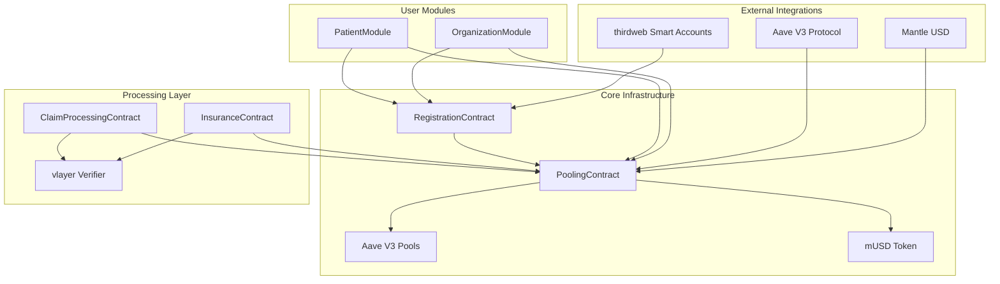
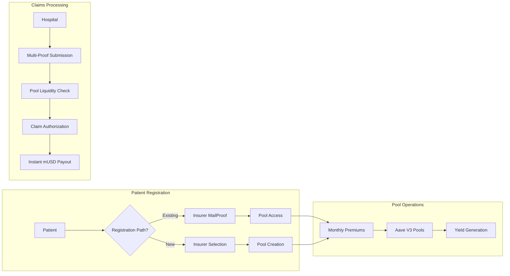

# zkMed Technical Context - Pool-Enabled Healthcare Platform

**Purpose**: Complete technical foundation for the revolutionary zkMed healthcare platform featuring Aave V3 pool integration, Mantle USD (mUSD) processing, dual patient registration paths, and comprehensive local fork testing environment.

---

## 🏗️ CORE TECHNOLOGY STACK

### Blockchain & Smart Contract Infrastructure

#### Primary Blockchain: **Mantle Network**
- **Target Network**: Mantle mainnet with native mUSD integration
- **Development Environment**: Local Mantle fork (Chain ID: 31339)
- **Benefits**: Lower transaction costs, native stablecoin, thirdweb partnership
- **Cookathon Integration**: Optimized for The Cookathon hackathon submission

#### Smart Contract Development
- **Framework**: Foundry (Forge, Cast, Anvil)
- **Language**: Solidity ^0.8.20
- **Testing**: Comprehensive test suite with 100% coverage target
- **Deployment**: Mantle-optimized deployment scripts

#### Local Development Environment
```bash
# Mantle Fork Configuration
FORK_URL=https://rpc.mantle.xyz
CHAIN_ID=31339
BLOCK_NUMBER=latest # Fork from current Mantle state

# Container Setup
Docker: mantle-dev-environment
Port: 8545 (Anvil RPC)
State: Real Mantle mainnet contracts available
```

---

## 💰 REVOLUTIONARY POOLING INFRASTRUCTURE

### Aave V3 Pool Integration

#### Core Pool Architecture
- **Pool Management**: Automated healthcare fund pooling via Aave V3 protocols
- **Yield Generation**: 3-5% APY on idle healthcare funds (patients & insurers)
- **Instant Liquidity**: Proven Aave mechanisms ensure immediate claim payouts
- **Risk Management**: Battle-tested parameters protect deposited funds

#### Technical Integration Points
```solidity
// Aave V3 Interfaces
import "@aave/core-v3/contracts/interfaces/IPool.sol";
import "@aave/core-v3/contracts/interfaces/IPoolAddressesProvider.sol";

// Key Integration Functions
aavePool.supply(address(mUSD), amount, address(this), 0);
aavePool.withdraw(address(mUSD), amount, hospital);
```

#### Pool Performance Metrics
- **Patient Pools**: Individual premium deposits earning yield until claims
- **Insurer Pools**: Operational fund deposits generating returns
- **Yield Distribution**: 60% patients, 20% insurers, 20% protocol
- **Liquidity Monitoring**: Real-time pool balance and utilization tracking

---

## 🪙 NATIVE STABLECOIN PROCESSING

### Mantle USD (mUSD) Integration

#### Technical Benefits
- **Native Integration**: Official Mantle stablecoin eliminates bridge risks
- **Simplified Architecture**: Direct mUSD processing removes oracle dependencies
- **Lower Costs**: Native asset reduces transaction fees
- **Enhanced Security**: No external price feeds or conversion mechanisms

#### Smart Contract Integration
```solidity
// Direct mUSD Processing
IERC20 public mUSD = IERC20(MANTLE_USD_ADDRESS);

// Premium Payments
mUSD.transferFrom(patient, poolContract, premiumAmount);

// Claim Payouts
mUSD.transfer(hospital, authorizedAmount);
```

#### Replaced Technology (Removed)
- ~~Flare FTSO Price Oracles~~ → Direct mUSD amounts
- ~~USD to USDC conversion~~ → Native mUSD processing
- ~~External price feeds~~ → Stable value by design
- ~~Oracle update mechanisms~~ → Eliminated entirely

---

## 🔐 MULTI-PROOF PRIVACY ARCHITECTURE

### vlayer Integration (Enhanced)

#### Proof Types Implementation
1. **MailProofs**: Organization domain verification via email validation
2. **WebProofs**: Patient portal and hospital system verification  
3. **ZK Proofs**: Privacy-preserving procedure validation within encrypted EHR

#### Technical Implementation
```javascript
// vlayer Prover Integration
const prover = new EmailDomainProver();

// MailProof Generation
const mailProof = await prover.verifyOrganization(emailData);

// WebProof Generation  
const webProof = await prover.verifyPortalAccess(patientData);

// ZK Proof Generation
const zkProof = await prover.verifyProcedureCoverage(ehrData);
```

#### Privacy Guarantees
- **Zero Medical Data Exposure**: Procedures validated via ZK proofs only
- **Domain Verification**: MailProofs prevent organization impersonation
- **Portal Validation**: WebProofs confirm legitimate system access
- **Combined Security**: Multi-proof architecture maximizes security

---

## 🎭 DUAL REGISTRATION INNOVATION

### Enhanced Patient Onboarding

#### Registration Path A: Existing Insurance Coverage
```solidity
function registerPatientWithInsurer(
    bytes32 commitment,
    address existingInsurer,
    bytes memory mailProof
) external {
    // Verify insurer mailproof
    require(verifyInsurerProof(mailProof, existingInsurer), "Invalid insurer proof");
    
    // Store privacy-preserving commitment
    patientCommitments[msg.sender] = commitment;
    
    // Link to existing insurer pool
    poolingContract.linkToExistingPool(msg.sender, existingInsurer);
}
```

#### Registration Path B: New Insurance Selection
```solidity
function registerPatientWithSelection(
    bytes32 commitment,
    address selectedInsurer,
    uint256 monthlyPremium
) external {
    // Record patient selection
    patientSelections[msg.sender] = InsuranceSelection({
        insurer: selectedInsurer,
        premium: monthlyPremium,
        startTime: block.timestamp
    });
    
    // Create new patient pool
    poolingContract.createPatientPool(msg.sender, selectedInsurer, monthlyPremium);
}
```

#### Technical Benefits
- **Flexible Onboarding**: Accommodates both existing and new insurance scenarios
- **Pool Integration**: Both paths enable yield generation on healthcare funds
- **Privacy Preservation**: Medical details remain encrypted regardless of registration path
- **Automated Payments**: Seamless monthly premium processing via pool contracts

---

## 🚀 THIRDWEB AUTHENTICATION & SPONSORSHIP

### Smart Account Integration

#### Gas Sponsorship Architecture
- **Provider**: thirdweb Smart Accounts with built-in paymaster
- **Sponsored Actions**: Patient registration, premium payments, claim submissions
- **Cost Optimization**: Reduces barrier to entry for healthcare platform users
- **Mantle Compatibility**: Optimized for Mantle network gas pricing

#### Technical Implementation
```typescript
// thirdweb Smart Account Setup
const smartAccount = new SmartAccount({
  chain: mantleChain,
  gasless: true,
  bundlerUrl: THIRDWEB_BUNDLER_URL,
  paymasterUrl: THIRDWEB_PAYMASTER_URL,
});

// Sponsored Transaction Execution
await smartAccount.sendTransaction({
  to: registrationContract.address,
  data: registrationContract.interface.encodeFunctionData("registerPatientWithSelection", [
    commitment,
    selectedInsurer,
    monthlyPremium
  ]),
});
```

#### Cookathon Alignment
- **Official Partnership**: thirdweb is official Cookathon partner
- **Competitive Advantage**: Leverages official tools for seamless UX
- **Prize Track Alignment**: Maximizes compatibility with hackathon criteria

---

## 🧪 COMPREHENSIVE TESTING ENVIRONMENT

### Local Mantle Fork Strategy

#### Development Environment Setup
```bash
# Start Mantle Fork
anvil \
  --fork-url https://rpc.mantle.xyz \
  --chain-id 31339 \
  --port 8545 \
  --accounts 10 \
  --balance 1000000

# Deploy Aave V3 Pools
forge script DeployAavePools --fork-url http://localhost:8545

# Setup mUSD Integration
forge script SetupMantleUSD --fork-url http://localhost:8545
```

#### Testing Strategy
1. **Unit Testing**: Individual contract function validation
2. **Integration Testing**: Pool interaction workflows
3. **End-to-End Testing**: Complete claim processing flows
4. **Performance Testing**: Gas optimization and throughput
5. **Security Testing**: Multi-proof validation and edge cases

#### Benefits of Local Fork Testing
- **Real State Access**: Fork provides access to actual Mantle contracts
- **Zero Cost Testing**: Unlimited testing without mainnet fees
- **Instant Feedback**: Immediate transaction confirmation
- **Safe Environment**: No risk to real funds or data

---

## 📊 DEVELOPMENT TOOLS & INFRASTRUCTURE

### Foundry Development Suite

#### Core Tools
```bash
# Testing Framework
forge test --gas-report --coverage

# Deployment Scripts
forge script DeployAll --broadcast --verify

# Contract Interaction
cast call $CONTRACT "getPatientPool(address)" $PATIENT_ADDRESS

# State Inspection
cast storage $POOLING_CONTRACT 0 --rpc-url http://localhost:8545
```

#### Advanced Features
- **Gas Profiling**: Optimize contract efficiency
- **Coverage Reports**: Ensure comprehensive testing
- **State Fuzzing**: Automated edge case discovery
- **Integration Testing**: Multi-contract workflows

### Development Workflow
```bash
# 1. Start Local Environment
make start-mantle-fork

# 2. Deploy Contracts
make deploy-local

# 3. Setup Pools
make setup-aave-pools

# 4. Run Tests
make test-all

# 5. Integration Testing
make test-e2e

# 6. Pool Performance Testing
make test-yield-generation
```

---

## 🎯 INTEGRATION ARCHITECTURE

### Contract Dependency Graph



### Data Flow Architecture



---

## 🔧 OPTIMIZATION STRATEGIES

### Gas Optimization Techniques

#### Smart Contract Optimization
```solidity
// Packed structs for storage efficiency
struct PatientPool {
    address patient;      // 20 bytes
    address insurer;      // 20 bytes
    uint128 monthlyPremium; // 16 bytes (reduced from uint256)
    uint128 totalDeposited; // 16 bytes
    uint64 lastDepositTime; // 8 bytes
    bool isActive;        // 1 byte
}
```

#### Batch Operations
```solidity
// Batch premium processing
function batchDepositPremiums(address[] calldata patients) external {
    for (uint256 i = 0; i < patients.length; i++) {
        _depositMonthlyPremium(patients[i]);
    }
}

// Batch claim authorization
function batchAuthorizeClaims(uint256[] calldata claimIds) external {
    for (uint256 i = 0; i < claimIds.length; i++) {
        _authorizeClaimPayout(claimIds[i]);
    }
}
```

### Pool Performance Optimization

#### Aave Integration Efficiency
- **Batch Deposits**: Combine multiple premium deposits into single Aave supply
- **Strategic Withdrawals**: Optimize withdrawal timing for maximum yield
- **Liquidity Management**: Dynamic rebalancing based on claim volume patterns
- **Yield Calculation**: Efficient computation of proportional returns

---

## �� MONITORING & ANALYTICS

### Real-Time Pool Monitoring

#### Key Metrics Tracking
```solidity
// Pool Performance Metrics
struct PoolMetrics {
    uint256 totalDeposited;
    uint256 totalYieldEarned;
    uint256 averageAPY;
    uint256 claimsProcessed;
    uint256 averagePayoutTime;
    uint256 utilizationRate;
}

// Yield Distribution Tracking
struct YieldDistribution {
    uint256 patientReturns;
    uint256 insurerReturns;
    uint256 protocolReturns;
    uint256 distributionTimestamp;
}
```

#### Analytics Dashboard Integration
- **Pool Performance**: Real-time yield tracking and utilization metrics
- **Patient Benefits**: Effective premium costs after yield generation
- **Insurer Metrics**: Operational fund performance and claim efficiency
- **System Health**: Overall platform performance and growth metrics

---

## 🔒 SECURITY ARCHITECTURE

### Multi-Layer Security Strategy

#### Smart Contract Security
1. **Formal Verification**: Mathematical proof of contract correctness
2. **Comprehensive Testing**: 100% code coverage with edge case validation
3. **Access Control**: Role-based permissions with multi-owner management
4. **Upgrade Patterns**: Proxy contracts for safe feature additions

#### Privacy Protection
1. **Zero-Knowledge Proofs**: Medical data never exposed on-chain
2. **Commitment Schemes**: Patient identity protection via cryptographic commitments
3. **Encrypted Storage**: All sensitive data encrypted before IPFS storage
4. **Minimal Data**: Only essential hashes and proofs stored on-chain

#### Pool Security
1. **Aave Integration**: Leverage battle-tested DeFi protocols
2. **Liquidity Validation**: Pre-authorization pool balance checks
3. **Yield Protection**: Automated distribution prevents fund accumulation
4. **Emergency Procedures**: Circuit breakers for unusual activity

---

## 🎉 TECHNICAL ACHIEVEMENTS

### Innovation Highlights

#### Revolutionary Pool Integration
- ✅ First healthcare platform with yield-generating fund pools
- ✅ Seamless Aave V3 integration for proven liquidity mechanisms
- ✅ Automated yield distribution maintaining stakeholder incentives
- ✅ Real-time pool performance monitoring and optimization

#### Simplified Architecture
- ✅ Native mUSD processing eliminates oracle dependencies
- ✅ Direct stablecoin handling reduces complexity and risks
- ✅ Streamlined claim processing with instant payouts
- ✅ Enhanced security through reduced external dependencies

#### Advanced Privacy Technology
- ✅ Multi-proof validation architecture (ZK + Web + Mail)
- ✅ Complete medical data privacy preservation
- ✅ Zero-knowledge procedure validation systems
- ✅ Privacy-preserving pool performance metrics

#### Dual Registration Innovation
- ✅ Flexible patient onboarding for all insurance scenarios
- ✅ Pool-enabled benefits regardless of registration path
- ✅ Automated payment systems with yield tracking
- ✅ Market-driven insurer competition optimization

### Competitive Advantages

#### Technical Superiority
- **Capital Efficiency**: Only platform generating yield on healthcare funds
- **Instant Processing**: Aave-powered immediate claim payouts
- **Privacy-First**: Advanced multi-proof validation without data exposure
- **Native Integration**: Mantle ecosystem optimization for lower costs

#### Market Position
- **Cookathon Optimization**: Aligned with hackathon requirements and judging criteria
- **thirdweb Partnership**: Leverages official sponsor tools for competitive edge
- **Proven Technology**: Built on battle-tested Aave protocols for reliability
- **Scalable Architecture**: Designed for mainstream healthcare adoption

**zkMed delivers the world's first privacy-preserving healthcare platform with revolutionary yield-generating pools, setting new standards for both capital efficiency and medical privacy in Web3 healthcare!** 🚀 