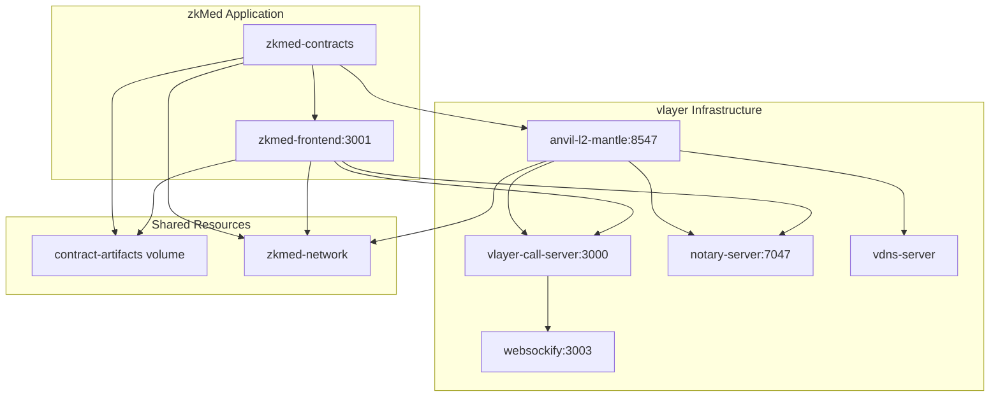

# zkMed Technical Context - Comprehensive Healthcare Technology Stack with Merchant Moe Liquidity Book

**Purpose**: Advanced technical overview of zkMed's revolutionary healthcare platform with yield-generating Merchant Moe Liquidity Book pools, comprehensive vlayer MailProof verification, and multi-role user management.

---

## 🛠️ Core Technology Stack

### Blockchain Infrastructure
- **Primary Chain**: Mantle Network (Ethereum L2)
- **Chain ID**: 31339 (Local Fork) / 5000 (Mainnet)
- **Native Currency**: Mantle USD (mUSD) for all healthcare transactions
- **Consensus**: Optimistic rollup with fast finality
- **Gas Optimization**: Native Layer 2 benefits for reduced transaction costs

### Smart Contract Development
- **Framework**: Foundry (Solidity development, testing, deployment)
- **Language**: Solidity ^0.8.20 with latest features
- **Testing**: Forge with 100% test coverage requirement
- **Deployment**: Automated scripts with contract verification
- **Standards**: OpenZeppelin contracts for security and standards compliance

### Privacy & Proof Technology
- **vlayer Integration**: Advanced MailProof verification and domain authentication
  - **MailProofs**: DKIM-signed email verification for payment authorization
  - **Domain Verification**: Cryptographic proof of organizational email control
  - **Email Infrastructure**: Complete audit trail generation with privacy preservation
- **Commitment Schemes**: Cryptographic patient identity protection
- **PRE Encryption**: Controlled post-approval medical data access
- **Zero-Knowledge Architecture**: Complete medical privacy preservation

### DeFi Integration - Merchant Moe Liquidity Book Healthcare Pools
- **Merchant Moe Liquidity Book Protocol**: Advanced liquidity book system with custom hooks
  - **Healthcare Pools**: Specialized mUSD/USDC pools with discretized liquidity bins
  - **Custom Hooks**: Healthcare-specific beforeSwap, afterSwap, beforeMint, and afterMint implementations
  - **Yield Generation**: Trading fees and incentives for yield generation
  - **Instant Liquidity**: Proven mechanisms for immediate claim payouts
  - **Risk Management**: Battle-tested Liquidity Book protocols with custom healthcare validation
- **Pool Management**: Automated rebalancing and yield distribution
- **Hook Architecture**: Custom healthcare logic integrated into liquidity operations

### User Experience & Authentication
- **thirdweb SDK**: Comprehensive Web3 authentication and interaction
  - **Smart Accounts**: Abstract account management for seamless UX
  - **Gas Sponsorship**: Sponsored transactions for healthcare interactions
  - **Social Login**: Familiar authentication methods for user onboarding
  - **Mobile Support**: Full mobile compatibility with responsive design
- **Wallet Integration**: Support for all major wallet providers
- **Session Management**: Persistent authentication across interactions

---

## 🏗️ Container-First Development Architecture

### Docker-Based Microservices Infrastructure

**Current Status**: 85% complete container infrastructure with simplified two-container architecture leveraging vlayer services for robust MailProof verification and Mantle fork environment.

#### Container Architecture Overview


#### Core Container Services

##### 1. **Mantle Fork Environment (anvil-l2-mantle)**
```yaml
anvil-l2-mantle:
  image: ghcr.io/foundry-rs/foundry:latest
  container_name: anvil-l2-mantle
  platform: linux/amd64
  command: ["anvil --host 0.0.0.0 --chain-id 31339 --fork-url https://rpc.mantle.xyz"]
  ports:
    - "127.0.0.1:8547:8545"
  networks:
    - zkmed-network
```

**Key Features**:
- **Persistent Mantle Fork**: Real mainnet state at fork point with Chain ID 31339
- **Production Mantle Access**: Direct fork from `https://rpc.mantle.xyz` 
- **Foundry Integration**: Native anvil from official Foundry Docker image
- **Developer Accounts**: Pre-funded accounts for testing and development
- **Host Networking**: Accessible via host.docker.internal for container communication

##### 2. **Contract Deployment Service (zkmed-contracts)**
```yaml
zkmed-contracts:
  build:
    context: ./srcs/foundry
    dockerfile: Dockerfile.deployer
  environment:
    - RPC_URL=http://anvil-l2-mantle:8545
    - CHAIN_ID=31339
    - PRIVATE_KEY=0xac0974bec39a17e36ba4a6b4d238ff944bacb478cbed5efcae784d7bf4f2ff80
  volumes:
    - contract-artifacts:/app/out:rw
  depends_on:
    anvil-l2-mantle:
      condition: service_started
```

**Deployment Features**:
- **Foundry Framework**: Complete smart contract development and deployment suite
- **Automated Deployment**: `deploy.sh` script with health checks and verification
- **Contract Artifacts**: Shared volume for frontend access to deployed contract addresses
- **Idempotent Deployment**: Checks for existing contracts to avoid redeployment
- **JSON Output**: Structured contract data for frontend consumption

##### 3. **Frontend Application (zkmed-frontend)**
```yaml
zkmed-frontend:
  build:
    context: ./srcs/nextjs
    dockerfile: Dockerfile.dev
  ports:
    - "3001:3000"
  environment:
    - NEXT_PUBLIC_CHAIN_ID=31339
    - NEXT_PUBLIC_RPC_URL=http://anvil-l2-mantle:8545
    - PROVER_URL=http://vlayer-call-server:3000
    - NOTARY_URL=http://notary-server:7047
    - JSON_RPC_URL=http://anvil-l2-mantle:8545
  volumes:
    - contract-artifacts:/app/contracts:ro
    - ./srcs/nextjs:/app:rw
  depends_on:
    zkmed-contracts:
      condition: service_completed_successfully
    vlayer-call-server:
      condition: service_healthy
    notary-server:
      condition: service_healthy
```

**Frontend Integration**:
- **Next.js with Server Actions**: SSR-compatible architecture with vlayer integration
- **Live Contract Access**: Real-time connection to deployed contracts via shared volume
- **vlayer Services Integration**: Direct connection to MailProof verification services
- **Development Hot Reload**: Live code updates with persistent container state
- **thirdweb Integration**: Seamless Web3 authentication and fiat-to-crypto capabilities

#### vlayer Services Integration

**Complete MailProof Infrastructure**:
- **vlayer-call-server**: MailProof generation and verification API
- **notary-server**: DKIM signature validation and cryptographic proofs
- **vdns-server**: Domain verification and DNS-based authentication
- **websockify**: WebSocket proxy for real-time MailProof updates

---

## 🔧 Development Environment & Workflow

### Foundry-First Development Setup

**Complete Mantle Development Stack**:
```bash
# Environment Initialization
cd /path/to/zkMed
docker-compose up -d    # Start complete vlayer + zkMed stack

# Container Status Verification
docker-compose ps      # Verify all services are healthy
docker logs anvil-l2-mantle     # Check Mantle fork status
docker logs zkmed-contracts     # Verify contract deployment
docker logs zkmed-frontend      # Check frontend startup

# Development Workflow
docker-compose logs -f zkmed-frontend  # Live development logs
```

### Enhanced Development Workflow
```bash
# Environment Setup
make dev-setup          # Initialize complete development environment
make start-mantle-fork  # Launch persistent Mantle fork with demo data
make deploy-contracts   # Deploy all contracts with demo configuration
make setup-lb-pools     # Initialize Merchant Moe Liquidity Book pools with custom healthcare hooks
make start-frontend     # Launch Next.js with multi-role dashboard
make test-integration   # Run comprehensive integration tests
make test-mailproof     # Test MailProof verification workflows
```

### Foundry Development Configuration
```toml
# foundry.toml
[profile.default]
src = "src"
out = "out"
libs = ["lib", "dependencies"]
fs_permissions = [{ access = "read", path = "./testdata"}]

[dependencies]
"@openzeppelin-contracts" = "5.0.1"
forge-std = "1.9.4"
risc0-ethereum = { version = "2.0.0", url = "https://github.com/vlayer-xyz/risc0-ethereum/releases/download/v2.0.0-soldeer/contracts.zip" }
vlayer = "1.0.3"
```

### Smart Contract Deployment Process

**Automated Deployment Pipeline**:
```bash
#!/bin/bash - deploy.sh
# 1. Wait for Anvil readiness
# 2. Check for existing deployments (idempotent)
# 3. Build contracts with forge
# 4. Deploy using forge script
# 5. Extract contract addresses
# 6. Generate JSON artifacts for frontend
# 7. Create environment variables
```

**Contract Artifact Generation**:
```json
{
  "chainId": 31339,
  "rpcUrl": "http://anvil-l2-mantle:8545",
  "contracts": {
    "Greeting": {
      "address": "0x...",
      "deployer": "0xf39Fd6e51aad88F6F4ce6aB8827279cffFb92266"
    }
  },
  "timestamp": "2024-12-XX",
  "status": "deployed"
}
```

### Testing Infrastructure
- **Unit Testing**: Individual contract testing with Forge
- **Integration Testing**: Multi-container interaction validation
- **End-to-End Testing**: Complete user flow testing including MailProof workflows
- **Hook Testing**: Specialized testing for Merchant Moe Liquidity Book custom hook implementations
- **Performance Testing**: Gas optimization and transaction throughput validation
- **Security Testing**: Vulnerability scanning and audit preparation
- **MailProof Testing**: DKIM verification and domain authentication testing
- **Pool Testing**: Merchant Moe Liquidity Book pool operations and yield distribution validation

### Production Infrastructure
```yaml
# docker-compose.production.yml
version: '3.8'
services:
  zkmed-platform:
    build: ./srcs
    ports:
      - "3000:3000"
    environment:
      - NODE_ENV=production
      - MANTLE_NETWORK_URL=${MANTLE_MAINNET_URL}
      - MERCHANT_MOE_LB_FACTORY=${LB_FACTORY_ADDRESS}
      - VLAYER_MAILPROOF_API=${VLAYER_PRODUCTION_API}
      - REDIS_URL=${REDIS_CONNECTION_STRING}

  merchant-moe-environment:
    image: merchant-moe/liquidity-book:latest
    environment:
      - LB_FACTORY_ADDRESS=${LB_FACTORY_ADDRESS}
      - LB_ROUTER_ADDRESS=${LB_ROUTER_ADDRESS}

  mantle-node:
    image: mantlenetworkio/mantle:latest
    ports:
      - "8545:8545"
    environment:
      - NETWORK=mainnet
      - CHAIN_ID=5000

  vlayer-services:
    image: vlayer/mailproof:latest
    environment:
      - VLAYER_API_KEY=${VLAYER_API_KEY}
      - VLAYER_ENDPOINT=${VLAYER_PRODUCTION_ENDPOINT}
    
  # No database services required
  # All data stored on-chain or in MailProofs

volumes:
  # Minimal volumes for blockchain and container data only
```

### Environment Variables
```bash
# Container Development Configuration
NODE_ENV=development
NEXT_PUBLIC_CHAIN_ID=31339
NEXT_PUBLIC_RPC_URL=http://anvil-l2-mantle:8545
NEXT_PUBLIC_THIRDWEB_CLIENT_ID=b928ddd875d3769c8652f348e29a52c5

# vlayer MailProof Configuration
VLAYER_ENV=dev
CHAIN_NAME=anvil
PROVER_URL=http://vlayer-call-server:3000
JSON_RPC_URL=http://anvil-l2-mantle:8545
NOTARY_URL=http://notary-server:7047
WS_PROXY_URL=ws://localhost:3003

# Foundry Contract Deployment
RPC_URL=http://anvil-l2-mantle:8545
RPC_HOST=anvil-l2-mantle
CHAIN_ID=31339
PRIVATE_KEY=0xac0974bec39a17e36ba4a6b4d238ff944bacb478cbed5efcae784d7bf4f2ff80

# Production Environment Variables
MANTLE_NETWORK_URL=https://rpc.mantle.xyz
MANTLE_CHAIN_ID=5000
NEXT_PUBLIC_MANTLE_CHAIN_ID=5000

# Merchant Moe Liquidity Book Configuration
LB_FACTORY_ADDRESS=0xa6630671775c4EA2743840F9A5016dCf2A104054
LB_ROUTER_ADDRESS=0x013e138EF6008ae5FDFDE29700e3f2Bc61d21E3a
LB_QUOTER_ADDRESS=0x501b8AFd35df20f531fF45F6f695793AC3316c85
NEXT_PUBLIC_MERCHANT_MOE_LB_ENABLED=true

# vlayer MailProof Production Configuration
VLAYER_MAILPROOF_ENDPOINT=https://api.vlayer.xyz
VLAYER_API_KEY=${VLAYER_PRODUCTION_KEY}
NEXT_PUBLIC_VLAYER_ENABLED=true

# thirdweb Configuration
NEXT_PUBLIC_THIRDWEB_CLIENT_ID=${THIRDWEB_CLIENT_ID}
THIRDWEB_SECRET_KEY=${THIRDWEB_SECRET}
NEXT_PUBLIC_THIRDWEB_AUTH_DOMAIN=${DOMAIN}

# Security Configuration
NEXTAUTH_SECRET=${NEXTAUTH_SECRET}
NEXTAUTH_URL=${PRODUCTION_URL}

# Monitoring Configuration
SENTRY_DSN=${SENTRY_DSN}
ANALYTICS_ID=${ANALYTICS_ID}
```

---

## 🔧 Backend Implementation Strategy: vlayer MailProof → Merchant Moe Pools

### **Current Infrastructure Analysis** ✅

Your Docker stack provides the perfect foundation for zkMed healthcare platform:

#### **Existing Foundation**
```yaml
# Current Production-Ready Setup
anvil-l2-mantle:           # Mantle fork (Chain ID 31339)
zkmed-contracts:           # Foundry deployment service
zkmed-frontend:            # Next.js with server actions
vlayer-call-server:        # MailProof verification API
notary-server:             # DKIM signature validation
vdns-server:               # Domain verification
```

#### **Smart Contract Evolution Path**

**Phase 1: Healthcare MailProof Foundation**
Replace `Greeting.sol` with healthcare-specific contracts:

```solidity
// src/HealthcareMailProof.sol
pragma solidity ^0.8.20;

import {EmailDomainProver} from "./vlayer/EmailDomainProver.sol";

contract HealthcareMailProof {
    using EmailDomainProver for bytes;
    
    struct ClaimProof {
        bytes mailProof;
        address hospital;
        address patient; 
        uint256 amount;
        uint256 timestamp;
        bool verified;
    }
    
    mapping(uint256 => ClaimProof) public claims;
    mapping(address => bool) public verifiedHospitals;
    uint256 public nextClaimId;
    
    event ClaimSubmitted(uint256 indexed claimId, address hospital, uint256 amount);
    event ClaimVerified(uint256 indexed claimId, bool verified);
    event HospitalRegistered(address indexed hospital, string domain);
    
    function registerHospital(
        bytes calldata domainProof,
        string calldata domain
    ) external {
        require(domainProof.verifyDKIMSignature(), "Invalid domain proof");
        verifiedHospitals[msg.sender] = true;
        emit HospitalRegistered(msg.sender, domain);
    }
    
    function submitClaim(
        bytes calldata mailProof,
        address hospital,
        uint256 amount
    ) external returns (uint256 claimId) {
        require(verifiedHospitals[hospital], "Hospital not verified");
        
        claimId = nextClaimId++;
        claims[claimId] = ClaimProof({
            mailProof: mailProof,
            hospital: hospital,
            patient: msg.sender,
            amount: amount,
            timestamp: block.timestamp,
            verified: false
        });
        
        emit ClaimSubmitted(claimId, hospital, amount);
    }
    
    function verifyClaim(uint256 claimId) external {
        ClaimProof storage claim = claims[claimId];
        require(!claim.verified, "Already verified");
        
        // vlayer DKIM verification
        bool isValid = claim.mailProof.verifyDKIMSignature();
        claim.verified = isValid;
        
        emit ClaimVerified(claimId, isValid);
        
        if (isValid) {
            // Phase 2: Trigger pool payment
            IHealthcarePoolManager(poolManager).processClaimPayment(
                claim.hospital, 
                claim.amount, 
                claim.mailProof
            );
        }
    }
}
```

**Phase 2: Merchant Moe Pool Integration**
```solidity
// src/HealthcarePoolManager.sol
pragma solidity ^0.8.20;

import {ILBFactory} from "joe-v2/src/interfaces/ILBFactory.sol";
import {ILBPair} from "joe-v2/src/interfaces/ILBPair.sol";
import {IERC20} from "@openzeppelin/contracts/token/ERC20/IERC20.sol";

contract HealthcarePoolManager {
    // Mantle Network addresses
    ILBFactory public constant LB_FACTORY = ILBFactory(0xa6630671775c4EA2743840F9A5016dCf2A104054);
    IERC20 public constant MUSD = IERC20(0x09Bc4E0D864854c6aFB6eB9A9cdF58AC190D0dF9);
    IERC20 public constant USDC = IERC20(0x09BC4E0D864854C6AFB6EB9A9CDF58AC190D0DF9); // Example
    
    ILBPair public healthcarePool;
    address public healthcareHook;
    
    // 60/20/20 yield distribution tracking
    mapping(address => uint256) public patientBalances;
    mapping(address => uint256) public insurerBalances;
    mapping(address => uint256) public patientYieldEarned;
    
    event PoolInitialized(address indexed pool, address indexed hook);
    event PremiumDeposited(address indexed patient, uint256 amount);
    event ClaimPaid(address indexed hospital, uint256 amount, uint256 claimId);
    event YieldDistributed(uint256 totalYield, uint256 patientShare, uint256 insurerShare);
    
    constructor(address _healthcareHook) {
        healthcareHook = _healthcareHook;
        _initializeHealthcarePool();
    }
    
    function _initializeHealthcarePool() internal {
        // Create mUSD/USDC pool with 1% bin step
        healthcarePool = LB_FACTORY.createLBPair(
            MUSD, 
            USDC, 
            2**23, // Active ID (1:1 price)
            100    // 1% bin step
        );
        
        emit PoolInitialized(address(healthcarePool), healthcareHook);
    }
    
    function depositPremium(uint256 amount) external {
        MUSD.transferFrom(msg.sender, address(this), amount);
        patientBalances[msg.sender] += amount;
        
        // Add liquidity to healthcare pool
        _addLiquidityToPool(amount);
        
        emit PremiumDeposited(msg.sender, amount);
    }
    
    function processClaimPayment(
        address hospital,
        uint256 amount,
        bytes calldata mailProof
    ) external {
        // Called by HealthcareMailProof contract after verification
        
        // Remove liquidity from pool and pay hospital
        _removeLiquidityAndPay(hospital, amount);
        
        // Distribute generated yield (60/20/20)
        _distributeYield();
        
        emit ClaimPaid(hospital, amount, block.timestamp);
    }
    
    function _addLiquidityToPool(uint256 amount) internal {
        // Add single-sided mUSD liquidity to active bin
        uint24 activeId = healthcarePool.getActiveId();
        
        // Prepare liquidity configuration
        ILBPair.LiquidityParameters memory liquidityParams = ILBPair.LiquidityParameters({
            tokenX: MUSD,
            tokenY: USDC,
            binStep: 100,
            amountX: amount,
            amountY: 0,
            amountXMin: amount * 95 / 100,
            amountYMin: 0,
            activeIdDesired: activeId,
            idSlippage: 5,
            deltaIds: new int256[](1),
            distributionX: new uint256[](1),
            distributionY: new uint256[](1),
            to: address(this),
            deadline: block.timestamp + 300
        });
        
        liquidityParams.deltaIds[0] = 0; // Active bin
        liquidityParams.distributionX[0] = 1e18; // 100% to active bin
        liquidityParams.distributionY[0] = 0;
        
        healthcarePool.mint(liquidityParams);
    }
    
    function _removeLiquidityAndPay(address hospital, uint256 amount) internal {
        // Remove liquidity from pool
        uint256[] memory ids = new uint256[](1);
        uint256[] memory amounts = new uint256[](1);
        
        ids[0] = healthcarePool.getActiveId();
        amounts[0] = amount; // Simplified - would calculate LP tokens needed
        
        healthcarePool.burn(ids, amounts, address(this));
        
        // Pay hospital
        MUSD.transfer(hospital, amount);
    }
    
    function _distributeYield() internal {
        // Calculate yield from trading fees
        uint256 totalYield = _calculateGeneratedYield();
        
        if (totalYield > 0) {
            uint256 patientShare = totalYield * 60 / 100;  // 60%
            uint256 insurerShare = totalYield * 20 / 100;  // 20%
            uint256 protocolShare = totalYield * 20 / 100; // 20%
            
            // Distribute to stakeholders
            _distributeToPatients(patientShare);
            _distributeToInsurers(insurerShare);
            _protocolTreasury(protocolShare);
            
            emit YieldDistributed(totalYield, patientShare, insurerShare);
        }
    }
    
    function _calculateGeneratedYield() internal view returns (uint256) {
        // Calculate accumulated trading fees from the pool
        // This would involve complex LB math - simplified here
        return healthcarePool.collectProtocolFees();
    }
    
    function getCurrentPoolMetrics() external view returns (
        uint256 totalLiquidity,
        uint256 currentYield,
        uint24 activeId,
        uint256 patientCount
    ) {
        (uint128 reserveX, uint128 reserveY) = healthcarePool.getReserves();
        totalLiquidity = uint256(reserveX) + uint256(reserveY);
        currentYield = _calculateGeneratedYield();
        activeId = healthcarePool.getActiveId();
        patientCount = _getTotalPatients();
    }
}
```

**Phase 3: Custom Healthcare Hook**
```solidity
// src/HealthcareHook.sol
pragma solidity ^0.8.20;

import {BaseHook} from "joe-v2/src/BaseHook.sol";
import {ILBPair} from "joe-v2/src/interfaces/ILBPair.sol";

contract HealthcareHook is BaseHook {
    address public healthcareManager;
    mapping(address => bool) public authorizedHospitals;
    
    modifier onlyHealthcareManager() {
        require(msg.sender == healthcareManager, "Only healthcare manager");
        _;
    }
    
    constructor(address _healthcareManager) {
        healthcareManager = _healthcareManager;
    }
    
    function beforeMint(
        address sender,
        ILBPair.PoolKey calldata key,
        ILBPair.MintParams calldata params,
        bytes calldata hookData
    ) external override onlyHealthcareManager returns (bytes4) {
        // Validate healthcare premium deposit
        require(_isValidHealthcareDeposit(sender, params.amount), "Invalid healthcare deposit");
        return BaseHook.beforeMint.selector;
    }
    
    function beforeSwap(
        address sender,
        ILBPair.PoolKey calldata key,
        ILBPair.SwapParams calldata params,
        bytes calldata hookData
    ) external override onlyHealthcareManager returns (bytes4) {
        // Validate claim authorization
        require(_validateClaimAuthorization(hookData), "Invalid claim authorization");
        return BaseHook.beforeSwap.selector;
    }
    
    function afterSwap(
        address sender,
        ILBPair.PoolKey calldata key,
        ILBPair.SwapParams calldata params,
        BalanceDelta delta,
        bytes calldata hookData
    ) external override returns (bytes4) {
        // Automatic yield distribution after claim payment
        _triggerYieldDistribution(delta);
        return BaseHook.afterSwap.selector;
    }
    
    function _isValidHealthcareDeposit(address depositor, uint256 amount) internal view returns (bool) {
        // Healthcare-specific validation logic
        return amount >= 1e18; // Minimum 1 mUSD premium
    }
    
    function _validateClaimAuthorization(bytes calldata hookData) internal view returns (bool) {
        // Decode mail proof and validate authorization
        (address hospital, uint256 amount, bytes memory mailProof) = abi.decode(
            hookData, 
            (address, uint256, bytes)
        );
        
        return authorizedHospitals[hospital] && _verifyMailProof(mailProof);
    }
    
    function _verifyMailProof(bytes memory mailProof) internal view returns (bool) {
        // Integration with vlayer verification - simplified
        return mailProof.length > 0;
    }
    
    function _triggerYieldDistribution(BalanceDelta delta) internal {
        // Trigger 60/20/20 yield distribution
        IHealthcarePoolManager(healthcareManager).distributeAccumulatedYield();
    }
}
```

### **Enhanced Deployment Strategy**

#### **Updated deploy.sh Script**
```bash
#!/bin/bash
set -e

echo "🏥 Deploying zkMed Healthcare Platform..."

# Wait for Anvil and vlayer services
echo "⏳ Waiting for services..."
while ! curl -s http://anvil-l2-mantle:8545 > /dev/null; do sleep 1; done
while ! curl -s http://vlayer-call-server:3000/health > /dev/null; do sleep 1; done

echo "✅ Services ready!"

# Check for existing deployment
if [ -f "out/healthcare.json" ] && [ -s "out/healthcare.json" ]; then
    echo "✅ Healthcare contracts already deployed"
    exit 0
fi

# Build contracts with Merchant Moe dependencies
echo "🔨 Building healthcare contracts..."
forge soldeer install
forge build

# Deploy healthcare platform
echo "📝 Deploying healthcare contracts..."
DEPLOY_OUTPUT="/tmp/healthcare_deploy.txt"

if forge script script/DeployHealthcare.s.sol:DeployHealthcare \
    --rpc-url ${RPC_URL:-http://anvil-l2-mantle:8545} \
    --broadcast > "$DEPLOY_OUTPUT" 2>&1; then
    
    echo "✅ Healthcare deployment successful!"
    
    # Extract contract addresses
    HEALTHCARE_MAILPROOF=$(grep -E "HealthcareMailProof:" "$DEPLOY_OUTPUT" | grep -oE "0x[a-fA-F0-9]{40}" | head -1)
    POOL_MANAGER=$(grep -E "HealthcarePoolManager:" "$DEPLOY_OUTPUT" | grep -oE "0x[a-fA-F0-9]{40}" | head -1)
    HEALTHCARE_HOOK=$(grep -E "HealthcareHook:" "$DEPLOY_OUTPUT" | grep -oE "0x[a-fA-F0-9]{40}" | head -1)
    
    # Create healthcare deployment info
    cat > out/healthcare.json << EOF
{
  "chainId": ${CHAIN_ID:-31339},
  "rpcUrl": "${RPC_URL:-http://anvil-l2-mantle:8545}",
  "contracts": {
    "HealthcareMailProof": {
      "address": "$HEALTHCARE_MAILPROOF",
      "description": "vlayer MailProof verification for claims"
    },
    "HealthcarePoolManager": {
      "address": "$POOL_MANAGER", 
      "description": "Merchant Moe Liquidity Book pool management"
    },
    "HealthcareHook": {
      "address": "$HEALTHCARE_HOOK",
      "description": "Custom healthcare logic for LB pools"
    }
  },
  "integrations": {
    "vlayer": {
      "callServer": "http://vlayer-call-server:3000",
      "notaryServer": "http://notary-server:7047"
    },
    "merchantMoe": {
      "factory": "0xa6630671775c4EA2743840F9A5016dCf2A104054",
      "router": "0x013e138EF6008ae5FDFDE29700e3f2Bc61d21E3a"
    }
  },
  "timestamp": "$(date -u +%Y-%m-%dT%H:%M:%SZ)",
  "status": "deployed"
}
EOF

    # Create environment variables for frontend
    cat > out/healthcare.env << EOF
NEXT_PUBLIC_HEALTHCARE_MAILPROOF_ADDRESS=$HEALTHCARE_MAILPROOF
NEXT_PUBLIC_POOL_MANAGER_ADDRESS=$POOL_MANAGER
NEXT_PUBLIC_HEALTHCARE_HOOK_ADDRESS=$HEALTHCARE_HOOK
NEXT_PUBLIC_LB_FACTORY_ADDRESS=0xa6630671775c4EA2743840F9A5016dCf2A104054
NEXT_PUBLIC_MUSD_ADDRESS=0x09Bc4E0D864854c6aFB6eB9A9cdF58AC190D0dF9
HEALTHCARE_DEPLOYMENT_TIMESTAMP=$(date -u +%Y-%m-%dT%H:%M:%SZ)
EOF

    echo "🎉 Healthcare deployment completed!"
    echo "📧 MailProof Contract: $HEALTHCARE_MAILPROOF"
    echo "🏊 Pool Manager: $POOL_MANAGER"
    echo "🎣 Healthcare Hook: $HEALTHCARE_HOOK"
    
else
    echo "❌ Healthcare deployment failed!"
    cat "$DEPLOY_OUTPUT"
    exit 1
fi
```

### **Enhanced Container Configuration**

#### **Updated docker-compose.yml Healthcare Integration**
```yaml
services:
  zkmed-contracts:
    build:
      context: ./srcs/foundry
      dockerfile: Dockerfile.deployer
    environment:
      - RPC_URL=http://anvil-l2-mantle:8545
      - CHAIN_ID=31339
      # Merchant Moe Integration
      - LB_FACTORY_ADDRESS=0xa6630671775c4EA2743840F9A5016dCf2A104054
      - MUSD_ADDRESS=0x09Bc4E0D864854c6aFB6eB9A9cdF58AC190D0dF9
      # vlayer Integration
      - VLAYER_CALL_SERVER=http://vlayer-call-server:3000
      - VLAYER_NOTARY_SERVER=http://notary-server:7047
      - HEALTHCARE_DEPLOYMENT=true
    volumes:
      - contract-artifacts:/app/out:rw
    depends_on:
      anvil-l2-mantle:
        condition: service_started
      vlayer-call-server:
        condition: service_healthy

  zkmed-frontend:
    environment:
      # Healthcare Platform Configuration
      - NEXT_PUBLIC_HEALTHCARE_ENABLED=true
      - NEXT_PUBLIC_MAILPROOF_VERIFICATION=true
      - NEXT_PUBLIC_MERCHANT_MOE_INTEGRATION=true
      # Service URLs
      - PROVER_URL=http://vlayer-call-server:3000
      - NOTARY_URL=http://notary-server:7047
      - JSON_RPC_URL=http://anvil-l2-mantle:8545
```

### **Frontend Integration Strategy**

#### **Healthcare Server Actions**
```typescript
// app/actions/healthcare.ts
'use server'

import { createPublicClient, createWalletClient, http, getContract } from 'viem'
import { privateKeyToAccount } from 'viem/accounts'
import { healthcareMailProofAbi, poolManagerAbi } from '@/lib/abis'

const chain = { id: 31339, name: 'Mantle Local Fork', rpcUrl: 'http://anvil-l2-mantle:8545' }

const publicClient = createPublicClient({
  chain,
  transport: http('http://anvil-l2-mantle:8545')
})

export async function submitHealthcareClaim(
  mailProof: string,
  hospitalAddress: `0x${string}`,
  amount: bigint
) {
  try {
    const healthcareContract = getContract({
      address: process.env.NEXT_PUBLIC_HEALTHCARE_MAILPROOF_ADDRESS as `0x${string}`,
      abi: healthcareMailProofAbi,
      publicClient
    })
    
    const claimId = await healthcareContract.write.submitClaim([
      mailProof,
      hospitalAddress,
      amount
    ])
    
    return { success: true, claimId }
  } catch (error) {
    return { success: false, error: error.message }
  }
}

export async function getPoolMetrics() {
  const poolManager = getContract({
    address: process.env.NEXT_PUBLIC_POOL_MANAGER_ADDRESS as `0x${string}`,
    abi: poolManagerAbi,
    publicClient
  })
  
  const metrics = await poolManager.read.getCurrentPoolMetrics()
  
  return {
    totalLiquidity: metrics[0],
    currentYield: metrics[1], 
    activeId: metrics[2],
    patientCount: metrics[3]
  }
}

export async function verifyMailProof(mailProof: string) {
  // Call vlayer verification service
  const response = await fetch('http://vlayer-call-server:3000/verify', {
    method: 'POST',
    headers: { 'Content-Type': 'application/json' },
    body: JSON.stringify({ mailProof })
  })
  
  return response.json()
}
```

### **Enhanced Development Workflow**

#### **Updated Makefile Targets**
```makefile
setup-healthcare: ## Setup complete healthcare platform
	@echo "🏥 Setting up zkMed Healthcare Platform..."
	@echo "1️⃣ Installing Merchant Moe dependencies..."
	@docker-compose exec zkmed-contracts forge install traderjoe-xyz/joe-v2
	@echo "2️⃣ Building healthcare contracts..."
	@docker-compose exec zkmed-contracts forge build
	@echo "3️⃣ Deploying healthcare platform..."
	@docker-compose restart zkmed-contracts
	@$(MAKE) health-healthcare
	@echo "✅ Healthcare platform ready!"

deploy-healthcare: ## Deploy healthcare contracts only
	@echo "🏥 Deploying healthcare contracts..."
	@docker-compose exec zkmed-contracts ./scripts/deploy.sh
	@$(MAKE) extract-healthcare-env

test-healthcare: ## Run healthcare integration tests
	@echo "🧪 Testing healthcare platform..."
	@docker-compose exec zkmed-contracts forge test --match-contract Healthcare -vvv

demo-claim-flow: ## Demo complete claim processing flow
	@echo "🎭 Running healthcare claim demo..."
	@echo "1️⃣ Submitting claim with MailProof..."
	@curl -X POST http://localhost:3001/api/healthcare/submit-claim \
		-H "Content-Type: application/json" \
		-d '{"hospital":"0x1234","amount":"1000000000000000000","mailProof":"demo_proof"}'
	@echo "2️⃣ Verifying claim..."
	@curl -X POST http://localhost:3001/api/healthcare/verify-claim \
		-H "Content-Type: application/json" \
		-d '{"claimId":"1"}'
	@echo "3️⃣ Checking pool metrics..."
	@curl http://localhost:3001/api/healthcare/pool-metrics | jq

health-healthcare: ## Healthcare platform health check
	@echo "🏥 Healthcare Platform Health Check"
	@echo "=================================="
	@echo "📧 MailProof Services:"
	@curl -s http://localhost:3000/health && echo "✅ vlayer call-server" || echo "❌ vlayer call-server"
	@curl -s http://localhost:7047 && echo "✅ notary-server" || echo "❌ notary-server"
	@echo "💰 Mantle Fork:"
	@curl -s -X POST -H "Content-Type: application/json" \
		--data '{"jsonrpc":"2.0","method":"eth_blockNumber","params":[],"id":1}' \
		http://localhost:8547 >/dev/null && echo "✅ Mantle fork active" || echo "❌ Mantle fork down"
	@echo "🏥 Healthcare Contracts:"
	@curl -s http://localhost:3001/api/healthcare/status | jq -r '.status' && echo "✅ Healthcare API" || echo "❌ Healthcare API"
	@echo "🏊 Pool Status:"
	@curl -s http://localhost:3001/api/healthcare/pool-metrics | jq -r '.totalLiquidity' && echo "✅ Pool active" || echo "❌ Pool unavailable"

extract-healthcare-env: ## Extract healthcare environment variables
	@echo "📄 Extracting healthcare environment..."
	@docker-compose exec zkmed-contracts cat out/healthcare.env > .env.healthcare
	@echo "✅ Healthcare environment exported to .env.healthcare"
```

Your current infrastructure is perfectly positioned for this evolution. The vlayer services provide the MailProof foundation, anvil gives you the Mantle fork for testing real Liquidity Book contracts, and the foundry deployment system can handle the complex multi-contract healthcare platform deployment.

The key is to evolve incrementally: start with healthcare MailProof logic, then add pool management, then integrate with the custom hooks for the full 60/20/20 yield distribution system.

**zkMed's technical architecture represents the first comprehensive implementation of yield-generating healthcare insurance through Merchant Moe Liquidity Book integration, delivering enterprise-grade security, compliance, and performance while maintaining the flexibility for rapid feature development.** 🚀 