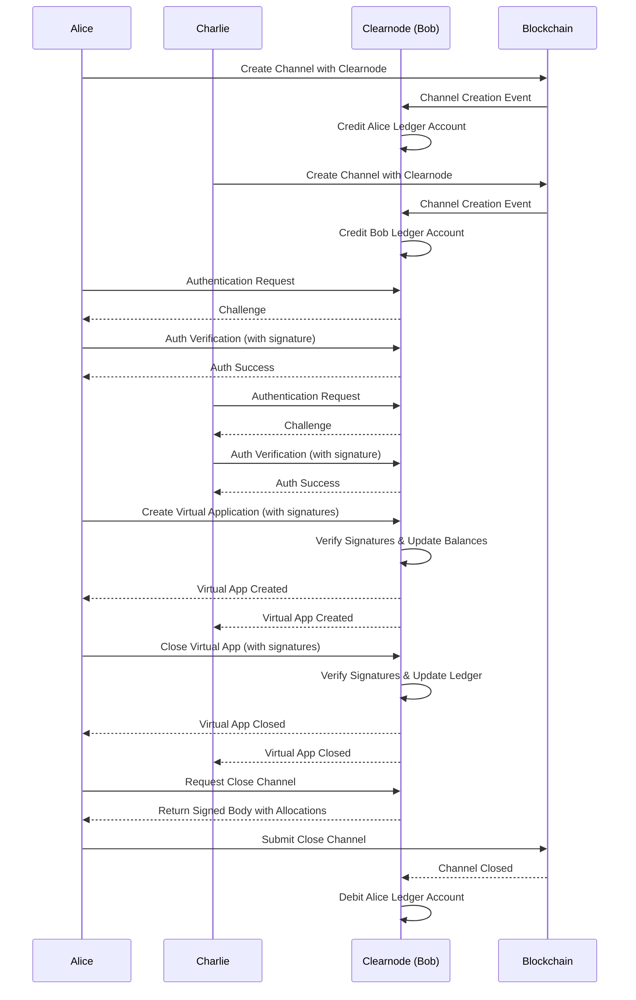

# Clearnode

Clearnode is an implementation of a message broker node providing ledger services for the Clearnet protocol, which enables efficient off-chain payment channels with on-chain settlement capabilities for fast payment channel applications. This system allows participants to conduct transactions without requiring on-chain operations for every exchange, significantly reducing transaction costs and improving efficiency.

## Features

- **Multi-Chain Support**: Connect to multiple EVM blockchains (Polygon, Celo, Base)
- **Off-Chain Payments**: Efficient payment channels for high-throughput transactions
- **Virtual Applications**: Create multi-participant applications
- **Message Forwarding**: Bi-directional message routing between application participants
- **Flexible Database**: Support for both PostgreSQL and SQLite
- **Prometheus Metrics**: Built-in monitoring and telemetry
- **Quorum-Based Signatures**: Support for multi-signature schemes with weight-based quorums

### Communication Protocol

- [Protocol Specification](docs/Clearnode.protocol.md): Describes the protocol architecture and message format
- [API Reference](docs/API.md): Detailed API endpoint documentation



## Authentication and security Policy

Each websocket connection must be authenticated by signing the Policy struct defined in nitrolite.
Main console scope is `console` and allows superuser access to clearnode administration.
Application must also connect to clearnode with limited scope permissions (`app.create`) to only `create_app_session`
for a specific application address, a maximum allocation limit and register and assign the participant session key
with an expiration date.

`create_app_session` must verify:

- Policy scope allow to create app
- Wallet in allocation match with policy wallet address
- The application address match with the policy value
- Allocation is within the permitted policy Allowance
- Participant address from policy is in the first value of app participant array

```solidity
struct Policy {
    string challenge; // Unique challenge identifier (UUID format)
    string scope; // Permission scope (e.g., "app.create", "ledger.readonly")
    address wallet; // Main wallet address authorizing the session
    address application; // Application public address
    address participant; // Delegated session key address
    uint256 expire; // Expiration timestamp
    Allowance[] allowances; // Array of asset allowances
}
```

Once authenticated, a JWT is return for session persistence:

```typescript
type JWTClaims struct {
 Scope       string      `json:"scope"`       // Permission scope (e.g., "app.create", "ledger.readonly")
 Wallet      string      `json:"wallet"`      // Main wallet address authorizing the session
 Participant string      `json:"participant"` // Delegated session key address
 Application string      `json:"application"` // Application public address
 Allowances  []Allowance `json:"allowance"`   // Array of asset allowances
 jwt.RegisteredClaims
}
```

## Go Documentation

### Package Structure

- **main.go**: Application entry point, service initialization
- **config.go**: Configuration loading and environment variable handling
- **auth.go**: Authentication challenge generation and verification
- **ws.go**: WebSocket connection and message handling
- **ledger.go**: Double-entry accounting and balance management
- **channel.go**: Payment channel state management
- **rpc.go**: RPC protocol implementation and message format
- **custody.go**: Blockchain integration for channel monitoring
- **eth_listener.go**: Ethereum event listeners for custody contracts
- **signer.go**: Cryptographic operations for message signing
- **handlers.go**: RPC method handlers and business logic
- **metrics.go**: Prometheus metrics collection

### Key Interfaces

#### Ledger Interface

The ledger system manages financial transactions between accounts using double-entry accounting principles:

## Environment Variables

Clearnode requires the following environment variables to be properly configured:

| Variable | Description | Required | Default |
|----------|-------------|----------|---------|
| `BROKER_PRIVATE_KEY` | Private key used for signing broker messages | Yes | - |
| `DATABASE_DRIVER` | Database driver to use (postgres/sqlite) | No | sqlite |
| `CLEARNODE_DATABASE_URL` | Database connection string | No | clearnode.db |
| `LOG_LEVEL` | Logging level (debug, info, warn, error) | No | info |
| `HTTP_PORT` | Port for the HTTP/WebSocket server | No | 8000 |
| `METRICS_PORT` | Port for Prometheus metrics | No | 4242 |
| `MSG_EXPIRY_TIME` | Time in seconds for message timestamp validation | No | 60 |
| `POLYGON_INFURA_URL` | Polygon RPC endpoint URL | At least one network required | - |
| `POLYGON_CUSTODY_CONTRACT_ADDRESS` | Polygon custody contract address | Required if using Polygon | - |
| `POLYGON_ADJUDICATOR_ADDRESS` | Polygon adjudicator contract address | Required if using Polygon | - |

Multiple networks can be added. For each supported network (POLYGON, ETH_SEPOLIA, CELO, BASE, WORLD_CHAIN, LOCALNET), you can specify the corresponding INFURA_URL, CUSTODY_CONTRACT_ADDRESS, and ADJUDICATOR_ADDRESS environment variables.

## Running with Docker

### Quick Start

1. Set up environment variables:

```
BROKER_PRIVATE_KEY=your_private_key
DATABASE_DRIVER=postgres
CLEARNODE_DATABASE_URL=file:./dev.db 
POLYGON_INFURA_URL=https://polygon-mainnet.infura.io/v3/your_infura_key
POLYGON_CUSTODY_CONTRACT_ADDRESS=0xYourContractAddress
POLYGON_ADJUDICATOR_ADDRESS=0xYourAdjudicatorAddress
```

### Run locally

```go
go run .
```

### Build and Run the Docker Image

```bash
# Build the Docker image
docker build -t clearnode .

# Run the container
docker run -p 8000:8000 -p 4242:4242  -v ./.env:/.env clearnode
```
