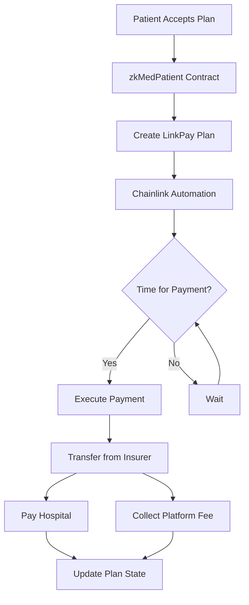

# zkMed LinkPay - Automated Payment System

## Overview

The `zkMedLinkPay` contract is a Chainlink Automation-powered payment system that handles automated monthly payments for zkMed payment plans. It integrates seamlessly with the existing zkMed ecosystem to provide automated, trustless healthcare payment processing.

## Features

### ✅ **Core Functionality**
- **Automated Monthly Payments**: Uses Chainlink Automation to trigger monthly payments without manual intervention
- **Multi-Party Payment Plans**: Supports Patient → Insurer → Hospital payment flows
- **Platform Fee Management**: Configurable platform fees with automatic collection
- **Payment Plan Lifecycle**: Complete management from creation to cancellation
- **Comprehensive Tracking**: Full payment history and plan monitoring

### ✅ **Integration Points**
- **zkMedPatient Contract**: Receives payment plan creation requests
- **zkMedCore Contract**: Coordinates with core system functionality
- **ERC20 Token Support**: Works with any ERC20 token (USDC recommended)
- **Chainlink Automation**: Automated execution without human intervention

### ✅ **Security Features**
- **ReentrancyGuard**: Protection against reentrancy attacks
- **Access Control**: Role-based permissions and ownership
- **Balance Validation**: Comprehensive balance and allowance checks
- **Graceful Failure**: Safe handling of failed payments

## Architecture

### Data Structures

```solidity
struct PaymentPlan {
    address patient;           // Patient receiving care
    address insurer;          // Insurance company paying
    address hospital;         // Hospital receiving payments
    uint256 monthlyAllowance; // Monthly payment amount
    uint256 planDuration;     // Plan expiration timestamp
    uint256 lastPaymentTime;  // Last successful payment
    uint256 totalPaid;        // Total amount paid to date
    bool isActive;            // Plan status
    string insuranceName;     // Insurance provider name
    bytes32 planId;           // Unique plan identifier
}
```

### Payment Flow



## Usage

### Deployment

```solidity
zkMedLinkPay linkPay = new zkMedLinkPay(
    30 days,              // Payment interval (monthly)
    zkMedCoreAddress,     // zkMedCore contract
    zkMedPatientAddress,  // zkMedPatient contract
    usdcTokenAddress,     // Payment token (USDC)
    treasuryAddress       // Platform treasury
);
```

### Creating Payment Plans

Payment plans are created through the zkMedPatient contract when patients accept insurance coverage:

```solidity
// Called by zkMedPatient contract
bytes32 planId = linkPay.createPaymentPlan(
    patientAddress,
    insurerAddress,
    hospitalAddress,
    monthlyAmount,
    planDuration,
    "Insurance Provider Name"
);
```

### Chainlink Automation Setup

1. **Register with Chainlink Automation**:
   - Visit [Chainlink Automation](https://automation.chain.link/)
   - Register the contract address
   - Fund the automation subscription

2. **Configure Automation**:
   - **Target Contract**: zkMedLinkPay address
   - **Function**: `performUpkeep(bytes calldata)`
   - **Check Function**: `checkUpkeep(bytes calldata)`
   - **Gas Limit**: 500,000 (recommended)

### Integration with zkMedPatient

The zkMedPatient contract has been updated to automatically create LinkPay plans:

```solidity
// In zkMedPatient.acceptPaymentPlan()
bytes32 planId = linkPayContract.createPaymentPlan(
    msg.sender,                    // patient
    planData.insurerAddress,       // insurer
    hospitalAddress,               // hospital
    planData.monthlyAllowance,     // monthly allowance
    planData.duration,             // plan duration
    planData.insuranceName         // insurance name
);
```

## API Reference

### Core Functions

#### `createPaymentPlan()`
Creates a new automated payment plan.

**Parameters**:
- `patient`: Patient wallet address
- `insurer`: Insurance company address
- `hospital`: Hospital receiving payments
- `monthlyAllowance`: Monthly payment amount in wei
- `duration`: Plan end timestamp
- `insuranceName`: Name of insurance provider

**Returns**: `bytes32` - Unique plan ID

#### `cancelPaymentPlan(bytes32 planId)`
Cancels an active payment plan.

**Access**: Patient, Insurer, or Contract Owner

#### `checkUpkeep(bytes calldata)`
Chainlink Automation check function.

**Returns**:
- `upkeepNeeded`: Boolean indicating if automation should trigger
- `performData`: Encoded plan IDs to process

#### `performUpkeep(bytes calldata performData)`
Chainlink Automation execution function.

**Triggers**: Automatic monthly payment processing

### View Functions

#### `getPaymentPlan(bytes32 planId)`
Returns complete payment plan details.

#### `getPatientPlans(address patient)`
Returns array of plan IDs for a patient.

#### `getHospitalPlans(address hospital)`
Returns array of plan IDs for a hospital.

#### `getPlanPaymentHistory(bytes32 planId)`
Returns payment history indices for a plan.

### Admin Functions

#### `updateTreasury(address newTreasury)`
Updates platform treasury address.

#### `updatePlatformFee(uint256 newFeePercent)`
Updates platform fee percentage (max 10%).

#### `withdrawFees(uint256 amount)`
Withdraws accumulated platform fees.

## Configuration

### Platform Fees
- **Default**: 2.5% (250 basis points)
- **Maximum**: 10% (1000 basis points)
- **Collection**: Automatic during payment processing

### Payment Intervals
- **Default**: 30 days (2,592,000 seconds)
- **Customizable**: Can be set during deployment

### Supported Tokens
- **Recommended**: USDC (6 decimals)
- **Compatible**: Any ERC20 token
- **Requirements**: Sufficient insurer balance and allowance

## Error Handling

The contract implements comprehensive error handling:

### Common Errors
- `"Only zkMed contracts can call this"`: Unauthorized contract access
- `"Payment plan not active"`: Plan is cancelled or expired
- `"Insufficient insurer balance"`: Insurer lacks funds
- `"Transfer failed"`: Token transfer unsuccessful

### Event Emissions
```solidity
event PaymentPlanCreated(bytes32 planId, address patient, address insurer, address hospital, uint256 monthlyAllowance, uint256 duration);
event MonthlyPaymentExecuted(bytes32 planId, address patient, address hospital, uint256 amount, uint256 platformFee);
event PaymentFailed(bytes32 planId, address patient, string reason);
event PaymentPlanCanceled(bytes32 planId, address patient);
```

## Testing

The contract includes comprehensive tests covering:

- ✅ Payment plan creation and management
- ✅ Chainlink Automation integration
- ✅ Monthly payment execution
- ✅ Error handling and edge cases
- ✅ Admin functionality
- ✅ Multi-cycle payment processing

Run tests:
```bash
forge test --match-contract zkMedLinkPayTest
```

## Security Considerations

### Access Control
- **Contract Creation**: Only zkMed contracts can create plans
- **Plan Cancellation**: Only patient, insurer, or owner
- **Admin Functions**: Only contract owner

### Financial Security
- **ReentrancyGuard**: Prevents reentrancy attacks
- **Balance Validation**: Checks before transfers
- **Allowance Verification**: Ensures sufficient approval
- **Graceful Failures**: Safe handling of failed payments

### Automation Security
- **Gas Limits**: Reasonable execution limits
- **State Validation**: Comprehensive plan status checks
- **Time-based Execution**: Prevents premature payments

## Deployment Checklist

1. ✅ Deploy zkMedLinkPay contract
2. ✅ Update zkMedPatient constructor with LinkPay address
3. ✅ Set zkMedCore and zkMedPatient addresses in LinkPay
4. ✅ Register with Chainlink Automation
5. ✅ Fund Chainlink Automation subscription
6. ✅ Update frontend contract addresses
7. ✅ Configure payment token approvals
8. ✅ Set treasury and fee parameters

## Future Enhancements

### Potential Improvements
- **Multi-token Support**: Handle multiple payment currencies
- **Dynamic Intervals**: Variable payment schedules
- **Emergency Pause**: Circuit breaker functionality
- **Governance Integration**: DAO-based parameter updates
- **Cross-chain Support**: Multi-blockchain deployment

### Integration Opportunities
- **DeFi Yield**: Treasury management with yield farming
- **Oracle Integration**: Dynamic fee adjustments
- **Insurance APIs**: Real-time coverage validation
- **Healthcare Analytics**: Payment pattern analysis

## Support

For technical support or integration questions:
- **Contract Address**: (Deploy and update)
- **Documentation**: This README
- **Tests**: `test/zkMed/zkMedLinkPay.t.sol`
- **Deployment Script**: `script/zkMedLinkPay.s.sol` 